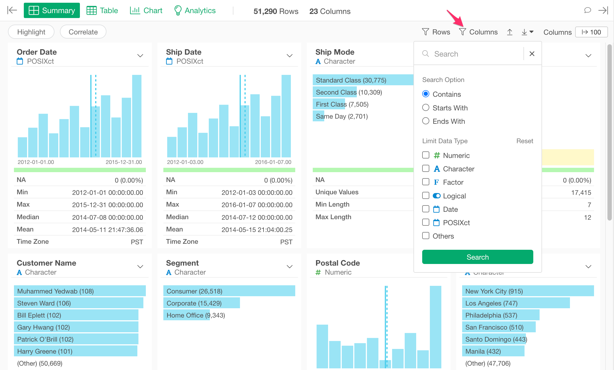
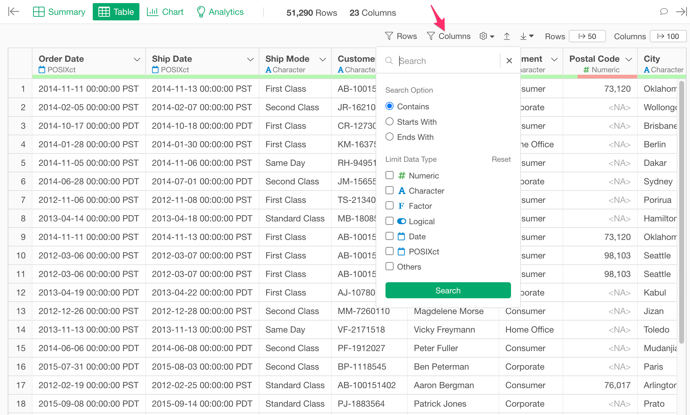
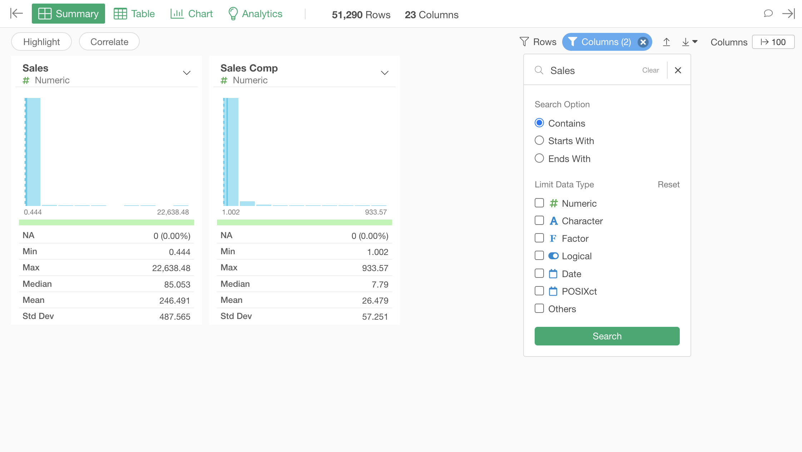
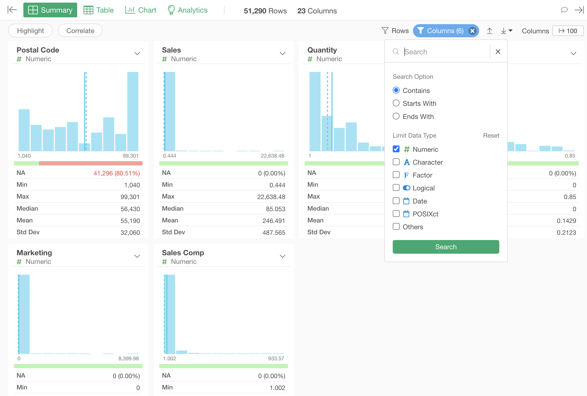
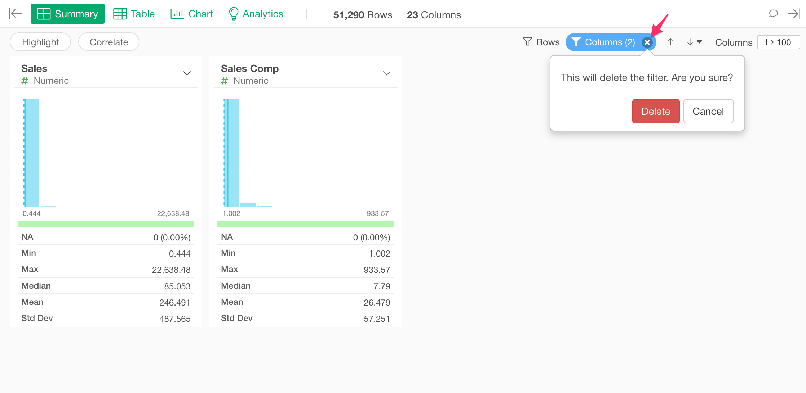

# Column Filter

You can filter the columns by the condition on Summary View and Table View. You can define the condition from the "Columns" button at the top. The condition can be shared among the Summary View and Table View.

Summary View

Table View

If conditions are applied, the button gets highlighted. The number on the button means the number of columns currently showing. 

The following filter options are available.

## Keyword

You can filter columns by the keyword. The following search options are available.

* Contains: You can show columns that contain the keyword anywhere in the column name.
* Starts With: You can show columns that contain the keyword at the beginning of the column name.
* Ends With: You can show columns that contain the keyword at the end of the column name.

## Data Type

You can filter columns by the data type. You can check the data type to show. You can check multiple checkboxes. If you don't check anything, filtering by the data type is disabled. The following data type options are available. 

* Numeric
* Character
* Factor
* Logical
* Date
* POSIXct
* Others - It matches the data types that don't match any of the data types above (Numeric, Character, Factor, Logical, Date, POSIXct). 

## Reset Conditions

You can remove all the conditions at once by clicking the 'x' icon in the "Columns" button.

