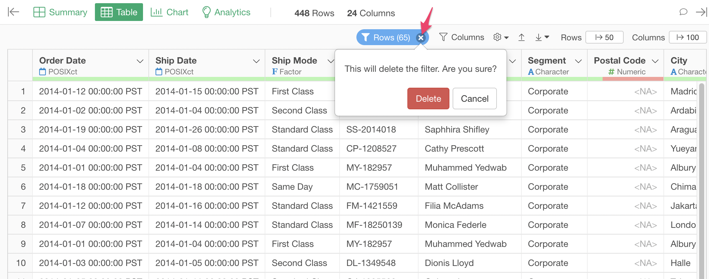

# Row Filter

You can filter the rows (data) to show by the condition on Summary View and Table View. You can define the condition from the "Rows" button at the top. The condition can be shared among the Summary View and Table View.

Summary View

Table View

If conditions are applied, the button gets highlighted. The number on the button means the number of rows after applying the filter. 

## Create a new Condition

You can click the "Rows" button to create the very first condition. It will immediately open the Filter dialog. You can define the condition, and click the "Run" button to apply the condition.

## Update and Delete Conditions 

You can click the "Rows" button to update existing conditions, add other conditions, or delete conditions. 

You can add other conditions by clicking the "+ Add Filter" link.

If you have multiple conditions, you can choose how to apply those conditions. Those 2 options are available. 

* AND (&)
* OR (|)

## Reset Conditions

You can remove all the conditions at once by clicking the 'x' icon in the "Columns" button.

