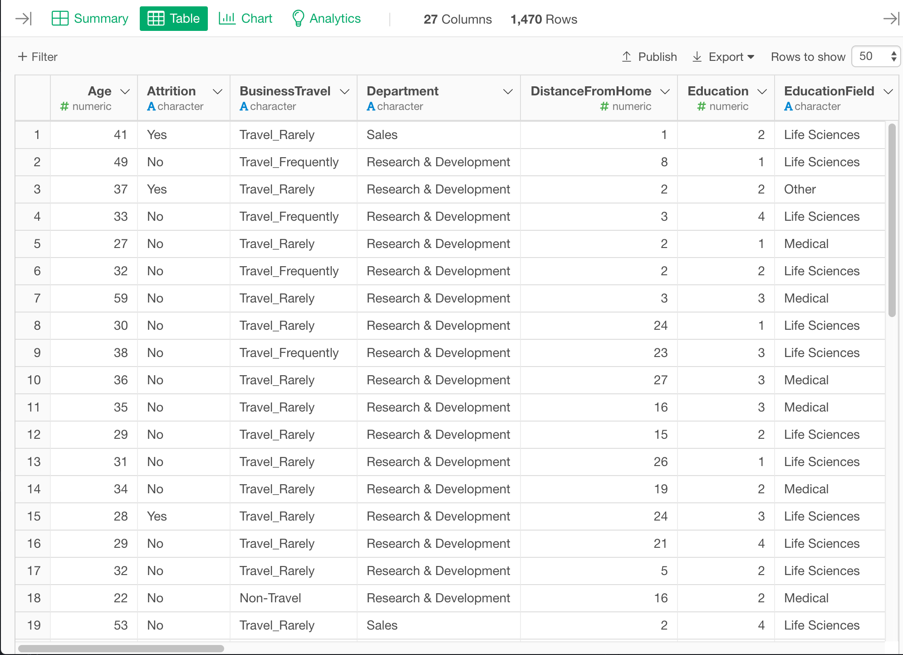
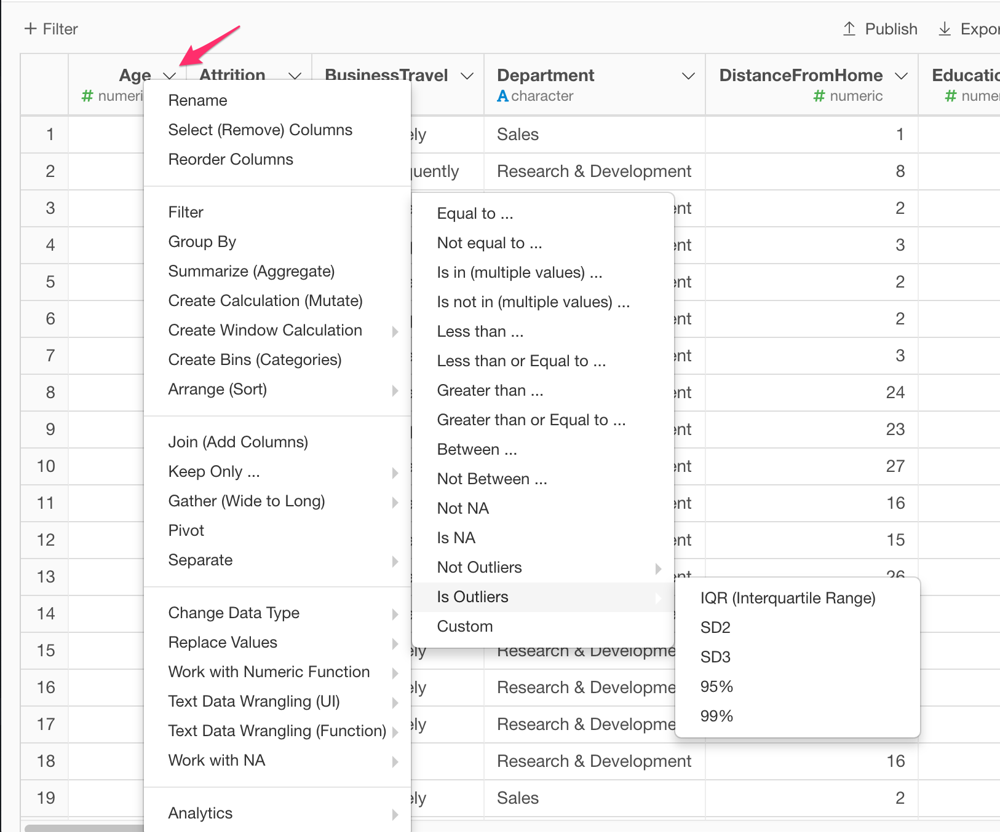

# Table View

At the Table View, you can view the details information of the selected data frame. 

You can view the data in each column in the selected data frame. 

## Row Filter

You can filter rows to show by the condition on Table View. See [Row Filter](row_filter.md) for more details.

## Column Filter

You can filter columns to show by the condition on Table View. See [Column Filter](column_filter.md) for more details. 

## Column Metrics

You can show the column metrics by hovering the column header area and click the green "i" icon. 

## Column Menu
You can click the downward button to see the column menu. It shows a list of operations you can perform against this column. 

## Select Columns

You can select a column by clicking a panel. You can also choose multiple panels by Shift+Click or Control(Command)+Click. 

After selecting columns, you can open the column menu and select an operation to perform the operation to multiple columns at a time.

