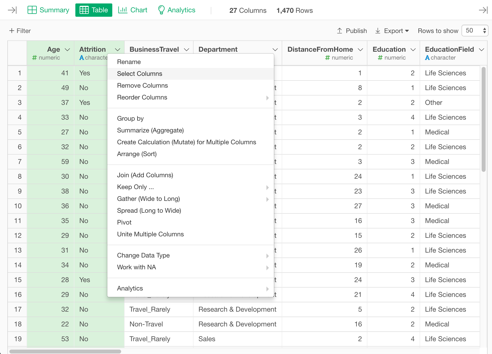
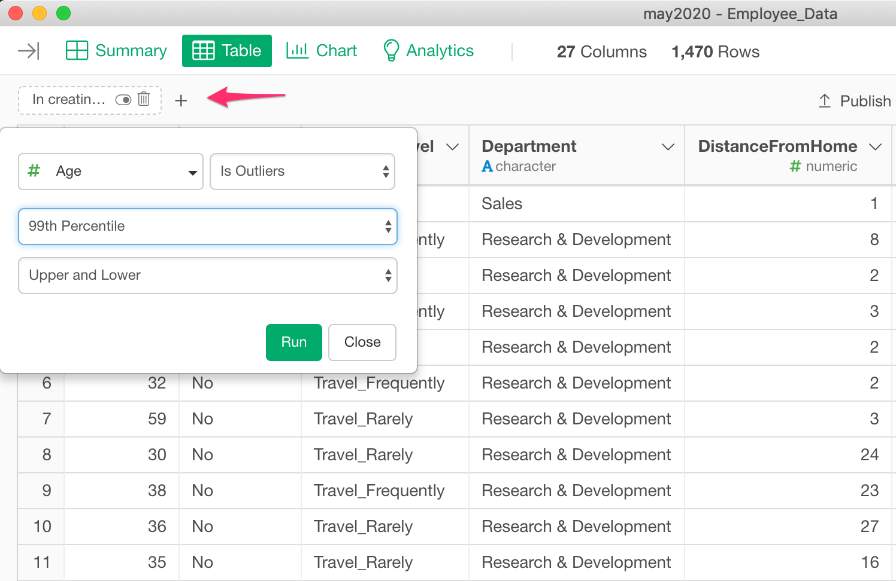

# Table View

At the Table View, you can view the details information of the selected data frame. 

You can view the data in each column in the selected data frame. 

## Column Menu
You can click the downward button to see the column menu. It shows a list of operations you can perform against this column. 

## Select Columns

You can select a column by clicking a panel. You can also choose multiple panels by Shift+Click or Control(Command)+Click. 

After selecting columns, you can open the column menu and select an operation to perform the operation to multiple columns at a time.

## Filter
On Table View, you can filters so that you can check details of the data that you want to confirm. 

