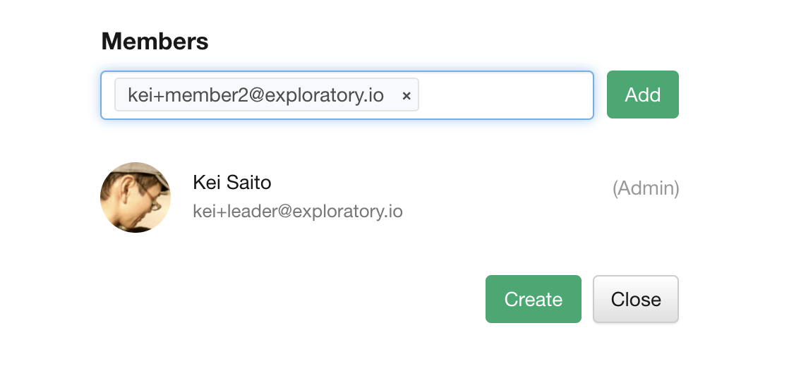

# Manage Teams

You can manage teams at the [Account Setting](https://exploratory.io/account/settings) page.

You can manage teams only if you subscribe the Business plan now. 

## Ceating a Team

You can click the "Add New" link to create a new team.

Then, the screen for creating a team will be displayed. You can create a new team by entering the following information and clicking the "Create" button.

* Team name (required): The name of the team used in the URL. Only lowercase alphanumers, hyphens, and underscores can be used in the team name. Once created, the team name cannot be changed.
* Display Name (Optional): The name used for the display. If not entered, the team name will be used automatically.
* Overview (optional): An overview of the team.
* Members: Members of this team.

### Adding Members to the Team

To add a member of your team, enter the email address of the member you want to add in the Add Member input field. Members must be registered on exploratory.io.

After entering the email address, enter ',' to confirm the email address. You can add multiple members at once by entering multiple email addresses. 

When you're done, press the add button. Then, the member you just added will be displayed at the bottom.

### Deleting Members from the Team

To delete a member, click the "x" button next to the member.

## Updating a Team

To change a team, click the team you want to change from the team management screen.

The team settings screen is displayed. You can change the following information.

* Display name (optional): The name used for display. If not entered, the team name will be used automatically.
* Overview (optional): An overview of the team.
* Members: Members of this team.

When you have finished making changes, press the "Update" button to confirm your changes.

## Deleting a Team
To change a team, click the team you want to change from the team management screen.

The team settings screen is displayed. You can delete a team by pressing the "Delete Team" button at the bottom of the screen.

Once a team is deleted, it cannot be undone later. Deleting a team also removes all insights published as a team from the server.

