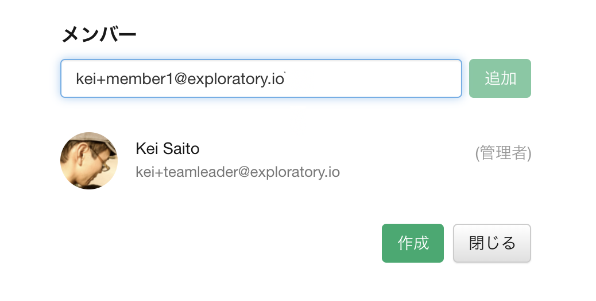
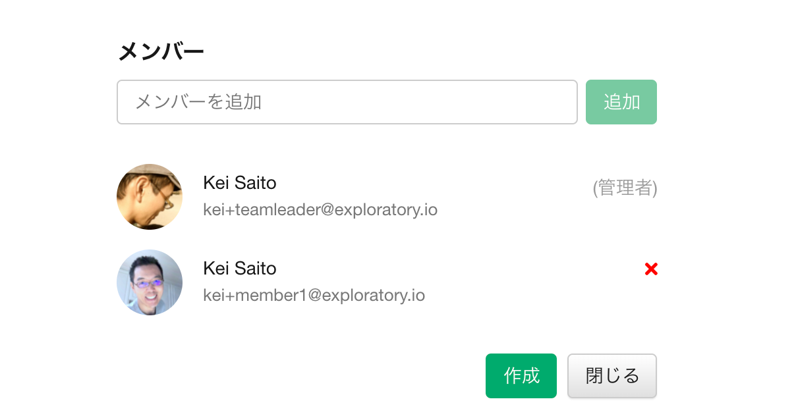
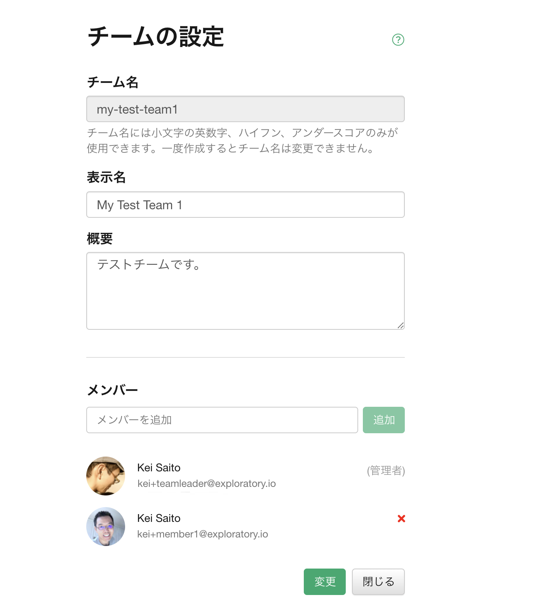

# チームの管理

チームの管理は、[アカウントの設定](https://exploratory.io/account/settings)から行うことができます。

チームの管理は、現在Businessプランでのみサポートされています。

## チームの作成

新しくチームを作成するには「新規作成」のリンクをクリックします。

すると、チーム作成の画面が表示されます。以下の情報を入力して、「作成」ボタンをクリックすることで、新規のチームを作成することができます。

* チーム名 (必須): URLに使われるチームの名前になります。チーム名には小文字の英数字、ハイフン、アンダースコアのみが使用できます。一度作成するとチーム名は変更できません。
* 表示名 (オプショナル): 表示に使われる名前です。入力しない場合は、チーム名が自動的に使用されます。
* 概要 (オプショナル): チームの概要です。
* メンバー: このチームのメンバーです。

### チームのメンバーの追加

チームのメンバーを追加するには、「メンバーを追加」の入力フィールドに、追加したいメンバーのメールアドレスを入力します。メンバーは、exploratory.io上に登録されている必要があります。

メールアドレスを入力したら、','を入力することでメールアドレスが確定されます。続けてメールアドレスを入力することで、複数のメンバーを一度に追加することができます。

入力が終わったら、追加ボタンを押します。すると、下の方に今追加したメンバーが表示されます。

### チームのメンバーの削除

メンバーを削除するには、メンバーの横にある「ｘ」ボタンをクリックしてください。

## チームの変更

チームの変更を行うには、チームの管理画面から、変更を行いたいチームをクリックしてください。

チームの設定画面が表示されます。以下の情報を変更することができます。

* 表示名 (オプショナル): 表示に使われる名前です。入力しない場合は、チーム名が自動的に使用されます。
* 概要 (オプショナル): チームの概要です。
* メンバー: このチームのメンバーです。

変更が終わったら、「変更」ボタンを押して、変更を確定します。

## チームの削除

チームの変更を行うには、チームの管理画面から、変更を行いたいチームをクリックしてください。

チームの設定画面が表示されます。画面一番下にある「チームの削除」のボタンを押すことで、チームを削除することができます。

チームは削除してしまうと、後でもとに戻すことはできません。また、チームを削除すると、チームとしてパブリッシュされた全てのインサイトもサーバーから削除されます。

