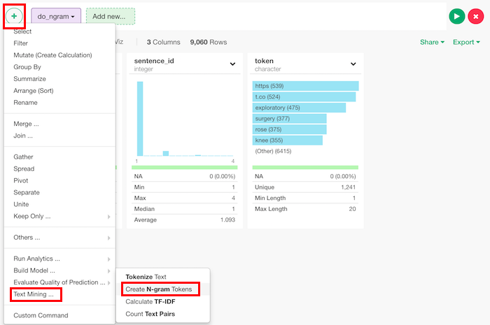
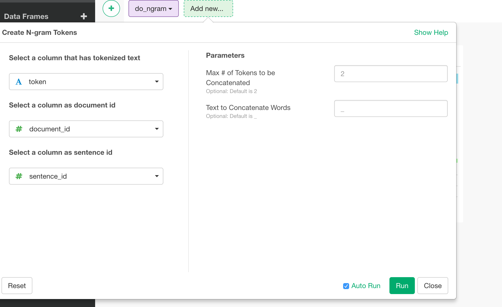

(# Create N-gram Tokens

## How to Access This Feature

### From + (plus) Button
You can access it from 'Add' (Plus) button. "Text Mining..." -> "Tokenize Text".

## How to Use?

* Select a column that has tokenized text - Set a column that has tokens. This is "token" column if it's tokenized by [do_tokenize](./do_tokenize.md) function.
* Select a column as a document - A column considered as document id. If you run [do_tokenize](./do_tokenize.md) beforehand, this can be document_id.
* Select a column as sentence id - A column considered as sentence id in a document. If you run do_tokenize beforehand, this can be sentence_id.
* Max # of Tokens to be Concatenated (Optional) - The default is 2. Maximum number of tokens to be connected.
* Text to Concatenate Words (Optional) - The default is "\_". Character to be used to connect ngrams.
)
