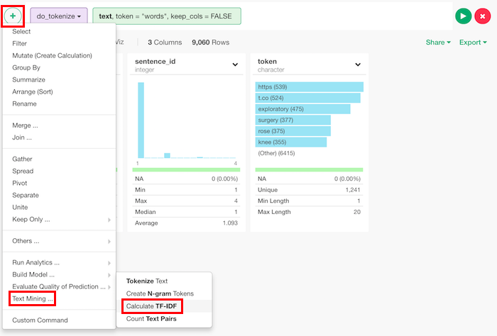
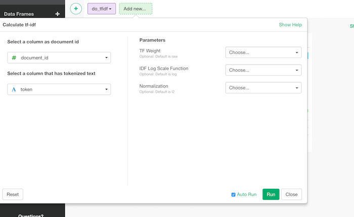

# Calculate tf-idf

## How to Access This Feature

### From + (plus) Button
There are two ways to access. One is to access from 'Add' (Plus) button.


## How to Use?



* Select a column as document id - Set a grouping column for a set of the tokens. In most of the cases this would be a document id column.
* Select a column that has tokenized text - Set a column that has tokens. This is "token" column if it's tokenized by [do_tokenize](./do_tokenize.md) function.
* TF Weight (Optional) - The default is "raw".
  * "raw" is count of a term in a document.
  * "binary" is if it exists or not. If it exists, it is 1 and if not, it is 0.
  * "log_scale" is ```1+log(count of a term in a document)```.
* IDF Log Scale Function (Optional) - The default is log. This is a function to suppress the increase of idf value. Idf is calculated by ```log_scale_function((the total number of documents)/(the number of documents which have the token))```. It's how rare the token is in the set of documents. It might be worth trying log2 or log10. log2 increases the value more easily and log10 increases it more slowly.
* Normalization (Optional) - The default is l2. How to normalize the tfidf vector.
  * "l2" is normalization that Euclidean distance of the tfidf vector for a document becomes 1.
  * "l1" is normalization that Manhattan distance (sum of values) of the tfidf vector for a document becomes 1.
  * FALSE doesn't normalize the result.
