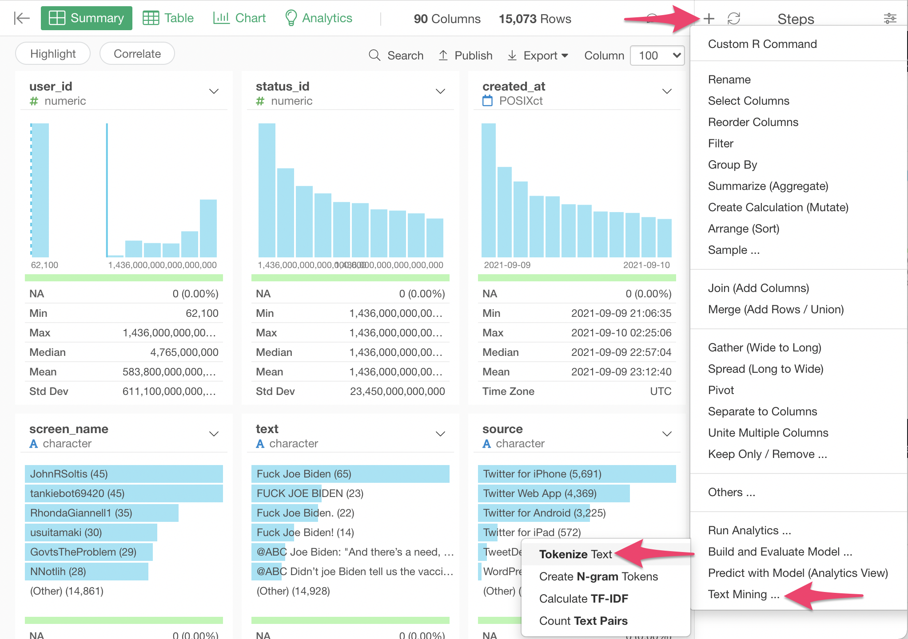
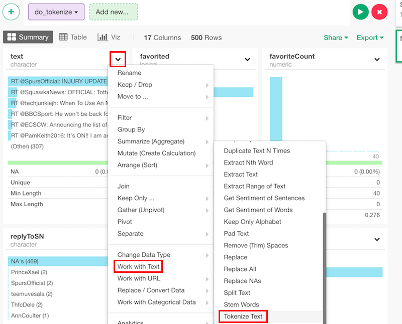
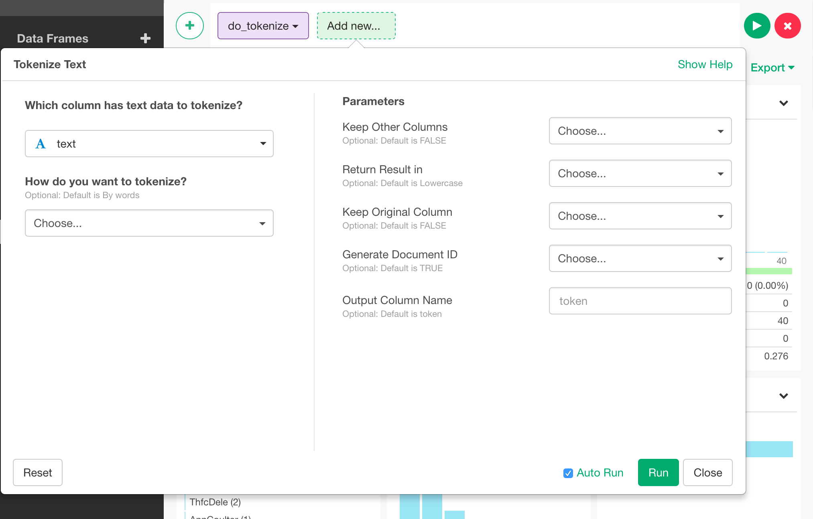

# Tokenize Text

## How to Access This Feature

### From + (plus) Button

There are two ways to access. One is to access from 'Add' (Plus) button.

Another way is to access from a column header menu.

## Parameters

* Column to Tokenize - Set the text column you want to split or tokenize.
* Tokenize By - The default is "words". Select the unit of token from
  * Words
  * Sentences
* Keep Other Columns - The default is FALSE. Whether existing columns should remain.
* Keep Original Column - Whether input column should be removed. The default is No.
* With Sentence ID - Whether the sentence ID should be in the output. The default is Yes
* Remove Stopwords - Default is Yes.
* Language for Stopwords - By default it is automatically selected based on the content of the text.
* Additional Stopwords - Words to be added to the default set of stopwords.
* Exclude from Stopwords - Words to be excluded from the default set of stopwords.
* Words To Be Treated As One Word - If a word or phrase that should be treated as one token is separated into multiple tokens, it can be fixed by specifying the word/phrase here.
* Remove Punctuations
* Remove Numbers
* Clean Up Twitter Data - Whether to remove hashtag (starts with #) and mention (starts with @). The default is No.
* Remove Hiragana Only Words - You can treat often meaningless short Japanese Hiragana words as stopwords altogether by selecting an option here.
* Column Name for Output Data - The default is "token". Set a column name for the new column to store the tokenized values.
* Format for Output Data - Format for the output tokens. The default is lowercase.
  * Lowercase
  * Titlecase
  * Uppercase
