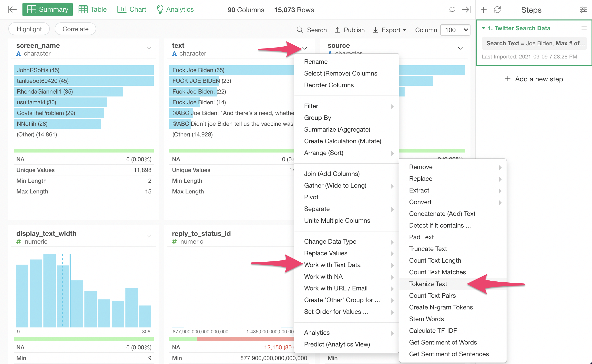

# Tokenize Text

## How to Access This Feature

### From + (plus) Button
There are two ways to access. One is to access from 'Add' (Plus) button.

Another way is to access from a column header menu.

## How to Use?

* Which column has text data to tokenize? - Set a column of which you want to split the text or tokenize.
* How do you want to tokenize? (Optional) - The default is "words". Select the unit of token from
  * "By words"
  * "By characters"
  * "By sentences"
  * "By lines"
  * "By paragraphs"
  * "By regular expression"
* Keep Other Columns (Optional) - The default is FALSE. Whether existing columns should remain.
* Return Result in (Optional) - The default is TRUE. Whether output should be lower cased.
* Keep Original Column (Optional) - The default is TRUE. Whether input column should be removed.
* Output Column Name (Optional) - The default is "token". Set a column name for the new column to store the tokenized values.
* Generate Document ID (Optional) - The default is TRUE. Whether output should contain original document id and sentence id in each document.
