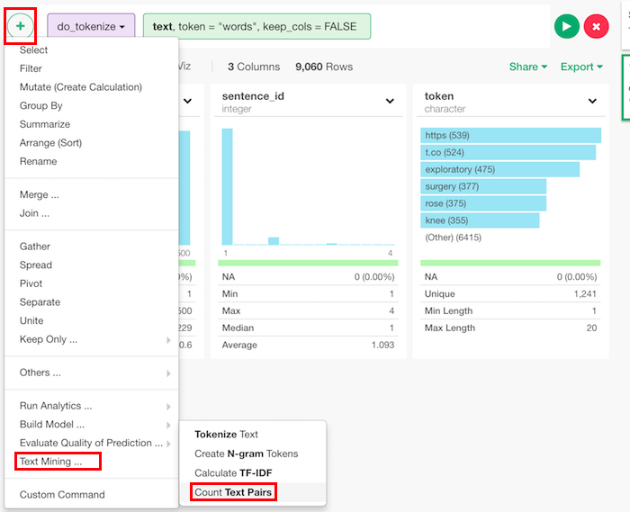
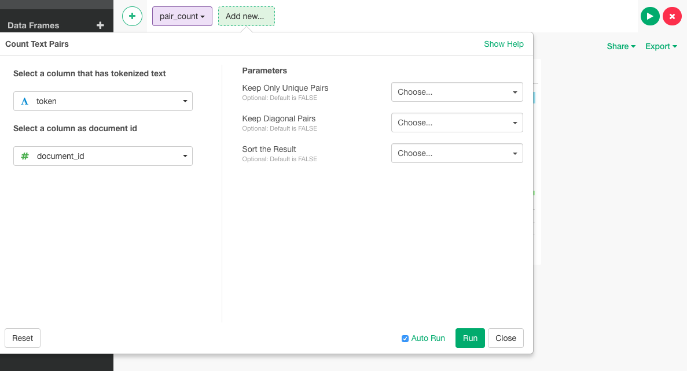

# Count Text Pairs

## How to Access This Feature

Count pairs of tokens that appear simultaneously within a document.

### From + (plus) Button
There are two ways to access. One is to access from 'Add' (Plus) button.

## How to Use?

* Select a column that has tokenized text - Set a column that has tokens. This is "token" column if it's tokenized by [do_tokenize](./do_tokenize.md) function.
* Select a column as document id - A column considered as document id. If you run [do_tokenize](./do_tokenize.md) beforehand, this can be document_id.
* Keep Only Unique Pairs (Optional) - The default is TRUE. If FALSE, duplicated pairs appear in reverse order.
* Keep Diagonal Pairs (Optional) - The default is FALSE. If TRUE, count of the value itself appears.
* Sort the Result (Optional) - The default is FALSE. If TRUE, the output is in decreasing order of frequency.
