# Analyze Flight Data - part 1

### What you are going to learn:

- Column Selection - select()
- Creating Calculation / Expression - mutate()
- Date data transformation - wday()
- Grouping - group_by()
- Aggregation - summarize()
- Filtering - filter()


## Download Flight Delay sample data

We're going to use the following file for this tutorial. You can download it from [here](http://download.exploratory.io/data/airline_delay_2016_01.csv).

- [Flight delay 2016 January data](http://download.exploratory.io/data/airline_delay_2016_01.csv)

## Create a new project

Once you start Exploratory app, create a new project to start.


## Import sample data

Inside the project, you can click a plus '+' icon next to 'Data Frame' text in the left side pane to import 'airline_delay_part1.csv'.


After you select the file from the file picker dialog and hit OK, you'll see the first 10 rows of the data you're importing.


Since the data is showing up ok, you can keep the parameters as default and click 'Save' button.

## Summary data view

Once the data is imported you can see a brief summary of the data in Summary view. It shows 26 columns and 445,827 rows at the top, and you can also see some of the columns' sneak peak view. For example, you can see the most frequently appeared airline carriers in CARRIER column.


And, when you scroll down you can see ARR_DELAY column having NA values and its data range quickly.


## Select or Drop columns

There are many ways to select only the columns you want for your analysis. Let's try some of them.

First, let's drop 'FL_NUM' column'. Click the down arrow icon next to 'FL_NUM' column name and select 'Delete'.

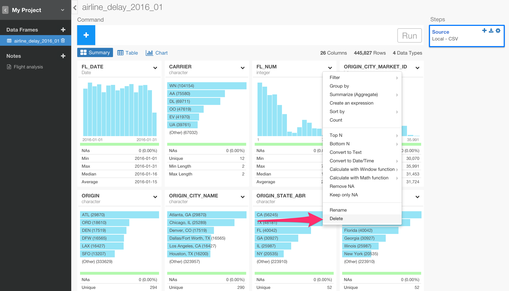

You will see 'select()' command generated in the command input area. This is one of the dplyr - a grammar of data wrangling - commands in R and can be used to either keep or delete columns. As you can see there is a minus '-' in front of the column name 'FL_NUM', which means to delete the column.

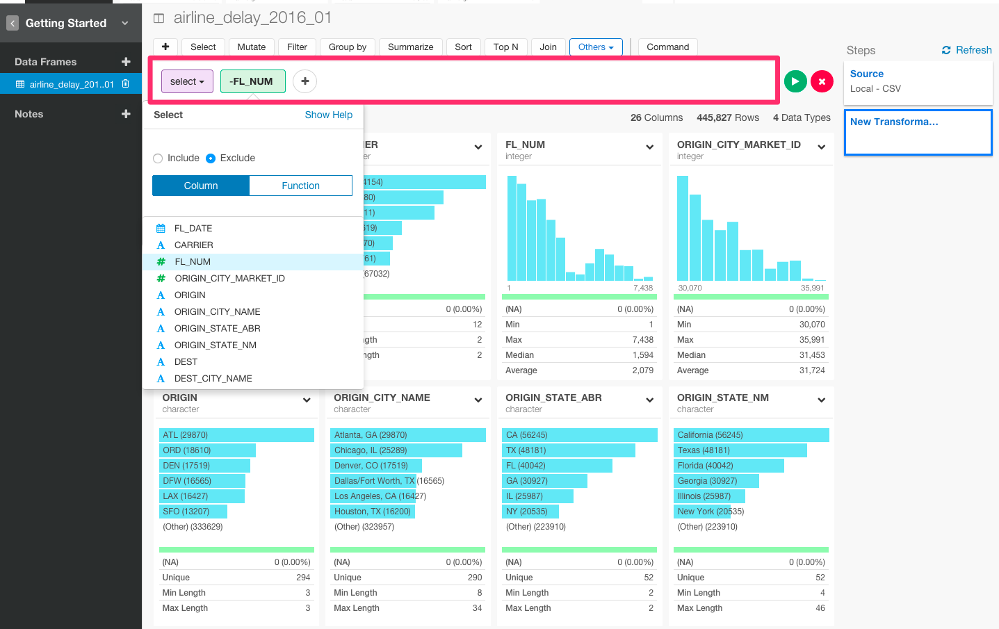

Hit 'Run' button.

Now FL_NUM column is gone.

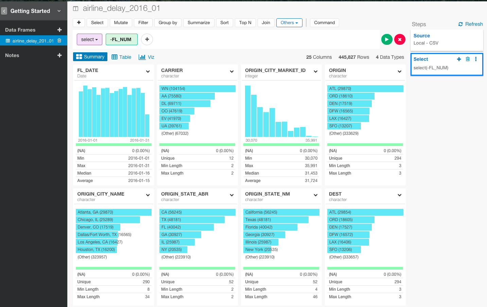

Let's remove other columns. There are columns whose names start with "ORIGIN", and you can delete them all together by using one of the convenient functions called 'starts_with()' inside the 'Select' command.

Press '+' right after '-FL_NUM', press 'Function' from the dialog.


Then select Exclude and  ```starts_with()``` function from the Function Type. Inside this ```starts_with()``` function, type "ORIGIN" in Matching Text, and  hit 'Run' button.


Now those columns whose names starting with "ORIGIN" are all gone!

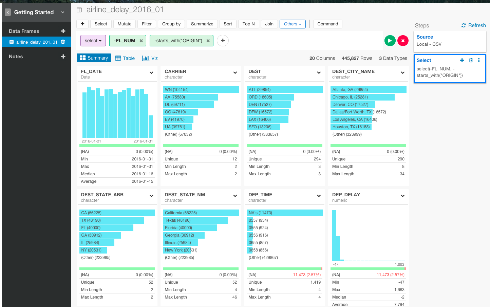

The final command would be something like below.

```
select(-FL_NUM, -starts_with("ORIGIN"))
```

The syntax suggestion list gives you only the relevant operators, functions, and column names depending on where you are inside each command or function.


## Date operation - Weekday

You can add custom calculations or expressions to add new columns easily.

There is a column called 'FL_DATE', which is Date data type and has the flight date information. Let's say you want to extract weekday (e.g. Monday, Tuesday, etc.) information out of this data. You can use one of the date related functions called ```wday()```.

Select 'Extract' and 'Day of week' from the column header dropdown menu.

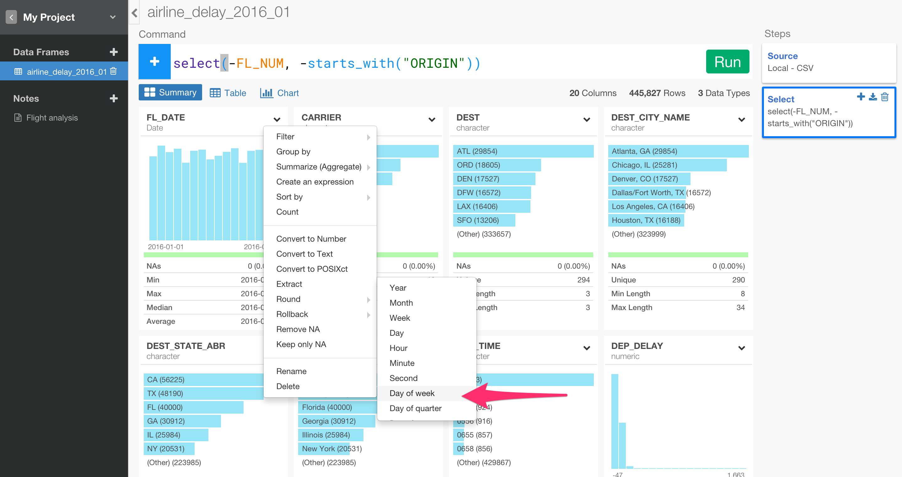

Type FL_DATE_wday in New Column Name. As you can see in the syntax help that shows up right the dialog when you click Doc inside the function, there are a few options to get different results.

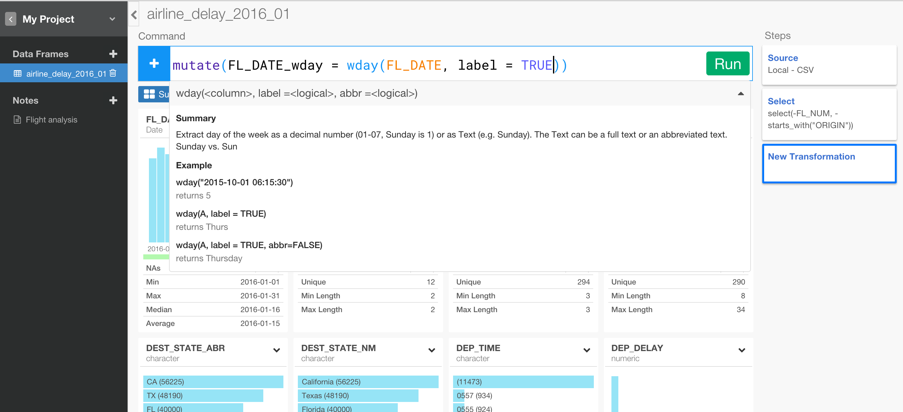

In this case, we can go with the default so hit 'Run' button. When you scroll down to the bottom of the page you'll see a new column called 'FL_DATE_wday'.

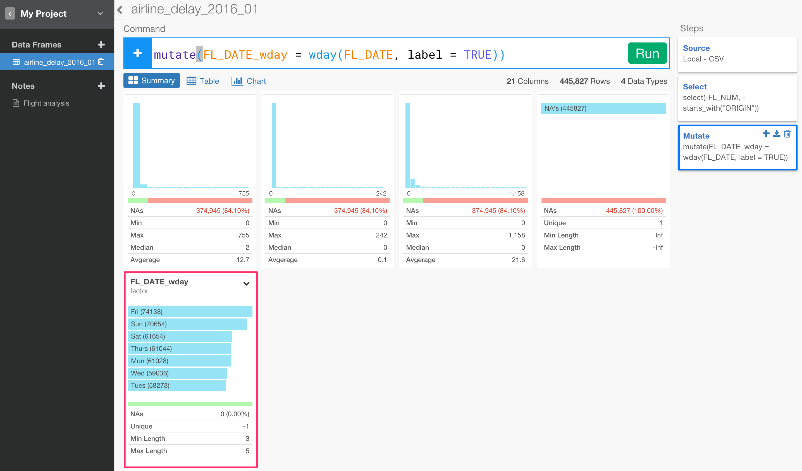

You can update the column name by typing 'weekday' instead of 'FL_DATE_wday' inside the 'mutate()' command, and hit 'Run' button.

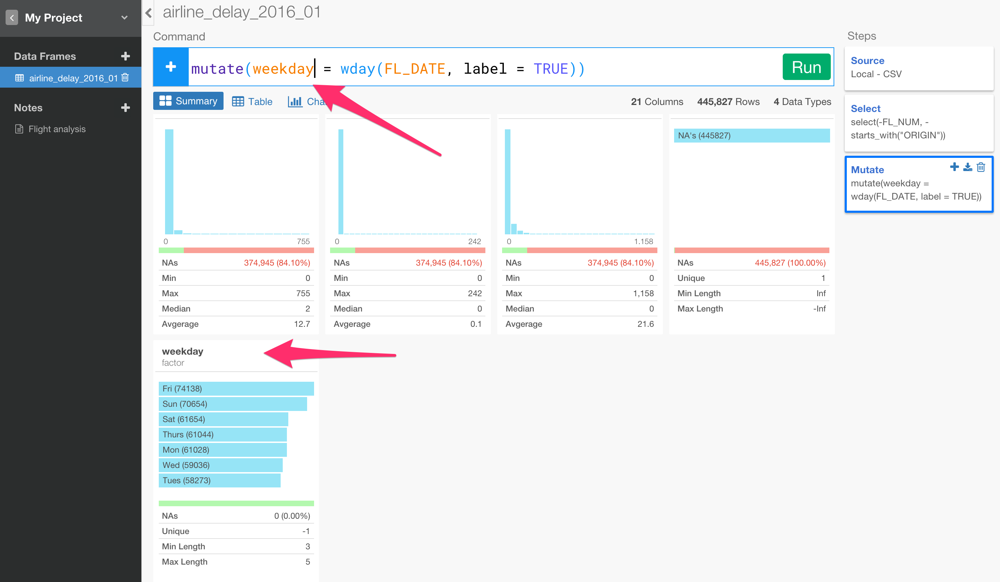

One cool thing about this is that the result data type is something called 'ordered factor', which means that when you want to sort on this column it would respect the order of the weekdays starting from Sunday and ending at Saturday. You can quickly check this out by going to Viz view and assign this column 'weekday' to X-Axis. Make sure you uncheck the 'Sort' check box next to Sort-Axis to disable Y-Axis level sorting.


## Count rows and Count uniques

Let's find out how many flights per each carrier there are in this data. To do this, let's go to Table view and see the result better.


We want to count many flights per each carrier by using the ‘count’ command below. You can construct this command from the column header menu. Click on ‘Count’.

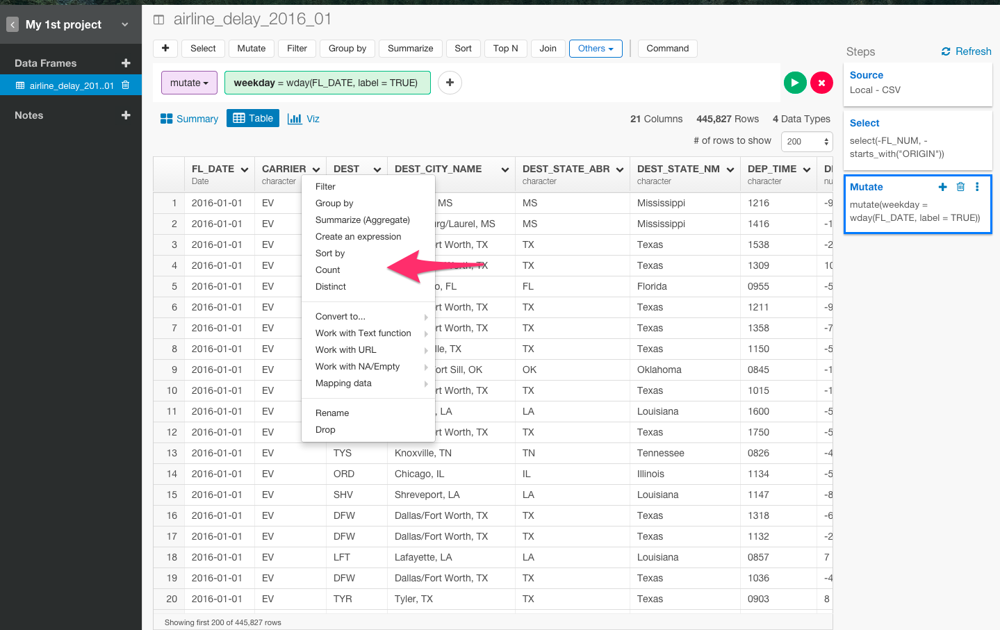

Here is the final command we want to run.

```
count(CARRIER, wt = n(), sort = TRUE)
```

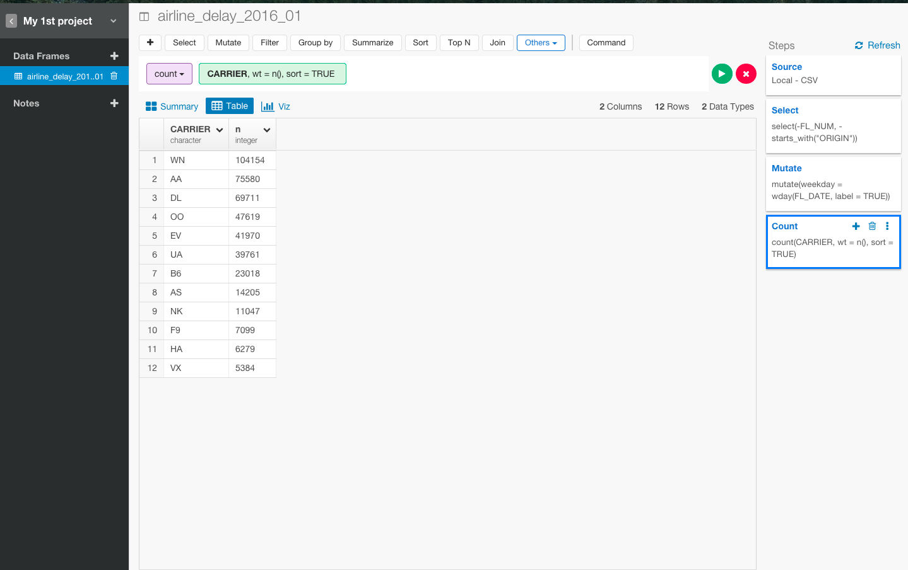


### Calculate the proportion (percentage / ratio)

For the newly created 'counts' column values,
Let's say you also want to know the proportion (percentage) of the 'counts' values against the total counts. You can click the gear icon next to ‘Y Axis’. This will open ‘Window (Table) Calculation’ dialog and select ‘% of Total’ from the list.


You can see AA has 16.95 % of the all flights in this data.


### Update existing grouping setting

Now, let's say you want to see which US States each carrier is flying to and how many flights there are for each of States. You can do this very easily by clicking on the 'Grouping' step at the right hand side to go back to this particular step.

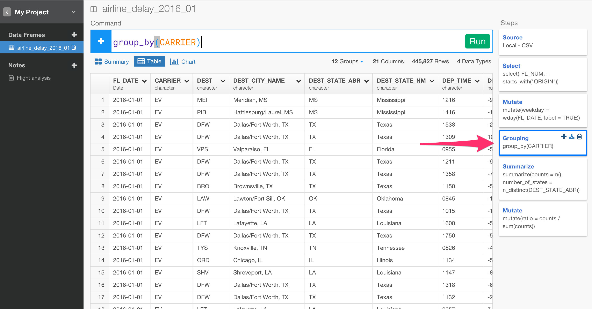


And, update the existing command to add DEST_STATE_ABR column right after CARRIER column, and hit 'Run' button.

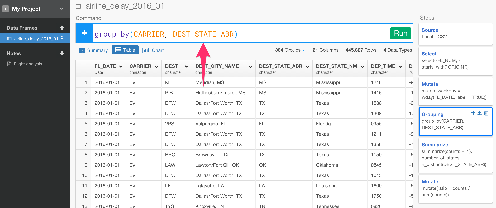

You would notice that the number of the groups is 384 groups and the grouping levels are set to 'CARRIER' and 'DEST_STATE_ABR'.

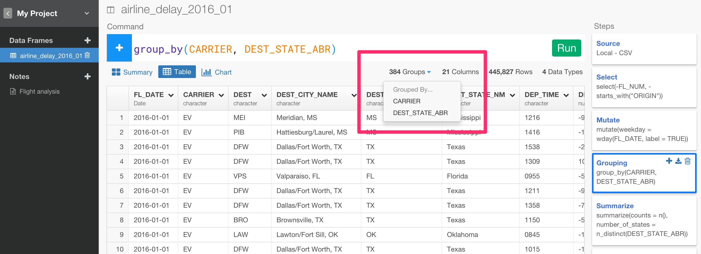

Now, click the last step 'Mutate' in the right hand side.

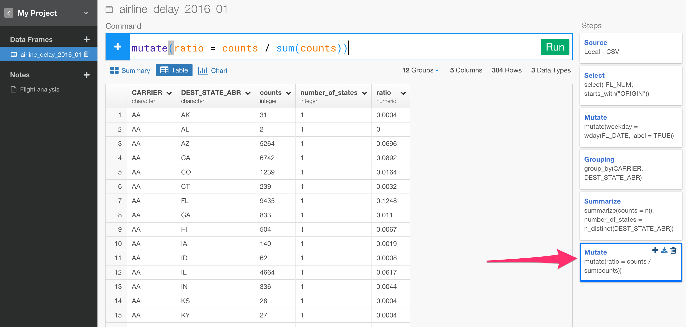

You would notice that there are now 384 rows instead of the 14 rows like before.

This is because now each carrier has rows for all the States it's flying to. And the aggregated calculations like 'count', 'number_of_states', 'ratio' have been just re-calculated automatically when you clicked on the 'Mutate' step to reflect the change with 'Grouping' step. The 'ratio' column is now showing the ratio against each carrier group instead of the entire total. You can visualize this to understand it better in Chart view.

Each bar is representing each carrier, and you can see the ratio of US States within each carrier.

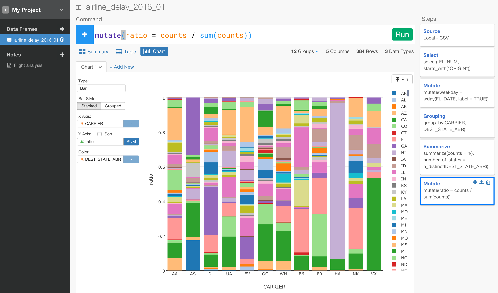


### Window Function - Rank

Now, let's do one last thing. This is a pretty cool and strong capability. Some people call this 'Window' function.

Let's say you want to see the ranking numbers for each state within each carrier based on the 'counts' values. To do this, you can use 'min_rank()' function to return the ranking number. You can either update the existing mutate() command like below.

```
mutate(ratio = count / sum(count) * 100, rank = min_rank(count))
```

Or, simply select 'min_rank' function from the dropdown menu of 'count' column header in Table view.

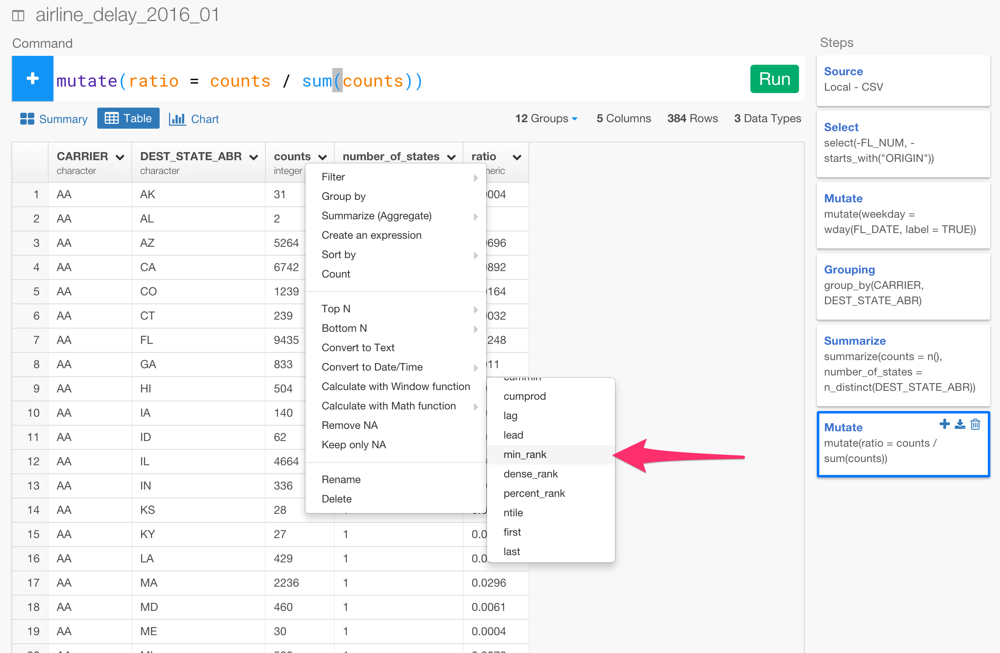

After you hit 'Run' button you'll get something like below.

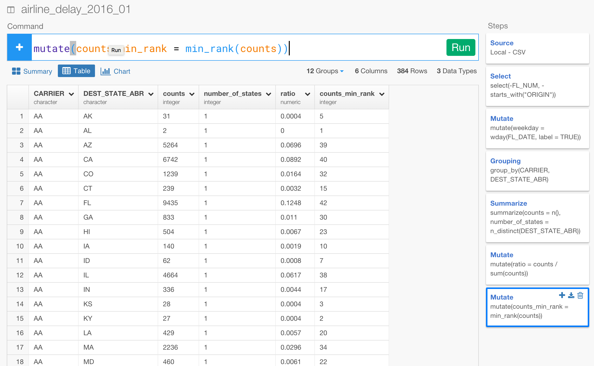

But, the generated rank values are based on the ascending order (small number to big number). In this case, we want to consider that the bigger the 'count' number is the smaller the ranking number should be. So you can use 'desc' function to wrap around 'count' column to make the order reversed like below.

```
mutate(ratio = count / sum(count) * 100, rank = min_rank(desc(count)))
```

After you hit 'Run' button you'll get something like below. You can see FL (Florida) is the 2nd and CA (California) is the 4th for American Airline carrier.

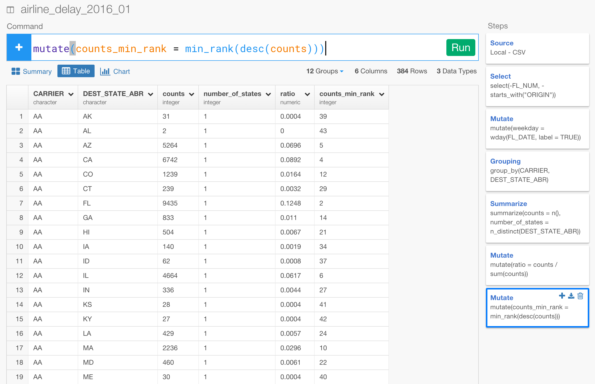

There is another similar ranking function called 'dense_rank', we can quickly see the difference between them by using Chart. But before going to Chart view, let's filter to keep only 'DL' (Delata Airline) carrier.

Select '==' (equal to) operator under 'Filter' operation from the dropdown menu of 'CARRIER' column header.

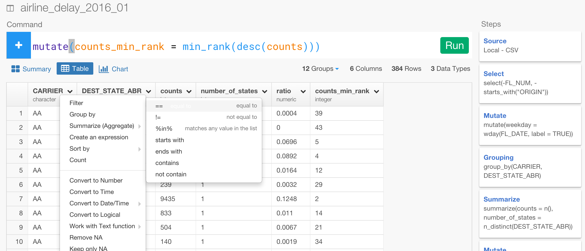

Select 'DL' from the dropdown menu in the command input area.

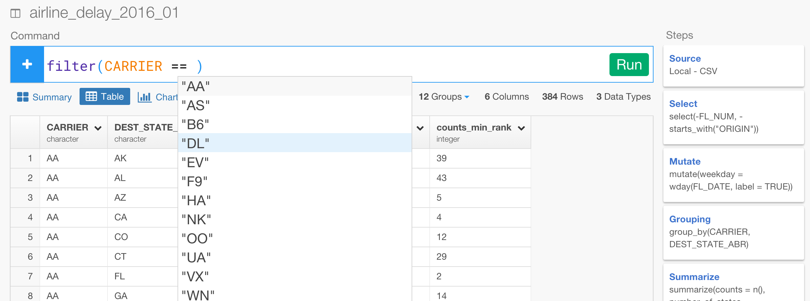

Once you hit 'Run' button, then go to Chart view.

Assign 'rank' column to both X-Axis and Y-Axis, and 'DEST_STATE_ABR' column to Color.

As you see, the rank 26th has two states 'AL' and 'OR' because they have the equal 'count' values. In this case 'min_rank()' function keeps the next rank vacant, that is the 27th, and resume the next rank from the 28th. If you don't want to have this vacant ranks, then you can use 'dense_rank()' instead.

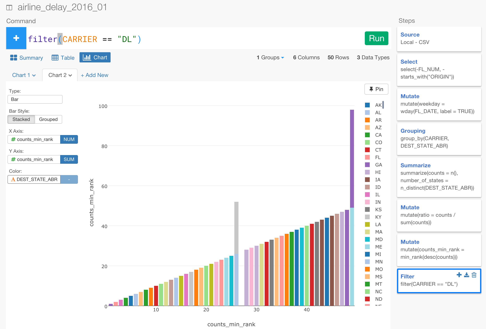

Before going back to the previous 'Mutate' step, click 'Pin' button to keep the chart pinned down to this 'Filter' step.

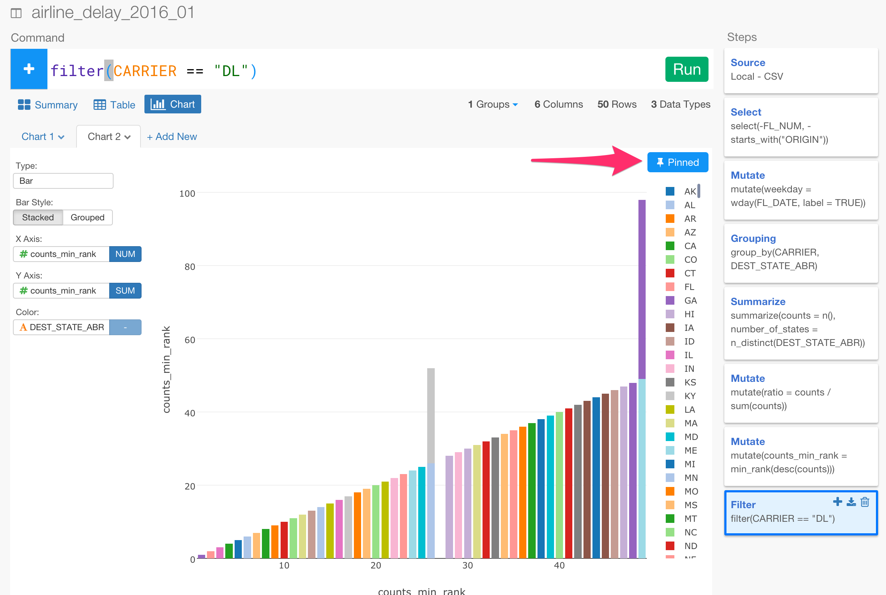

Then, go to the 'Mutate' step and replace ```min_rank()``` with ```dense_rank()```, and hit 'Run' button. You will see a chart view like below. Now there is no vacant rank number.

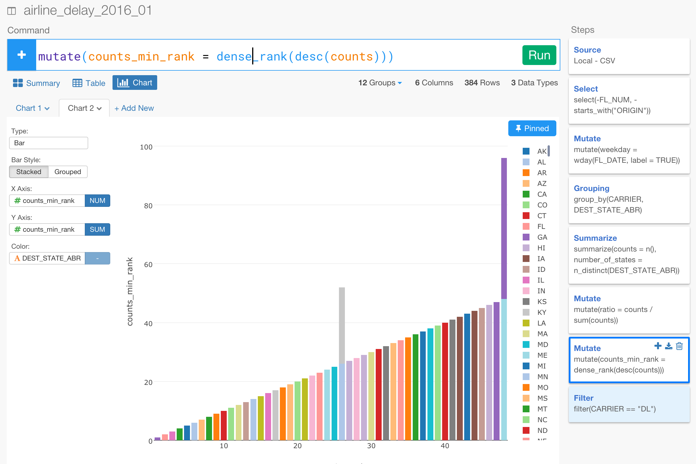

## Conclusion

As you have seen, by using the combination of group_by(), summarize(), and mutate() flexibly you can do many amazing things quickly with Exploratory.

This is just the basic, and there are much more to explore. Try other tutorials or start play around with your own data. If you have any question please feel free to contact support@exploratory.io .

Happy Data Wrangling!
