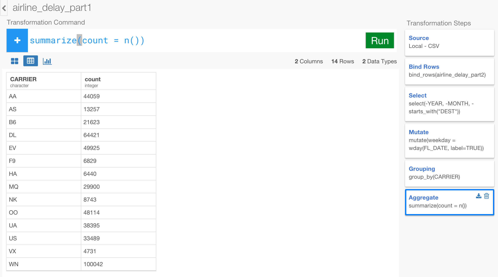

# Analyze Flight Data

## Download Flight Delay sample data

We're going to use the following three data files for this tutorial. You can download them by clicking on them.

- Airline delay part 1
- Airline delay part 2
- Airline carrier code

## Create a new project  

After you open Exploratory app, create a new project.


## Import sample data

Inside the project, you can click a plus '+' icon next to 'Data Frame' text in the left side pane to import 'airline_delay_part1.csv'.


Aftr you select the file from the file picker dialog and hit OK, you'll see the first 10 rows of the data you're importing.


Since it's showing up appropriately, you can keep the parameters as default and click 'Import' button.

You can see a brief summary of the data in Summary view. It shows 26 columns and 234,634 rows at the top, and you can also see some of the columns' sneak peak view. For example, you can see the most frequently appeared airlines in CARRIER column, and when you scroll down you can see ARR_DELAY column has some NA values and its data range quickly.


Let's import the other two data files as well.

- Airline delay part 2
- Airline carrier code

After the import, go back to Airline delay data part1 and let's start analyzing the data.


## Combine multiple data frames - bind_rows

First, let's combine the current data frame 'airline_delay_part1' with the other data frame 'airline_delay_part2'. You can click plus '+' button, and select 'Bind Rows' from the dropdown menu.


Once the command is set in the transformation command input box, you'll see a dropdown that suggests two possible data frames.


 Hit 'Return' key or click on 'airline_delay_part2' to select 'airline_delay_part2'. The command look like the below.

```
bind_rows(airline_delay_2014_12)
```

Click 'Run' button, and you'll get a result like below.


You can see the same number of the columns - 26 columns - but now the number of the rows has increased to 469,968 rows. And when you look at DAY_OF_MONTH column its data range starts from 1 to 31.


## Select Columns

There are many ways to select only the columns you want for your analysis. Let's try some of them.

First, let's drop the first two columns YEAR and MONTH. Click the plus '+' icon and select 'Select' from the dropdown menu. Once the 'select' command is typed you'll be suggested a list of the relevant functions and columns, and you'll notice the 1st choice as minus '-', which you can use to drop columns. Hit enter to select it.


Now, immediately after, you'll be suggested a list of the columns, select YEAR.


Once it's selected, you can continue typing comma to select another column. From the suggested list you can basically do the same to select the minus '-' operator and select MONTH column. The final command would be something like below.

```
select(-YEAR, -MONTH)
```

This will produce something like the one below. You'll notice that there are only 24 columns now.


Now, let's say you're not interested in the information about the destination of the flights and want to drop the related columns all together. Instead of typing each column to add or remove, you can use one of the convenient functions you can use inside select() function called 'starts_with()'. You can either update the existing 'select' command or add a new 'select' step. Here, let's update the existing 'select' step to be something like below.

```
select(-YEAR, -MONTH, -starts_with("DEST"))
```

The syntax suggestion should list the relevant operators, functions, and column names for you to pick as you type. When you hit 'Run' button you'll get something like below. Now, you see only 19 columns.


## Date operation - Weekday  

You can add custom calculations or expressions to add new columns easily.

There is a column called 'FL_DATE', which is Date data type and has the flight date information. Let's say you want to extract weekday (e.g. Monday, Tuesday, etc.) information out of this data. You can use one of the date related functions called ```wday()```.

Click the plus '+' button, select 'Mutate' operation, and start typing something like below.  

```
mutate(weekday = wday(FL_DATE)
```
when you hit 'Run' button and scroll down to the bottom of the page you'll see a new column created called 'weekday'.

  

You'll notice, though, that the data is number between 1 and 7. This is because ```wday()``` function gives you integer values from 1 to 7 starting 1 for Monday. Instead of the number, you can get the name of each day like 'Monday' by adding an extra argument called ```label``` to ```wday()``` function like below.

```
mutate(weekday = wday(FL_DATE, label=TRUE))
```

This would give you what you would expect for week days like below.

  

One cool thing about this is that the result data type is something called 'ordered factor', which means that when you want to sort on this column it would respect the order of the weekdays starting from Sunday and ending at Saturday. You can quickly check this out by going to Chart view and assign this column 'weekday' to X-Axis.

  


## Summarize (Aggregate)

Let's find out how many flights for each carrier. To do this, let's go to Table view and see the result better.

Click the plus '+' button to add group_by() command, and type a command like below.

```
group_by(CARRIER)  
```

This is not going to change the data yet. It's just updated the internal data structure that is now grouped by CARRIER unique values.

  


Now, you can add ```summarize()``` command to get the aggregated count values with ```n()``` function like below.

```
summarize(count = n())
```

Once you hit 'Run' button you'll see only two columns, one is for the grouping column and the other is for this aggregated value column 'count'.

  

Now, let's say you want to find out how many states each carriers are flying out from, you can use ```n_distinct()``` function and set ORIGIN_STATE_ABR column as an argument value.

```
summarize(count = n(), number_of_states = n_distinct(ORIGIN_STATE_ABR))
```

This will give you something like below. You can see there are 39 US States AA (American Airline) is flying out from in this particular time period.

  


### Calculate Ratio

For the count values, let's say you also want to know the proportion (percentage) of the flights for each carrier against the total number. You can do this by, first, calculating the total of these count values and using that to divide each of the count value. Let's add 'mutate' command and type something like below.

```
mutate(ratio = count / sum(count))
```

This will give you the result like below. You can see AA has 9.37 % of the flights in this data.


Now, let's say you want to see the most common US States that each carrier is flying from. This means we want to change the grouping setting that we have done at a few steps before. You can do this easily with Exploratory. Click 'Grouping' step at the right hand side 'Transformation Steps' pane to go back to this particular step.


And, update the existing command to add ORIGIN_STATE_ABR column right after CARRIER column like below.

```
group_by(CARRIER, ORIGIN_STATE_ABR)
```


And make sure you hit 'Run' button. After that's done, then click the last step 'Mutate' in the right hand side 'Transformation Steps' pane. Now you see 442 rows instead of the 14 rows before.


This is because now each carrier has rows for all the States it's flying out from. And the aggregated calculations like 'count', 'number_of_states', 'ratio' are re-calculated automatically based on the previous grouping setting with ```group_by()``` function. The 'ratio' column is now showing the ratio of number of the flights within each carrier group in this case. You can go to Chart view to see what's happening visually.

Within an each bar, which is representing each carrier, you can see the ratio based on the number of flights for each US States.


Now, let's do one last but really cool calculation. Some people call this 'Window' function.

Let's say you want to see the ranking number for each state within each carrier based on the 'count' numbers that are the numbers of the flights. To do this, you can use 'min_rank()' function to return the ranking number. You can update the existing mutate() command like below.

```
mutate(ratio = count / sum(count) * 100, rank = min_rank(count))
```

After you hit 'Run' button you'll get something like below.


But, the generated rank values are based on the ascending order (small number to big number). In this case, we want to consider that the bigger the 'count' number is the smaller the ranking number should be. So you can use 'desc' function to wrap around 'count' column to make the order reversed like below.

```
mutate(ratio = count / sum(count) * 100, rank = min_rank(desc(count)))
```

After you hit 'Run' button you'll get something like below. You can see FL (Florida) is the 2nd and CA (California) is the 3rd.


There are a few variations of the ranking functions, and 'min_rank()' is one of them. You might want to go to Chart view to understand this visually.

Click on Chart button and go to Chart view. Add a new transformation step with ```filter()``` command to make this simple. You can type something like below to keep only the data for a carrier 'AA' (American Airline).

```
filter(CARRIER  == "AA")
```

Now, assign 'rank' column to both X-Axis and Y-Axis, and 'ORIGIN_STATE_ABR' column to Color.


As you see, the 35th rank has two states 'AL' and 'IA' because they have the equal 'count' values. In this case 'min_rank()' function keeps the next rank vacant, in this case that is the 36th, and resume the next rank from the 37th. If you don't want to have this vacant ranks, then you can use 'dense_rank()' instead.

Go back to one step before of 'Mutate' and use ```dense_rank``` instead of the existing ```min_rank```, and hit 'Run' button. After that, go back to the last step of 'Filter'. You will see a chart view like below. Now there is no vacant rank number.


As you have seen, by using the combination of group_by(), summarize(), and mutate() flexibly you can do many amazing things quickly with Exploratory.
