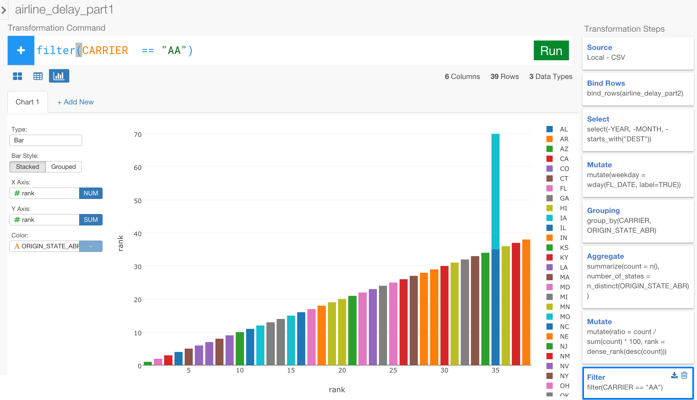
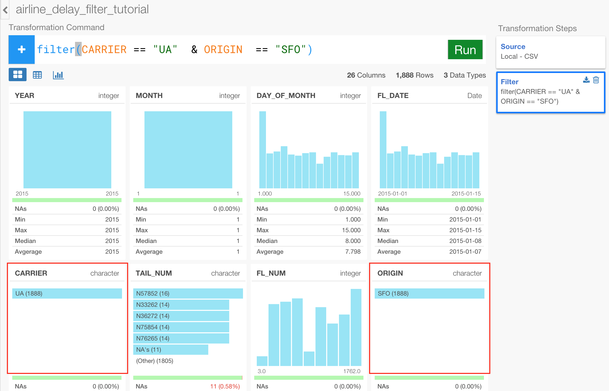

# Data Wrangling / Analysis Grammar - Basic

### What you are going to learn:

In this tutorial, you are going to learn how you can transform and analyze data in Exploratory by using a grammar based operations such as:

- Column Selection - select
- Creating a new column or overriding an existing column with Expression - mutate
- Grouping - group_by
- Summarizing / Aggregation - summarize
- Window Calculation - mutate
- Filtering - filter


## Download Flight Delay sample data

We're going to use the following file for this tutorial. You can download it from the link below.  

- [Flight delay 2016 January data](http://download.exploratory.io/data/airline_delay_2016_01.csv)

## Create a new project

Once you start Exploratory app, create a new project to start, if you haven't.


## Import sample data

Inside the project, you can click a plus '+' icon next to 'Data Frame' text in the left side pane to import 'airline_delay_2016_01.csv'.


After you select the file from the file picker dialog and hit OK, you'll see the preview data.


Since the data is showing up ok, you can keep the parameters as default and click 'Save' button.


## Select or Drop columns

There are many ways to select columns you want for your analysis. Let's try some of them.

First, let's drop 'FL_NUM' column'. Click the down arrow icon next to 'FL_NUM' column name and select 'Drop'.


You will see that 'select' operation is generated at the top. This is one of the dplyr - a grammar of data wrangling - commands in R and can be used to either keep or delete columns. In the pop-up dialog, you can see that 'Exclude' option is selected for dropping the column. Also you can see there is a minus '-' in front of the column name 'FL_NUM' in the green box indicating that it's going to delete the column.


Hit 'Run' button, which is located at the right hand side with green color.


Now FL_NUM column is gone.


Let's remove other columns. There are columns whose names start with "ORIGIN", and you can delete them all together by using one of the convenient functions called 'starts_with()' inside the same 'select' operation.

Click '+' button next to '-FL_NUM' green token.

Inside the dialog, select 'Exclude' option, select 'Function' tab, and select 'starts_with' from Function Type,


Type "ORIGIN" in Matching Text, and  hit 'Run' button.


Now those columns whose names starting with "ORIGIN" are all gone!


## Mutate - Extract Day of Week

You can create a new column or override an existing column with an expression with 'mutate' operation.

Let's try to extract the day of week (e.g. Monday, Tuesday, etc.) information from 'FL_DATE' column values.

Select 'Extract' and 'Day of week' from the column header dropdown menu.


You would notice that 'mutate' operation (in purple box) is created and there is the following expression already generated inside Expression text area.

```
wday(FL_DATE, label = TRUE)
```

This 'wday' function is from one of the R packages called [lubridate](https://cran.r-project.org/web/packages/lubridate/), which has a comprehensive set of functions that help you to work with any date and time related data in a much more effective and intuitive way.

You can click on 'Function List' button to see all the R functions available out of the box in Exploratory. Click on a function name to select so that you can see the detail information for the function, double click to insert the function into Expression text area.


Also, you can always click 'Show Doc' link to show the document for the function. Make sure your mouse cursor is inside the function you want to know about.


Type a column name to create a new column with this expression. If you want to override 'FL_DATE' column with the generated values by this expression then you can click 'Existing Column' tab and select 'FL_DATE' column from the list.

Once you click 'Run' button you will find a new column created at the bottom of the page with the generated values.


One cool thing about this 'wday' function is that it creates the new column as something called 'ordered factor', which contains the sorting order information embedded inside the column itself. This means that any sorting related operation such as 'Arrange', 'Group by', will respect the order of the weekdays starting from Sunday and ending to Saturday. You can quickly verify this by going to Viz view and assigning this newly created column for the day of week to X-Axis.


Or, you can check this out with Pivot Table like below.


## Group by / Summarize - Counts

You can use 'group_by' operation to set grouping levels and 'summarize' operation to summarize or aggregate values.

Let's find out how many flights each of the carriers had during this time period. In order to see the results better, we can go to Table view.


First, click on 'Group by' button at the top, and select 'CARRIER' column in the pop-up.


This has set the grouping level at the data frame. When your data is in 'Grouped' mode you can see 'Groups' attribute showing up at the top.


You can click 'Summarize' button at the top and select 'n (count)' to count the number of the flights for each CARRIER.


Once you click 'Run' button you will get the counts values for each of the carriers.


### Mutate - Calculate the proportion (percentage / ratio) - Window Calculation

Let's say you also want to know the proportion (percentage) of the 'counts' values against the total.

Click 'Mutate' button and enter the following expression to calculate the total counts.

```
sum(counts)
```


You would notice that the same value is repeated for every single row.


This is because 'mutate' command calculates and returns the values at row level, as opposed to 'summarize' command calculate and return the value at the group level. As you can see, there is no 'Grouped' attribute displayed, this means this data frame is not in 'Grouped' mode. That's why the 'sum' function has calculated the total for all rows available.

Now, you can click '+' button to create a new expression, which is to calculate the proportion (percentage).


You can hit 'Tab' key when the mouse cursor is inside Expression text area. This will show a list of the appropriate columns and functions you can pick from.


Select 'counts' column and make the expression to be something like below to calculate the percentage.

```
counts / total * 100
```


Once you click 'Run' button, you will get a 'percentage' column that is showing the result of the calculation.


As you can see in this example, you can use a previously created expression in the next expression in a same 'mutate' operation.


This is because R does something called 'vectorized' operation, which means it does the calculation column by column. And this is part of the reason why the performance is much faster in R with dplyr than other 'scalar' type operations commonly found in SQL based tools, in general.

By the way, in this example, we have separated these 'total' and 'percentage' to take 'step-by-step' approach. But you could have done this together in a single expression like below.

```
counts / sum(counts) * 100
```

Now, by this time, we have taken 3 steps (group by, summarize, mutate) to get these percentage calculation. Each step is performed based on the data frame that is generated by the step before, but these steps are actually independent from one another. Let me rephrase this again because this is really important and actually a key concept to work with data efficiently in R and Exploratory. What's connecting those steps are not steps themselves, rather the data between the steps. This means, you can go back to any of the previous steps to update the operation independently and expect any downstream operation steps to reflect the change automatically.

For example, go back to 'Grouping' step by clicking on 'Grouping' step at the right hand side. Add another grouping level by clicking on '+' button.


Select 'DEST_STATE_ABR', which is column for the destination states for the flights.


And now, you can go back to the last step by clicking on 'Mutate' step at the right hand side.


You would notice that, not only there is now a new column 'DEST_STATE_ABR' showing up in the table, but also the 'total' values are different among the Carriers.



This is because the previous 'Summarize' step removes one grouping level (DEST_STATE_ABR) from the data frame when summarized the data, but there is still one level of grouping left, which is 'CARRIER'. So the 'sum' function inside this 'mutate' step is calculating the total against each group (CARRIER). And therefore, as you would guess, the 'percentage' values are calculated against each group (CARRIER), which means that you are looking at the percentage of the flights that arrived in each state for each carrier in this result.

To understand this visually, you can go to Visualization view and assign 'CARRIER' to X-Axis, 'percentage' to Y-Axis, and 'DEST_STATE_ABR' to Color in Bar chart.


### Rank - Window Calculation

Now, you can add ranks to each State within each Carrier based on the 'counts' values. Click '+' button in the same 'mutate' step, and add the following expression.

```
min_rank(desc(counts))
```

We're using 'desc' function to reverse the default ranking order.


Again, this ranking calculation is done within each Carrier group. You can always check 'Groups' attribute to see what is the current grouping level.


Note that, if you want to get rid of the grouping setting, you can use 'ungroup' operation.


## Filter - Top 10

Now, here is the last step. Let's keep only the top 10 ranking states for each carrier.

Click 'Filter' button, select 'rank' column, select 'less than or equal' operator for Operator, and type 10.


This will keep only the states that are in the top 10 ranking for each carrier.



As you might have noticed though, you could have simply click on 'Top N' button and use 'counts' column get only Top 10 states for each carrier, instead of calculating the ranks and filtering as separate steps.


## Conclusion

As you have seen, by using the combination of group_by(), summarize(), and mutate() flexibly you can do many amazing things quickly.

This is just the basic, and there are much more to explore. Try other tutorials or start play around with your own data. If you have any question please feel free to contact support@exploratory.io .

Happy Data Exploration!
