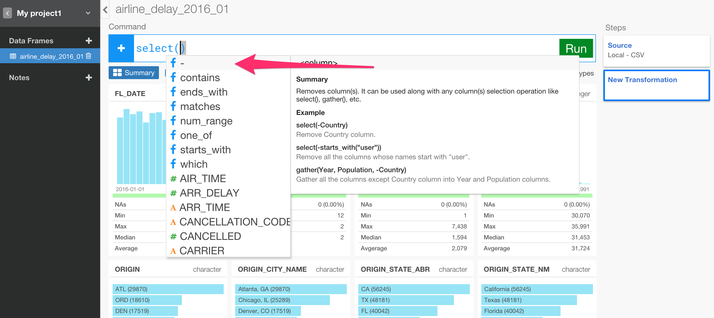
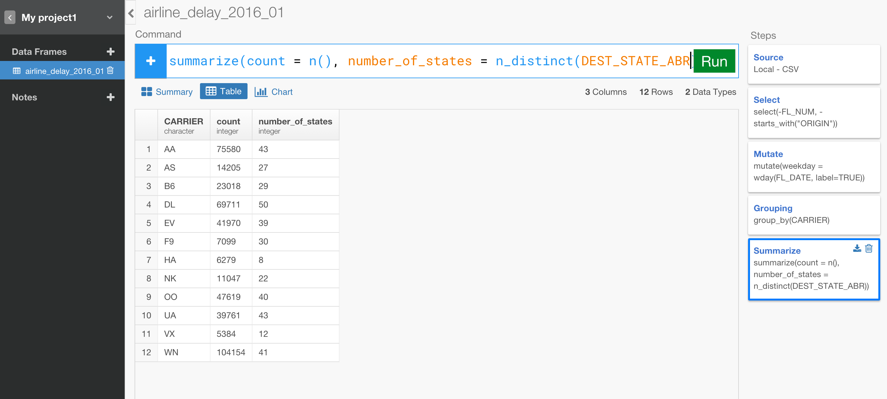

# Analyze Flight Data

## Download Flight Delay sample data

We're going to use the following three data files for this tutorial. You can download them by clicking on them.

- Airline delay part 1
- Airline delay part 2
- Airline carrier code

## Create a new project  

After you open Exploratory app, create a new project.


## Import sample data

Inside the project, you can click a plus '+' icon next to 'Data Frame' text in the left side pane to import 'Airline delay part1'.


You can see the first 10 rows of the data from the file you're importing.


Since it's showing up appropriately, you can keep the parameters as default and click 'Import' button.

You can see a brief summary of the data in Summary view. It shows 26 columns and 234,634 rows at the top, and you can also see some of the columns' sneak peak view. For example, you can see the most frequently appeared airlines in CARRIER column, and when you scroll down you can see ARR_DELAY column has some NA values and its data range quickly.


Let's import the other two data files as well.

- Airline delay part 2
- Airline carrier code

After the import, go back to Airline delay data part1 and let's start analyzing the data.

## Combine data frames with Bind Rows / Union  

First, let's combine the current data frame 'airline_delay_part1' with the other data frame 'airline_delay_part2'. You can click plus '+' icon under 'Transformation Command' text, and select 'Bind Rows' from the dropdown menu.


Once the command is set in the transformation command input box, you'll see a dropdown that suggests two possible data frames. Hit 'Return' key or Click on it to select 'airline_delay_part2'. The command look like the below.

```
bind_rows(airline_delay_2014_12)
```

Click 'Run' button.


You can see the same number of the columns - 26 columns - but now the number of the rows has increased to 469,968 rows. And when you look at DAY_OF_MONTH column its data range starts from 1 to 31.


## Select Columns

There are many ways to select only the columns you want for your analysis. Let's try some of them.

First, let's drop the first two columns YEAR and MONTH. Click the plus '+' icon and select 'Select' from the dropdown menu. Once the 'select' command is typed you'll be suggested a list of the columns but you'll notice the 1st choice as minus '-', which you can use to drop columns. Hit enter to select it.



You'll be suggested a list of the columns, select YEAR.


Once it's selected, you can continue typing comma to select another column. From the suggested list you can basically do the same to select the minus '-' operator and select MONTH column. The final command would be something like below.

```
select(-YEAR, -MONTH)
```

This will produce something like the one below. You'll notice that there are only 24 columns now.


Now, let's say you're not interested the information about the destination of the flights and drop the related columns all together. Instead of typing each column to add or remove, you can use one of the convenient functions 'starts_with()'. You can either update the existing 'select' command or add a new 'select' step. Here, let's update the existing 'select' step to be something like below.

```
select(-YEAR, -MONTH, -starts_with("DEST"))
```

The syntax suggestion should list the relevant operators, functions, and column names for you to pick as you type.


## Date operation - Weekday  

You can add custom calculations or expressions to add new columns easily. We have a column called 'FL_DATE', which is Date data type and has the flight date information. Let's say you want to extract weekday (e.g. Monday, Tuesday, etc.) information out of this data. To do so, you can use one of the date related functions called 'wday()'.

Click the plus '+' button, select 'Mutate' operation, and start typing something like below.  

```
mutate(weekday = wday(FL_DATE)
```
when you hit 'Run' button and scroll down to the bottom of the page you'll see something like below.

  

You'll notice that the data is number between 1 and 7. This is because wday() function gives you integer values from 1 to 7 starting, 1 is Monday. Instead of the number, you can get the name of each day by adding an extra argument to the 'wday()' function like below.

```
mutate(weekday = wday(FL_DATE, label=TRUE))
```

This would give you what you would expect for week days.

  

One cool thing about this is that the result data type is something called 'ordered factor', which means that when you want to sort on this column it would respect the order of the weekdays starting from Sunday and end at Saturday. You can quick check this by going to Chart view.

  


## Summarize (Aggregate)

Let's find out how many flights for each carrier. To do this, let's go to Table view to see the result better.

Click the plus '+' button to add group_by() command, and select CARRIER like below.

```
group_by(CARRIER)  
```

  


Then, you can add summarize() command to get the aggregated count values with 'n()' function like below.

```
summarize(count = n())
```

  

If you want to find out how many states each carriers are flying out from you can use n_distinct() function and set ORIGIN_STATE_ABR column.

```
summarize(count = n(), number_of_states = n_distinct(ORIGIN_STATE_ABR))
```

  


## Calculate Ratio

For the count values, let's say you also want to know the proportion of all the flights for each carrier. To do this, first you want to calculate the total of these count values and use that to divide each of the count value. You can add 'mutate' command to do just that.

```
mutate(ratio = count / sum(count))
```




Now, let's say you want to see the most common States that each carrier is flying from. To do, click Grouping step at the right hand side 'Transformation Steps' pane to go back to this particular step, and add ORIGIN_STATE_ABR column to the group_by() command like below.

```
group_by(CARRIER, ORIGIN_STATE_ABR)
```


And, click the last step of 'Mutate' in the right hand side 'Transformation Steps' pane. Now you see 442 rows instead of the 14 rows before. This is because now each carrier has rows for all the States it's flying out from. And the aggregated calculations like 'count', 'number_of_states', 'ratio' are updated accordingly. The 'ratio' column is now showing the ratio of number of the flights within each group - CARRIER - in this case. You can go to Chart view to understand this visually.


Now, let's say you want to see the ranking of the states for each carrier. You can use 'min_rank()' function inside the mutate() command like below.

```
mutate(ratio = count / sum(count) * 100, rank = min_rank(count))
```


But, the generated rank values are based on the order of the small number to the big number. In this case, we want to consider that the bigger the 'count' number is the higher the ranking should be. So you can use 'desc' function to wrap around 'count' column to make the order reversed like below.

```
mutate(ratio = count / sum(count) * 100, rank = min_rank(desc(count)))
```


There are a few variations of the ranking functions, and 'min_rank()' is one of them. You might want to go to Chart view to understand this visually. Make sure you run filter() command to keep only 'AA' carrier.


As you see, the 35th rank has two states 'AL' 'IA' because they have the equal 'count' values. In this case 'min_rank()' function keeps the next rank vacant, in this case that is 36th, and resume the next rank to be 37th. If you don't want to have this vacant ranks, then you can use 'dense_rank()' instead. This will give you a view of something like below.


As you have seen, by using the combination of group_by(), summarize(), and mutate() flexibly you can do many amazing things quickly.


## Filter Data

### Basic Filtering

Now, let’s say you want to see only United Airline (UA) data. You can run something like below.

```
filter(CARRIER == “UA”)
```

And now, you want to see the data only for the flights that are United Airline (UA) and left San Francisco airport (SFO).

```
filter(CARRIER == “UA” & ORIGIN == “SFO”)
```

Or, you might want to see only the data for the flights that left San Francisco airport (SFO) but not United Airline (UA).

```
filter(CARRIER != “UA” & ORIGIN == “SFO”)
```

Filtering with multiple values

What if you want to see only the data for the flights that are either United Airline (UA) or American Airline (AA)?
You can use ‘%in%’ for this, just like ‘in’ operator in SQL.

```
filter(CARRIER %in% c(“UA”, “AA”))
```

We can see only AA and UA as we expected. 

Now, what if you want to see the data other than United Airline (UA) and American Airline (AA) this time ? Here’s a magic one letter you can use with any condition, it’s ‘!’ (exclamation mark). So it goes like this. 

```
filter(!CARRIER %in% c(“UA”, “AA”))
```

Notice that there is the exclamation mark at the beginning of the condition inside the filter clause. This is a very handy ‘function’ that basically flips whatever the condition after. So the result above doesn’t include ‘UA’ nor ‘AA’.


### Filtering with Aggregate functions

Now, let’s spice it up a little bit. 

What if you want to see only the flights whose arrival delay time (ARR_DELAY) is greater than the overall average ? First, let’s look at the average time.

```
 summarize(average = mean(ARR_DELAY, na.rm = TRUE))
```

It’s about 12.75 minutes. So we’re interested in seeing any flights whose arrival delay time is greater than 12.75 minutes. To do, you can actually directly do the average calculation inside the filter clause. 

```
filter(ARR_DELAY > mean(ARR_DELAY, na.rm = TRUE))
```

This to me used to look almost too good to be true, but then as I get more used to it this is how we ask questions, that is “What are the flights whose arrival delay times are greater than the overall average ?” 

By the way, ‘na.rm = TRUE’ inside ‘mean()’ function is an argument you can pass to the aggregate functions like ‘mean()’ so that it removes any NA values before doing the calculation. If this is not set TRUE then it will return NA when there is NA values in the data. 

Now, what if you want to see the flights whose arrival delay times are greater than the average of each airline carrier, instead of the overall average ? In this case, all you need to do is to add ‘group_by’ clause before the filter step.

```
group_by(CARRIER)
```

And when you click on the filter step, the result contains only the data whose arrival delay time is greater than each carrier's average delay time.  


It’s this simple! Before we get too excited let’s make sure the result really reflects the command below by looking at each airline carrier’s average arrival delay time. 


```
summarize(average = mean(ARR_DELAY, na.rm = TRUE))
```

As you see the average arrival delay time for carrier ‘EV’ is about 19.69 minutes. Now when you look at the previous result of the filtering, you can see that the arrival delay times are all greater than 19.69. 


## Filtering with Top N functions

Let’s say you want to see the worst 10 flights in terms of the arrival delay time. You can do this with two different ways. First, let's do a very simple one using top_n() function. It's pretty straightforward to use this.

First, you can see NA values for ARR_DELAY column. Let's filter them out.

```
filter(!is.na(ARR_DELAY))
```

Now, NA values are gone. Next, you can run the top_n() command like below.

```
top_n(10, ARR_DELAY)
```

This will return the 10 flights whose arrival delay time are the biggest 10. If you want to see the opposite order, which means in this case it would keep the 10 flights from the smallest arrival delay time.

```
top_n(10, desc(ARR_DELAY))
```


Now, instead of using top_n() command, you can also use filter() command to achieve the similar.

```
filter(min_rank(ARR_DELAY) <= 10)
```

But looks like the result is actually the best 10, not the worst 10, because the less the arrival time means the earlier the flights actually had arrived in this context, so basically we want to flip the order. To do that, you can use ‘desc()’ function just like you’d do with SQL.


```
filter(min_rank(desc(ARR_DELAY)) <= 10)
```


These are the worst 10 flights in January 2014. I see 7 out of those 10 flights are American Airlines, interesting.

### Filtering with Window Function - Rank

Now, what if you want to see the worst 10 flights for each airline carrier, instead of the overall worst 10? Yes, as you saw before, all you need to do is to add group_by clause before this filter clause.

```
group_by(CARRIER)
```

Then, clicking on the filter step will give you the result you would expect.

```
filter(rank(desc(ARR_DELAY)) <= 10)
```


To make it easier to see if the result really reflects the command, let’s try to see only the worst 1 for each carrier.

```
filter(rank(desc(ARR_DELAY)) <= 1)
```

Looks like it’s doing what we would expect. And we can see American Airline is the worst of the worst.;)

As you see, with dplyr not only can you filter the data with aggregate or window functions, but also you can assemble them flexibly to answer your analysis question without disturbing the way you would ask the question. Hope this post has demonstrated you the power of dplyr.


## Join - Left, Anti, Inner Joins

Now, these two abbreviation of the carrier names are not clear. Fortunately, there is a lookup data so that we can join them together. First, let's import this carrier abbreviation data.

```
left_join(carrier_code, by=c("CARRIER" = "code"))
```
