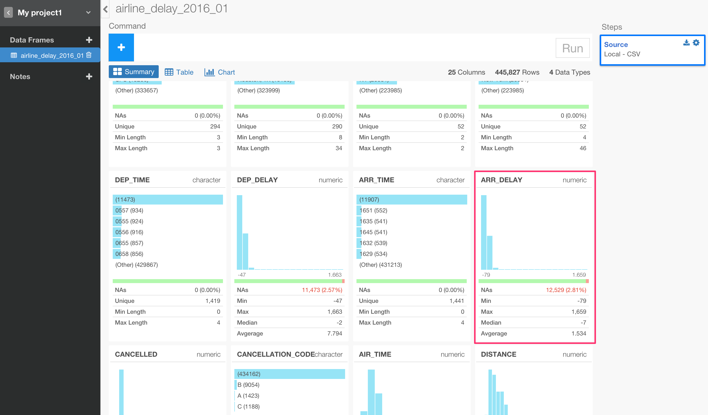
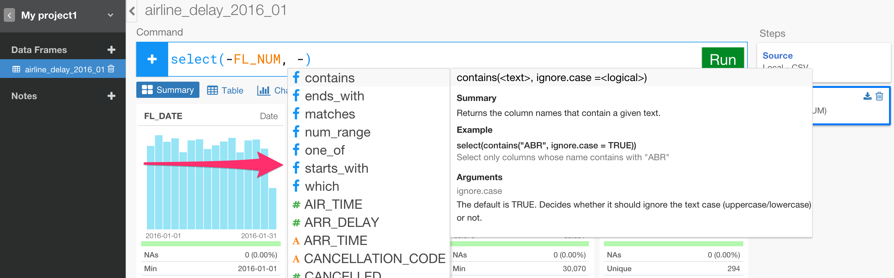
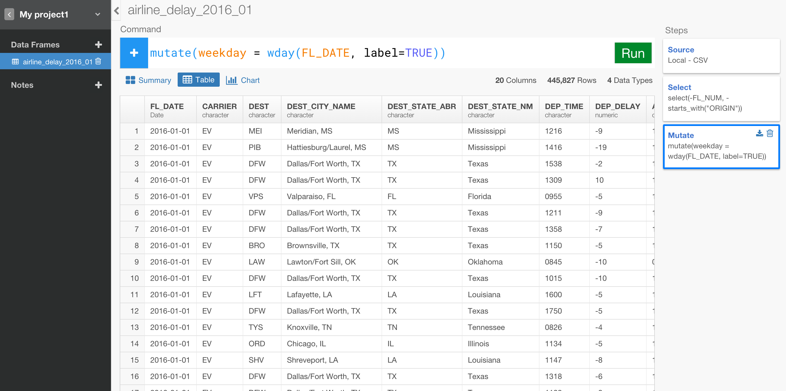

# Analyze Flight Data - part 1

### What you are going to learn:

- Column Selection - select()
- Creating Calculation / Expression - mutate()
- Date data transformation - wday()
- Grouping - group_by()
- Aggregation - summarize()
- Filtering - filter()


## Download Flight Delay sample data

We're going to use the following file for this tutorial. You can download it from [here](](http://download.exploratory.io/data/airline_delay_2016_01.csv)).

- [Flight delay 2016 January data](http://download.exploratory.io/data/airline_delay_2016_01.csv)

## Create a new project

Once you start Exploratory app, create a new project to start.


## Import sample data

Inside the project, you can click a plus '+' icon next to 'Data Frame' text in the left side pane to import 'airline_delay_part1.csv'.


After you select the file from the file picker dialog and hit OK, you'll see the first 10 rows of the data you're importing.


Since the data is showing up ok, you can keep the parameters as default and click 'Import' button.

## Summary data view

Once the data is imported you can see a brief summary of the data in Summary view. It shows 25 columns and 445,827 rows at the top, and you can also see some of the columns' sneak peak view. For example, you can see the most frequently appeared airline carriers in CARRIER column.


And, when you scroll down you can see ARR_DELAY column having NA values and its data range quickly.



## Select or Drop columns

There are many ways to select only the columns you want for your analysis. Let's try some of them.

First, let's drop 'FL_NUM' column'. Click the plus '+' icon and select 'Select' from the dropdown menu.


Once the 'select' command is typed you'll be suggested a list of the relevant functions and columns, and you'll notice the 1st choice as minus '-', which you can use to drop columns. Hit enter to select it.


Now, immediately after, you'll be suggested a list of the columns, select FL_NUM.


Once the column is selected click 'Run' button.


Now FL_NUM column is gone.


You can either update the existing 'select' command or add a new 'select' step. Here, let's update the existing 'select' step to be something like below.

Let's try removing the columns whose names start with "ORIGIN". You can use one of the convenient functions you can use inside select() function called 'starts_with()'. Inside the 'Select' command you can start typing ',' (comma) and select '-' from the suggested list to remove, then select ```starts_with()``` function from the suggested list.



Inside this ```starts_with()``` function, type "ORIGIN", and  hit 'Run' button.


Now those columns whose names starting with "ORIGIN" are all gone!

The final command would be something like below.

```
select(-FL_NUM, -starts_with("ORIGIN"))
```

The syntax suggestion should list only the relevant operators, functions, and column names for you to pick as you type.


## Date operation - Weekday

You can add custom calculations or expressions to add new columns easily.

There is a column called 'FL_DATE', which is Date data type and has the flight date information. Let's say you want to extract weekday (e.g. Monday, Tuesday, etc.) information out of this data. You can use one of the date related functions called ```wday()```.

Click the plus '+' button, select 'Mutate' operation.


And, start typing something like below.  Basically, this is creating a new column called 'weekday' and using ```wday()``` function to return week days from 'FL_DATE' column data.

```
mutate(weekday = wday(FL_DATE))
```

when you hit 'Run' button and scroll down to the bottom of the page you'll see a new column created called 'weekday'.


You'll notice, though, that the data is shown as number between 1 and 7. This is because ```wday()``` function gives you integer values from 1 to 7 starting 1 for Monday. Instead of the number, you can get the name of each day like 'Monday' by adding an extra argument called ```label``` to ```wday()``` function like below.

```
mutate(weekday = wday(FL_DATE, label=TRUE))
```

This would give you what you would expect for week days like below.


One cool thing about this is that the result data type is something called 'ordered factor', which means that when you want to sort on this column it would respect the order of the weekdays starting from Sunday and ending at Saturday. You can quickly check this out by going to Chart view and assign this column 'weekday' to X-Axis. Make sure you uncheck the 'Sort' check box next to Y-Axis to disable Y-Axis level sorting.


## Summarize (Aggregate) - Count rows and Count uniques

Let's find out how many flights per each carrier there are in this data. To do this, let's go to Table view and see the result better.



Click the plus '+' button to add group_by() command.


And, select 'CARRIER' column from the suggested list.


And, hit 'Run' button.

You would notice now that it is showing '12 Groups' in the data summary information area above the table. You can click on it to see which column(s) is set for the grouping.


Once the grouping level is set, let's get the aggregated calculation. We can use ```summarize()``` command to aggregate values and ```n()``` function inside the ```summarize()``` command to count how many records for each 'CARRIER'.

Select 'Summarize' command under '+' button.


Start typing something like below.

```
summarize(count = n())
```

You would notice you will get a list of the suggested aggregate functions list right after typing '=' like below.


The suggested list always gives you the most appropriate functions based on the context. In this case, these are the functions that can be used inside ```summarize()``` command.

Once you hit 'Run' button you'll see only two columns, one is for the grouping column and the other is for this aggregated value column 'count'.


Now, let's say you want to find out how many states each carriers are flying into. You can use ```n_distinct()``` function to count unique values of 'DEST_STATE_ABR' column inside the same ```summarize``` command like below.


This will give you something like below. You can see AA (American Airline) is flying out from into 43 States while Hawaiian Airline is flying into only 8 States.

The final command is something like below.

```
summarize(count = n(), number_of_states = n_distinct(DEST_STATE_ABR))
```


### Calculate the proportion (percentage / ratio)

For the newly created 'count' column values, let's say you also want to know the proportion (percentage) of the values against the total number. You can use ```sum()``` function to calculate the total and use the result to divide each of the count values. You can do this operation with ```mutate()``` command, which would simply create a new column for doing such calculation. Note that ```summarize()``` would calculate values in an aggregated fashion meaning the result of the ```summarize``` operation will be less number of rows, while ```mutate``` operation doesn't aggregate, instead the result of the operation will keep the same number of the original rows.

Select 'Mutate' from the '+' button.


Type 'ratio' as a new column name and type '='.

You will be suggested for a list of the columns and functions, select 'count' column.

Once 'count' column is selected, you will see a list of the operators you can use to create a calculation. Select '/' (division) operator.


And, type 'sum(count)' by selecting the function and column from the suggested list, and hit 'Run' button.


You can see AA has 16.95 % of the all flights in this data.


### Update existing grouping setting

Now, let's say you want to see which US States each carrier is flying into and how many flights there are for each of States. You can do this very easily by clicking on the 'Grouping' step at the right hand side to go back to this particular step.


And, update the existing command to add DEST_STATE_ABR column right after CARRIER column, and hit 'Run' button.


You would notice that the number of the groups is 384 groups and the grouping levels are set to 'CARRIER' and 'DEST_STATE_ABR'.

Now, click the last step 'Mutate' in the right hand side.


You would notice that there are now 384 rows instead of the 14 rows like before.

This is because now each carrier has rows for all the States it's flying into. And the aggregated calculations like 'count', 'number_of_states', 'ratio' are re-calculated automatically based on the previous grouping setting with ```group_by()``` function. The 'ratio' column is now showing the ratio against each carrier group instead of the entire total. You can go to Chart view to see what's happening visually.

Within an each bar, which is representing each carrier, you can see the ratio based on the number of flights for each US States.


### Window Function - Rank

Now, let's do one last thing. This is a pretty cool and strong capability. Some people call this 'Window' function.

Let's say you want to see the ranking number for each state within each carrier based on the 'count' numbers. To do this, you can use 'min_rank()' function to return the ranking number. You can update the existing mutate() command like below.

```
mutate(ratio = count / sum(count) * 100, rank = min_rank(count))
```

After you hit 'Run' button you'll get something like below.


But, the generated rank values are based on the ascending order (small number to big number). In this case, we want to consider that the bigger the 'count' number is the smaller the ranking number should be. So you can use 'desc' function to wrap around 'count' column to make the order reversed like below.

```
mutate(ratio = count / sum(count) * 100, rank = min_rank(desc(count)))
```

After you hit 'Run' button you'll get something like below. You can see FL (Florida) is the 2nd and CA (California) is the 4th for American Airline carrier.


There are a few variations of the ranking functions, and 'min_rank()' is one of them. You might want to go to Chart view to understand this visually.

Click on Chart button to go to Chart view. Add a new transformation step with ```filter()``` command to make this simple. You can type something like below to keep only the data for a carrier 'DL' (Delta Airline).

```
filter(CARRIER  == "DL")
```

Now, assign 'rank' column to both X-Axis and Y-Axis, and 'ORIGIN_STATE_ABR' column to Color.


As you see, the rank 26th has two states 'AL' and 'OR' because they have the equal 'count' values. In this case 'min_rank()' function keeps the next rank vacant, that is the 27th, and resume the next rank from the 28th. If you don't want to have this vacant ranks, then you can use 'dense_rank()' instead.

Before going back to the previous 'Mutate' step, click 'Pin' button to keep the chart pinned down to this 'Filter' step.


Then, go to the 'Mutate' step and replace ```min_rank()``` with ```dense_rank()```, and hit 'Run' button. You will see a chart view like below. Now there is no vacant rank number.


As you have seen, by using the combination of group_by(), summarize(), and mutate() flexibly you can do many amazing things quickly with Exploratory.

This is just the basic, and there are much more to explore. Try other tutorials or start play around with your own data. If you have any question please feel free to contact support@exploratory.io .

Happy Data Wrangling!
