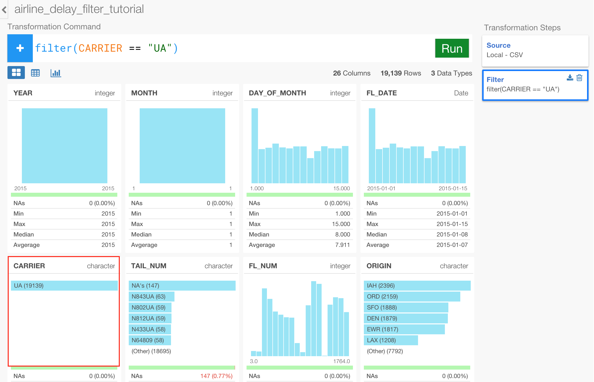
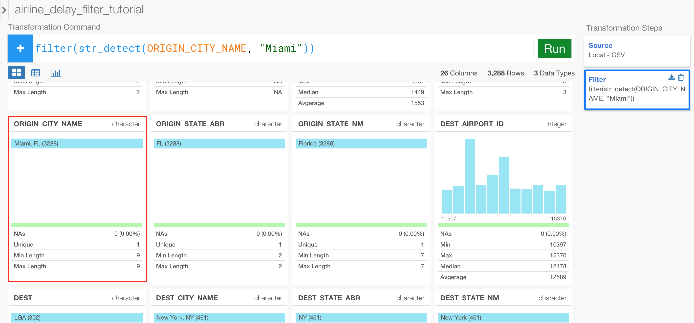
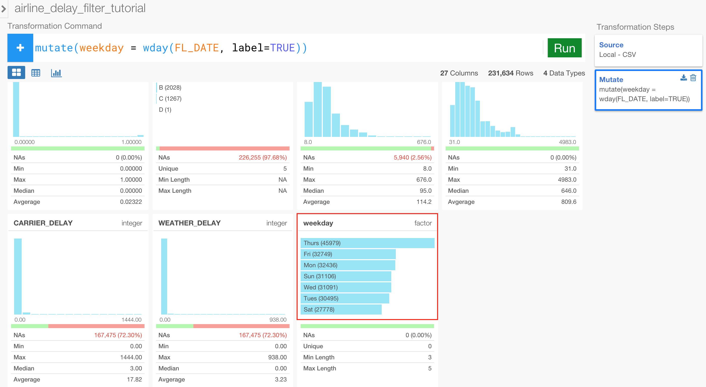
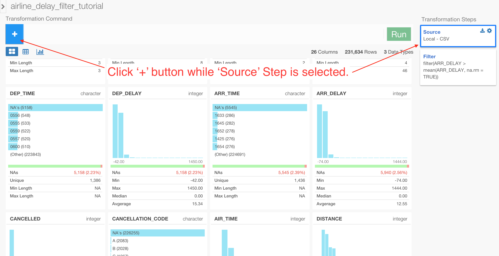
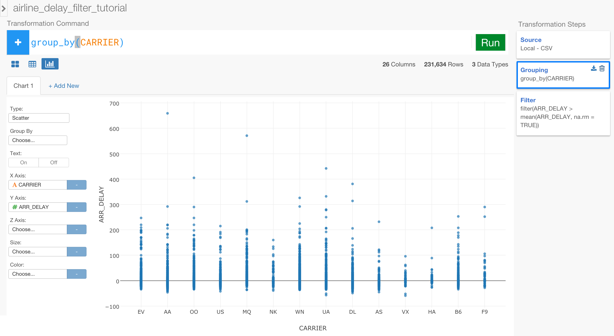
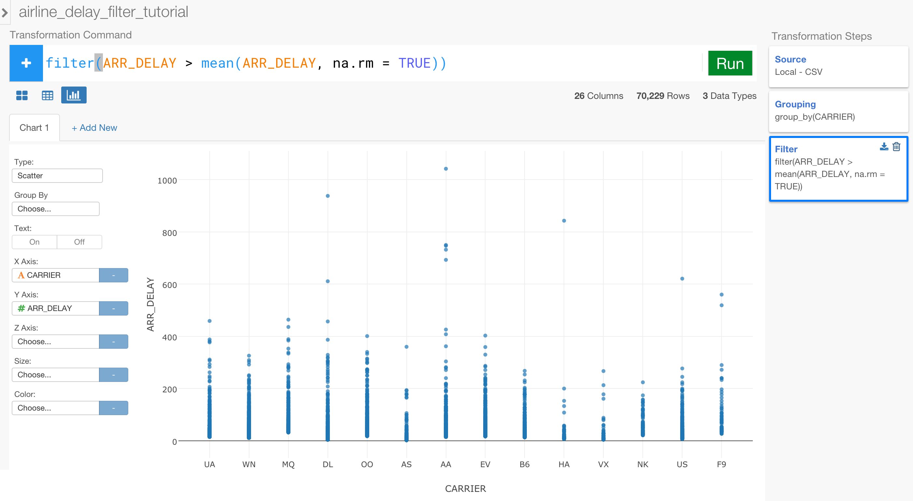
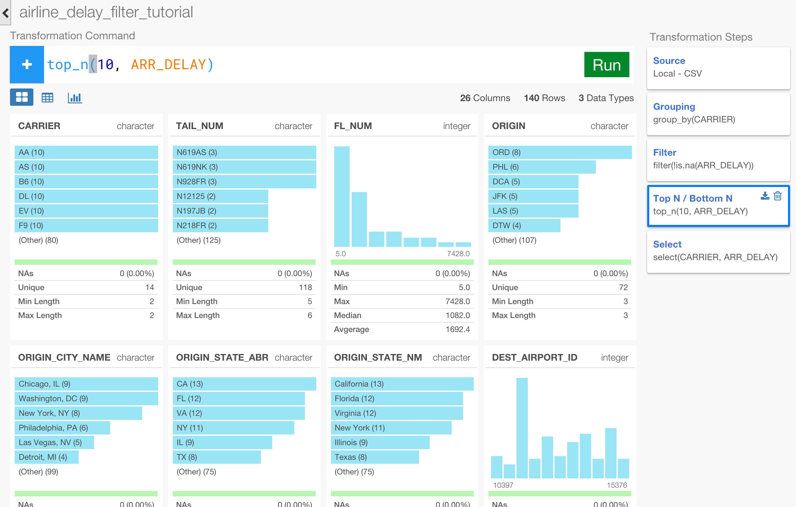

# Analyze Flight Data - part 2

**Before you start**

Because you can do many interesting ways of filtering the data with Exploratory we wanted to dedicate one whole tutorial to focus on just data filtering. If you haven't finished the part 1, we'd recommend you take a look to get your hands on with the basics of the data analysis with Exploratory.

**Data Transformation and Analysis operations you can find in this tutorial**

- Basic Filtering - filter()
- Filtering out NA values - filter(), is.na()
- Filtering with Date functions - str_detect()
- Filtering with Date functions - wday(), between()
- Filtering with Aggregated functions - group_by()
- Filtering with Window functions - rank()
- Filtering with Top N - top_n()


## Import sample data

We are going to create a new data frame by importing the same CSV file, 'airline_delay_part1.csv', we used in the part 1 tutorial. If you haven't downloaded it yet, you can download from the link below.

- Airline delay part 1 (link is still under development)

Inside the same project or a new project, you can click a plus '+' icon next to 'Data Frame' text in the left side pane to import 'airline_delay_part1.csv'.


After you select the file from the file picker dialog and hit OK, you'll see the first 10 rows of the data you're importing.


Keep the parameters as default and click 'Import' button.

You can see a brief summary of the data in Summary view. It shows 26 columns and 234,634 rows at the top.


Ok, let's begin.

## Basic Filtering

Now, let’s say you want to see only United Airline (UA) data. You can type something like below and hit 'Run' button.

```
filter(CARRIER == "UA")
```

You can see only UA is showing up in CARRIER column in Summary view.



### Filtering with multiple conditions

And now, you want to see the data only for the flights that are United Airline (UA) and the ones that left San Francisco airport (SFO). You can use '&' to connect two conditions.

```
filter(CARRIER == "UA" & ORIGIN == "SFO")
```

You can see only SFO is showing up in ORIGIN column in Summary view.


### Filtering with Not Equal operator

Now, let's see all the flights that left San Francisco airport (SFO) but not including United Airline (UA). You can use '!=' operator for 'Not Equal' condition.

```
filter(CARRIER != "UA" & ORIGIN == "SFO")
```

Once you hit 'Run' button, now you can see various carrier codes other than 'UA' in CARRIER column.


### Filtering with multiple values - IN

What if you want to see only the data for the flights that are either United Airline (UA) or American Airline (AA)?
You can use ‘%in%’ operator like below, just like ‘in’ operator in SQL.

```
filter(CARRIER %in% c("AA", "UA"))
```

Note that you need to add 'c' right before the beginning bracket, and this is actually a command that would create a list. Once you hit 'Run' button, you can see only 'AA' and 'UA' in CARRIER column.

 

### Filtering with multiple values - Not IN

Now, what if you want to see the data other than United Airline (UA) and American Airline (AA) this time ? It's actually pretty simple. You can just add an exclamation mark at the beginning of the condition inside the filter command like below.

```
filter(!CARRIER %in% c("UA", "AA"))
```

This flips the effect of whatever the condition after. You can hit 'Run' button to see the result where you can see all the carriers other than 'AA' and 'UA'.


## Filtering with String Function

Let's try to filter to keep only the flights that flew from airports in 'Miami'. There is a column 'ORIGIN_CITY_NAME' that has the city information so we can use ```str_detect()```, which returns TRUE or FALSE based on whether a given text is in the data or not, and find a text 'Miami'.

```
filter(str_detect(ORIGIN_CITY_NAME, "Miami"))
```

Once you hit 'Run' button then you'll see only 'Miami, FL' related data.



Now, sometimes you might have the data with mixed cases like 'Miami' and 'miami'. In that case, you can use ```str_to_lower()``` function to make all the text data to be lowercase first before finding the matching text like below.

```
filter(str_detect(str_to_lower(ORIGIN_CITY_NAME), "miami"))
```

The result would be the same as above.


## Filtering with Date Function

Let's filter to keep only the flights which flew on the dates greater than January 5th, 2015.

```
filter(FL_DATE  >= as.Date("2015-01-05") & FL_DATE <= as.Date("2015-01-10"))
```

Once you hit 'Run' button, you'll notice FL_DATE data values are now only between '2015-01-05' and '2015-01-15'


If you want to set the date range you can do it two ways. The first one is the most obvious, you can simply add another condition with '&'.

```
filter(FL_DATE  >= as.Date("2015-01-05") & FL_DATE <= as.Date("2015-01-10"))
```


But, you can use ```between()``` function instead to make it more clean.

```
filter(between(FL_DATE, as.Date("2015-01-05"), as.Date("2015-01-10")))
```


Now, what if you want to keep only for weekday (Monday to Friday) ? You can use ```wday()``` function, which would return numbers between 1 and 7 starting from Sunday as 1, inside the filter. To make this visually easy to understand, let's create a new column with ```wday()``` function first.

```
mutate(weekday = wday(FL_DATE, label=TRUE))
```

You can add ```label``` argument and set it to ```TRUE``` inside ```wday()``` function so that it will return the weekday as text such as 'Mon', 'Tue', and so on.



Now, you can type the following.

```
filter(!wday(FL_DATE) %in% c(1, 7))
```

The above ```filter()``` command is testing if the numbers returned by ```wday(FL_DATE)``` function are NOT 1 (Sunday) or 7 (Saturday) with the exclamation, which reverse the condition after.

Once you hit 'Run' button, you can see only Monday to Friday in the 'weekday' column.


## Filtering with Aggregate functions

Now, let’s spice it up a little bit. 

What if you want to see only the flights whose arrival delay time (ARR_DELAY) is greater than the overall average ? First, let’s look at the average time quickly. Remove any steps created previously, and add a new step by clicking on the plus '+' button.

And type the following command to calculate an overall average value of ARR_DELAY.

```
 summarize(average = mean(ARR_DELAY, na.rm = TRUE))
```

Note that you need to set ```na.rm``` argument to be ```TRUE```. This will remove any NA values before doing the calculation. If this is not set TRUE then it will return NA when there is NA values in the data. 

To see the result better you want to go to Table view.


It’s about 12.55 minutes. So we want to keep only the flights whose arrival delay time is greater than the overall average time. You can actually do this average calculation directly inside the ```filter()``` operation. 

First, delete the ```summarize()``` command we just run. Then, start typing ```filter()``` operation like below.

```
filter(ARR_DELAY > mean(ARR_DELAY, na.rm = TRUE))
```
Note that you need to set ```na.rm``` argument to be ```TRUE```. This will remove any NA values before doing the calculation. If this is not set TRUE then it will return NA when there is NA values in the data. 

Hit 'Run' button, then you will see ARR_DELAY column is showing the values between 13 mins and 1,444 mins.  


If you click on 'Source' step in the right hand side 'Steps' pane, you can find that it used to show the values between -74 mins and 1444 mins.


## Filtering with aggregate values inside each group

Now, what if you want to see the flights whose arrival delay times are greater than the average of each airline carrier, instead of the overall average ? In this case, all you need to do is to add ‘group_by’ clause before the filter step.

Select 'Source' step in the right hand side of 'Step' pane, and click a plus '+' button to add a new step right after 'Source' step. This will insert a step between the 'Source' step and the 'Filter' step.




And now, type the following command in this new step to do the grouping.

```
group_by(CARRIER)
```

Hit 'Run' button. This is going to make the underlying data frame to be grouped by CARRIER values, though you don't really see the effect of this in the UI.

But, when you click on the 'Filter' step, the result contains only the data whose arrival delay time is greater than each carrier's average delay time, which varies depending on each carrier.   


You can see this in Chart view with Scatter plot assigning CARRIER to X-Axis and ARR_DELAY to Y-Axis.

When you click on 'Grouping' step.



And, when you click on 'Filter' step.



It’s this simple!


## Filtering with Top N functions

Let’s say you want to see the worst 10 flights in terms of the arrival delay time. You can do this with two different ways. Let's start with a very simple one using top_n() function.

First, remove 'Filter' step we have created previously but keep 'Grouping' step. And add a new step by clicking on the plus '+' button.

In Summary view, you can see NA values for ARR_DELAY column.


Remove them by using ```is.na()``` function with an exclamation mark ```!``` at the beginning inside ```filter()``` function.

```
filter(!is.na(ARR_DELAY))
```

As you have seen already, the exclamation mark makes whatever the condition after the mark to be reversed. So in this case, instead of making the condition to be 'if the value is NA' it makes it to be 'if the value is NOT NA'.

Hit 'Run' button and you'll notice ARR_DELAY column doesn't have NA value anymore.


Now, you can add a new step by clicking on the plus '+' button and start typing ```top_n()``` command like below.

```
top_n(10, ARR_DELAY)
```

Once you hit 'Run' button, you will see the top 10 flights per each carrier based on ARR_DELAY values. whose arrival delay time are the biggest 10. You can see the total number of the rows is 140, which is equal to the number of the carriers (14) multiplied by 10.




You can see this result better in Chart view. Click Chart button, and select 'Scatter' chart type, assign CARRIER to X-Axis and ARR_DELAY to Y-Axis.


If you want to see the opposite order, which means you want to keep the 10 flights from the smallest arrival delay time per each of the carriers, you can use ```desc()``` function like below.

```
top_n(10, desc(ARR_DELAY))
```

## Filtering with Window Function - Rank

Now, instead of using top_n() command, you can also use one of the rank functions inside ```filter()``` command to achieve the similar. Let's try using ```min_rank()``` function this time like below.

```
filter(min_rank(ARR_DELAY) <= 10)
```

Once you hit 'Run' button, you can see the result in Chart view like below.


But looks like the result is actually the best 10, not the worst 10, because the less the arrival time means the earlier the flights actually had arrived in this context. So, let's flip the order with ‘desc()’ function like below.

```
filter(min_rank(desc(ARR_DELAY)) <= 10)
```

Once you hit 'Run' button, you can see the result showing the worst 10 flights for each carrier. You can see the carriers like 'AA' and 'DL' are standing out from other carriers for their delay times.


As you have seen, with Exploratory, not only can you filter the data with various type of functions like string, date, aggregate, window functions, etc, but also you can assemble them flexibly to answer your analysis question without disturbing the way you would ask the question.
