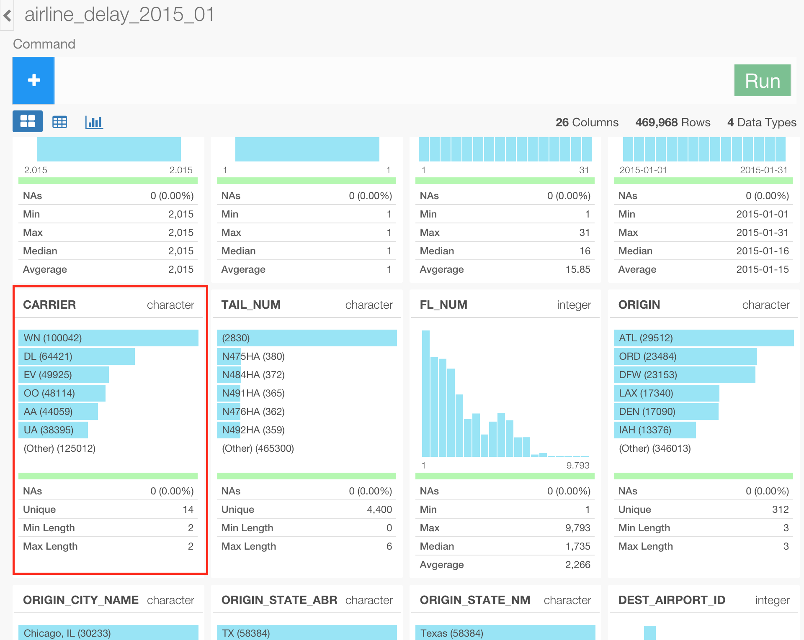
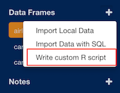
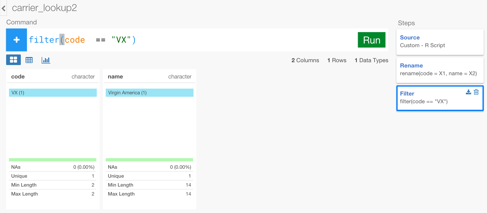

# Analyze Flight Data - part 3 - Data Join / Blending

### What you are going to learn:

- Scraping data from web pages
- Joining (Blending) with other data frames - left join, anti join, inner join
- Set operation - Union / Merge

## Import sample data

We are going to create a new data frame by importing the same CSV file, 'airline_delay_part1.csv', we used in the part 1 tutorial. If you haven't downloaded it yet, you can download from the link below.

- Airline delay part 1 (link is still under development)

Inside the same project or a new project, you can click a plus '+' icon next to 'Data Frame' text in the left side pane to import 'airline_delay_part1.csv'.


After you select the file from the file picker dialog and hit OK, you'll see the first 10 rows of the data you're importing.


Keep the parameters as default and click 'Import' button.

You can see a brief summary of the data in Summary view. It shows 26 columns and 234,634 rows at the top.


Now, there is a column called 'CARRIER' that has airline carrier codes.



But these two abbreviation codes are not really clear to most of us. Fortunately, there is a bunch of the code and actual airline carrier name mapping data that is just one click away with google search. For example, there is one at this [web site](http://aspmhelp.faa.gov/index.php/ASQP:_Carrier_Codes_and_Names) from Federal Aviation Administration's official site.


You can see the two letters code and the carrier name mapping. Instead of manually copying and pasting these information, we can actually directly scrape the data from this page.


## Scrape and import Airline Carrier lookup code from Web Site

### Scrape and Import

To scrape the data and import, you can create a new data frame by selecting 'Write custom R script' from the dropdown menu under '+' sign right next to 'Data Frames' text in lefthand side pane.



In the dialog, give it a name like 'carrier_lookup' and type the following R script.

```
## Load 'rvest' package for web scraping
library(rvest)

## Read the web page and store into faa_mapping_html object.
faa_mapping_html <- read_html("http://aspmhelp.faa.gov/index.php/ASQP:_Carrier_Codes_and_Names")

## Set "table" element name as a node that we're interested inside the html, and load the content of the table with html_table() function. ''%>%'' is a chain operator that pass the data from the one before to the one after. '<-' is an assignment operator that store the result from the one after to the one before.
faa_mapping <- faa_mapping_html %>%
  html_node("table") %>%
  html_table()

## Return 'faa_mapping' object that stores the result above.
faa_mapping
```

The web page we're dealing with is pretty simple this time, hence the script above is also pretty simple. But 'rvest' package is a lot more capable than this. If you're interested in more here's an [official document](https://cran.r-project.org/web/packages/rvest/rvest.pdf).

Hit 'Preview' button and see the result.


The result looks exactly what we wanted, so hit 'Import' button.

You can see 14 rows of the data that has just been imported.


### Clean up

Let's do a few clean up. First, let's rename the column names to be something that is easy for later use like below.

```
rename(code = `IATA Carrier Code`, name = `Carrier Name`)
```

We don't really need a column that holds three letters abbreviation for this exercise, so let's drop that.

```
select(-`ICAO Carrier Code`)
```

That's it, let's go to the main data frame 'airline_delay_2015_1'.

## Join the lookup data

Let's join with the lookup data that we just prepared in the previous steps. We can use ```left_join()``` command to do a type of join called 'Left Join', which would try to find any matching data from the target data (right side) for the original data rows (left side) and leave any rows that can't find the matching data from the target without assigning any data (NA).

Probably, it's easier to see it rather than reading it, so let's run the command below.  

```
left_join(carrier_lookup, by=c("CARRIER" = "code"))
```

Using ```by``` argument you can assign the columns from each data frames you want to use to match the two data sets. Make sure you need to use ```c()``` to set that information as above.

Once you hit 'Run' you see the lookup table is successfully joined by adding a new column 'name'.  


However, you would notice that there is a small fraction of the data that didn't get mapped to any carrier name and ended up having NAs. You can find what those are quickly by switching from ```left_join``` command to ```anti_join``` command like below. No need to change the argument inside the command.  

```
anti_join(carrier_lookup, by=c("CARRIER" = "code"))
```

You can see 'VX' is the carrier that has not been mapped.


Now, when we google-ed again, we have found the following web site.

http://www.airfarewatchdog.com/pages/3799702/airline-letter-codes/


The data table on this page has 'VX', which is 'Virgin Airline' so we can use this. Let's scrape that and import so that we can add this data set to our 'carrier_lookup' data set.

Before, going to the next step, let's make sure we change the join back to 'left_join' instead of 'anti_join'

```
left_join(carrier_lookup, by=c("CARRIER" = "code"))
```

If you're interested in other types of Join, take a look at our [Join document page](dplyr/join.md)

## Scrape another data from Web

To scrape the data and import, you want to do basically the same thing as you did before. Create a new data frame by selecting 'Write custom R script' from the dropdown menu under '+' sign right next to 'Data Frames' text in lefthand side pane.


In the dialog, give it a name like 'carrier_lookup2' and type the following R script.

```
library(rvest)

airline_code_html <- read_html("http://www.airfarewatchdog.com/pages/3799702/airline-letter-codes/")

airline_code <- airline_code_html %>%
  html_node("table") %>%
  html_table()
```

Hit 'Preview' button to preview the data.


And, hit 'Import' button.


### Clean up the data

Let's do a few clean ups with this data.

First, let's rename the column names to make their easier to recognize.

```
rename(code = X1, name = X2)
```

And, this time we care about only 'VX' from this data set, so let's filter to keep only 'VX' data. This way, we can use ```union()``` command to add this to the original lookup data.

```
filter(code  == "VX")
```



## Combine the two lookup data frames with Union operation

Now, let's combine the two lookup data frames. Go back to the original 'carrier_lookup' data frame. We can use ```union()``` command to combine the two lookup data frames.

```
union(carrier_lookup2)
```

Once you hit 'Run', you can see the one row of the data from 'carrier_lookup2' has been added and the number of the rows are 15 now.


## Review the main data

Go back to 'airline_delay_2015_1' data frame. If you haven't change the join type back to 'left_join' already make sure update that now.

```
left_join(carrier_lookup, by=c("CARRIER" = "code"))
```

If you had already done that, then the moment you click on the 'left_join' step the data will get refreshed automatically.


This is because Exploratory keeps track the underlying change on all the related data and the steps, and any change will automatically invalidates the data cache and refresh the data on-the-fly.

Now there is no NA value under 'name' column, which means that all the carriers are mapped and they have corresponding names.


## Find what could have been missing if we had only the 2nd lookup ?

Now, you might be wondering why didn't we use just the 2nd lookup data instead of using the 1st one and union a data for 'VX' from the 2nd lookup. The reason we didn't do it is because we knew even the 2nd data was alone not enough. We can take a look at the data to quickly prove this. Basically, we can compare the carrier codes from the two lookup data frames.

First, go to the 2nd lookup 'carrier_lookup2' data frame and select only the 'code' column.

```
select(code)
```

There are 95 carriers.


Then, go to the 1st look up 'carrier_lookup' data frame and select only the 'code' column.

```
select(code)
```

Now, use ```setiff()``` command to find what's in the 1st lookup data but not in the 2nd lookup data.

```
setdiff(carrier_lookup2)
```

Once you hit 'Run' button, you can see that there are three carriers, 'EV', 'MQ', and 'OO' that exist only in this 1st lookup data, but not in the 2nd lookup data.


That means, either of the data sets is not complete by itself to satisfy the 'airline_delay_2015_1' data, and this is why we were better off combining the two data sets with ```union()``` command before the join.
