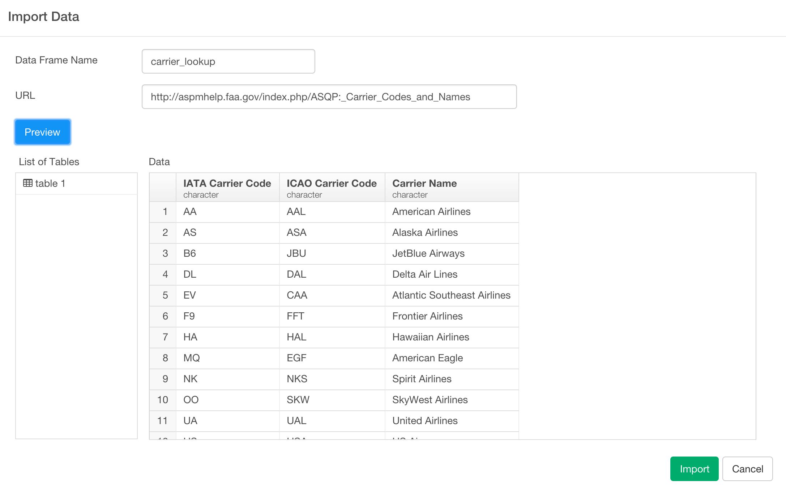

# Analyze Flight Data Part 3 - Data Join / Blending

### What you are going to learn

- Scraping data from web pages
- Joining (Blending) with other data frames - left join, anti join, inner join
- Set operation - Union / Merge

## Import sample data

We are going to create a new data frame by importing the following CSV file below.

- [airline_delay_2015_01](https://www.dropbox.com/s/iz3fibz91liwct9/airline_delay_2015_01.csv?dl=0)

Inside the same project or a new project, you can click a plus '+' icon next to 'Data Frame' text in the left side pane and select 'Import Local Data' menu.


Select 'airline_delay_2015_01.csv' in the file picker dialog to import and hit 'OK' button. You will see the first 10 rows of the data you're importing.


Keep the parameters as default and click 'Import' button.

You can see a brief summary of the data in Summary view. It shows 26 columns and 469,968 rows at the top.


Now, there is a column called 'CARRIER' that has airline carrier codes.


But these two abbreviation codes are not really clear to most of us. Fortunately, there is a bunch of the code and actual airline carrier name mapping data that is just one click away with google search. For example, there is one at this [web site](http://aspmhelp.faa.gov/index.php/ASQP:_Carrier_Codes_and_Names) from Federal Aviation Administration's official site.


You can see the two letters code and the carrier name mapping. Instead of manually copying and pasting these information, we can actually directly scrape the data from this page.


## Scrape and import Airline Carrier lookup code from Web Site

### Scrape and Import

To scrape the data and import, you can select 'Import Remote Data' from the dropdown menu under '+' sign right next to 'Data Frames' text in lefthand side pane,


and select 'Scrape Web Page' menu.

In the opened dialog, give it a name like 'carrier_lookup' and type the URL below into URL input field.

http://aspmhelp.faa.gov/index.php/ASQP:_Carrier_Codes_and_Names

And click 'Get Data' button.



The preview data looks good. Hit 'Save' button to import this data into Exploratory.

You can see 14 rows of the data that has just been imported.


### Clean up

Let's do a few clean up. First, let's rename the column names to be something that is easy for later use like below.

```
rename(code = `IATA Carrier Code`, name = `Carrier Name`)
```


We don't really need a column that holds three letters abbreviation for this exercise, so let's drop 'ICAO Carrier Code' column. You can select 'Select()' operation from the menu after you click '+' button, select '-' from the suggested list that would show up immediately after you select 'Select' operation, then select 'ICAO Carrier Code' from the next suggested list.


That's it, let's go back to the main data frame 'airline_delay_2015_1'.

## Join the lookup data

Now we can join this new data to the original 'flight' data with ```left_join()``` command.

Go back to 'airline_delay_2015_1' data frame.

Select 'Left Join' operation from the '+' button menu, and select 'carrier_lookup' data frame inside the 'left_join()' command, select 'c()' function from the suggested list, then select 'CARRIER' column first, then 'code' column from the suggested list.

```
left_join(carrier_lookup, by=c("CARRIER" = "code"))
```

Using ```by``` argument you can assign the columns from each data frame you want to use to match the two data frames. Make sure you need to use ```c()``` to set that information as above. If you happen to have the data frames that you need to use two pairs of columns to match, you can have those two pairs inside the ```c()``` and have them separated by ',' (comma).

Once you hit 'Run' you see the lookup table is successfully joined by adding a new column 'name' at the end.  


However, you would notice that there is a small fraction of the data that didn't get mapped to any carrier name and ended up having NAs. You can find what those are quickly by switching from ```left_join``` command to ```anti_join``` command like below. You don't need to change the argument inside the command.  

```
anti_join(carrier_lookup, by=c("CARRIER" = "code"))
```

The ```anti_join()``` operation finds and keeps the rows from the original data frame that don't match with anything from the target data frame. You can see 'VX' is the carrier that doesn't have a match in the lookup data.


With another google search, we have found the following web site that lists the carrier code and name mapping.

http://www.airfarewatchdog.com/pages/3799702/airline-letter-codes/


The data table on this page has 'VX', which is 'Virgin Airline' so we can use this. Let's scrape that and import so that we can add this data frame to our 'carrier_lookup' data frame.

Before, going to the next step, let's make sure we change the join back to 'left_join' instead of 'anti_join'

```
left_join(carrier_lookup, by=c("CARRIER" = "code"))
```

If you're interested in other types of Join, take a look at our [Join document page](dplyr/join.md)

## Scrape another data from Web

In the opened dialog, give it a name like 'carrier_lookup' and type the URL below into URL input field.

To scrape the data and import, you want to do basically the same thing as you did before. You can select 'Import Remote Data' from the dropdown menu under '+' sign right next to 'Data Frames' text in lefthand side pane, and select 'Scrape Web Page' menu.


In the dialog, give it a name like 'carrier_lookup2' and type the URL below into URL input field.

http://www.airfarewatchdog.com/pages/3799702/airline-letter-codes/

And click 'Get Data' button.


The preview data looks good. Hit 'Save' button to import this data into Exploratory.

You can see 95 rows of the data that has just been imported.


### Clean up the data

Let's do a few clean ups with this data like we did before.

First, let's rename the column names to make them easier to recognize.

```
rename(code = X1, name = X2)
```


## Combine the two lookup data frames with Union operation

Now, we can merge (combine) the two carrier code lookup data frames by using 'union()' command.

Select 'Union' from '+' button menu.


Select 'carrier_lookup2' data frame from the suggested list, and hit 'Run' button.

Now you can see the two data sets are merged together now.


But, when you look closer to 'code' column in Summary view there seems to be duplicated entries. That's because some of the carrier codes existing in both data frames and they are simply added together. We can make this to keep only the unique ones by deleting any 'duplicated' entries by using 'distinct()' command.

Select 'Distinct' operation from '+' button menu.


Select only 'code' column.


You could have not selected any column inside 'distinct()' function, in which case it would have evaluate whether each row is duplicated or not by using the values from all the columns, in this case both 'code' and 'name' columns. In this data set, the carrier names are slightly different between the two data frames, so we are using only 'code' column values to evaluate the uniqueness.

Once you hit 'Run' button, you will see 'Unique' metric is showing 98 in 'code' column and the total rows is also showing 98 rows, so all the values are unique now.


## Review the main data

Go back to 'airline_delay_2015_1' data frame. If you haven't already changed the join type back to 'left_join', make sure you update that now.

```
left_join(carrier_lookup, by=c("CARRIER" = "code"))
```

If you had already done that, then the moment you click on the 'left_join' step the data will get refreshed automatically.


This is because Exploratory keeps track the underlying change on all the related data and the steps, and any change on any step will automatically invalidates the data cache and refresh the data on-the-fly.

Now there is no NA value under 'name' column, which means that all the carriers are mapped and they have corresponding names.


