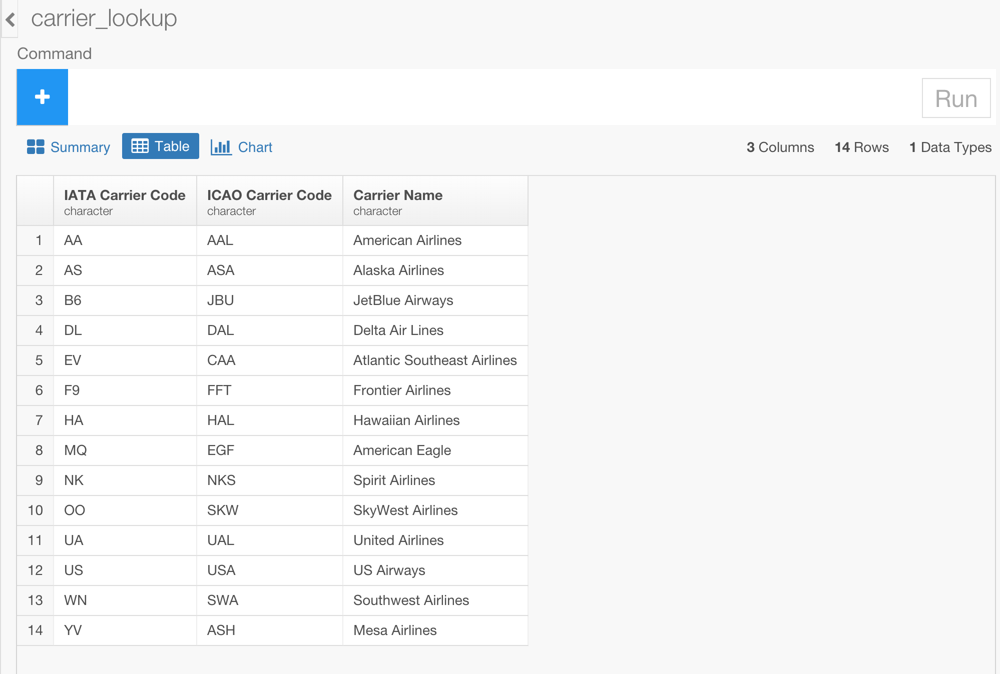

# Data Join

### What you are going to learn

- Scraping data from web pages
- Joining (Blending) with other data frames - Left Join, Anti Join
- Rename columns
- Add an extra row to an existing data frame manually 

## Download Flight Delay sample data

We're going to use the following file for this tutorial. You can download it from the link below.  

- [Flight delay 2016 January data](http://download.exploratory.io/data/airline_delay_2016_01.csv)

## Create a new project

Once you start Exploratory app, create a new project to start, if you haven't.


## Import sample data

Inside the project, you can click a plus '+' icon next to 'Data Frame' text in the left side pane to import 'airline_delay_2016_01.csv'.


After you select the file from the file picker dialog and hit OK, you'll see the preview data.


Since the data is showing up ok, you can keep the parameters as default and click 'Save' button.


Now, there is a column called 'CARRIER' that has airline carrier codes.


But these two abbreviation codes are not really clear to most of us. Fortunately, there is a bunch of the code and actual airline carrier name mapping data that is just one click away with google search. For example, there is one at this [web site](http://aspmhelp.faa.gov/index.php/ASQP:_Carrier_Codes_and_Names) from Federal Aviation Administration's official site.


You can see the two letters code and the carrier name mapping. Instead of manually copying and pasting these information, we can quickly scrape the data from this page.


## Scrape and import Airline Carrier lookup code from Web Site

### Scrape and Import

To scrape the data, you can select 'Import Remote Data' from the dropdown menu in the lefthand side pane,


and select 'Scrape Web Page' menu.


In the opened dialog, give it a name like 'carrier_lookup' and type the URL below into URL input field.

http://aspmhelp.faa.gov/index.php/ASQP:_Carrier_Codes_and_Names

And click 'Get Data' button.


Since the preview data looks ok, simply click 'Save' button to import this data into Exploratory.

You can see 14 rows of the data that has just been imported.



### Rename columns

Let's do a few clean up. First, let's rename the column names to be something else to make them easier to use later. We can use 'rename' operation to do such.


That's it, let's go back to the main data frame 'airline_delay_2016_1'.

## Join the lookup data

Now we can join this new data to the original 'flight' data with 'join' operation.

In 'airline_delay_2016_1' data frame, click on 'Join' button.


We'll use the default 'Left Join' as Join Type, select 'carrier_lookup' data frame for Target Data Frame, 'CARRIER' and 'code' as the joining columns from both data frames.

Once you hit 'Run' you see the lookup table is successfully joined by adding new columns 'code3' and 'name' at the end.  


However, you would notice that there is a small fraction of the data that didn't get mapped to any carrier name and ended up having NAs. You can find what those are quickly by switching from ```left_join``` command to ```anti_join``` command like below.


The ```anti_join()``` operation finds and keeps the rows from the original data frame that don't find matching in the target data frame. You can see 'VX' is the carrier that doesn't have a match in the lookup data.


## Add Row Manually

Let's say we know this 'VX' is actually 'Virgin Airline'. We can look for another lookup table data, but since there is only one entry missing from the original lookup table data, we can simply add an additional row by using 'add_row' operation.


And add values for the two columns, 'code' and 'name'.


## Review the main data

Now, go back to 'airline_delay_2016_1' data frame. You will get "There is no data to display." message. That's because the join type is still 'Anti Join'.


You can change that to 'Left Join' in the dialog.


Once you click 'Run' button, now there is no NA value under 'name' column, which means that all the carriers are mapped appropriately.


