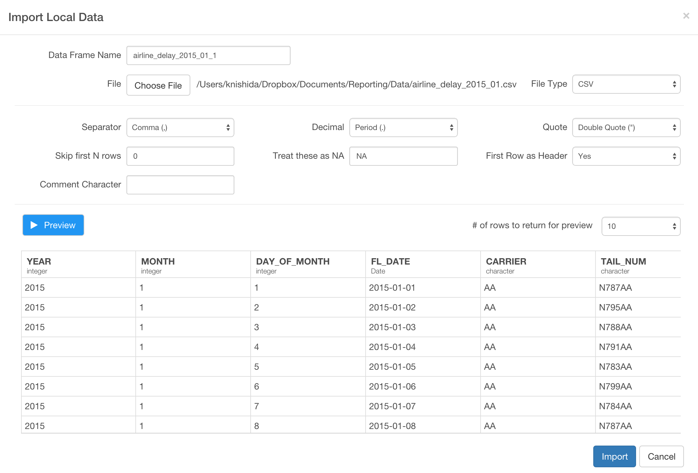

# Analyze Flight Data Part 4 - Statistical Analysis

### What you are going to learn:

- Use Histogram, Boxplot, Scatterplot to Explore data
- Find correlation coefficients with cor()
- Perform linear regression with lm()
- Perform clustering (segmentation) with kmean()

## Import sample data

We are going to create a new data frame by importing the following CSV file below.

- [airline_delay_2015_01](https://www.dropbox.com/s/fpmqzjan5us91yg/airline_delay_2015_01.csv?dl=0)

Inside the same project or a new project, you can click a plus '+' icon next to 'Data Frame' text in the left side pane and select 'Import Local Data' menu.


Select 'airline_delay_2015_01.csv' in the file picker dialog to import and hit 'OK' button. You will see the first 10 rows of the data you're importing.



Keep the parameters as default and click 'Import' button.

You can see a brief summary of the data in Summary view. It shows 26 columns and 469,968 rows at the top.


Now, there is a column called 'CARRIER' that has airline carrier codes.


But these two abbreviation codes are not really clear to most of us. Fortunately, there is a bunch of the code and actual airline carrier name mapping data that is just one click away with google search. For example, there is one at this [web site](http://aspmhelp.faa.gov/index.php/ASQP:_Carrier_Codes_and_Names) from Federal Aviation Administration's official site.


You can see the two letters code and the carrier name mapping. Instead of manually copying and pasting these information, we can actually directly scrape the data from this page.

## Remove NA values

```
filter(!is.na(ARR_DELAY))
```

## Use plots to explore data visually

Histogram
-> maybe we can try using scale() function to see a normal distribution

Boxplot  

Scatterplot

Scatterplot with color


## Generate Correlation Coefficients to find linear relationship


## Perform Linear Regression to find more detail


## Standardize the data first before Linear Regression
scale()


```
gather(delay_type, delay_time, ARR_DELAY, DEP_DELAY)
```

```
mutate(is_delay = delay_time > 0)
```


Scatterplot


Correlation


Linear Regression Model


Clustering
