# Analyze Flight Data Part 4 - Statistical Analysis

## What you are going to learn:

- Use Histogram, Boxplot, Scatterplot to Explore data
- Find correlation coefficients with cor() function
- Perform linear regression analysis with do_lm()
- Perform clustering (segmentation) analysis with do_kmean()

## Download Flight Delay sample data

We're going to use the following file for this tutorial. You can download it from the link below.  

- [Flight delay 2016 January data](http://download.exploratory.io/data/airline_delay_2016_01.csv)

## Create a new project

Once you start Exploratory app, create a new project to start, if you haven't.


## Import sample data

Inside the project, you can click a plus '+' icon next to 'Data Frame' text in the left side pane to import 'airline_delay_2016_01.csv'.


After you select the file from the file picker dialog and hit OK, you'll see the preview data.


Since the data is showing up ok, you can keep the parameters as default and click 'Save' button.

## Remove NA values

When you look closer at ARR_DELAY column you would notice there are some NA values.


You can quickly remove them by selecting 'Drop NA' from the column header menu.

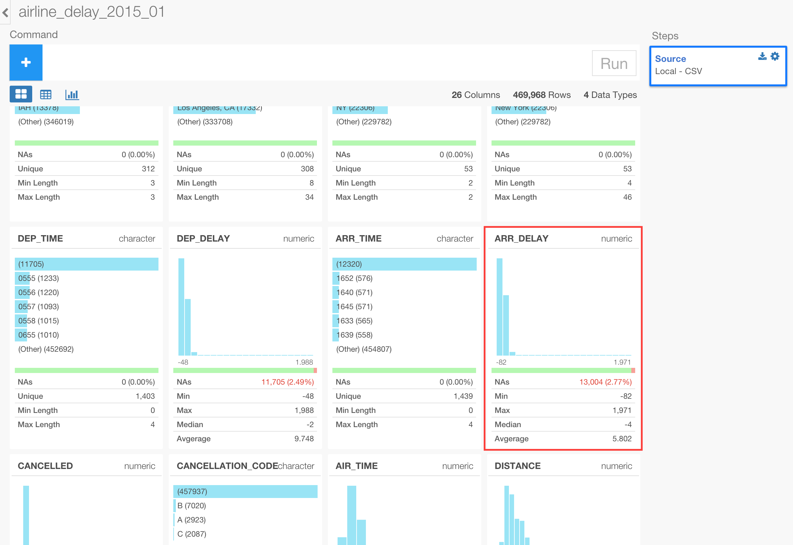

This will create a step with 'filter' operation.

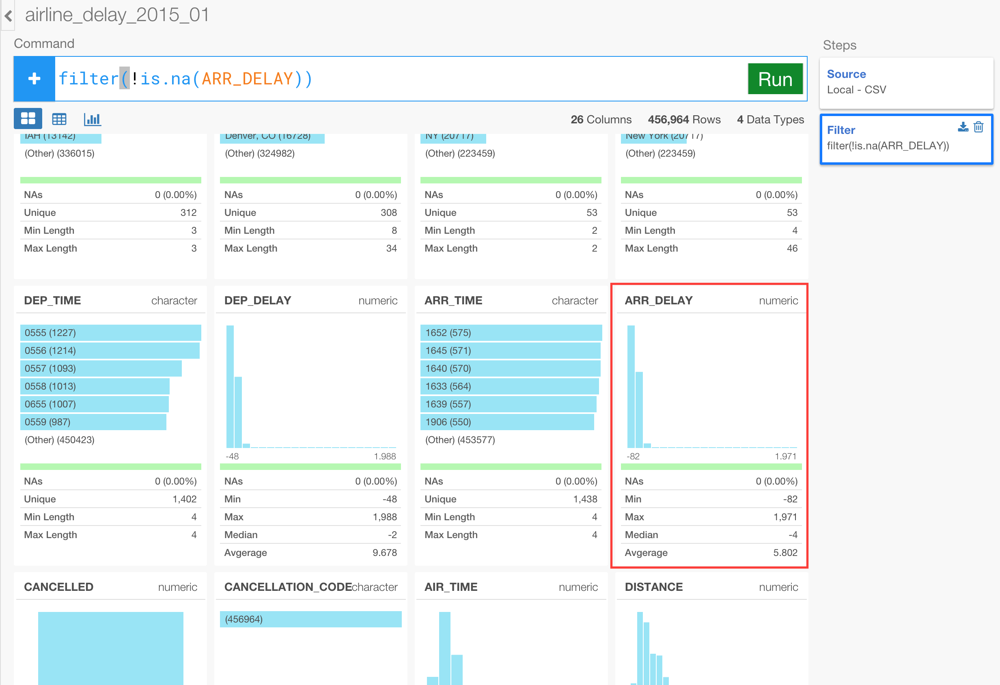

Once you click 'Run' button, you will no longer see the red color bar.


## Use Charts to explore data visually

Let's go to Viz (Visualization) view and explore the data visually.

First, let's take a look at the average arrival delay time (ARR_DELAY) per each airline carrier (CARRIER). We can keep the chart type to be 'Bar' as default, and assign CARRIER to X-axis and ARR_DELAY to Y-axis. Also, let's change the 'aggregation' type from the default 'SUM' to 'AVE (Average)'.

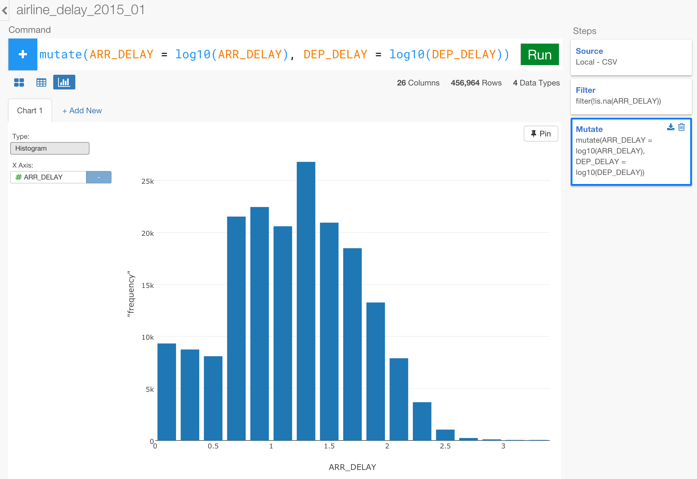

Now, these summarized values are interesting, but they can be easily distorted by any extreme values. Instead, we can use Boxplot to see the distribution of ARR_DELAY values per CARRIER.

Change the chart type to 'Boxplot'.


Now you can see carriers like 'HA' have smaller range while carriers like 'NK' have a lot wider range.

Now let's find out if there is any correlation between ARR_TIME (Arrival time) and DEP_TIME (Departure time). First, we can use 'Scatter' chart to see it visually.


We can see some sort of a linear relationship but it's a bit hard to say especially around the values around 0. What if we separate the data by carriers ? Maybe some of the carriers do have such linear relationship between ARR_TIME and DEP_TIME while some others don't.

Let's assign 'CARRIER' to 'Color'.


Unfortunately, we can't really gain useful information from this chart view. Instead of relying on the visual cues, let's use algorithm and have the machine to find useful patterns for us.

## Generate correlation coefficients to find linear relationship

First, let's go back to Table view.


Click on 'Summarize' button and select 'Custom' from Aggregate Function dropdown.


We can use 'cor' function to calculate the correlation between ARR_DELAY and DEP_DELAY columns like below.

```
cor(ARR_DELAY, DEP_DELAY)
```


Once you run the command you'll get something like below.


The correlation coefficient value is 0.9405. But this is for the whole data set. What if we want to know the correlation coefficient for each airline carrier (CARRIER)? In that case, we can group the data by CARRIER by using ```group_by()``` operation right before the ```summarize()``` operation.

To do this, you can click on the previous step of 'Filter'.


Then, click 'Group by' button, and select 'CARRIER' from the list.


Finally, click on 'Summarize' step to go back to where you were before to see the correlation values re-calculated, but this time it is at each CARRIER value level.


Now, you can go back to Chart view, set the chart type to 'Bar', and assign 'CARRIER' to X-axis and 'correlation' to Y-axis.

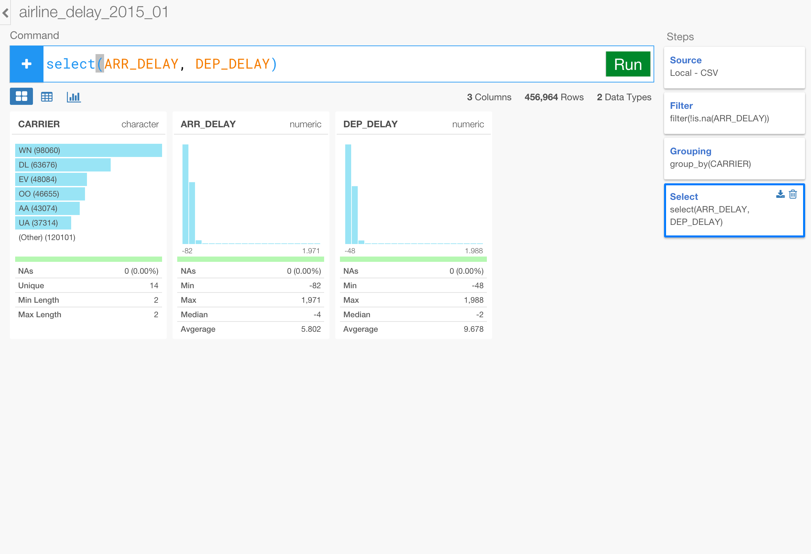

You can compare the correlation coefficients by CARRIER visually now.


## Perform Linear Regression analysis with lm

Let's build a Linear Regression model to understand more about the relationship between the arrival delay time and the departure delay time.

First, let's go back to Table view.

Remove the 'Summarize' step by clicking on 'Trash' icon at the right hand side corner.

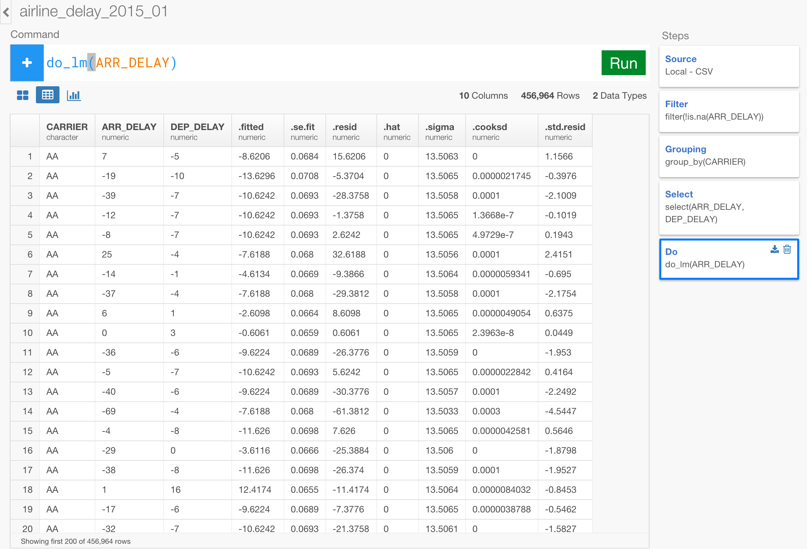

Select Build Linear Regression Model under 'Analytics' tab after clicking on 'Others' button.

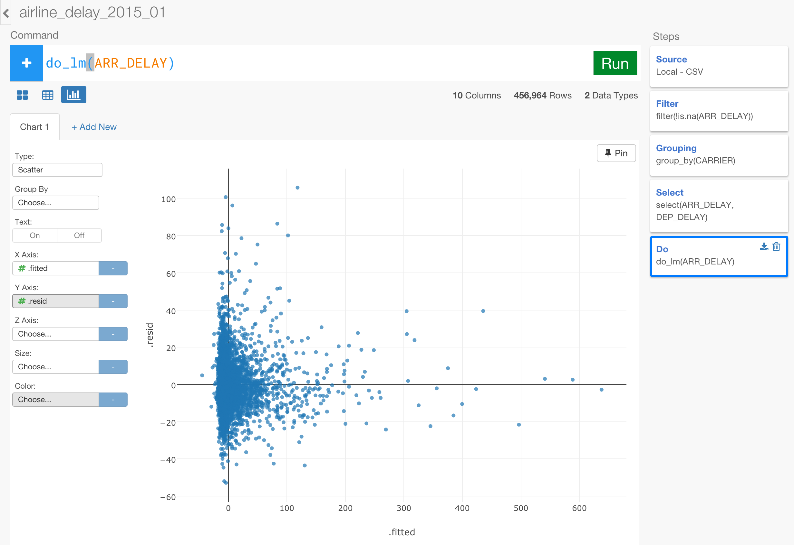

Select 'ARR_DELAY' column for Target Column and 'DEP_DELAY' for Predictor Column.


Click 'Run' button to build the models.

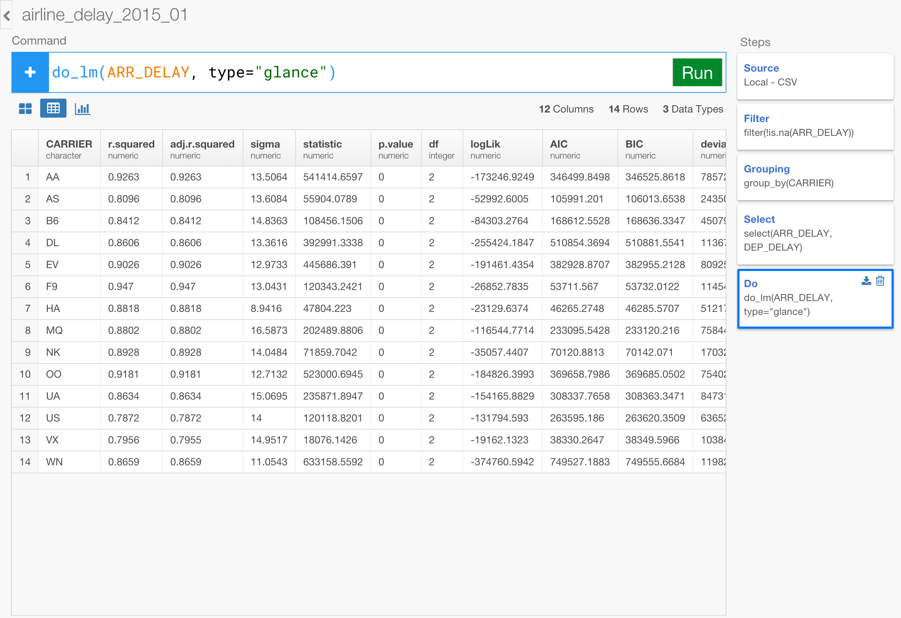

The operation above has just built a linear regression model using R's ```lm()``` function and store the model inside the data frame. Because of the 'Grouping' step before, there are multiple models being built per each CARRIER. You can mouse over on the model column to see the summary information of each model quickly.

Let's say you want to compare R squared values among the carriers. You can select 'Extract summary info (model level)' from the column header menu like below.


One you hit 'Run' button you will see all the summary information for all the carriers are in the table.


With this, you can go to Viz view and compare R squared values visually. For example, you can compare the R squared values among the carriers with Bar chart like below.

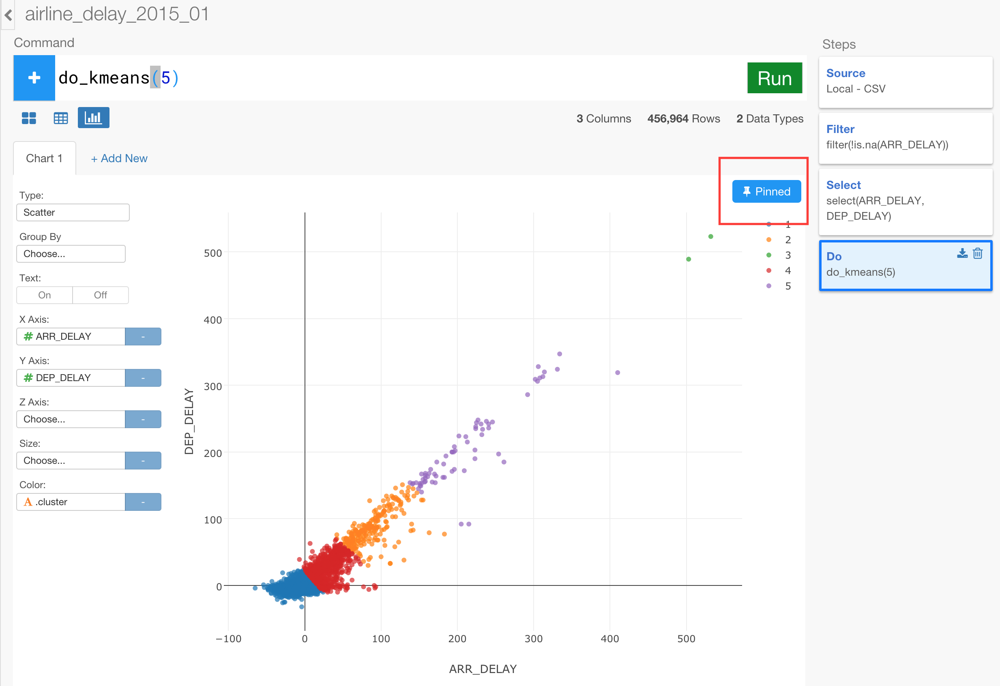

What if you want to see the residuals, which are the differences between the actual values and the model fitted (or predicted) values? You can actually quickly extract these data by selecting 'Extract model data' at 'Linear Regression' step like below.


Select 'Source Data' for Data 'source.data' column for Column, and click 'Run' button.


Once you hit 'Run' button you now see the model data in the table.

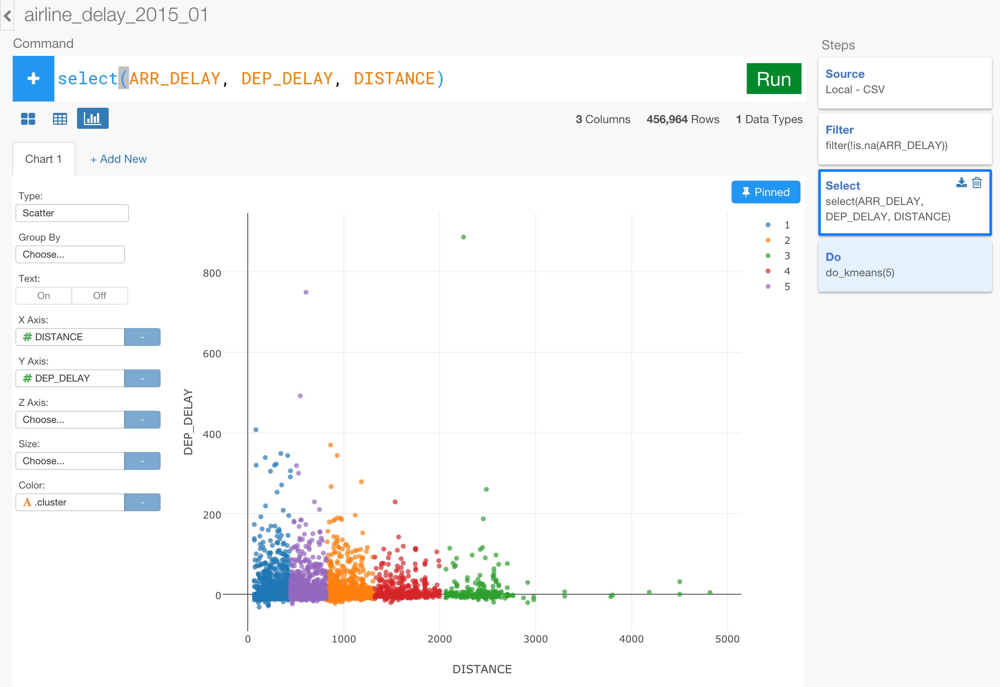

You can go to Chart view and compare the residuals and fitted values, for example, like below.  

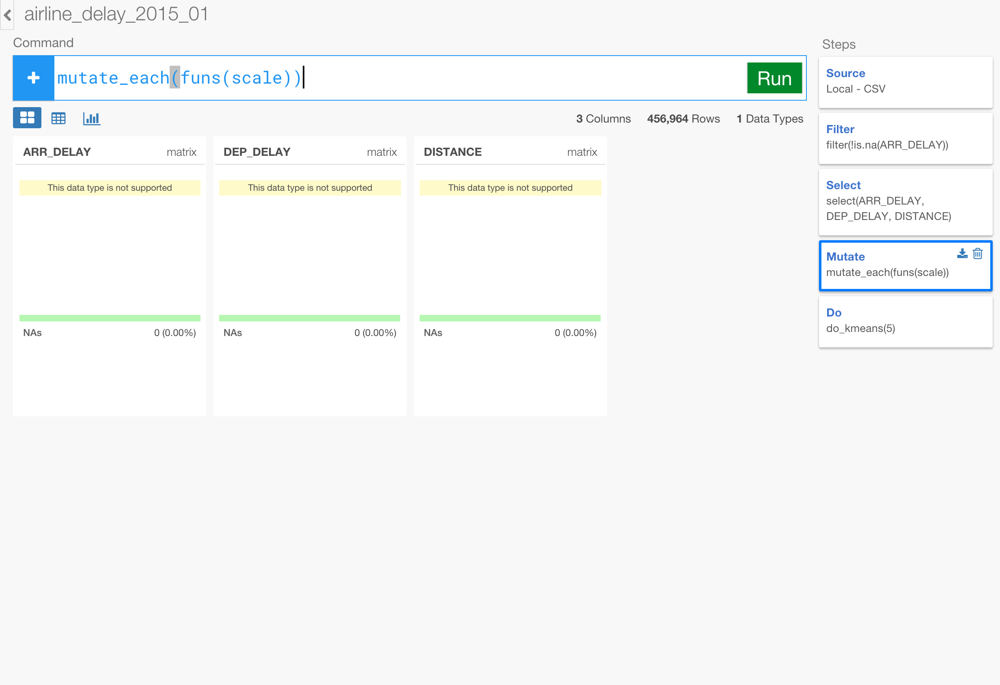


## Perform Clustering analysis with kmeans

Let's use K-means algorithm to cluster the flight data based on ARR_DELAY and DEP_DELAY.

To do this, let's create a branch at 'Filter' step.

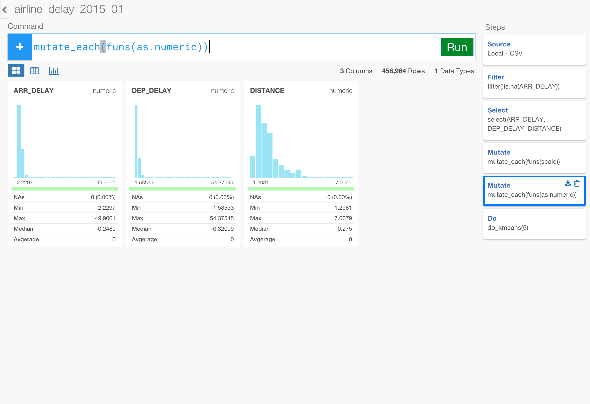

Type 'Clustering' for the branch name.

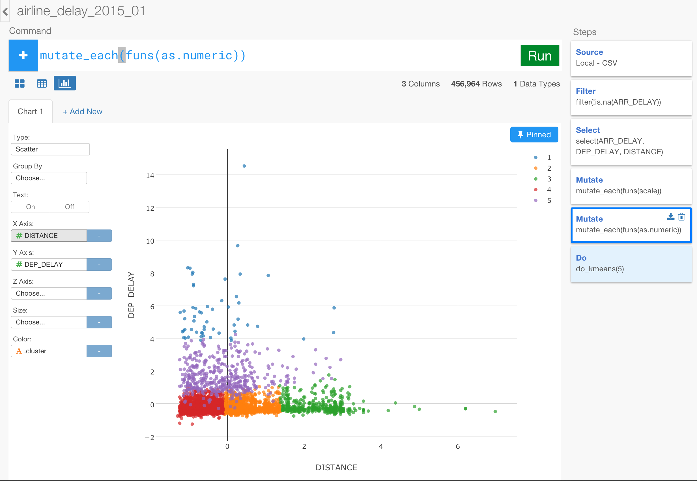

In the new branch, select 'Build K-menas Clustering Model' under Analtyics tab after clicking on Others button.


Select 'Value Columns Select' tab, select 'DEP_DELAY' and 'ARR_DELAY' columns. Click 'Run' button.


This will create a new column called 'cluster', which has the cluster IDs.

In Viz view, you can assign 'DEP_DELAY' to X-Axis, 'ARR_DELAY' to Y-Axis, and 'cluster' column to Color.


We can change the number of the clusters from the default 3 to 5.


Also, we can add another column 'DISTANCE'.


Once you click 'Run', then you can assign 'DISTANCE' column to Z-Axis and see the chart in 3-D view.


Lastly, let's say you want to cluster the airline carriers based on where their flights departs from. You can use the same 'build_kmeans' operation, but this time you want to select 'Subject Key Value' tab. Select 'CARRIER' for 'Subject Column' and 'ORIGIN_CITY_NAME' for 'Key Column', and click 'Run' button.


This will create a cluster column that has the cluster IDs as seen before. This time, you might want to try using Pivot table and see how the carriers are clustered.


