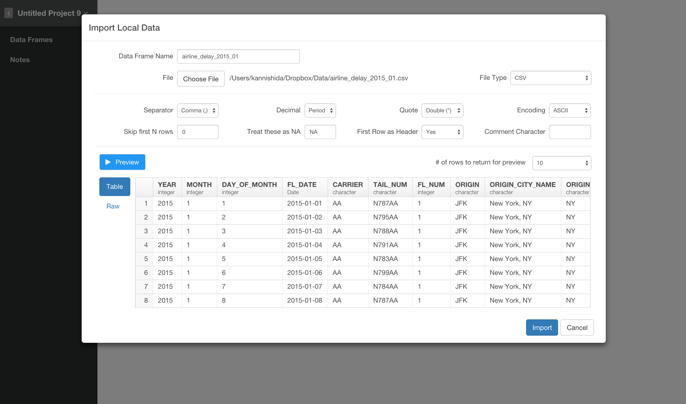
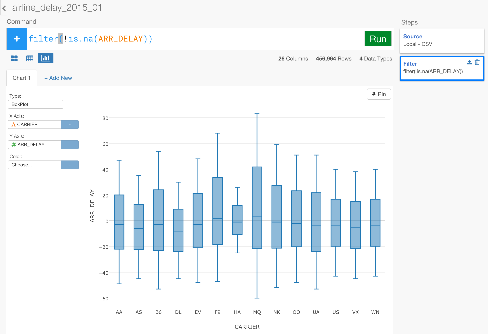
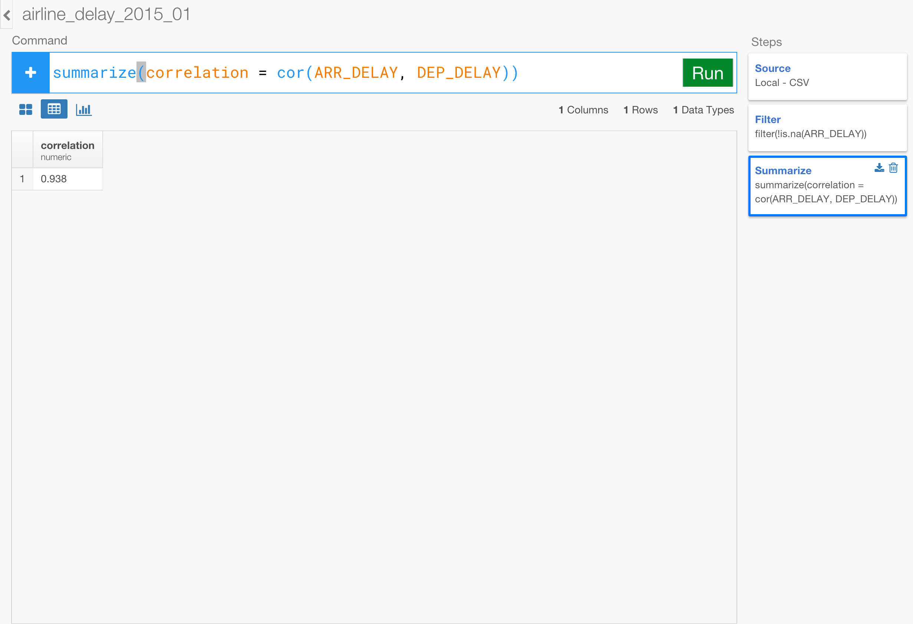
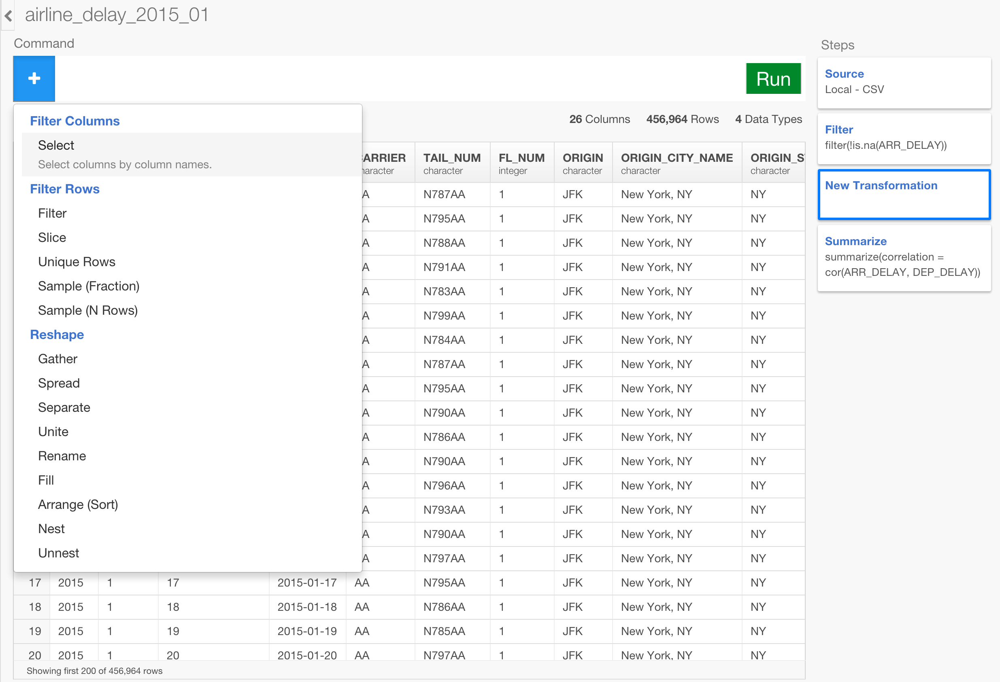
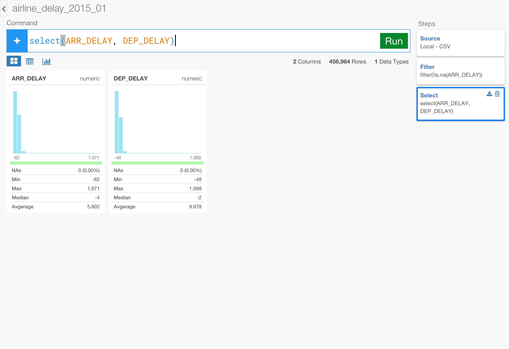
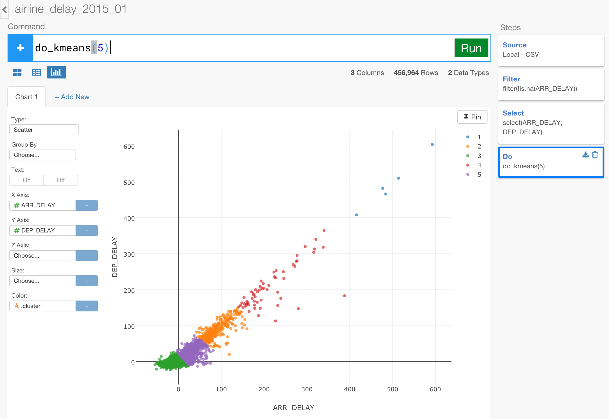

# Analyze Flight Data Part 4 - Statistical Analysis

### What you are going to learn:

- Use Histogram, Boxplot, Scatterplot to Explore data
- Find correlation coefficients with cor() function
- Perform linear regression analysis with do_lm()
- Perform clustering (segmentation) analysis with do_kmean()

## Import sample data

We are going to create a new data frame by importing the following CSV file below.

- [airline_delay_2016_01](https://www.dropbox.com/s/x2g3qgo28syxhcl/airline_delay_2016_01.csv?dl=0)

Inside the same project or a new project, you can click a plus '+' icon next to 'Data Frame' text in the left side pane and select 'Import Local Data' menu.


Select 'airline_delay_2016_01.csv' in the file picker dialog and hit 'OK' button. You will see the first 10 rows of the data you're importing.



Keep the parameters as default and click 'Import' button.

You can see a quick summary of the data in Summary view. It shows 26 columns and 469,968 rows at the top.


For example, when you look at CARRIER column you can see carriers like 'WN' and "AA" have more data than the others in this data set. And there are 12 unique CARRIER values.

## Remove NA values

When you look closer at ARR_DELAY column you would notice there are some NA values. You can quickly remove them by selecting 'Drop NA' from the column header menu.


This will build a command like below.

```
filter(!is.na(ARR_DELAY))
```

. ```is.na()``` function returns TRUE when a given value is NA, and ```!``` (exclamation mark) function reverses the effect of the function after. When combining these two it will return TRUE when a given values is NOT NA.

Once you hit 'Run' button, you no longer see the red color bar.


## Use Charts to explore data visually

Let's go to Chart view and explore the data quickly. First, let's take a look at the average arrival delay time (ARR_DELAY) per each airline carrier (CARRIER). We can keep the chart type to be 'Bar' as default, and assign CARRIER to X-axis and ARR_DELAY to Y-axis. Also, let's change the 'aggregation' type from the default 'SUM' to 'AVE (Average)'.


Now, these summarized values are interesting, but they can be easily distorted by any extreme values, so let's use Boxplot to see the distribution of ARR_DELAY values per CARRIER.

Change the chart type to 'Boxplot'.



Now you can see carriers like 'HA' have smaller range while carriers like 'NK' have a lot wider range.

Now let's find out if there is any correlation between ARR_TIME (Arrival time) and DEP_TIME (Departure time). First, we can use 'Scatter' chart to see it visually.


We can see some sort of a linear relationship but it's a bit hard to say especially around the values around 0. What if we separate the data by carriers ? Maybe some of the carriers do have such linear relationship between ARR_TIME and DEP_TIME while some others don't.

Let's assign 'CARRIER' to 'Color'.


Unfortunately, we can't really obtain useful information from this chart view. Instead of relaying on the visual cues, let's calculate the correlation and see the numbers.

## Generate correlation coefficients to find linear relationship

First, let's go back to Table view.


We can use ```cor()``` function to calculate the correlation between two column values inside ```summarize()``` command.

```
summarize(correlation = cor(ARR_DELAY, DEP_DELAY))
```

Once you run the command you'll get something like below.



The correlation coefficient value is 0.9405. But this is for the whole data set. What if we want to know the correlation coefficient for each airline carrier (CARRIER) ? We can group the data by CARRIER by using ```group_by()``` command right before the ```summarize()``` command.

To do this, you can select (click) the previous step of 'Filter', then hit '+' (Plus) button to insert a new transformation step right before this 'Summarize' step.



Then, start typing something like below.

```
group_by(CARRIER)
```

Hit 'Run' button to run the command, then click on 'Summarize' step at the right hand side.


This will give you the correlation coefficient value for each airline carrier. Now, you can go back to Chart view, set the chart type to 'Bar', and assign 'CARRIER' to X-axis and 'correlation' to Y-axis.


You can compare the correlation coefficients by CARRIER visually now.


## Perform Linear Regression analysis with lm

Let's build a Linear Regression model to understand more about the relationship between the arrival delay time and the departure delay time.

First, let's go back to Table view.

Remove the 'Summarize' step by clicking on 'Trash' icon at the right hand side corner.


Select Build Model / Linear Regression from ARR_DELAY column's column header menu.


And, start typing 'DEP_DELAY'


This will eventually build a command like below.

```
build_lm(ARR_DELAY ~ DEP_DELAY, keep.source = FALSE)
```

Hit 'Run' button.


The command above has just built a linear regression model using R's ```lm()``` function and store the model inside the data frame. Because of the 'Grouping' step before there are multiple models being built per each CARRIER. You can mouse over on the model column to see the summary information of each model quickly.


Let's say you want to compare R squared values among the carriers. You can select 'Extract summary info (model level)' from the column header menu like below.


One you hit 'Run' button you will see all the summary information for all the carriers are in the table.



With this, you can go to Chart view and visualize these data. For example, you can compare the R squared values among the carriers with Bar chart like below.


What if you want to see the residuals, which are the differences between the actual values and the model fitted (or predicted) values? You can actually quickly extract these data by selecting 'Extract model data' at 'Linear Regression' step like below.



Once you hit 'Run' button you now see the model data in the table.


You can go to Chart view and compare the residuals and fitted values, for example, like below.  


## Perform Clustering analysis with kmeans

Let's build a clustering model and segment the data based on ARR_DELAY and DEP_DELAY.
