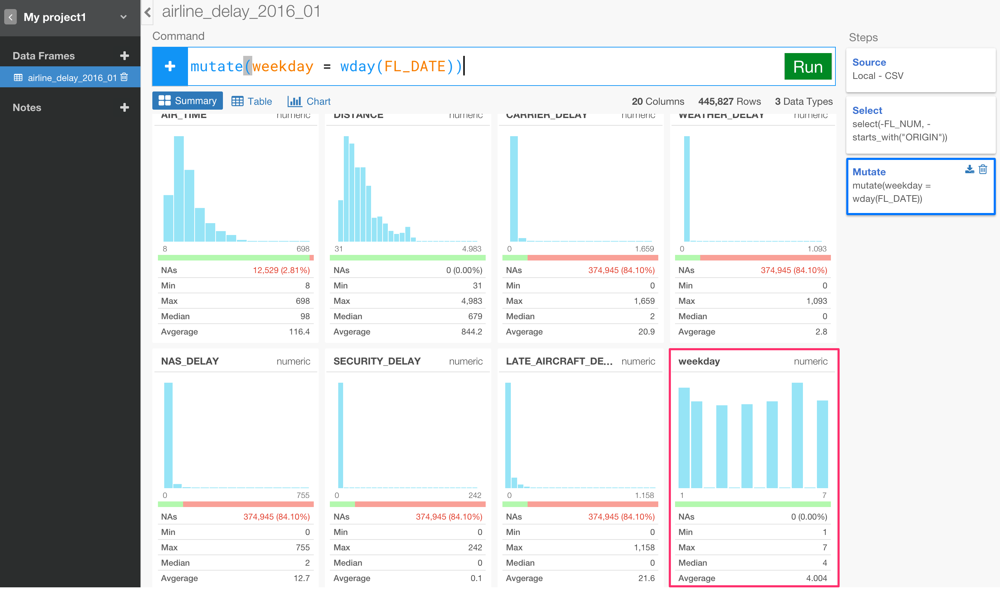
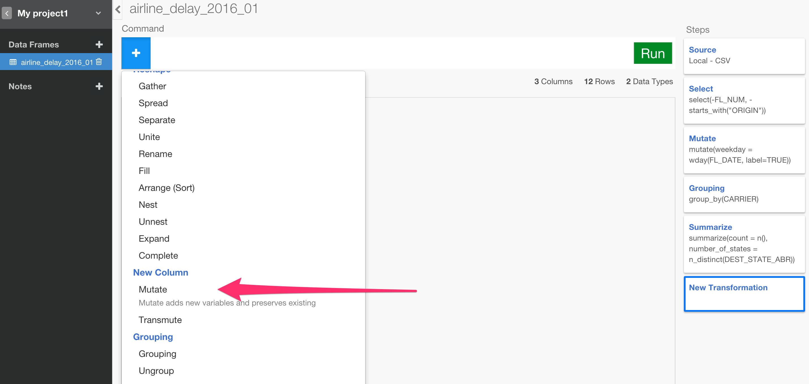
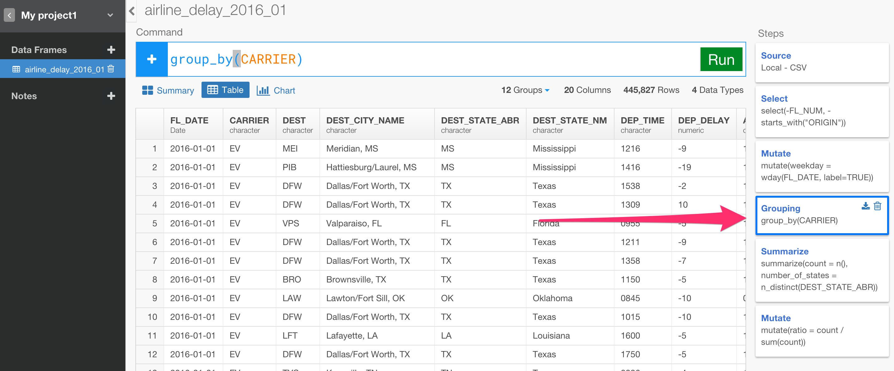
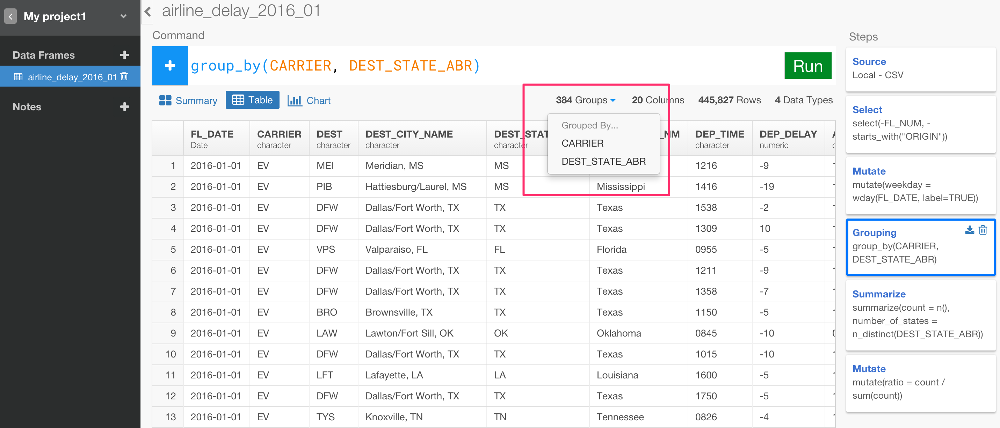
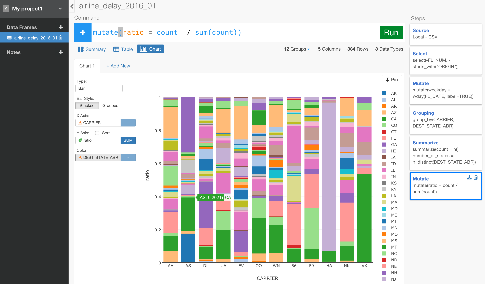
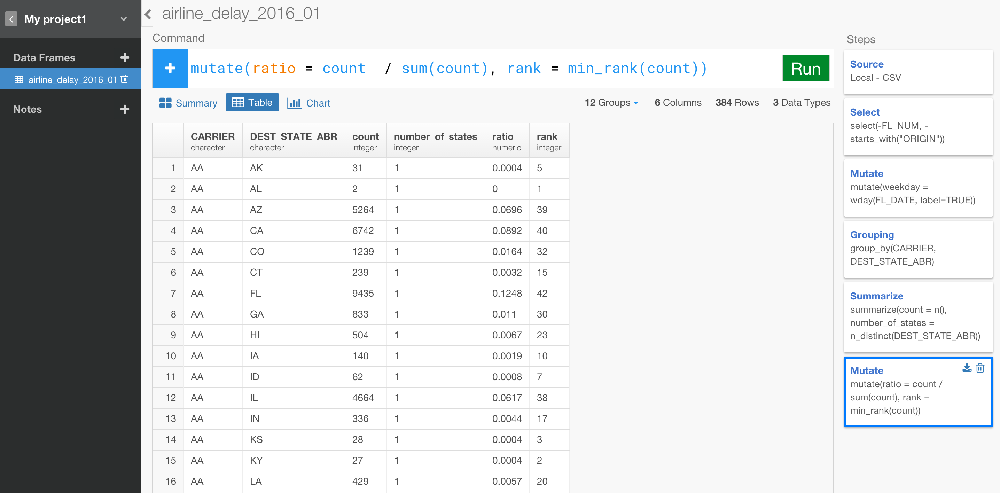
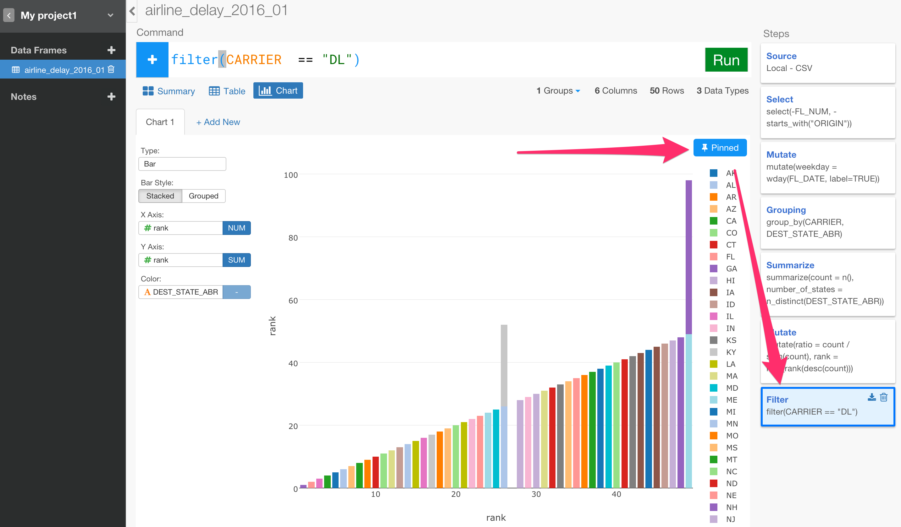

#フライトのデータを分析しよう - part 1

###この章であなたが学ぶこと：

- 特定の列を選ぶ - select()
- 計算結果をもとに新しい列を作る- mutate()
- 曜日の値を抽出する - wday()
- データをグルーピングする- group_by()
- データを集計する - summarize()
- データをフィルターする - filter()

##フライトの遅延データをダウンロードしよう

この章では、3つのデータファイルを使うことになります。クリックしてダウンロードすることができます。

・[Flight delay 2016 January data](http://download.exploratory.io/data/airline_delay_2016_01.csv)

##新しいプロジェクトを作ろう

Exploratoryを開いたら、まず新しいプロジェクトを作りましょう。


##サンプルデータをインポートしよう

Data Frameの横にある＋アイコンを押すとairline_delay_part1.csvをインポートすることができます。


ファイルを開くダイアログボックスからファイルを選んだ後に、 OKボタンを押すと、あなたがインポートしたデータをこのように確認することができます。


データはうまく表示されているので、そのままImportボタンをクリックします。

##サマリーデータ画面

いったんデータをインポートすると、サマリー画面で、データの概要を見ることができます。上に25カラムと445,827行があると表示されています。また、他のカラムものぞき見することもできます。例えば、CARRIERカラムではもっとも頻繁に出てくる航空会社を見ることができます。


スクロールしていくと、NA値を持ったARR_DELAYカラムを見つけることができますね。


##カラムを選ぶか取り除こう

分析のために、あなたがほしいカラムだけを選びとるためのたくさんの方法があります。では、いくつか試してみましょう。
まず、FL_NUMカラムを取り除いてみます。＋アイコンを押して、ドロップダウンメニューからSelectを選んでください。


select()コマンドがいったん入力されると、関連のある関数やカラムがレコメンドされるようになっています。カラムを取り除くための-関数が1番上に表示されていますね。それを押してください。


押すとすぐに、カラムの一覧表がレコメンドされます。FL_NUMを選んでください。


カラムを選んだら、Runボタンを押してください。


これで、FL_NUMカラムは取り除かれました。


あなたは、既存のselectコマンドを更新したり、新しいselectステップを加えることができます。下記のように、既存のselectのステップを更新してみましょう。ORIGINで始まるカラムを取り除きましょう。select()コマンドの中にstarts_with()関数を使うことができます。select()関数の中に、レコメンドされたリストから','（カンマ）や'-'を入力し始めることができます。その次に、リストからstarts_with()関数を選んでください。


starts_with()関数の中に、ORIGINと入力してRunボタンを押してください。


これで、ORIGINで始まるカラムカラムはなくなりました。最後のコマンドは下記になります。

```
select(-FL_NUM, -starts_with("ORIGIN"))
```

シンタックスのレコメンドも関連のある演算子や関数やカラム名になっているはずです。

## 曜日の値を抽出する - wday()

あなたは、簡単に新しいカラムを加えるための、計算や表現を加えることができます。

Dateデータタイプになっていて、フライトの日付の情報を持っているFL_DATEカラムがあります。このデータから、それぞれの日付に対応する正確な曜日の値（月曜日、火曜日など）を抽出しましょう。 ```wday()```という関数を使うことによって、曜日を抽出することができます。

＋アイコンを押して、Mutate関数を押してください。


下記のように、入力し始めてください。簡潔に説明すると、weekdayという新しいカラムを作り、 ```wday()```によって、FL_DATEカラムのデータから曜日の値を抽出しています。

```
mutate(weekday = wday(FL_DATE))
```
Runボタンを押して、画面の最下部のほうにスクロールするとweekdayという新しいカラムができているのがわかります。



データが、1~7という数字として表示されているのがわかりますね。これは、```wday()```関数が月曜日が1からはじまる1~7の数値を与えているからです。下記のように```label```という引数を加えることによって、数値の代わりに、月曜日のような曜日の名前を取得することができます。

```
mutate(weekday = wday(FL_DATE, label=TRUE))
```

これで、下記のように、正確な曜日の値を取得できるはずです。


これの素晴らしい点の1つは、結果のデータタイプはordered factorと呼ばれるものになっているところです。これは、あなたがカラムをソートしたいとき、日曜日からはじまって、土曜日で終わるようにすることができます。チャート画面に行って、weekdayカラムをX軸に指定すると確認することができます。Y軸のソートを無効にするための、Y軸の横にあるSortボタンのチェックは外しておいてください。


## データを集計する - summarize()　行とuniquesの数を計算する

このデータにおいて、それぞれの航空会社につきいくつのフライトがあるのか見てみましょう。これをするために、テーブル画面に行って、結果をわかりやすくします。


＋アイコンを押して、group_by()コマンドを入力してください。


レコメンドされたリストからCARRIERカラムを選んでください。


Runボタンを押してください。

テーブルの上のデータ概要情報に12Groupsと表示されているのがわかりますね。クリックすると、どのカラムがグルーピングされているのかを確認することができます。


一度、グルーピングされると集計することができます。私たちは、それぞれのCARRIERごとにいくつの数が記録されているのかを計算するために```summarize()```コマンドの中に```n()```関数を使うことができます。

＋アイコンの下のSummarizeコマンドを選んでください。


下記のように入力しはじめてください。

```
summarize(count = n())
```

下記のように=を入力するとすぐにデータを集計するために関数のリストがレコメンドされます。


このリストは、いつもそのときに適した関数をレコメンドします。この場合は、 ```summarize()``` コマンドの中で使うことができる関数が表示されています。

Runボタンを押すと2つのカラムを見ることができます。ひとつは、グルーピングされているカラム、もうひとつは、データの値が集計されたカラムです。


それぞれの航空会社がいくつの州に向かって飛んでいるのか気になりませんか？　下記のように```summarize```コマンドの中に```n_distinct()```関数を使うことでDEST_STATE_ABRカラムの固有値を計算することができます。


AA (American Airline)が43州にフライトしている一方、Hawaiian Airlineは8州だけに向かってフライトしていることがわかります。
最後のコマンドはこのような感じになります。

```
summarize(count = n(), number_of_states = n_distinct(DEST_STATE_ABR))
```

### 比率を計算しよう (percentage / ratio)

新しく作られたcountカラムを使って、合計に対する比率を知りたくありませんか？　```sum()```関数を使うと、合計を計算することができ、それぞれのカウントの値を割るためにその結果を使うこともできます。そのような計算をするための新しいカラムを簡単に作ることができる```mutate()```コマンドを使いましょう。```summarize()```は行をまとめて新しいカラムを作るときに使うのに対して、```mutate```は、この行のまま新しいカラムを作りたいときに計算をするときに使うことに注意してください。計算をしたいときは基本的にこの２つしか使いません。


＋アイコンからMutateコマンドを選んでください。



新しいカラムの名前としてratioと次に=を入力してください。

カラムと関数のリストがレコメンドされますね。そこから、countカラムを選んでください。

いったんcountカラムが入力されると、あなたは、計算するための演算子のリストを見ることができます。割り算を意味する/を選んでください。


そして、レコメンドされたリストからsum(count)という関数とカラムを入力してください。


このデータにおいてAAがすべてのフライトの16.95 %を占めていることがわかりますね。

### 既存のグルーピングの設定を更新する

今度は、それぞれの航空会社がどのアメリカの州にフライトしているのか、それぞれの州にフライトがいくつあるのかを知りたくないですか？　右側にあるGroupingのステップをクリックすることによって、簡単に見ることができます。



そして、CARRIERカラムのすぐ後にDEST_STATE_ABRカラムを加えることによって既存のグルーピングコマンドの設定を更新してください。



グループの数が384グループになっていて、グルーピングがCARRIERとDEST_STATE_ABRに設定されているのを確認できますね。

右側の最後のMutateのステップをクリックしてください。


これで、データが以前の14行ではなく384行になりました。

何が起きているかをビジュアライズ化してみましょう。チャート画面に行って何が起きているかをビジュアライズ化してみましょう。それぞれの航空会社を表すバーの中に、それぞれのアメリカの州に対するフライトの数に基づいた比率を見ることができます。



### Window Function - Rank

.
では、最後のステップをしましょう。これは、かなりクールでたくさんの可能性を秘めています。Window関数と呼ぶ人もいます。

countの数に基づいて、それぞれの航空会社がフライトする州のランキングを知りたくないですか？　min_rank()関数を使うと、ランキングを出すことができます。下記のように、既存のmutate()コマンドを更新しましょう。

```
mutate(ratio = count / sum(count) * 100, rank = min_rank(count))
```

Runボタンを押すと、このような感じになります。




しかし、表示されたランクの値は、昇count順になっています。この場合だと、countの数が多くなればなるほど、ランキングの値は小さくなってしまいます。だから、下記のように降順になるようにcountカラムに対してdesc関数を使います。

```
mutate(ratio = count / sum(count) * 100, rank = min_rank(desc(count)))
```

Runボタンを押すとこのような感じになります。American Airline carrierだと、FL (Florida)が2位でCA (California)が4位になっているのがわかります。


You might want to go to Chart view to understand this visually.
ランキング関数には少しのバリエーションがあります。min_rank()はそのうちの1つです。チャート画面に行くと視覚的に理解することができます。

チャート画面に行くためには、Chartボタンを押してください。簡単に見せるために、```filter()```コマンドといっしょに新しいステップを加えてください。
'DL' (Delta Airline)のデータだけを見るために下記のように入力してください。

```
filter(CARRIER  == "DL")
```

X軸とY軸の両方にrankカラムを指定してください。そして、色をORIGIN_STATE_ABRカラムにしてください


見るとわかるように、countの値が同じなのでランクの26位はALとORの2つの州があります。この例では、min_rank()関数の場合だと、次の順位の値、つまり27位が空欄になって、28位からはじまってしまいます。もしあなたが、空欄の順位を持ちたくないなら```min_rank()```の代わりにdense_rank()関数を使ってください。

前のMutateステップに戻る前に、PinされたこのFilterのステップのチャート画面に固定するためにPinボタンを押してください。



そのときに、Mutateステップに行って、```min_rank()```の代わりに```dense_rank()```と置き換えてRunボタンを押してください。今度は空欄がなくなっています。


見るとわかるように、group_by()とsummarize()とmutate()を柔軟に組み合わせることによって、あなたは、Exploratoryで驚くほど簡単にたくさんのデータ分析をすることができます。


このチュートリアルは基本です。Exploratoryでは、まだまだもっとできることがあります。他のチュートリアルを試すか、自分たちのデータで試してみてください。何か質問があれば、こちらへいつでもお問い合わせください。 support@exploratory.io
では、良きデータ分析ライフを