### Map with GeoJSON

You can bring your own GeoJSON files to visualize your geographical data in a very flexible way with Exploratory. If you don't have GeoJSON, take a look at our [map gallery page](https://exploratory.io/map), you might find maps that are  useful for you. (if you have a particular map you are looking for or ESRI Shape files you want to convert to GeoJSON, let us know at support@exploratory.io)

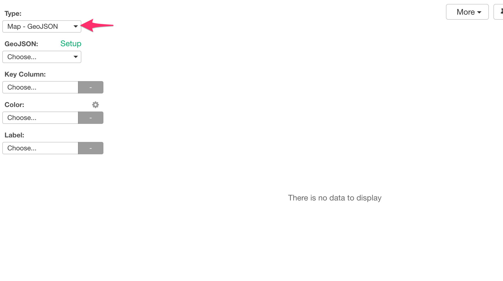

You can download a zip file for US States by clicking on 'DOWNLOAD' button.

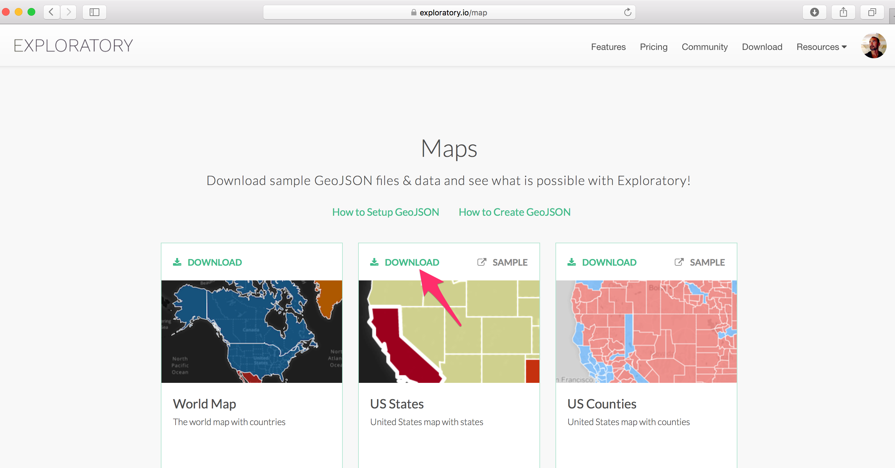

Once it's downloaded, unzip it, then you want to upload 'states.geojson' file inside 'states' folder by clicking on 'Add' button.

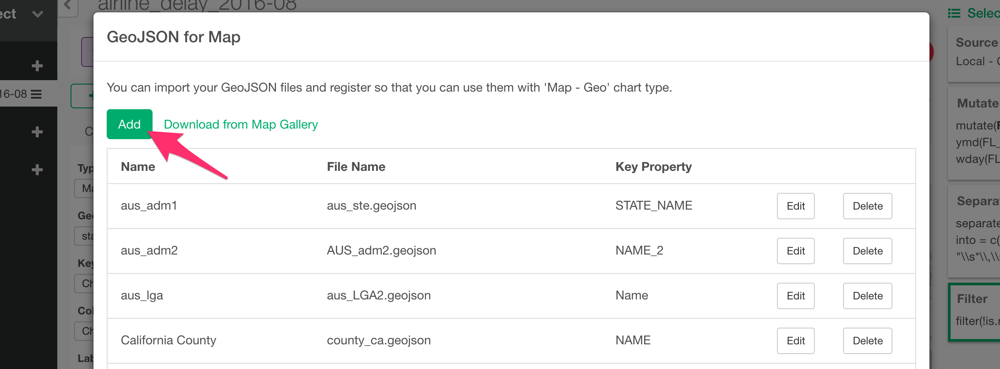

Once it's added, you want to select a right 'Key Property' from the list to match with your data, in this case that should be the US State codes (e.g. CA, NY, etc.).

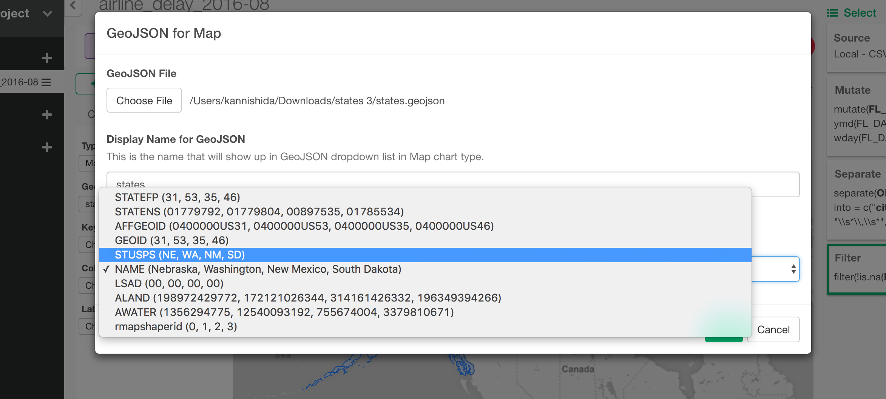

And, click 'Add' button.

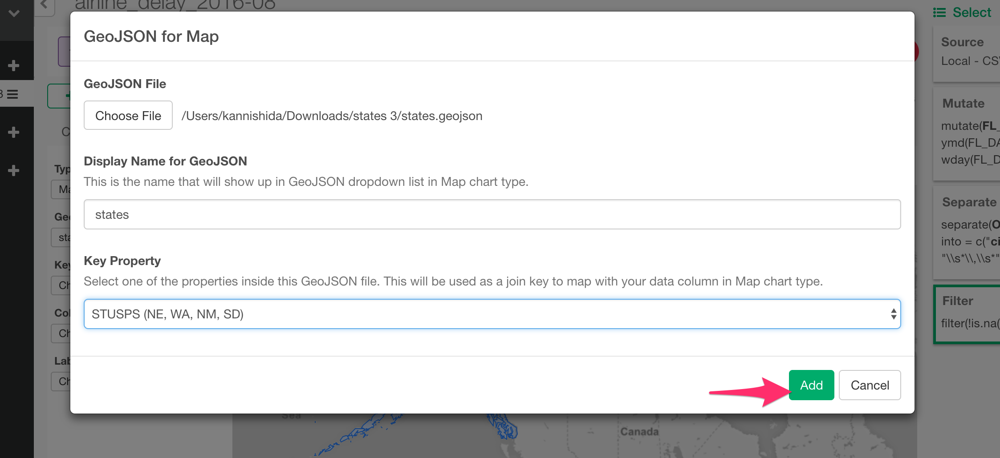

Now, you should see 'state' map in GeoJSON dropdown list.

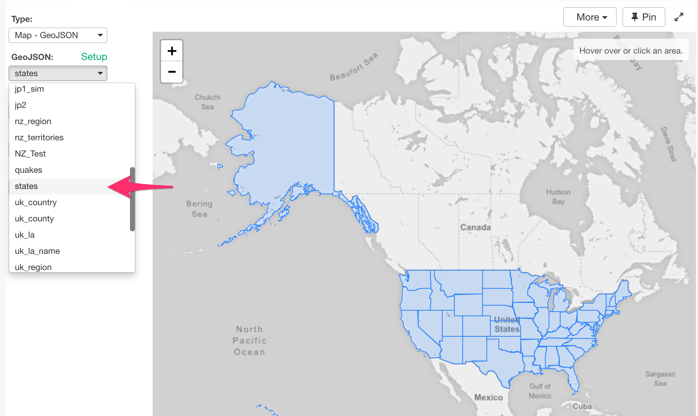

Select 'state' column for Key Column.

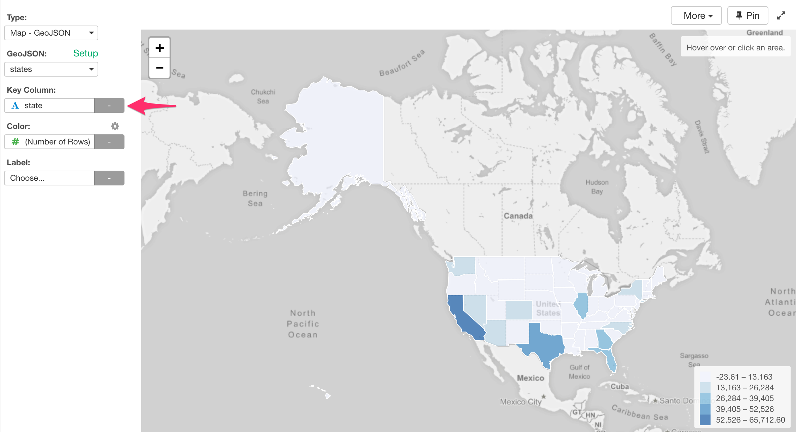

You can see which states more flights left from. California and Texas have more than other states in this case.

Now, let's say we want to see which carrier had the most flights by each US State. We can assign 'CARRIER' column to Color.

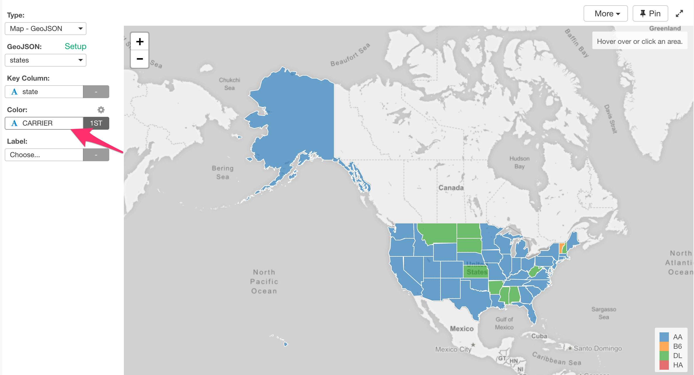

But this is showing a carrier that happens to be the 1st entry for each state. It doesn't mean that these are the number one carrier for each state.

In order to show a carrier with the most flights for each US State, you can count the number of the flights for each state and carrier by using 'Group By' and 'Summarize' commands, then keep only the top 1 row for each US State.

Let's start by grouping the data frame. Select 'CARRIER' and 'state' columns by clicking on the two columns while pressing on 'command' (for Mac) or 'control' (for Windows) key, and select 'Group by' from the column header menu.

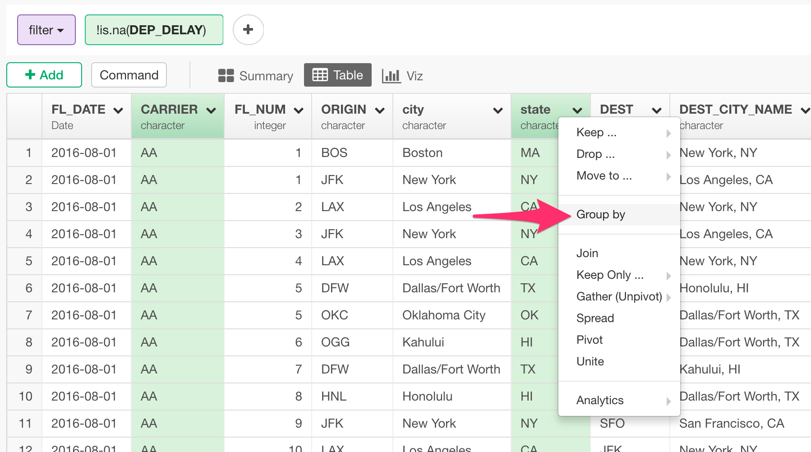

Now, we want to count the number of rows based on the grouped data frame. Select 'Summarize' from 'Add' button.

Keep '(Number of Rows)' as default, and type 'counts' for the newly created column name, and click 'Run' button. You will get the number of the rows (or flights in this case) calculated for each US State and carrier.

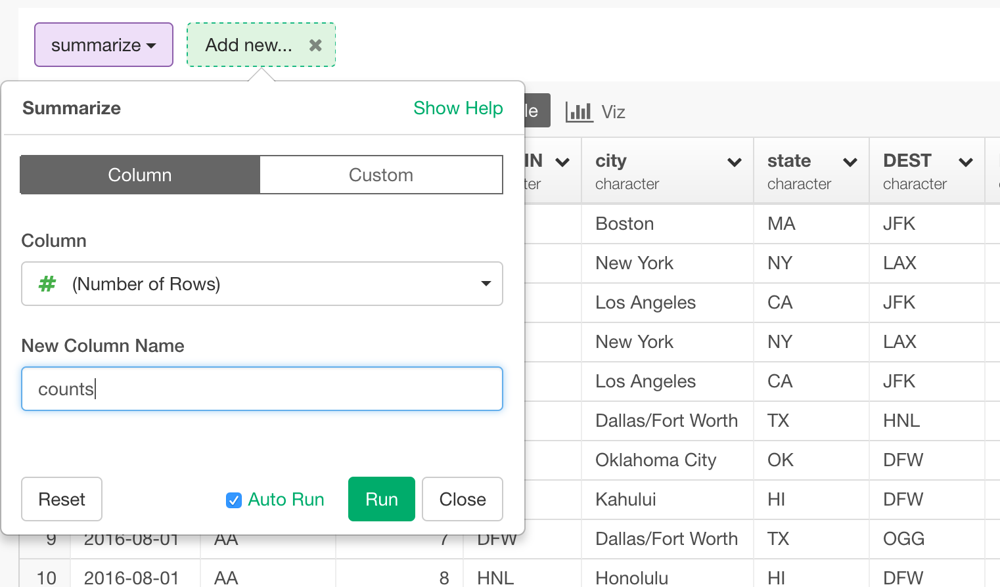

You can select 'Keep Only' -> 'Top N' from Add button.

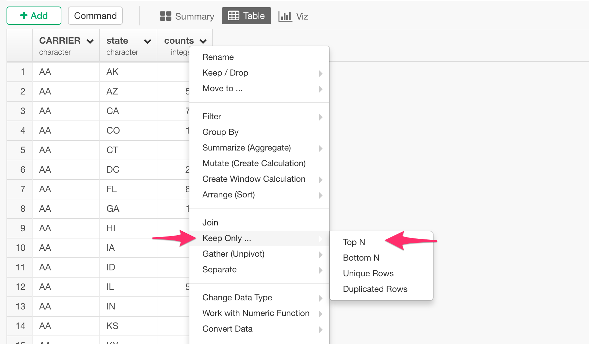

Instead of the default '10', you can set it to '1' so that it will keep only the highest number for each group, and click 'Run' button.

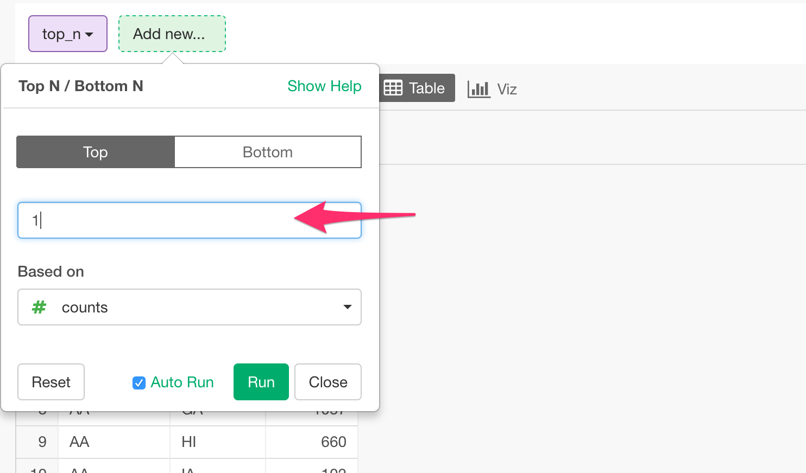

Now the result looks a bit strange.

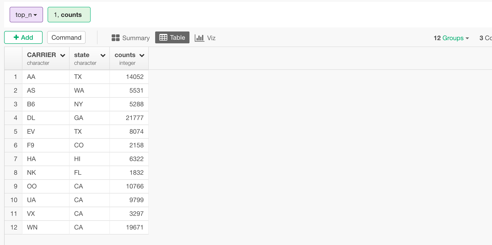

We wanted to get a carrier with the highest number of the flights for each state. Here, we are getting a state with the highest number of the flights for each carrier. That's opposite!

When you look at 'Grouping' setting, the data frame is 'grouped' by CARRIER at this point. And this is why the 'Top N' command returned the result for each carrier, instead of each US State.

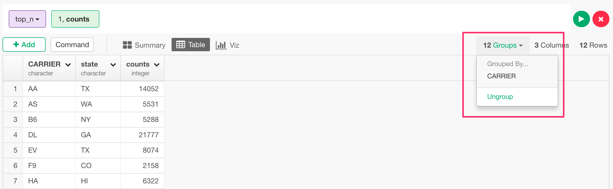

When 'Summarize' command is run, it removes the group setting from the lowest. This means, it had removed 'state' from the original group setting of 'CARRIER' and 'state'.

Now, we can fix this revisiting 'Group By' step.

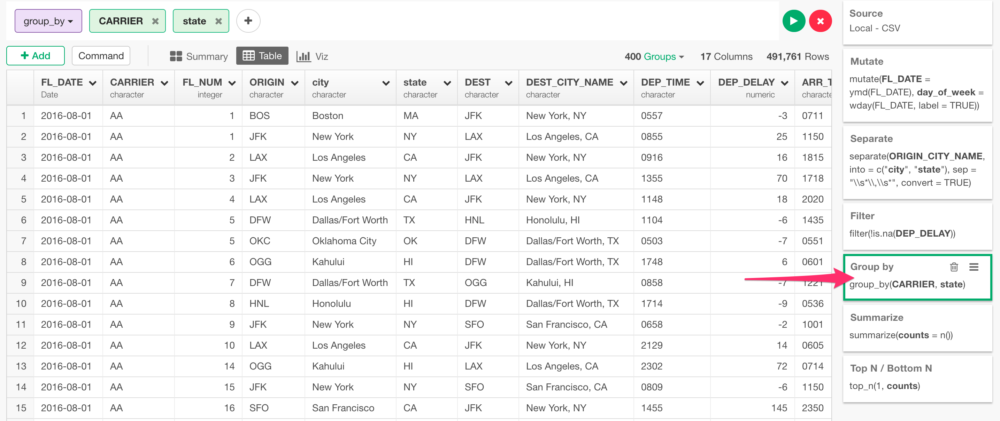

And drag 'state' column token and drop on 'CARRIER' token.

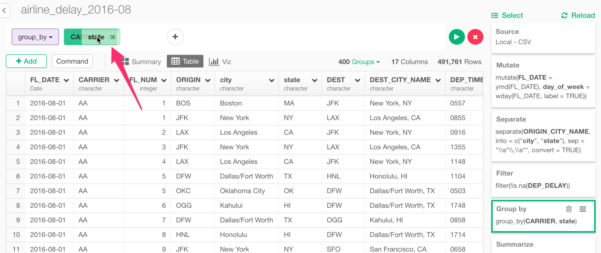

This will change the order of the grouping. Now it's 'state', and 'CARRIER'.

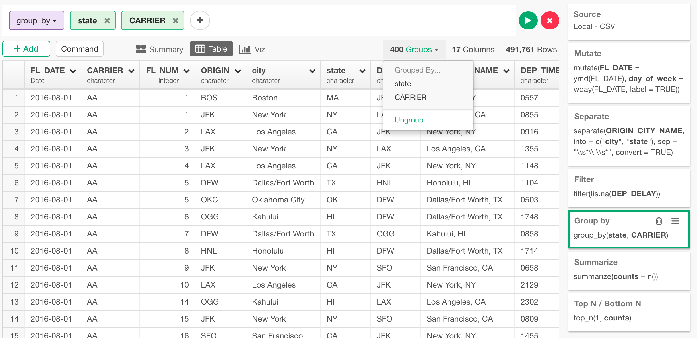

Now, go back to 'Top N' step, you will see only the highest carrier for each US State.

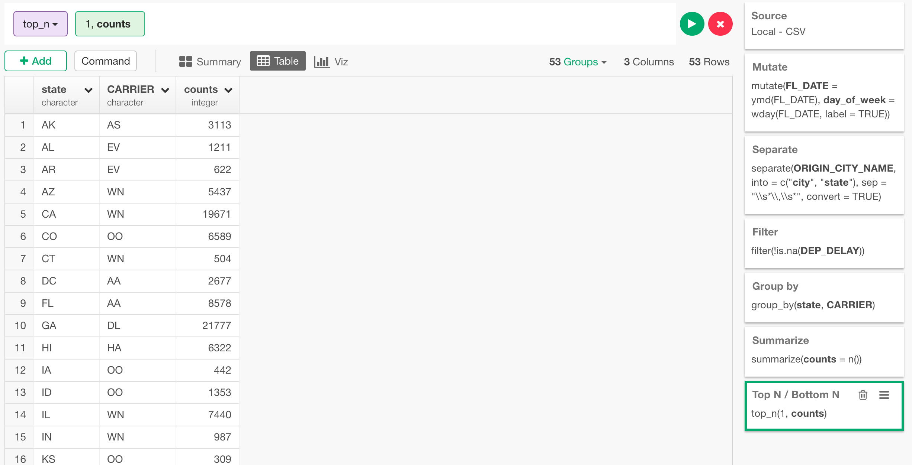

And, go back to Map, you will see the highest carrier for each state visually.

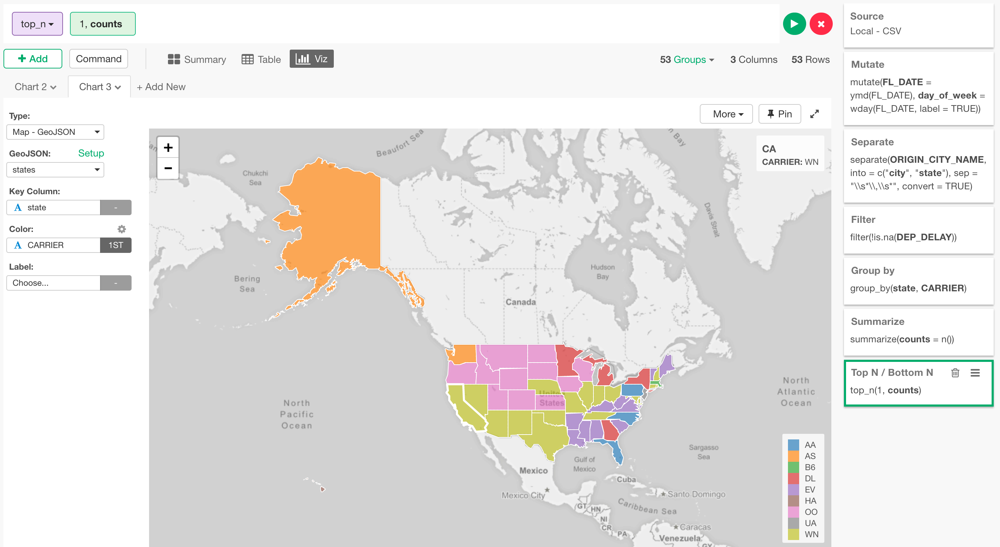

Now, unfortunately, these carrier codes showing up in Legend are not really clear, and it would be nice if we can show the actual carrier name. Conveniently enough, we have shared a mapping table that maps between the carrier codes and names at [this page](https://exploratory.io/data/kanaugust/9876993836892339) in a format called 'EDF (Exploratory Data Format)', which contains not only the data itself, but also the data transformation steps to reproduce the data in another Exploratory Desktop environments.

Visit the above linked page, and download the EDF.

And, import the EDF file to your Exploratory Desktop.

If you are interested in other things you can do, take a look at [this blog post](https://blog.exploratory.io/visualizing-geospatial-data-with-your-own-geojson-f96dde0f6296#.y7v3v5nyj).
