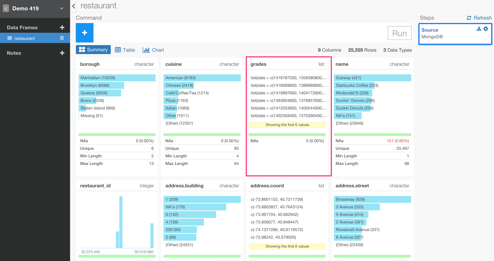
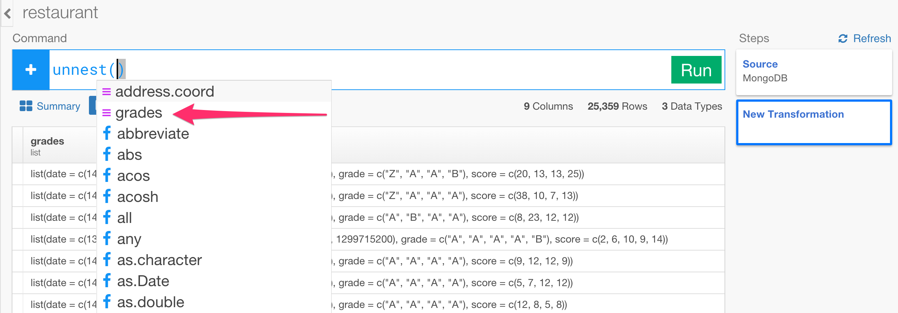
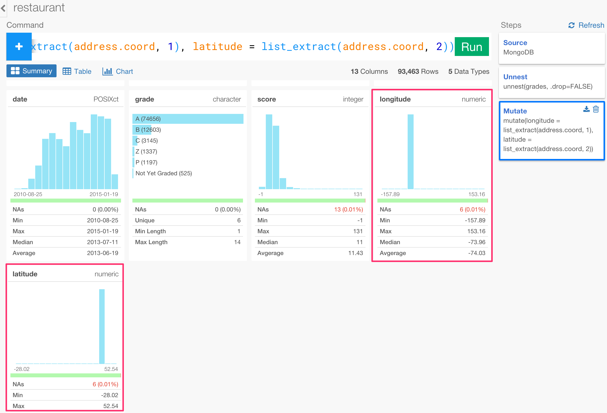
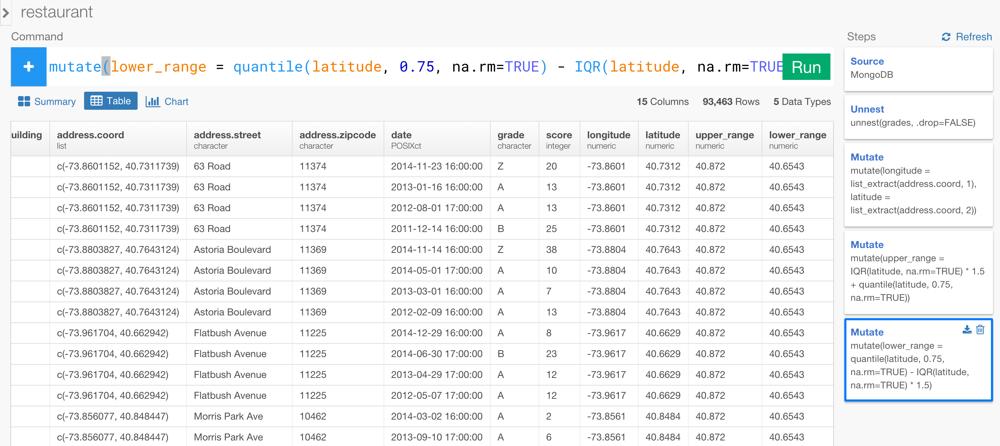
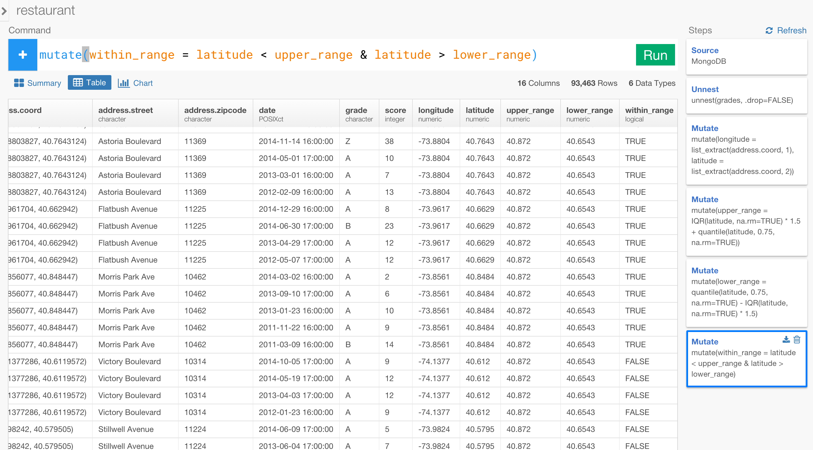
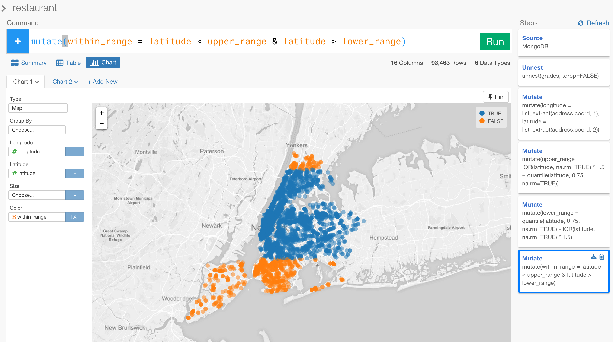
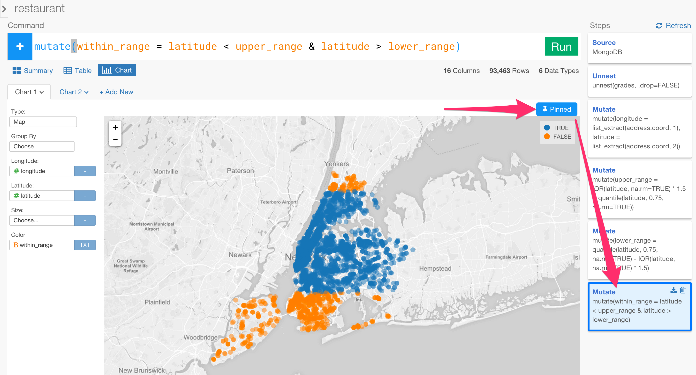
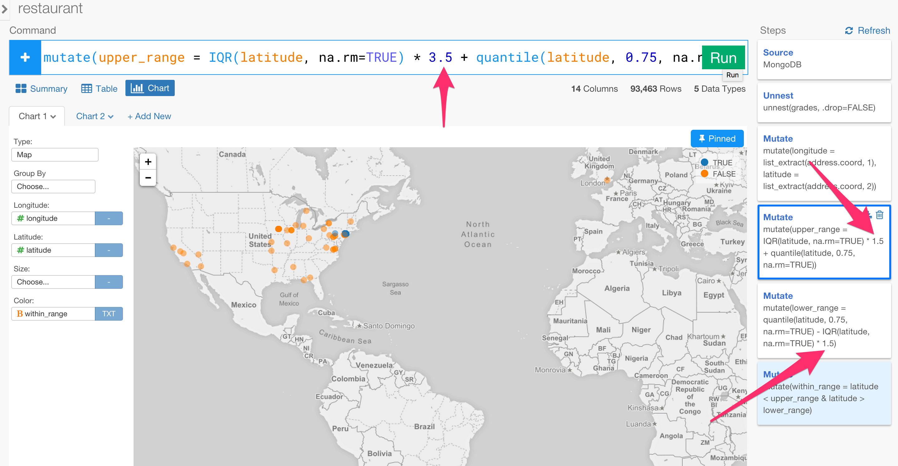

# Working with Mongo DB Data

### What you are going to learn

- Importing data from Mongo DB
- Flatten the nested data with 'unnest' command
- Extracting values from List (array) data
- Visualize data with Map
- Detect and remove outliers with R statistical functions

### Data for this tutorial

This tutorial is based on the MongoDB's standard example database called 'restaurants' collection. If you don't have the data you might want to import it to your MongoDB quickly by downloading the data from [MongoDB website](https://docs.mongodb.org/getting-started/shell/import-data/).

- [MongoDB Example Dataset Import Instruction](https://docs.mongodb.org/getting-started/shell/import-data/)

## Import data from Mongo DB

You can quickly import data from your Mongo DB into Exploratory.

### 1. Open Mongo DB Import dialog

Select 'Import Remote Data' from Add New Data Frame menu.


Click Mongo DB to select.


### 2. Set Parameters

Type your new data frame name

Type the following your Mongo DB connection related parameter values.

- Host name
- Port number
- Database name
- Collection name
- Username
- Password
- Query - you can leave this as default unless you know the specific query.
- Flatten - you can leave this as default for most of the cases.

Note: We support the connection with username and password. If you are working with locally installed MongoDB and don't have username and password then please create them in order for Exploratory to be able to access to it. We will support the connection without username/password soon.


### 3. Preview and Import

Click Preview button to see the data back from your Mongo DB.


If it looks ok, then you can click 'Import' to import the data into Exploratory.

You will see the data showing up in Summary view!


## Unnest nested data column

When you look at 'grades' column you will notice that it is a List data type column.



When you go to Table view you can quickly see the detail data inside this column. It has each restaurant's grade and score per each date.


This is basically a table inside the cell (or row). So what we want to do is to unnest this column so that each column - grade, score, date - inside this nested table will become columns of its own and each row will become its own row. You can Do this very quickly with 'unnest()' command.

Select 'Unnest' operation from '+' dropdown menu.


Select 'grade' column from the suggested list and click 'Run' button.



You will notice there are 3 new columns - date, grade, score - added in the table view.


You can go to Summary view and quickly see that those grades were done between 2010-08-25 and 2015-01-19 and that the grades are among A, B, C, Z, P.


But, you would notice though, there is one column disappeared. That column was 'address.coord'.


This is because 'unnest' command would drop other List type columns unless it's specified otherwise. So we can go back to the 'unnest()' command and add an extra argument to not to drop the other List columns by setting '.drop' argument to FALSE.


Once you hit 'Run' button, now you will see 'address.coord' column along with the unnested columns.


This 'address.coord' column looks like it's holding Longitude and Latitude values. If we use 'unnest' command for this column, this will create two rows, one for the first value and another is for the second value. But what we really want is to have these two values to have their own columns as Longitude and Latitude columns so that we can use those values to do analysis or to visualize the data easier.

There are a few ways to do this, but let's look at probably the most simple way.

## Extract values from List column with the position

Select 'Mutate' operation from '+' dropdown menu.


Type 'longitude' as a new column name and '=' like below.


Once you type a space you will get a list of the columns and functions. Click 'Open Function List' to open Function List dialog.


Select 'List' category


You can see a list of the functions you can use to work with List column. Select 'list_extract' function.


Click 'Insert Function' button.


Select 'address.coord' column from the suggested list.


And type 1 as position after comma like below.

```
mutate(longitude = list_extract(address.coord, 1))
```

Add another column inside the same 'mutate()' command to extract 'latitude' value like below. Make sure you set 2 as the position number.

```
mutate(longitude = list_extract(address.coord, 1), latitude = list_extract(address.coord, 2))
```

Hit 'Run' button, you will see two new columns called 'longitude' and 'latitude' created.



## Visualize data

Now we have enough data, let's visualize it to understand better.

Go to Chart view and select 'Map' as Chart type, assign 'longitude' column to Longitude and 'latitude' column to 'Latitude'.


The result looks strange. By looking at 'borough' column in Summary view, we know these restaurants are supposed to be all in New York City.


So it's a bit weird to see those circles displayed all over the world. Let's assign 'borough' column to Color in Map view.


As you zoom in you will notice that the most data points are actually concentrated around New York city.


This means, there are some restaurants that have incorrect geo location data.

## Detect and Filter Outliers using Stats functions

There are many ways to filter out those incorrect data. Here, let's try to detect those as 'outliers' so that we can filter them out easily.

In order to calculate the outlier values, we want to first calculate the interquartile range, which is the range between 1st quartile (25 percentile) and 3rd quartile (75 percentile). Once we get the interquartile range value then we can decide a threshold value such as 1.5 and multiply that to both 1st and 3rd quartile values in order to get 'upper range' and 'lower range'. In R, there is 'iqr' function for calculating the interquartile range and 'quartile' function for calculating the quartile or percentile. So the calculation will look something like below.

```
upper_range = iqr(latitude) * 1.5 + quartile(latitude, .75)
lower_range = quartile(latitude, .25) - iqr(latitude) * 1.5
```

Once we get these numbers then we can test if each value of 'latitude' column is within this range or outside of this range.

Let's do this step by step within Exploratory.

### Calculate Upper Range for Latitude

Let's go to Table view to see the calculated result at each step better.

Click '+' button to add a new transformation step, and type something like below into the command input.

```
mutate(upper_range = IQR(latitude, na.rm=TRUE) * 1.5 + quantile(latitude, 0.75, na.rm=TRUE))
```


### Calculate Lower Range for Latitude

Click '+' button, and type something like below into the command input.

```
mutate(lower_range = quantile(latitude, 0.75, na.rm=TRUE) - IQR(latitude, na.rm=TRUE) * 1.5)
```



### Evaluate if Latitude value is between upper and lower range values

Now, we can evaluate to see each 'latitude' column value is between the upper_range and the lower_range values.

Click '+' button, and type something like below into the command input.

```
mutate(within_range = latitude < upper_range & latitude > lower_range)
```

The command above will return TRUE if the condition is satisfied, which means a given values is between the 'lower_range' value and the 'upper_range' value.



Now, go back to Chart view and assign this new 'within_range' column to Color.



Looks like the threshold value we set, which was 1.5, was too mild. So let's update the value to something like 3.5 so that we can differentiate only the extreme values.

Before going back to the previous steps to update, click 'Pin' button to fix the chart (map) to the last step.



Go back to the previous two steps and update each command by changing the value of 1.5 to 3.5 for both.



Now, zoom in to New York city and you will see all the dots inside the city are 'TRUE' color.


Now that the outlier threshold value setting seems to be working ok, let's add a new step to filter out the extreme values like below.

```
filter(within_range)
```

Once you hit 'Run' button, and 'unpin' the chart (map), which means that the map is now pointing to the latest step, then the map should be showing something like below.


There are still some data that is outside of New York city. You can repeat the same outlier detection and removal steps for 'longitude' to get rid of them.

## MongoDB plus Exploratory

With Exploratory, not only can you extract data from MongoDB easily, but also you can quickly transform the data into a 'tidy' format, visualize the data to understand the data intuitively, and analyze the data flexibly using rich and sophisticated R functions.

Happy Data Wrangling!
