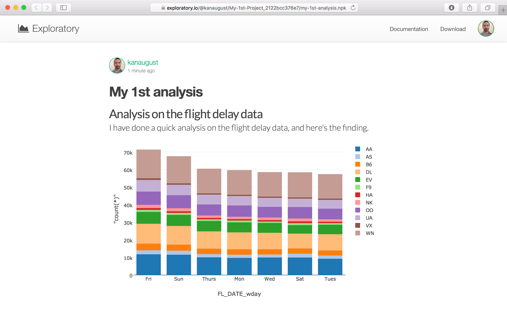
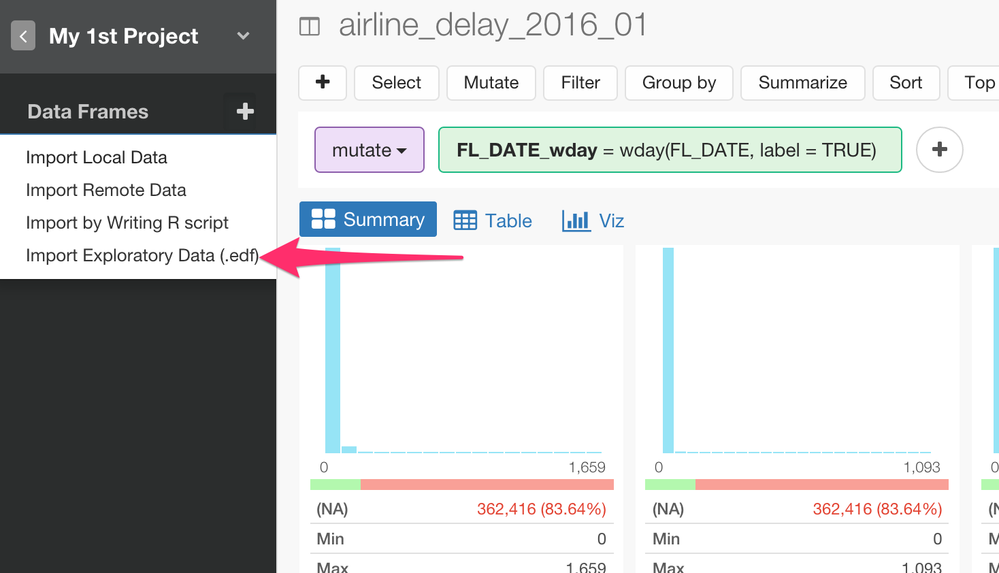
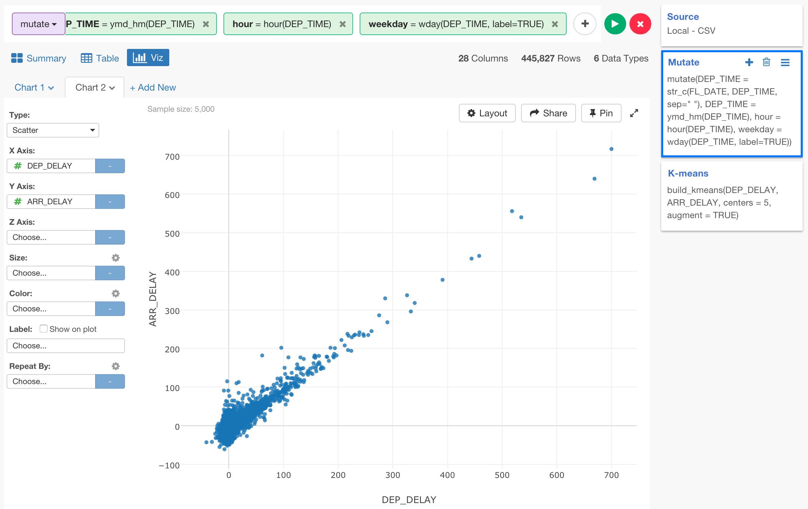

# Quick Start Guide

## Download Flight Delay sample data

We're going to use the following file for this tutorial. You can download it from the link below.

- [Flight delay 2016 August data](http://download.exploratory.io/data/airline_delay_2016_08.csv)

## Create a new project

Once you start Exploratory app, create a new project to start.


Type a project name and click 'Create' button.


## Import sample data

Inside the project, you can click a plus '+' button next to 'Data Frame' text in the left side pane to import 'airline_delay_2016_08.csv'.


Select 'Import File Data'.


After you select the file from the file picker dialog and hit OK, you'll see the first 50 rows of the data you're importing.


You can keep all the parameters as is for this exercise and simply click 'Save' button.

You should see the imported Flight data in the default Table view.


Click 'Hide Side Bar' button at the top to hide the left hand side section and make the data view area bigger.


## Inspect Data with Summary View

You can click 'Summary' tab and quickly see the summary information of the data in Summary view. For example, you can see that there are 12 unique airline carriers in CARRIER column and seven of them are listed as bar chart from the highest frequent one at the top.


## Data Wrangling (Data Transformation)

In this Data Wrangling section, we are going to cover the following common tasks:

* Parse character data and convert to Date
* Extract Day of Week information from Date
* Separate a column into multiple columns
* Remove NA (Missing Values)

### Parse character data and convert to Date

As you can see, FL_DATE column seems to contain date data but it's registered as 'character' data type.


In general, Exploratory convert appropriately with heuristic guess based on the original data at Import, but sometimes it can't due to the way the original data is format. But you can quickly convert the data after the import. In this case, you can select 'Change Data Type' -> 'Convert to Date / Time' -> 'Year, Month, Day' from the column header menu.


You want to choose 'Year, Month, Day' because the original data is format in that particular order. (e.g. 2016 Aug. 05) Note that the order of the date component is the only thing that matters here. Another word, the separating characters or if the month name is full name (August) vs. short name (Aug) doesn't matter. It's that simple!

Anyway, selecting the column header menu will open 'Mutate (Create Calculation)' dialog with the following function already configured.

```
ymd(FL_DATE)
```


This 'ymd' function parses the incoming data with an assumption that the data is presented in an order of Year, Month, and Day, and convert to 'Date' data type appropriately.

Note that, in R, 'Date' is a data type for date data without Time information. How about Time? Well, there is another data type called, 'POSIXct', which takes care of both Date and Time information.

You can see more details about the function by clicking on 'Show Doc' button.


Also, you can click on 'Function List' button to see all the other R functions that are available out of the box.

Anyway, you can click on 'Run' button to execute the command.

You can now see 'FL_DATE' column being converted to Date.


It's showing a histogram chart visualizing how the data are distributed along the timeline. Also, you can find the data is ranging from 2016-08-01 to 2016-08-31.

You would also notice that there are two color boxes (purple and green) at the top.


Purple box indicates which command was used, in this case that is 'mutate'. This 'mutate' command is used when you want to create a new calculation, which is equivalent to Excel's formula. You are going to see other types of the commands such as 'select', 'summarize', 'filter', etc. later, so no worry if you are puzzled here.

Now, in the green box you see the following.

```
FL_DATE = 'ymd(FL_DATE)'
```

The left hand side of the equal '=' is the column name and the right hand side is the calculation with 'ymd()' function, which you have seen previously.

So basically, the 'mutate' command is executing the calculation defined in the green box, in this case that is 'ymd()' function and store the result into a column name called 'FL_DATE', which happens to be the original column name, so it will override the existing column.

Lastly, you would also notice that there is a new step called 'Mutate' being added at the right hand side.


This is, by the way, the exactly R command that actually run behind the scene. As you perform more data transformation operations they will be registered and shown up as 'Steps' here.


### Extract Day of Week information from Date

Let's do one more operation within the same 'Mutate' step.

Now that FL_DATE column is 'Date' data type, we can extract date component information like 'Day of Week (e.g. Sunday, Monday, etc.)'. You can select 'Extract' -> 'Day of Week' from the column header menu.


In the opened 'Mutate' dialog, notice that 'Create New Column' tab is selected this time. This means, it will create a new column with the calculation defined here, instead of overriding the original column.


Type 'day_of_week' for the new column name, and hit 'Run' button.

When you scroll down to the bottom, you can see the new column 'day_of_week' being created.


It shows 'Sun', 'Mon', 'Tue', etc. as expected. However, the bar chart is not sorted from the highest frequent value, in this case that could be 'Mon'. This is because this column is created as 'factor' data type, which is a special data type in R to make it easier to work with categorical variable (column) by embedding a 'sorting order' information inside the column. This is actually perfect for the 'order' sensitive data like Day of Week. If you want ignore such order though, you can simply select 'Change Data Type' -> 'Convert to Character' from the column header menu, which would convert the 'factor' data column to a 'character' data column. In this exercise, we'll keep as is.


## Separate a column into multiple columns

ORIGIN_CITY_NAME column contains both city names and US State names.


Let's say you want to see which US state the most flights are leaving from. You want to extract only the US state part of the information.

For this, you can simply separate this column by setting a separating character, in this case that is a 'comma'. To make this operation easier to see, let's go to Table view first.

Then, select 'Separate' -> 'Separate to Columns by' -> 'Comma(,)' from the column header menu.


In the opened 'Separate' dialog, type column names for the new columns to be created. In this case, 'city' and 'state'


Once it's run, you will find two new columns being created, one has the city names and another has the US state names.


Also, you would notice that there is a new step just being added at the right hand side.


### Remove NA (Missing Values)

When you look at DEP_DELAY column in Summary view, you would notice that there is a slight red part in the green bar, which is located at the middle of the column tile.


This red bar indicates how much of the data in this column is NA. You can see that there is 1.32% of the data is NA. There are many ways to handle NA values and you can do them easily in Exploratory, but here let's try removing them with 'filter' command operation.

Select 'Filter' -> 'is not NA' from the column header menu.


This will open 'Filter' dialog with 'is not NA' operator being already selected.


If you are interested, you can click on the operator dropdown to see many other operators that are supported out-of-the-box. If you are familiar with R and want to extend, you can always go to 'Custom' tab and start typing the 'filter' condition the way you like.

Anyway, you want to simply click on Run button here.


You will see that NA becomes 0 (0.00%) now.


### Join with Airport Location Data Set


## Visualize data

There are many ways to visualize data with various chart types. In this exercise, let's take a look at a few of them to explore and have a better understanding of the data.

* Understand which state and day pairs have more flights than the others. (Pivot Table)
* Understand Departure Delay Time Trend in August.
Window functions
* Understand which airline carriers have more departure delay times than the others. (Boxplot)
* Understand correlations between Arrival Delay and Departure Delay times (Scatterplot)


### Pivot Table

Let's use Pivot table to understand which state and day pairs have more flights than the others.

Go to Viz view, and assign 'state' column to Row and 'day_of_week' column to Column. You can keep the default value of 'Number of Rows' for Value.



Notice that the column values are sorted as 'Sun', 'Mon', 'Tue', etc. by respecting the natural order of days of the week, while the row values (US States) are sorted alphabetically. This is because, as you saw before, 'day_of_week' column is 'factor' data type and has the sorting information embedded in, which Pivot table and other chart types respects when sorting the data.


You can use Color to visualize the data. Select 'All' from the dropdown.


You can show the value as '% of Total' instead of the raw numbers. Click on 'Gear' icon next to 'Value' and select '% of Total' from the calculation type dropdown.


The default setting calculates the '% of Total' as a percentage of the all the values in Pivot table. But you might want to see the percentage of each US state or each Day of Week. Here, let's change the 'Direction' setting to 'Row' to see which day of the week have more flights than the other days for each state.


We can see that most of the states have more flights between Monday and Wednesday. And Saturday is the lowest for most of the states.

You can click on 'Sat' to sort the data based on the values in this column. This would gives you an idea of which states have higher percentage of the flights on Saturday.


### Line Chart / Time Series

Let's take a look at the trend of the flight departure delay during this time period of August, 2016.

Select 'Line' chart and assign 'FL_DATE' column to X-Axis. The default data aggregation level for Date data is 'Year', but you can change it to 'Day' to see the daily trend.


Now, assign 'DEP_DELAY' column to Y-Axis to see the trend of the flight departure delay time. The default data aggregation function is set to 'sum', but you can change this to something like 'Average'.


You can assign 'CARRIER' column to Color to see the trend by each airline carrier.


You can click on any of the values in Legend to show or hide the lines inside the chart.


Double click on any part on the chart area, this will readjust the chart scales to show the currently available values in the most effective way.


You can also use Drag and Drop gesture to select an area to zoom in.


You can double click on any part on the chart to get back to the original level.

Now, let's take a look at how the departure delay times were getting accumulated by each carrier, by using a Window Calculation type called 'Cumulative Sum'.

Click on the property icon and select Window Calculation from the list.


Select 'Cumulative' for Calculation Type, and 'Sum' for 'Summarize Values using'.




We can see that Delta Airline (DL) has accumulated large amount of the departure delay time based on the average. Looks something happened in that week. Also, we can see that some airlines like Hawaiian (HA) and Alaska (AS) are consistently very low departure delay times, which means that their flights got delayed but those were exceptions, not like the other carriers where the delays are observed as normal events.

## Boxplot

Let's dig in a little bit more on the departure delay time. We can change the chart type to Boxplot, which shows the data distribution of a given measure, and see more detail on how much of the delay each carrier had for each day.



You can drag the mouse to select the time range between August 7th and 14th to zoom in.


We can see that many of Delta (DL) airline flights were delayed significantly on August 8th, 9th, and 10th.

Now, we can switch X-Axis to CARRIER column and see the data distribution of the departure delay time for each carrier.


The default setting removes the outlier values, but you can bring them back by checking 'Include Outlier' checkbox.


Now, let's say we want to know how bad those delayed flights were. We can filter the data to keep only the worst 100 flights based on the delay time for each carrier.

Click 'Add' button, and select 'Keep Only' -> 'Top N'.


Type 100 and select 'DEP_DELAY' column, and click 'Run' button.


The chart is showing the worst 100 flights now.


But this worst 100 flights are based on all the flights from all the carriers. We want to get the worst 100 flights per each carrier. We can do this by using 'group_by' command to group the data frame before applying the 'Top N' command.

One thing though, before adding 'group_by' step, let's click on 'Pin' button at the right hand side top.


This will make the chart always references to the data generated by this 'Top N / Bottom N' step.

Now, click on 'Filter' step right before 'Top N / Bottom N' step at the right hand side.


Select 'Group By' from 'Add' button menu.


Select 'CARRIER' from the column list.


Now you can see that the chart is showing the range of the delay times for the worst 100 flights by carrier.


Notice that the step that is currently selected at the right hand side is still 'Group By', but the data shown in the chart is the result that has applied 'Top N / Bottom N' step, and this is why you are seeing the worst 100 fights for each carrier. This is what 'Pin' button can do for you!

### Scatterplot

Now, let's see how the departure delay time and the arrival delay time are correlated. Another means, if a flight delayed for its departure will it delay for the arrival as well?

To explore such correlation, we don't need the last two steps of 'Group By' and 'Top N / Bottom N' we added previously, we'd rather evaluate the entire data. So for this analysis, we can create something called 'branch' and create a 'branched' data frame from the step before 'Group By'.  

Select 'Filter' step at the right hand side.


Select 'Create Branch' from the action menu.


Type a name for a new 'branch' data frame name, such as 'correlation', and click 'Create' button.


You would notice that there is a new data frame called 'correlation' created underneath the main data frame 'airline_delay-2016-08'.


Also, you would notice that the steps at the right hand side are grayed out. These are the steps that are managed in the main data frame and this 'correlation' data frame inherits the result of these steps from the main data frame.


Now, we can go to Viz view and select 'Scatter' as the chart type, assign 'DEP_DELAY' to X-Axis and 'ARR_DELAY' to Y-Axis.


There seems to be some degree of 'linear' correlation between the two measures.

We can see how the correlations look like for each carrier by assigning 'CARRIER' column to 'Repeat By'.


You can adjust 'Repeat By' properties to see all the charts better.


For example, it's selecting '4' for the number of the charts at the column, setting it to fit all the charts in the visible area, and setting it to not synchronize the scales for X and Y axes.

we can see that some carriers like 'AA' and 'DL' are showing much more clear 'linear' correlations compared to others like 'F9' and 'HA'. We can see how linear the correlations between the two measures for each carrier better by showing Trend Line.

Select 'Trend Line' from Y-Axis property menu.


Select 'Linear Regression' to use Linear Regression model to calculate the trend line, and select 'Data Range for Each Group' for 'Line Length' so that the trend lines will be drawn only for the data range of each carrier.


Again, the dots that represent the flights are nicely on the linear trend line for some carriers like 'AA', 'NK', but not so much for 'F9', 'VX'.

Now as you would have noticed though, most of the data are gathered around 0 for both the departure and the arrival delays. Maybe the linear relationship might be different depends on the range of the delay times.

So we can group the flights based on the arrival and departure delay times. If you want to group the data automatically based on the two or more measures, you can use one of the clustering algorithms called 'K-means'.

Select 'Run Analytics' -> 'Cluster with 'K-means'.


In the opened dialog 'Cluster with K-means', select 'DEP_DELAY' and 'ARR_DELAY' columns under 'Select Columns' section, and set '5' as the number of the clusters it will create, and click 'Run' button.


You can see what has just happened better in Table view. Scroll to the very right, you will notice that there is a new column called 'cluster' which has the cluster id for each row (flight).


Now, go back to Viz view, and assign this 'cluster' column to Color.


Now, as you notice though, the clustering calculation was done against the entire data set. If you remove 'CARRIER' from Repeat By, then you can see how the 5 clustered groups look like.


Let's say we want to cluster the data for each carrier, meaning we want to see 5 clustered groups for each carrier. This can be done by grouping the data frame before calculating the cluster IDs.

Select 'Filter' step, which is gray colored because it's coming from the main data frame.


Select 'Group By' from 'Add' button menu.


And, select 'CARRIER' column.


This will automatically run the next step of 'K-means Clustering' because the currently displayed chart is 'Pinned' to the step.

Lastly, we can show Trend Line. This time, we can try 'Polynomial (GAM)' as Type and select 'Data Range for Each Group'.

Unlike 'Linear Regression', which is to build linear regression models assuming it can draw a linear line to express the correlation between a given pair of two measures, 'Polynomial (GAM)' is to build general additive models assuming that it can draw a smooth curve between a given pair of two measures by optimizing for the 'local fitting' or for each divided subsection of a given data.

If you are not sure about this, no worry, Think of Linear Regression is a way for drawing a linear line and Polynomial is a way for drawing a smooth line to represent the data distribution.

As you see, here, the polynomial smooth curves tend to look more like linear lines as the delay times become larger, which means, it's easier to predict how many minutes the arrival time will be delayed if we know how many minutes the departure time was delayed beforehand. However, there are a few exceptions like HA, VX, etc.


## Share Chart

Once you find an interesting insight you might want to share it with others. With Exploratory, you can easily share not just the chart, but also the data wrangling steps along with the chart so that others will be able to reproduce your work easily.

Select 'Share Viz' under 'More' button.


Fill in Title and Description.


Select 'Private', if you like to share it privately.

And, click 'Share' button.

Once it's published, you will see 'Add or more users' link.


Clicking on the link will take you to the published page with 'Share' dialog opened.


By clicking on 'Enable' link, you can allow anyone with this uniquely generated URL to open this chart page.


On the published chart page, you or others you shared with can click 'Download' button and select 'Download EDF' to download the chart in a reproducible format.


This means, others can import the downloaded EDF file into their Exploratory and will see not only the chart but also all the data wrangling steps to produce the chart data.


## Create Note

Finally, you can create your analysis report by creating Note.

Click 'Plus' button next to 'Note'.


Type a name in the pop-up and click 'Create' button.

This is a Rich Text Editor, so you can write anything you like. Highlighting the text will prompt you a formatting menu.


Every time you hit Enter key to start a new line, you will see 'Plus' button at the beginning the line. By clicking on the button you will see a chart icon.


You can click this to get a Chart picker dialog.

Select a data frame where the chart were created, select the chart, and click 'OK' button.


Once you finish writing the report, you can either publish it so that you can share by URL or save it in a HTML document.


Lastly, you can click Refresh button to refresh all the charts that are in the Note. This will reload the data from the underlying data sources like databases, files, etc. for the charts.
