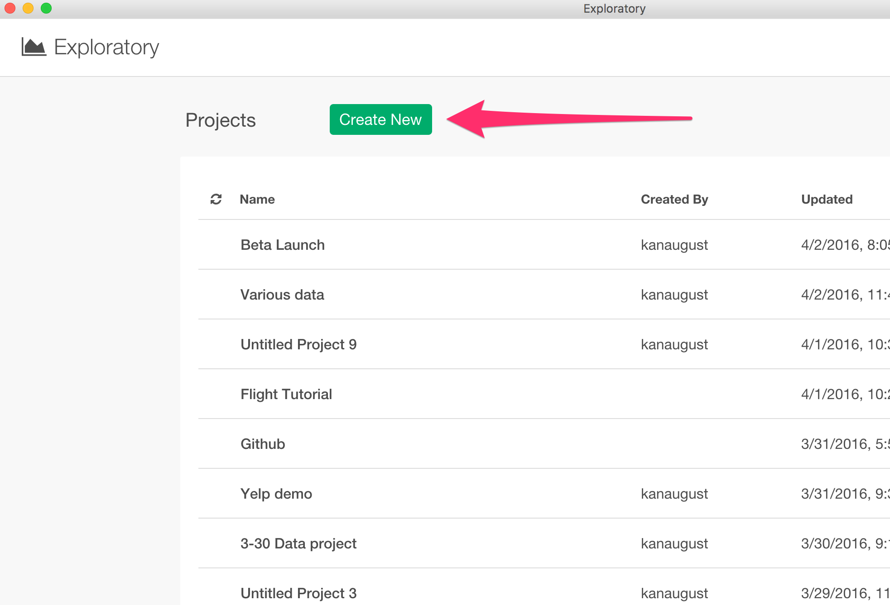

# Getting Started Guide

Duration (Time to finish) : About 60 minutes

This is a getting started guide that walks you through how to get around with Exploratory Desktop by performing exploratory data analysis on US flight delay data. The main areas to be covered are:

* Create a new project and import data
* Inspect Data with Summary view
* Transform Data (Data Wrangling)
  * Parse Character data and **Convert to Date**
  * **Extract Day of Week** information from Date
  * **Separate a column** into multiple columns
  * Work with **NA (Missing Values)**
  * **Join** with another Data Set
* Visualize Data
  * Map with **Geocodes**
  * Pivot Table with **Percent Total**
  * Line Chart with **Window Calculation**
  * Boxplot Chart with **Grouped Top 100**
  * Scatter Chart with **Trend Lines** (Linear Regression Model and General Additive Model)
* Analyze Data with **Machine Learning** Algorithm
  * **Variable Importance** with Random Forest
* Share Charts in **Reproducible** Way
* Create **Note** to Share insights

If you have any questions while you go through the steps, feel free to ask through the Chat window,


or, send emails to support@exploratory.io

## Download Flight Delay sample data

In this tutorial, we're going to use US flight delay data for August, 2016, which tracks all the domestic flights that flew in the month for:

* How much they were late or early for the departure / arrival delay times.
* Where they left from and arrive at.
* How long or far they were flying for each flight trip.

You can download the sample data CSV file from the link below.

- [Flight delay 2016 August data](http://download2.exploratory.io/data/airline_delay_2016_08.csv)

Let's start!

## Create a new project

Once you start Exploratory app, create a new project to start.



Type a project name and click 'Create' button.


## Import sample data

Inside the project, you can click on '+' (plus) button next to 'Data Frame' text in the left side pane, and select 'Import File Data' from the dropdown list.


After you have selected the file 'airline_delay_2016_08', you'll see the first 50 rows from the file displayed in the preview table.


You can keep all the parameters as is for this exercise, and simply click 'Save' button.

You should see the imported Flight data in Summary View like below.


Click 'Hide Side Bar' button at the top to hide the left hand side section and make the data view area wider.


## Inspect Data with Summary View

You can click 'Summary' tab and quickly see the summary information of the data in Summary view. For example, you can see that there are 12 unique airline carriers in CARRIER column and seven of them are listed as bar chart from the highest to the lowest.


## Transform Data (Data Wrangling)

In this Data Wrangling section, we are going to cover the following common data transformation tasks:

* Parse character data and convert to Date
* Extract Day of Week information from Date
* Separate a column into multiple columns
* Remove NA (Missing Values)
* Join with Airport Location Data Set

### Parse Character data and Convert to Date

As you can see below, FL_DATE column seems to contain date data but it's registered as 'character' data type.


In general, Exploratory registers the data type for each column appropriately with heuristic guess based on the original data at Import time. But sometimes it doesn't work due to the way the original data is formatted. But, you can easily and flexibly convert the data after the import. In this case, you can select 'Change Data Type' -> 'Convert to Date / Time' -> 'Year, Month, Day' from the column header menu.


You wanted to choose 'Year, Month, Day' because the original data was formatted in that particular order. (e.g. 2016 Aug. 05) Note that the order of the date component is the only thing that matters here. In other words, the separating characters or if the month name is full name (August) vs. short name (Aug) doesn't matter. It's that simple!

Anyway, you will see 'Mutate (Create Calculation)' dialog being opened with the following function already set.

```
ymd(FL_DATE)
```


This 'ymd' function is one of the date / time parsing functions from R package called 'lubridate', which parses the incoming data with an assumption that the data is presented in an order of Year, Month, and Day, and convert to 'Date' data type appropriately.

Note that, 'Date' is a data type for date data that includes only Date information, such as Year, Month, and Day. What about Time, such as hours, minutes, and seconds? Well, there is another data type called, 'POSIXct', which can hold both Date and Time information.

You can see more details about the function by clicking on 'Show (or Hide) Doc' button.


Also, you can click on 'Function List' button to see all the other R functions that are available out of the box.

Anyway, you can click on 'Run' button to execute the command.

You can now see 'FL_DATE' column being converted to Date.


It's showing a histogram chart visualizing how the data is distributed along the timeline. Also, you can see that the date range is from 2016-08-01 to 2016-08-31.

You would also notice that there are two color boxes (purple and green) at the top.


Purple box indicates which command was used, in this case that is ```mutate```. ```mutate``` command creates and runs new calculations, which is equivalent to Excel's formula. You are going to see other types of the commands such as 'select', 'summarize', 'filter', etc. later, so no worry if you are puzzled here.

Now, in the green box you see the following.

```
FL_DATE = 'ymd(FL_DATE)'
```

The left hand side of the equal '=' is the column name and the right hand side is the calculation with ```ymd()``` function, which you have seen previously.

So basically, the 'mutate' command executes the calculation defined in the green box, in this case that is ```ymd(FL_DATE)``` and store the result into a column name called 'FL_DATE', which happens to be the original column name, so it will override the existing column values.

Lastly, you would also notice that there is a new step called 'Mutate' being added at the right hand side.


This is the exact R command that actually runs behind the scene. As you perform more data wrangling operations, you will see more 'Steps' added here.


### Extract 'Day of Week Name' from Date

Let's do one more operation within the same 'Mutate' step.

Now that FL_DATE column is 'Date' data type, we can extract date component information like 'Day of Week Name (e.g. Sun, Mon, etc.)'. You can select 'Extract' -> 'Day of Week Name (e.g Mon)' from the column header menu.


In the opened 'Mutate' dialog, notice that 'Create New Column' tab is selected this time.


This means, it will create a new column with the calculation ```wday(FL_DATE, label = TRUE, abbr = TRUE)```, instead of overriding the original column like the last time.

Type 'day_of_week' for the new column name, and hit 'Run' button.


When you scroll down to the bottom, you can see the new column 'day_of_week' being created.


It shows the bars starting from 'Sun', 'Mon', 'Tue', etc., instead of starting from the most frequent value, in this case that is 'Mon'. This is because this column is created as a 'factor' data type column, which is a special data type in R to make it easier to work with categorical variables (columns) by embedding a 'sorting order' information inside the column. This is actually perfect for the 'order' sensitive data like Day of Week. If you want to ignore such order though, you can simply select 'Change Data Type' -> 'Convert to Character' from the column header menu, which would convert the 'factor' data type column to a 'character' data type column.


In this exercise, we'll keep it as is.


## Separate a column into multiple columns

Let's take a look at how you can separate a column into multiple columns.

Here, ORIGIN_CITY_NAME column contains both city names and US State names.


Let's say you want to see which US States the most flights departed from. You want to extract only the US State part of the text in this column.

For this, you can simply separate this column by setting a separating character, in this case that is a 'comma', into two columns, one for city names and another for US state names. To make this operation easier to see, let's go to Table view first.

Then, select 'ORIGIN_CITY_NAME column, and select 'Separate' -> 'Separate to Columns by' -> 'Comma(,)' from the column header menu.


In the opened 'Separate' dialog, type column names for the new columns to be created. In this case, 'city' and 'state'


Once the command is run, you will find two new columns being created, one has the city names and another has the US State names.


Also, you would notice that there is a new step just being added at the right hand side.

You can click on 'Mutate' step to see the data before this operation.


### Work with NA (Missing Values)

When you look at DEP_DELAY column in Summary view, you would notice that there is a slight red color in the green bar.


This red bar indicates the ratio of the data that is NA in this column. You can see that 1.32% of the data is NA. There are many ways to handle NA values, but here, let's try removing them with 'filter' command operation.

Select 'Filter' -> 'is not NA' from the column header menu.


This will open 'Filter' dialog with 'is not NA' operator being already selected.


If you are interested, you can click on the operator dropdown to see many other data type specific operators that are supported out-of-the-box. If you are familiar with R and want to customize it further, you can always go to 'Custom' tab and start typing your 'filter' conditions the way you like.


Anyway, you want to simply click on Run button here. You will see that NA is gone now.


### Join with Airport Location Data Set

Let's say we want to visualize where these airports are located on Map. We have airport codes in the data, but there is no geo location codes (longitude and latitude) associated with the airports. So, what we can do here is, first, find a mapping table that maps between the airport codes and the geo location codes.

You can find such mapping table easily on the web, but here is one we have published as EDF (Exploratory Data Format) file so that you can import to your Exploratory in a reproducible way.

* [Mapping Table for Airport Codes and Geo Location Codes](https://exploratory.io/data/kanaugust/0814311708280782)

Once you download and import it into your Exploratory, then we can use this mapping table data to assign the geo location codes for each airport code in the 'airline_delay_2016-08' data frame. Basically, it's similar to what you would do with 'vlookup' in Excel or with 'join' operation in SQL or typical BI tools.

In Exploratory, you can use one of the 'join' commands called 'left_join', which would join two data frames by adding columns from 'target' data frame by matching 'key' column values from both data frames. It looks something like below.


Anyway, let's go to the above linked page and download the EDF file.


Then, import the EDF file into Exploratory. You can select 'File Data' from 'Add Data Frame' dropdown list.


And select 'Exploratory (.edf)'


The data looks like below after the import.


Notice that there are a few steps at the right hand side. These are the steps that were used to prepare this 'us-air-port-code' data frame before. You can add more steps or delete these steps if you like, but we'll keep these as is for this exercise.

Also, you can see a column called 'Code', this is the key column we are going to use to join with 'airline_delay_2016-08' data frame.


Now, go back to 'airline_delay_2016_08' data frame.  


There is a column called 'ORIGIN', which has the airport codes for the airports from which the flights departed. And this is the column we are going to use to map with the 'us-air-port-code' data frame.

Select 'Join' from ORIGIN column menu.


In the opened 'Join' dialog, select a data frame 'us-air-port-code' for Target Data Frame, and select 'ORIGIN' column for Current Column and 'Code' for Target Column as key columns to join.


Once the command is run, you will see new columns from the target data frame 'us-air-port-code' being added at the end.


In this tutorial, we have used only 'left_join', but there are other types of 'join'. If you are interested, take a look at these two post for more details.

* [Introduction to Join — Bring extra columns from the target in Exploratory](https://blog.exploratory.io/introduction-to-join-bring-extra-columns-from-the-target-in-exploratory-1ec585ec2cf1#.u003r2k1m)
* [Introduction to Join — filtering data based on the target data in Exploratory](https://blog.exploratory.io/introduction-to-join-filtering-data-based-on-the-target-data-in-exploratory-eedbd7b39d0a#.fudvfqpdm)

Anyway, we have gotten enough data by now, let's start exploring the data with visualization to understand this US flight delay data better.

## Visualize data

There are many ways to visualize data with various chart types in Exploratory. In this exercise, let's use the following chart types to explore the data.

* **Map** - Understand where the flights are leaving from.
* **Pivot Table** - Understand which state and day pairs have more flights than the others.
* **Line Chart** - Understand the trend of the departure delay times in August.
* **Boxplot Chart** - Understand how bad the flights delayed by each carrier.
* **Scatter Chart** - Understand correlations between Arrival Delay and Departure Delay times.

### Map with Geocodes (Longitude and Latitude)

First, let's take a look at where these flights departed from.

Go to Viz view, and select 'Map - Long / Lat' chart type.


This will automatically pick up 'Longitude' and 'Latitude' columns and show all the airport locations on the map.


You can assign 'City' column to label, which will make the values of this column show up at the right hand side top of the chart when you move your mouse over on any circle.


You can use mouse, track pad, or the buttons at the left hand side top of the map to zoom in or pan.

You can change the background style from 'Property' menu.


For example, you can select 'Dark' type to get black color theme.


You can change the color palette by clicking on 'Gear' icon next to 'Color'.


### Pivot Table

Let's use Pivot table to understand which state and day pairs have more flights than the others.

Select Pivot Table, and assign 'state' column to Row and 'day_of_week' column to Column. You can keep Value to the default value, which would count 'Number of Rows' for each group.


Notice that the column values are sorted as 'Sun', 'Mon', 'Tue', etc. by respecting the natural order of days of the week. This is because, as you have seen previously, 'day_of_week' column is 'factor' data type and has the sorting order information embedded in, and  Pivot table and other chart types respect the sorting order information when sorting the data.


You can use Color to visualize the data. Select 'All (Down then Across)' from the dropdown.


You can show the values as '% of Total' instead of the raw numbers. Click on 'Gear' icon next to 'Value' and select '% of Total' from the calculation type dropdown.


The default setting calculates the '% of Total' as a percentage of all the values in Pivot table. But you might want to see the percentage of each US state or each Day of Week. For example, you can change the 'Direction' setting to 'Row' to make it easier to see which day of the week have more flights than the other days for each state.


We can see that most of the states have more flights between Monday and Wednesday. And Saturday is the lowest for most of the states.

You can click on 'Sat' to sort the data based on the values in this column. It turned out VI (US Virgin Islands) has more flights on Saturday than any other days of week, unlike any other US States. This is probably because more people go there for vacation than for business.


### Line Chart / Time Series

Let's take a look at the trend of the flight departure delay times during this time period of August, 2016.

Select 'Line' chart and assign 'FL_DATE' column to X-Axis. Since 'FL_DATE' column is Date data type, you can select a date level (e.g. Year, Month, Day) to aggregate the data. For example, you can set it to 'Day' to aggregate the data by day, instead of the default 'Year'.


Now, assign 'DEP_DELAY' column to Y-Axis to see the trend of the flight departure delay time. The default data aggregation function is set to 'Sum', but you can change this to something like 'Average'.


You can assign 'CARRIER' column to Color to see the trend by each airline carrier.


You can click on any of the values in Legend to show or hide the lines inside the chart.


Double click on any part on the chart area, this will re-adjust the chart scales to show the currently available values in the most effective way.


You can also use Drag and Drop gesture to select an area to zoom in.


You can double click on any part on the chart to get back to the original zoom level.

Now, let's take a look at how the departure delay times were getting accumulated by each carrier as the time progresses, by using one of the embedded Window Calculation types called 'Cumulative Sum' (or Running Total).

Click on the property icon and select Window Calculation from the list.


Select 'Cumulative' and 'Sum' from the lists.


We can see that Delta Airline (DL) has accumulated large amount of the departure delay times. It looks that something must have happened in that particular week. Well, it turned out that there was a global computer system outage for Delta on August 8th, 2016, which caused large-scale cancellations and took a few days before getting back to normal schedule. [News from CNN.](http://money.cnn.com/2016/08/08/news/companies/delta-system-outage-flights/)


Also, we can see that some airlines like Hawaiian (HA) and Alaska (AS) are consistently very low departure delay times, which means that their flights got sometimes delayed but those were rather exceptions, unlike the other carriers where the delays are observed as normal trends.

## Boxplot

Let's dig in a little bit more on the departure delay time. We can change the chart type to Boxplot, which would show the data distribution of the departure delay times for each carrier by each day.


You can drag the mouse to select the time range between August 7th and 14th to zoom in.


We can see that many of Delta (DL) airline flights were delayed significantly on August 8th, 9th, and 10th. As we have seen above, this is due to the Delta's computer system outage happened on August 8th. The system came back online on the same day, but we can see that it took them for a few days to get most of the flights back on schedule.

Now, we can switch X-Axis to CARRIER column and see the data distribution of the departure delay time for each carrier.


The default setting removes the outlier values, which are extremely high or low values compared to most of the data. You can bring them back by checking 'Include Outlier' checkbox.


Now, let's say we want to know how bad the delayed flights were focusing on the worst 100 flights based on the delay time for each carrier.

Click 'Add' button, and select 'Keep Only' -> 'Top N'.


Type 100 and select 'DEP_DELAY' column, and click 'Run' button.


The chart is showing the worst 100 flights now.


But this worst 100 flights are based on all the flights from all the carriers. This is why we don't see the carriers like HA (Hawaiian), WN (Southwest), etc.

What we wanted to see was the worst 100 flights per each carrier, not for all. We can actually achieve this easily by using 'group_by' command to group the data frame before applying the 'Top N' command.

Before adding 'group_by' step, let's click on 'Pin' button at the right hand side top of the chart area.


This will make the chart always reference to the data generated by this 'Top N / Bottom N' step.

Now, click on 'Filter' step right before 'Top N / Bottom N' step at the right hand side.


Notice that the chart is still showing the result of 'Top N', not the result of this 'Filter' step.

Select 'Group By' from 'Plus (+)' button menu.


Select 'CARRIER' from the column list.


This will automatically update the chart. It is now showing the range of the delay times for the worst 100 flights for each carrier.


Notice that the step that is currently selected at the right hand side is still 'Group By', but the data shown in the chart is the result that has applied 'Top N / Bottom N' step.  This is what 'Pin' button can do for you!

### Scatterplot

Now, how the departure delay time and the arrival delay time are correlated? In other words, did the flights that delayed for the departure time also delayed for the arrival time? If so, were there any correlation between those two delayed times?

To investigate such correlation, we don't need the last two steps of 'Group By' and 'Top N / Bottom N' we added previously because we would rather evaluate the entire data. So for this analysis, instead of deleting these two steps, we can create something called 'branch' data frame off from the step before 'Group By' step. This way, we can create two data frames with two different data wrangling paths while sharing the common part of the data wrangling steps.

Select 'Filter' step at the right hand side.


Select 'Create Branch' from the action menu.


Type a name for a new 'branch' data frame name, such as 'correlation', and click 'Create' button.


You would notice that there is a new data frame called 'correlation' created underneath the main data frame 'airline_delay-2016-08'.


Also, you would notice that the steps at the right hand side are grayed out.


These are the steps that are managed in the main data frame 'airline_delay_2016-08'. This 'correlation' data frame inherits the result of these steps from the main data frame.

Now, we can go to Viz view and select 'Scatter' as the chart type, assign 'DEP_DELAY' to X-Axis and 'ARR_DELAY' to Y-Axis.


There seems to be some degree of 'linear' correlation between the two measures.

We can see how the correlations look like for each carrier by assigning 'CARRIER' column to 'Repeat By'.


You can adjust 'Repeat By' properties to see all the charts better.


For example, we can select '4' for the number of the charts for each row, check 'Fit All the Charts in Viz Area' checkbox, and un-check 'Sync Scales Among Charts' to not synchronize the scales for X and Y axes among the charts.

We can see that some carriers like 'AA' and 'DL' are showing much more clear 'linear' correlations compared to others like 'F9' and 'HA'. We can see this even better by showing Trend Line.

Select 'Trend Line' from Y-Axis property menu.


Select 'Linear Regression' to use Linear Regression model to calculate the trend line, and select 'Data Range for Each Group' for 'Line Length' so that the trend lines will be drawn only for the data range of each carrier.


Again, the dots that represent the flights are nicely on the linear trend lines for some carriers like 'AA', 'NK', but not so much for 'F9', 'VX'.

## Use Machine Learning Algorithm to Gain Deep Insights

### Variable Importance with Random Forest

Visualization is great when you can recognize the patterns and trends with your eyes. But most often than not, things are not that simple.

For example, out of all these columns (or variables) like FL_DATE, ARR_DELAY, DEP_DELAY, FL_MUM, DISTANCE, etc, which are the most useful to characterize the carrier? In other words, if we don't have CARRIER column, can we still predict which carrier is for any given row of the flight data?

You can answer to this type of questions by using Machine Learning or Statistical algorithms. In Exploratory, you can use 'Variable Importance' feature under Analytics view. This internally uses Random Forest algorithm and help you find which columns are more influential in terms of predicting the outcome that you are interested.

First, click Analytics Tab and select 'Variable Importance' from Analytics Type pulldown list.


Then select 'CARRIER' for 'Target Variable' pulldown list.


Click 'Predictor Columns', and it will open up Column Selection Dialog. Click 'All' check box then scroll to the right and exclude 'CANCELLATION_CODE' since most of the value in CANCELLATION_CODE column is NA. Once you uncheck the CANCELLATION_CODE column, 'All' checkbox is automatically off.


And click Run button.


Now we know that FL_NUM and DISTANCE are the top two useful variables to characterize (or predict) carriers.


If you click "Summary by Class" link, you can see these variables predict carrier EV and OO very well.  


And if you click "Classification Table", you can see the chances of making errors such as predicting a carrier as EV where the actual carrier is something else (like DL) is really low. And the same applies to carrier OO.   


To confirm this, you can go back to Viz view and create a boxplot by selecting CARRIER as X Axis and FL_NUM as Y-AXIS. And you'll get the chart like this.


You can see that the range of the FL_NUM values for carrier EV and OO are much higher than the ones for the others. This pattern precisely aligns with the results of "Model quality" and "Prediction Matrix" we have observed for Variable Importance Analytics previously.

As you can see here, by using Machine Learning and Statistical algorithms, you can find patterns and trends from your data easily and quickly.


## Share Chart

Once you find an interesting insight you might want to share it with others. With Exploratory, you can easily share not just the chart, but also the data wrangling steps along with the chart so that others will be able to reproduce your work easily.

Select 'Share Viz' under 'More' button.


Fill in Title and Description.


Select 'Private', if you like to share it privately.

And, click 'Share' button.

Once it's published, you will see 'Add or more users' link.


Clicking on the link will take you to the published page with 'Share' dialog opened.


By clicking on 'Enable' link, you can allow anyone with this uniquely generated URL to open this chart page. Note that, in case you have shared it publicly, then you can simply copy the page URL and share it with others, without needing to enable this unique URL.


On the published chart page, you or others you shared with can click 'Download' button and select 'Download EDF' to download the chart in a reproducible format.


This means, others can import the downloaded EDF file into their Exploratory and will see not only the chart but also all the data wrangling steps to produce the chart data.


## Create Note with Simple Markdown Editor

Once you find insights from your data analysis, you want to communicate it with others by authoring, publishing, and sharing Notes. In this section, let's quickly take a look at how you can do such in Exploratory.

Click 'Plus' button next to 'Note'.


Type a name in the pop-up and click 'Create' button.

You will see Markdown editor and you can write anything you like following the markdown syntax.


If you want to know more details about the markdown syntax, you can check our [Exploratory Markdown help page](https://docs.exploratory.io/markdown/markdown-note.html).   

You can also use the icons in the toolbar to format the text or insert images if you're not familiar with Markdown syntax.


### Preview the formatting output

You can preview the markdown formatting (e.g. Header text, images, bullet points, etc.) style by clicking on one of the preview buttons in the toolbar.


### Insert Charts from Visualization or Analytics View

You can insert the charts you have created at the previous steps for the flight data by clicking on Chart icon in the toolbar.


This will open Chart selection dialog.


By selecting the chart in the dialog and clicking on 'OK' button, it will insert a code to embed the chart.


You can quickly preview how the note would look like with the embedded chart by clicking on Run button at the top or side-by-side icon on toolbar.


You can see the note output in 'Run' mode.


### Insert R Code

If you are familiar with R programming language, then you can write R script with your favorite R packages like [ggplot2](http://ggplot2.tidyverse.org) to present your data as well.


Example ggplot2 code:

````
```{r echo=FALSE, cache=TRUE}
suppressPackageStartupMessages(library(ggplot2))
ggplot(airline_delay_2016_09, aes(FL_NUM, color = CARRIER_NAME)) +
  geom_density()
```
````

You can click on Run button at the top to execute the R code and generate the output.


Lastly, you can click Re-Import button at the top to re-import the data from the original data sources for all the data frames that are used in this Note, and refresh all the charts. This is much more convenient than going back to each data frame and re-import the data one by one.


You can do a lot more with Markdown Editor, take a look at [Exploratory's markdown help page](https://docs.exploratory.io/markdown/markdown-note.html) for more details.

----

Congratulations! You have finished the tutorial. Now you know how to use Exploratory to start taking advantage of the latest and greatest of the technological advancements in Data Science and start finding much deeper insights from your data quickly!

If you have any questions, feel free to contact [Team Exploratory](mailto:support@exploratory.io).

Cheers!

Team Exploratory
