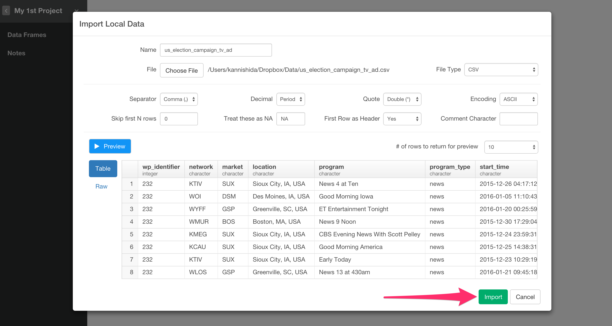
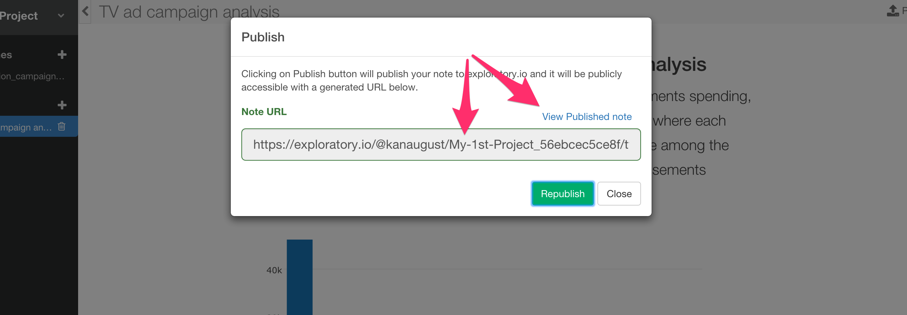

# Quick Start Guide

## Download Flight Delay sample data

We're going to use the following file for this tutorial. You can download it from [here](http://download.exploratory.io/data/airline_delay_2016_01.csv).

- [Flight delay 2016 January data](http://download.exploratory.io/data/airline_delay_2016_01.csv)

## Create a new project

Once you start Exploratory app, create a new project to start.

Type a project name and click 'Create' button.

## Import sample data

Inside the project, you can click a plus '+' button next to 'Data Frame' text in the left side pane to import 'airline_delay_part1.csv'.

Select 'Import Local Data'.

After you select the file from the file picker dialog and hit OK, you'll see the first 10 rows of the data you're importing.

Since the data is showing up ok, you can keep the parameters as default and click 'Import' button.

## Summary data view

Once the data is imported you can see a brief summary of the data in Summary view. It shows 26 columns and 445,827 rows at the top, and you can also see some of the columns' sneak peak view. For example, you can see the most frequently appeared airline carriers in CARRIER column.

## Visualize data

You can go to Chart view, and assign FL_DATE column to X-Axis and switch the aggregation level to Day.

And, you can assign 'ARR_DELAY' column to Y-Axis and switch the aggregation function to Average instead of Sum.

You can also switch the chart type to Boxplot or others to explore data visually.

## Remove NA values

Going back to Summary view and scrolling down the page you will notice that ARR_DELAY column has NA values.

You can remove NAs by selecting 'Remove NA' from the column dropdown menu.

This would produce one of the dplyr commands 'filter'. 'is.na' function inside the 'filter' command evaluates if a given value is NA or not. '!' (exclamation) mark reverses the effect of the function after. Combining all of them together, it will keep only the rows whose 'ARR_DELAY' column values are not NA. (If you are not R user, this could be your first R command, congrats!)

You can update the command or simply click Run button as is.

Once you run it, you see NA values from ARR_DELAY column are gone.

## Extract Weekday information from Date data

There is 'FL_DATE' column that is date data type.

You can extract week day information out of this column so that you can compare between the week days.

Click the dropdown menu from FL_DATE column header area, select 'Extract' and 'Day of week' from the sub-menu.

Once you click 'Run' button you will see that a new column is create at the end and it has week days.

You can always see Syntax Help by having the cursor inside the function if you are interested in.

## Visualize data

You can quickly visualize the data again by going back to Chart view.

Assign the new column 'FL_DATE_wday' to X-Axis and 'ARR_DELAY' to Y-Axis, and switch the aggregation function to 'Average.'

The default is showing each of the week day in the week day order. You can also sort based on the Y-Axis values by clicking on 'Sort' check box.

You can switch the chart type to Heatmap and assign 'CARRIER' to Y-Axis, 'ARR_DELAY' to Color, and switch the aggregation function to 'Average'

## Share Chart

Now, you can share the chart quickly. Click on 'Share' button.

Type for Title and click 'Share' button.

Once it's published, click 'View Shared Chart'

You can see your chart is shared at exploratory.io.

You can also click on Data tab and see how the data was prepared.

