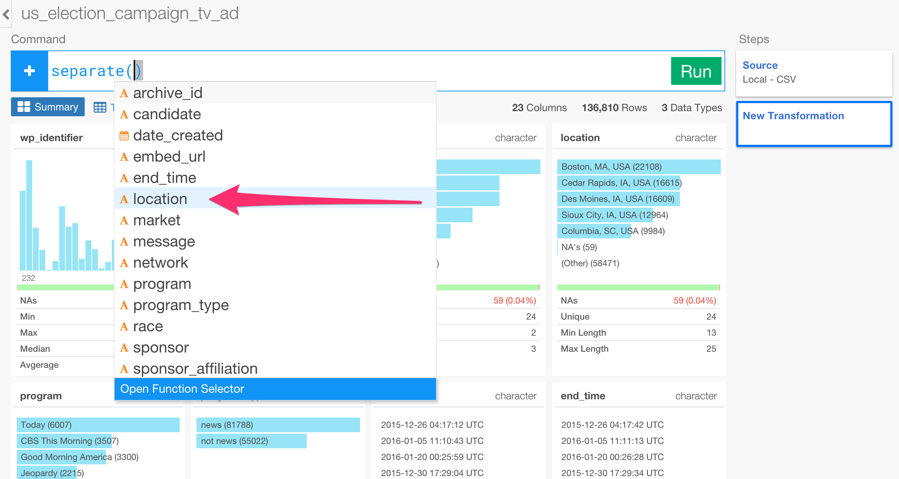
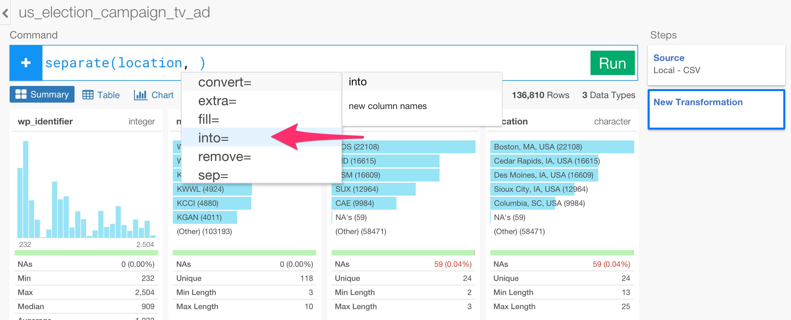
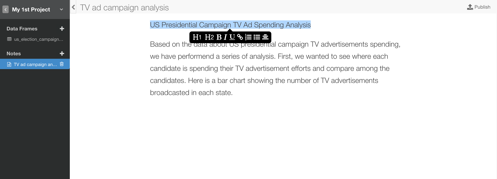
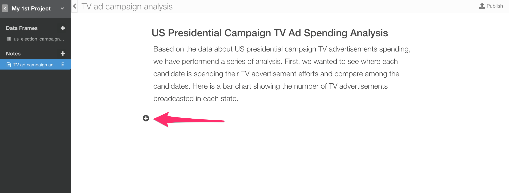
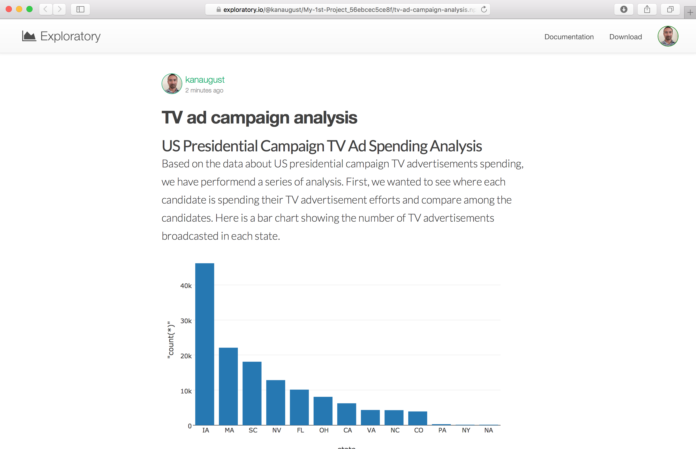

# Quick Start guide

## Create a project

First, create a new project by clicking on 'Create Project' button.


Type a project name and click 'Create' button.


## Import data - CSV

Next, let's import a data. You can download a sample data 'US Presidential Election Campaign TV Advertisement Spending' from [here](https://www.dropbox.com/s/7fwtbqd9lejkhyv/us_election_campaign_tv_ad.csv?dl=0).

Import the sample CSV file.

Click '+' icon next to 'Data Frame'.


Select 'Import Local Data'.


Find the downloaded sample data file and click 'Open' button.


The data is showing up in the preview table correctly. Click 'Import' button.


The data is imported into Exploratory. You can see it in Summary view. Each column is showing horizontal bar chart or histogram depending on the data type along with some useful metrics.


You can go to Table view by clicking on 'Table' button to see the raw data.


You can also go to Chart view by clicking on 'Chart' button to visualize the data.


Assign 'sponsor_affiliation' column to X-Axis.


You can see Bernie Sanders and Hillary Clinton are the top 2 TV Ad sponsor affiliated candidates.

## Transform

Go back to Summary view.

There is a column called 'location', which includes City, State, and Country information.


You can separate this column into three columns of 'city', 'state', and 'country' by using 'separate()' command.

Select 'Separate' from '+' button menu.


Select 'location' column name from the 'suggested' list.



Type ',' (comma) and ' ' (space), you'll be suggested a list of arguments (parameters) for 'separate' command. Select 'into' argument.



Select 'c' function fro the suggested list.


Type the new column names for City, State, and Country using double quotes.

```
"city", "state", "country"
```


Type ',' (comma) and select 'sep' argument from the suggested list.


Type ',' (comma) wrapped around with double quotes like below.

```
","
```

The final command looks like below.

```
separate(location, into=c("city", "state", "country"),sep=",")
```


Hit 'Run' button.


Now you can see three new columns being created.


## Visualize

Go to Chart view and assign the new column 'state' to X-Axis.


You can see Iowa (IA) has the most TV advertisements and has almost twice as much as the second (MA).

## Create a Note

Click '+' icon next to 'Notes'.


Type a name for the note.


Start writing your notes. You can format the text by selecting the sentence or words.



Every time you click on a new line you will see '+' button showing up at the left side.



You can click on it and click 'Chart' icon.


Select a chart you want to include in your note, and click 'OK' button.


You can see the chart being added to the note.


Once you are ready, you can publish your note to share by clicking on 'Publish' button.


Click 'Publish' button inside the dialog.


You can either copy and paste the URL or simply click 'View Published note' to open a web browser to see the published note.


Now you will see your published note in a web browser.


