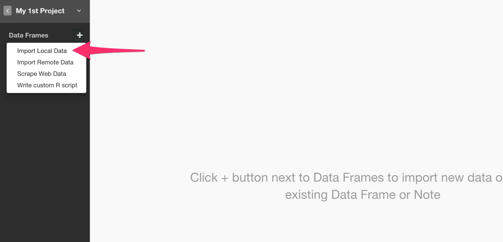
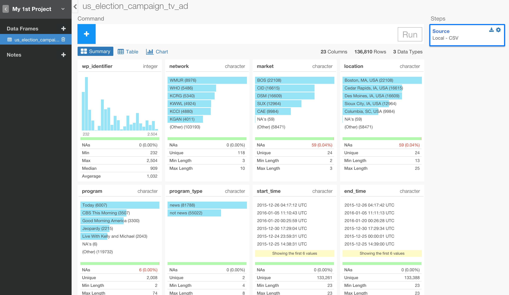
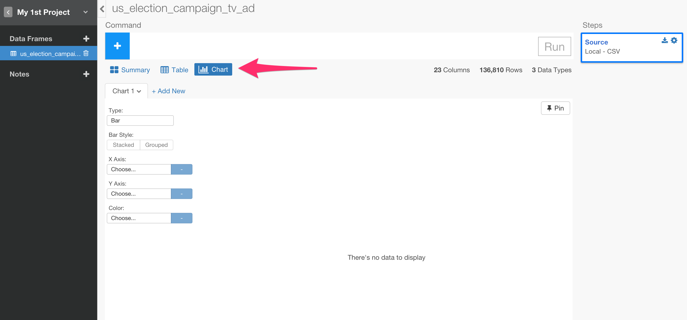
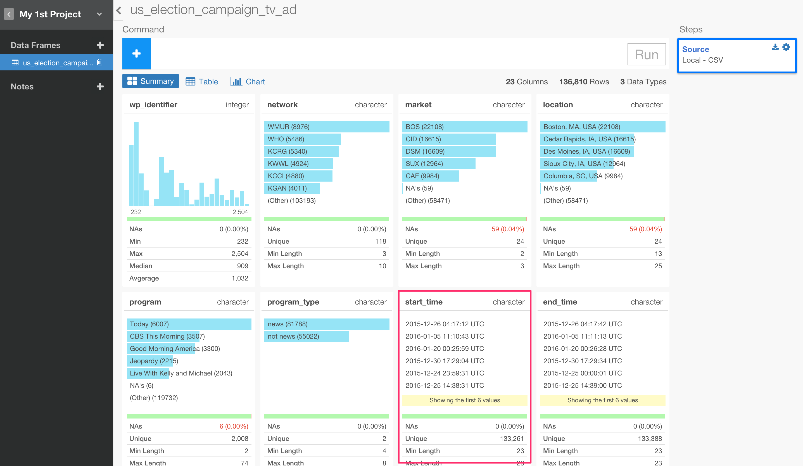
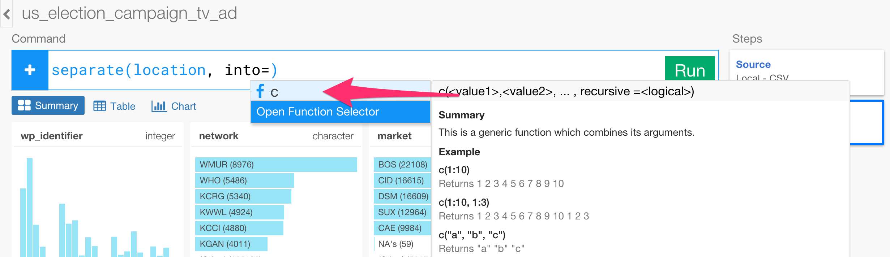
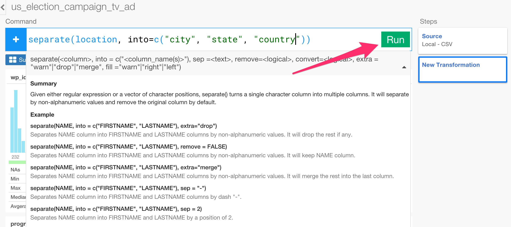
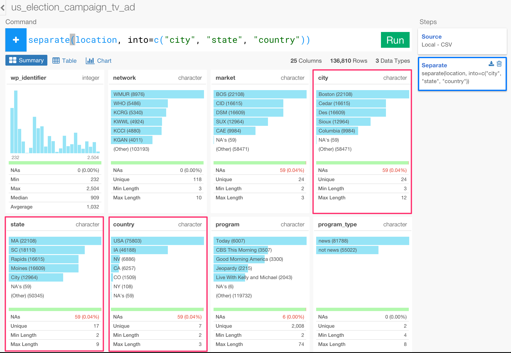
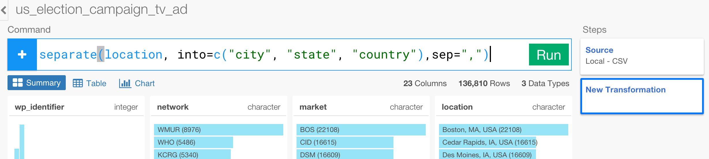
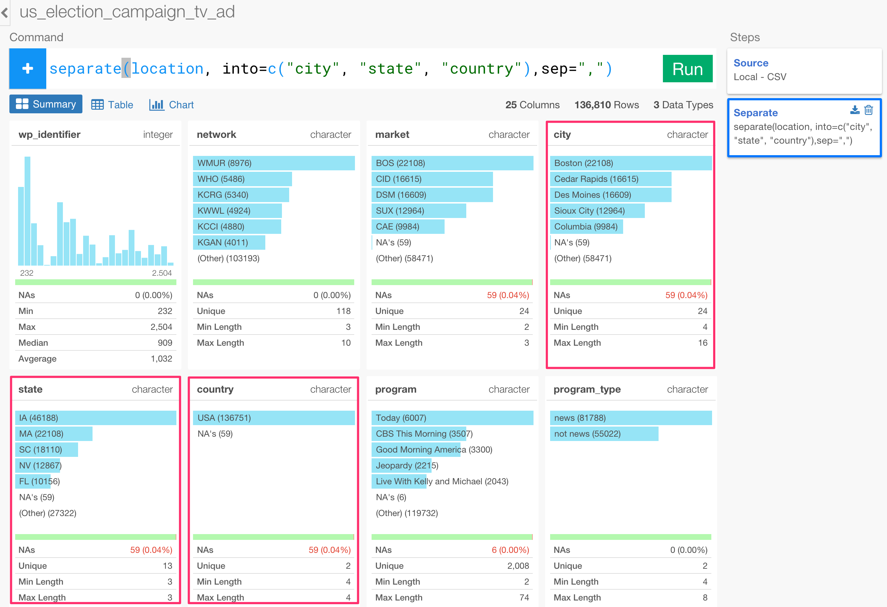

# Quick Start Guide

## Download Flight Delay sample data

We're going to use the following file for this tutorial. You can download it from [here](http://download.exploratory.io/data/airline_delay_2016_01.csv).

- [Flight delay 2016 January data](http://download.exploratory.io/data/airline_delay_2016_01.csv)

## Create a new project

Once you start Exploratory app, create a new project to start.

Type a project name and click 'Create' button.

## Import sample data

Inside the project, you can click a plus '+' button next to 'Data Frame' text in the left side pane to import 'airline_delay_part1.csv'.

Select 'Import Local Data'.

After you select the file from the file picker dialog and hit OK, you'll see the first 10 rows of the data you're importing.

Since the data is showing up ok, you can keep the parameters as default and click 'Import' button.

## Summary data view

Once the data is imported you can see a brief summary of the data in Summary view. It shows 26 columns and 445,827 rows at the top, and you can also see some of the columns' sneak peak view. For example, you can see the most frequently appeared airline carriers in CARRIER column.

## Remove NA values

When you scroll down you can see ARR_DELAY column having NA values and its data range quickly.

You can remove NAs by selecting 'Remove NA' from the column dropdown menu.

What you see in the command input box is one of the Data Wrangling Grammar - dplyr - based R commands, that is automatically generated. (This could be your first R command if you are not R user, congrats!)

You can update the command or simply click Run button as is.

Once you run it, you see NA values from ARR_DELAY column are gone.

## Extract Weekday information from Date data

There is 'FL_DATE' column that is date data type.

You can extract week day information out of this column so that you can compare between the week days.

Click the dropdown menu from FL_DATE column header area, select 'Extract' and 'Day of week' from the sub-menu.

Once you click 'Run' button you will see that a new column is create at the end and it has week days.

You can always see Syntax Help by having the cursor inside the function if you are interested in.

## Visualize data

You can quickly visualize the data by going to Chart view by clicking Chart menu.

You can assign the new column 'FL_DATE_wday' to X-Axis.

The default is showing each of the week day in the week day order. You can also sort based on the Y-Axis values by clicking on 'Sort' check box.

Additionally you can assign CARRIER column to Color.

## Create a Note and Publish

Click '+' icon next to 'Notes'.

Type a name for the note.

Start writing your notes. You can format the text by selecting the sentence or words.

Every time you click on a new line you will see '+' button showing up at the left side.

You can click on it and click 'Chart' icon.

Select a chart you want to include in your note, and click 'OK' button.

You can see the chart being added to the note.

Once you are ready, you can publish your note to share by clicking on 'Publish' button.

Click 'Publish' button inside the dialog.

You can either copy and paste the URL or simply click 'View Published note' to open a web browser to see the published note.

Now you will see your published note in a web browser.

