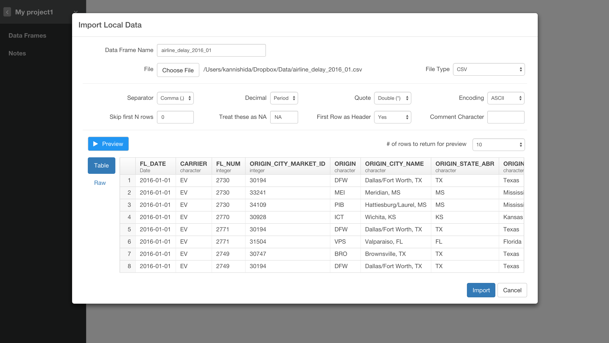
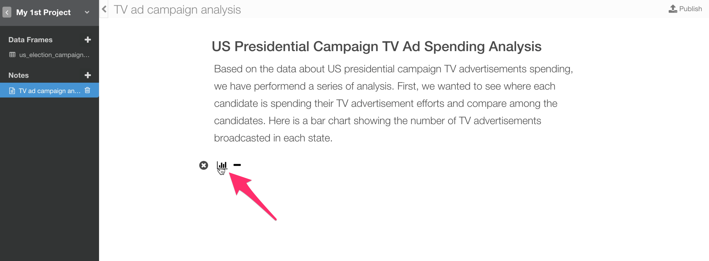
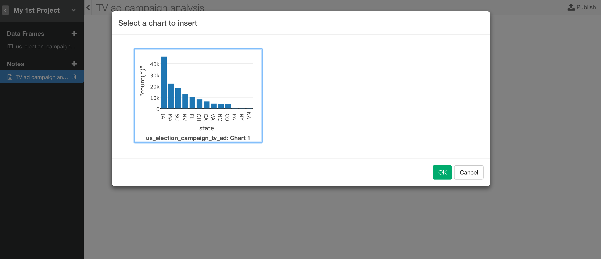
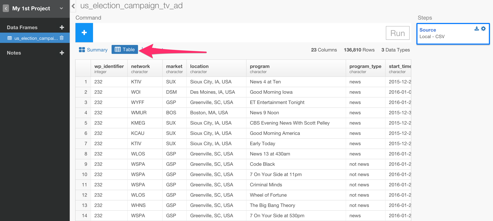
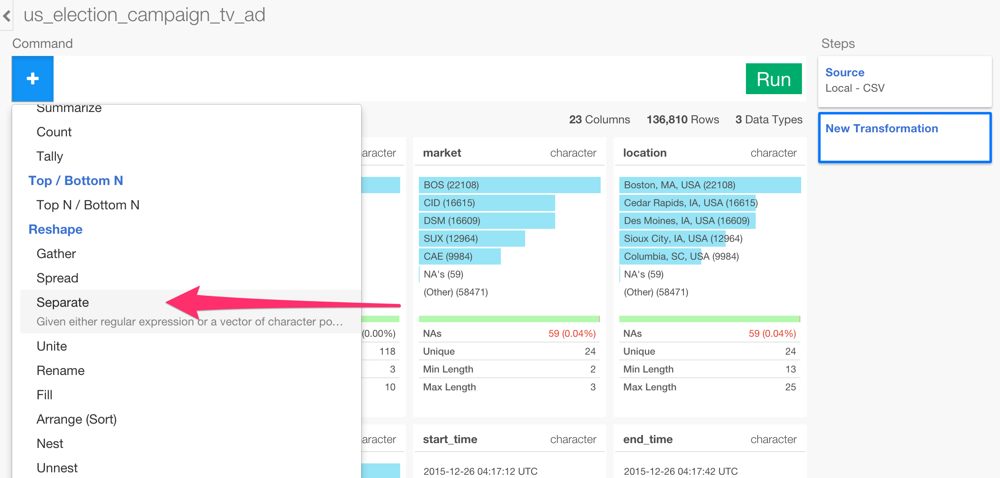

# Quick Start Guide

## Download Flight Delay sample data

We're going to use the following file for this tutorial. You can download it from the link below.

- [Flight delay 2016 January data](http://download.exploratory.io/data/airline_delay_2016_01.csv)

## Create a new project

Once you start Exploratory app, create a new project to start.

Type a project name and click 'Create' button.

## Import sample data

Inside the project, you can click a plus '+' button next to 'Data Frame' text in the left side pane to import 'airline_delay_2016_01.csv'.

Select 'Import Local Data'.

After you select the file from the file picker dialog and hit OK, you'll see the first 50 rows of the data you're importing.

Since the data is showing up ok, you can keep the parameters as default and click 'Save' button.

## Summary data view

Once the data is imported you can see a summary information of the data in Summary view. For example, you can see the most frequently appeared airline carriers in CARRIER column.

## Visualize data

You can go to Chart view, and assign FL_DATE column to X-Axis and switch the aggregation level to Day.

Now, you can assign 'ARR_DELAY' column to Y-Axis and switch the aggregation function to Average instead of Sum.

You can also switch the chart type to Boxplot or others to explore data visually.

## Remove NA values

Going back to Summary view and scrolling down the page you will notice that ARR_DELAY column has NA values.

You can remove NAs by selecting 'Remove NA' from the column dropdown menu.

You will notice that there is a pop-up dialog right underneath 'filter' token. This 'filter' is one of the data wrangling grammar operations (or command). Inside this dialog, 'ARR_DELAY' is selected for Columns and 'is not NA' is selected for Operator. You can simply click 'Run' button to submit the operation. This will keep only the rows whose 'ARR_DELAY' column values are not NA. (If you are not R user, this could be your first R command, congrats!)

Now, you would see NA values from ARR_DELAY column are gone.

## Extract Weekday information from Date data

There is 'FL_DATE' column that is date data type.

You can extract week day information out of these date values so that you can compare among the week days.

Click the dropdown menu from FL_DATE column header area, select 'Extract' and 'Day of week' from the sub-menu.

Type FL_DATE_wday in New Column Name.

Once you click 'Run' button you will see that a new column is create at the end and it has the day of week values.

You can always see the function document by clicking 'Show Doc' link. Make sure your mouse cursor is inside the function you want to know more about.

## Visualize data

You can quickly visualize the data again by going back to Viz view.

Assign the newly created column 'FL_DATE_wday' to X-Axis and 'ARR_DELAY' to Y-Axis, and switch the aggregation function to 'Average.'

It is showing the days of the week in an appropriate order starting from Sunday as default. You can also sort based on the Y-Axis values by selecting Y-Axis in 'Sort' dropdown.

There are many chart types, we would encourage you try them out by yourself. For example, you can try out Heatmap chart, and assign 'FL_DATE_wday' to X-Axis, 'CARRIER' to Y-Axis, 'ARR_DELAY' to Color, and switch the aggregation function to 'Average' for 'ARR_DELAY'.

## Share Chart

Once you find an interesting insight you might want to share it with others. Or, you might want to collaborate with others to transform analyze the data better. This is when you want to share your Chart or Data. You can simply click 'Share' button.

Type for Title and click 'Share' button.

Once it's published, click 'View Shared Chart'

You can see your chart at exploratory.io.

You can also click on Data tab and see how the data was prepared.

Now, your co-workers or friends can download this chart and data in a format of EDF (Exploratory Data Format). You can try it for yourself. Once it's downloaded then you can import from ''

