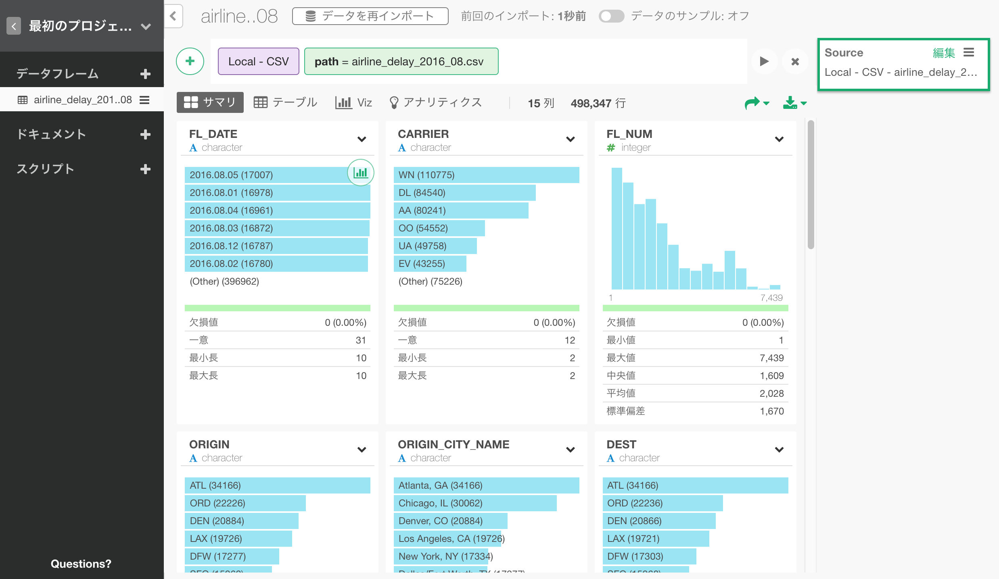
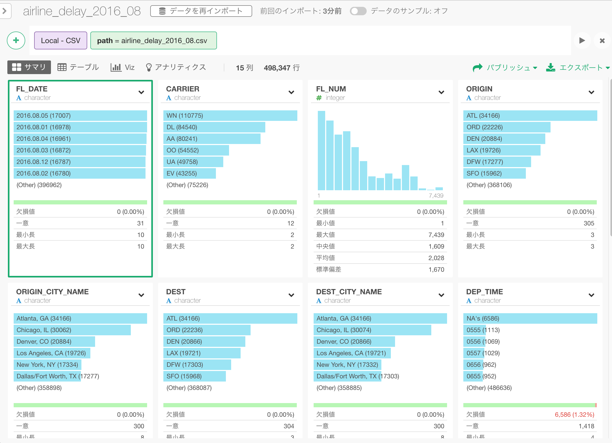
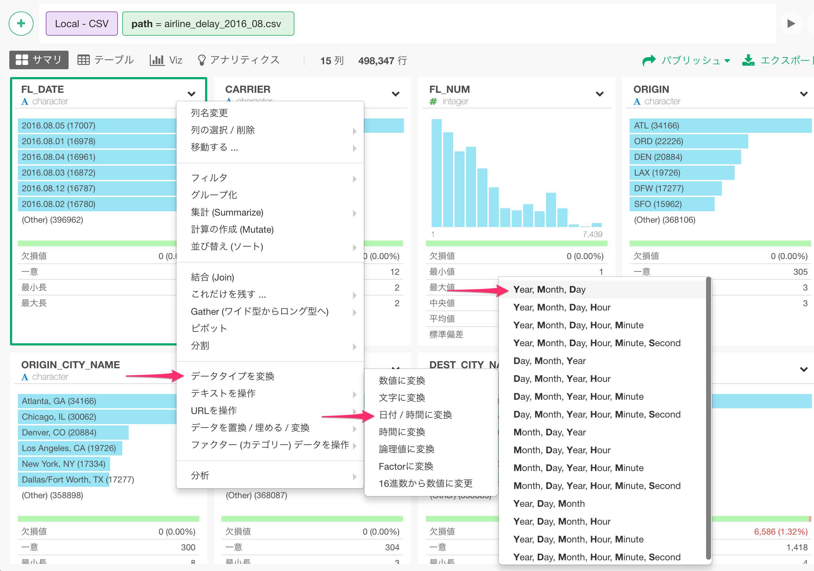
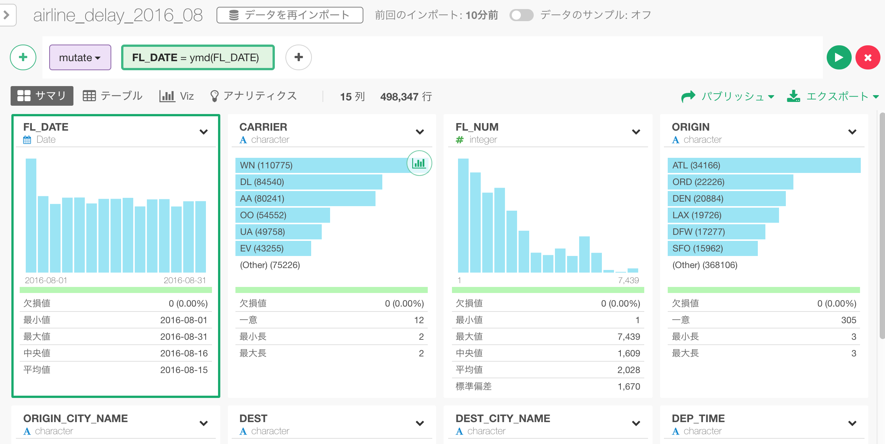
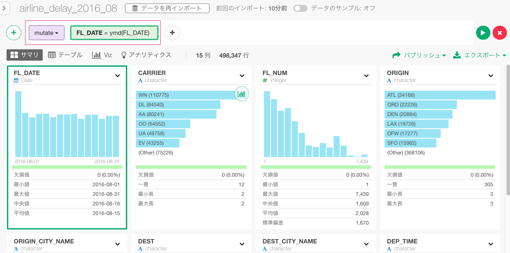
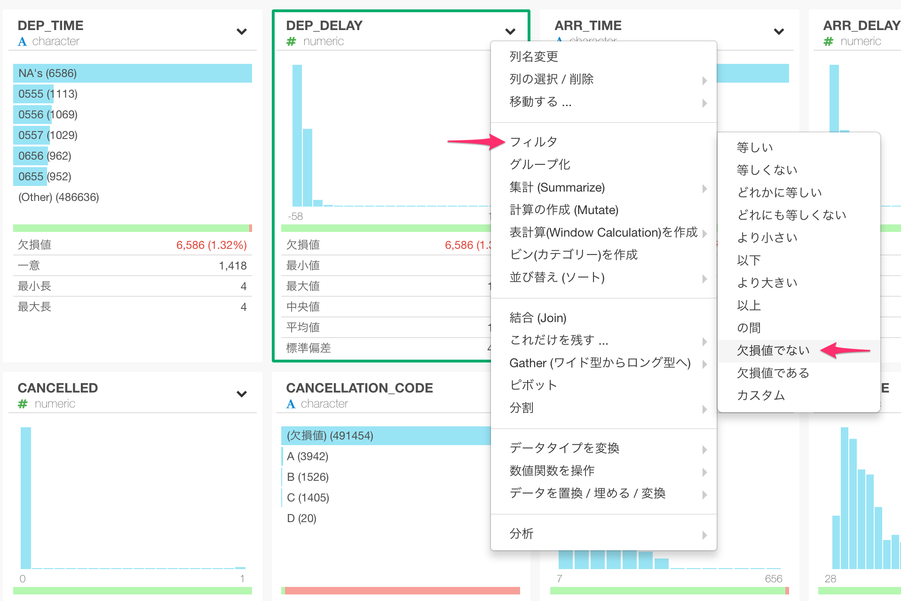

# スタートガイド

所要時間(初めから終わりまで) : 約60分

こちらの米国の航空機の発着遅延データを探索的に分析を行っていくというシナリオに沿ってExploratory デスクトップの使い方を効率よく学べるかと思います。このチュートリアルでは主に以下の機能に触れます。

* 新しいプロジェクトを作成してデータをインポートする
* サマリ(要約)ビューでデータを検査する
* データの加工（データ・トランスフォーメーション）
  * 文字データの解析と**日付への変換**
  * 日付から**曜日の情報を抽出**する
  * 複数の列に**列を分ける**
  * **欠損値**を扱う
  * 他のデータセットとの**結合**
* データの可視化
  * **ジオコードを使用した**地図
  * **パーセント合計**を使用したピボットテーブル
  * **表計算**(Window Calculation)を使用したラインチャート
  * **グループ毎のトップ100**を使用した箱ひげ図
  * **トレンドライン**を使った散布図 (線形回帰モデルと一般化加法モデル)
  * **k平均クラスタリング**
* データ操作と分析を翌月のデータで**再現する**
* **再現可能な**方法でチャートをシェアする
* インサイトをシェアするために**ノート**を作成する

ステップを進んでいる間にご質問がある場合は、チャットウィンドウからお気軽にお問い合わせください。


または、support@exploratory.ioまでe-mailを送ってください。

## 航空機の離発着遅延サンプルデータのダウンロード

このチュートリアルでは、2016年8月に飛行した米国国内線すべての離発着遅延データを使用し以下の項目を確認します：

* 出発/到着遅延時間の遅れや早さ。
* どこから出発してどこに到着したのか。
* それぞれのフライトでどのくらいの距離を飛んでいたか。

サンプルデータのCSVファイルは、下のリンクからダウンロードできます。

- [Flight delay 2016 August data](http://download2.exploratory.io/data/airline_delay_2016_08.csv)

それでは、さっそく始めましょう!

## 新しいプロジェクトを作成する

Exploratory デスクトップを起動し、まず新しいプロジェクトを作成します。


プロジェクト名を入力し、「作成」ボタンをクリックします。


##　データをインポートする

プロジェクト内で、左側のペインの 「データフレーム」テキストの隣にある 「+」（プラス）ボタンをクリックし、ドロップダウンリストから 「ファイルデータをインポート」を選択します。


ファイル 「airline_delay_2016_08」を選択すると、プレビューテーブルに表示されるファイルの最初の50行が表示されます。


この演習ではすべてのパラメータをそのままにして、「保存」ボタンをクリックするだけです。

インポートされたフライトデータは、以下のようなテーブルビューで表示されます。



上部の「サイドバーを隠す」ボタンをクリックすると、左側のセクションが非表示になり、データビュー領域が広くなります。


##　サマリ・ビューでデータを検査する

「サマリ」タブをクリックすると、サマリ(要約)ビューでデータの要約情報をすばやく確認できます。たとえば、CARRIER列には12のユニークな航空会社があり、そのうち7つが最高頻出から最低頻出のバーチャートとしてリストされています。


##　データの変換（データ・ラングリング）

このデータの変換のセクションでは、以下のよく行われるデータ変換タスクについて説明します。

* 文字データを解析し、日付に変換する
* 日付からの曜日情報の抽出
* 列を複数の列に分ける
* NA（欠損値）を削除する
* 空港のロケーションデータセットに結合する

###　文字データを解析して日付に変換する

以下に示すように、FL_DATEカラムには日付データが含まれているようですが、文字データ型として登録されています。



Exploratoryは、通常インポート時の元のデータに基づいてヒューリスティック(発見的)な推測で各列のデータ型を適切に割り当てます。しかし、元のデータがフォーマットされているために意図した通りに動作しないことがあります。その場合は、インポート後にデータを簡単かつ柔軟に変換することができます。この場合、列ヘッダーメニューから「データタイプの変更」->「日付/時刻に変換」->「年、月、日」を選択することができます。



元のデータが特定の順序でフォーマットされていたため、「年、月、日」を選択すればよかったのです。 （例えば、2016年8月5日）ここで重要なのは、日付コンポーネントの順序だけです。言い換えれば、分割された文字または月名がフルネーム（August）であっても、対短縮名（Aug）であっても問題になりません。とても簡単です！

ともあれ、次の関数が既に設定された状態で、「Mutate（計算を作成)」ダイアログが開きます。
```
ymd(FL_DATE)
```


この `ymd`関数は、 `lubridate`と呼ばれるRパッケージの日付/時刻解析関数の1つで、データが年、月、日の順に表示されるという前提で解析し、日付データ型に適切に変換します。

「日付」は、年、月、日などの日付情報のみを含む日付データのデータ型です。では時間、分、秒などの時間はどうでしょうか？これには`POSIXct`と呼ばれる別のデータ型があります。これは、日付と時刻の両方の情報を保持できます。

この機能の詳細は、「文章表示（または非表示）」ボタンをクリックすると表示されます。


また、「関数一覧」ボタンをクリックすると、すぐに利用可能なR関数がすべて表示されます。

ともあれ、「実行」ボタンをクリックしてコマンドを実行することができます。

「FL_DATE」列がDateに変換されて表示されるようになりました



これは、データがタイムラインに沿ってどのように分布しているかを視覚化するヒストグラムを表示しています。また、期間は2016-08-01から2016-08-31までであることがわかります。

また、上部に2つの色のついた箱（紫色と緑色）があることに気づくと思います。



紫色の箱は、どのコマンドが使用されたかを示します。この場合、 ``` mutate```です。 `` mutate``コマンドはExcelの式に相当し、新しい計算を作成して実行します。 `select`、 `summarize`、 `filter`などのコマンドは後で触れるので、ご心配なく。

今、緑色のボックスには、以下が表示されています。

```
FL_DATE = ymd(FL_DATE)
```

等号 '='の左辺は列名で、右辺は以前に見た ```ymd()```関数を使った計算です。

したがって、 mutateコマンドは緑色の箱で定義された計算を実行します。この場合、 ``` ymd(FL_DATE)```であり、その結果を 「FL_DATE」という列名に格納します。元の列名であるため、既存の列の値が上書きされます。

最後に、右側に「Mutate」という新しいステップが追加されていることに気付くでしょう。


これはExploratoryデスクトップが背後で実際に実行しているRコマンドそのものです。より多くのデータ操作を実行すると、ここに「ステップ」が追加されていきます。

###　日付から「曜日名」を抽出する

同じ「Mutate」のステップでもう一度操作をしましょう。

FL_DATE列がDateデータ型であるため、 「曜日名」のような日付コンポーネント情報を抽出できます。列ヘッダメニューから「抽出」 ->「曜日」を選択することができます。


開かれた「Mutate」ダイアログで、今回は「新しく列を作成」タブが選択されていることに注目してください


これは、前回のように元の列を上書きするのではなく、 ```wday(FL_DATE、label = TRUE)```という計算で新しい列を作成することを意味します。

新しい列名として「day_of_week」と入力し、「実行」ボタンを押します。


下にスクロールすると、作成されている新しい列 「day_of_week」が表示されます。


ここでは、バーは最も頻度の高い値、この場合「Mon」から開始するのではなく、「Sun」、「Mon」、「Tue」などで始まっています。これは、この列が factorデータ型列として作成されるためです。これは、列内に「並べ替え順」情報を埋め込むことで、カテゴリ変数（列）を扱いやすくするための特殊なデータ型です。これは実際には、曜日のような「順序」に意味のあるデータには完璧です。しかし、そのような順序を無視したい場合は、factorデータ型列を 文字データ型列に変換する列ヘッダーメニューから 「データタイプの変換」 - > 「文字に変換」を選択するだけです。


この演習では、そのままにしておきます。

##　列を複数の列に分ける

列を複数の列に分割する方法を見てみましょう。

ORIGIN_CITY_NAME列には、米国の都市名と州名が含まれています。


米国のどの州から最も飛行機が離陸したのかを見たいとしましょう。この列のテキストの中から州のみを抽出したいとします。

区切り文字（この場合はカンマ）を設定することで、この列を2つの列に分けることができます。1つは都市名、もう1つは州名です。この操作を見やすくするために、最初にテーブルビューに移動してみましょう。

次に、ORIGIN_CITY_NAME列を選択し、列見出しメニューから「分割」 ->「...で列に分割」 -> 「コンマ(,)」を選択します。


開いている「分割」ダイアログで、作成する新しい列の列名を入力します。この場合、「都市」と「州」です。


コマンドが実行されると、2つの新しい列が作成されます。1つは都市名、もう1つは州名です。


そして新しいステップが右側に追加されます。

Mutateステップをクリックして、この「分割」の操作を行う前のデータを表示することができます。


### 欠損値を扱う

サマリビューでDEP_DELAY列を見ると、緑色のバーにわずかな赤色が表示されていることがわかります。


この赤いバーは、この列の欠損値であるデータの比率を示します。データの1.32％が欠損値であることがわかります。 欠損値を扱う方法はたくさんありますが、ここでは フィルタコマンド操作でそれらを削除してみましょう。

列見出しメニューから「フィルタ」 -> 「欠損値でない」を選択します。



これにより、「欠損値でない」演算子が既に選択されている フィルタダイアログが開きます。


興味のある場合は、演算子のドロップダウンをクリックすると、そのデータ型でサポートされる他の多くの演算子が表示されます。 Rに精通しており、それをさらにカスタマイズしたい場合は、いつでも「カスタム」タブに移動して、好きなようにフィルタ条件を入力することができます。


ここで「実行」ボタンをクリックすると、欠損値が除外されたことがわかります。


### 空港の所在地データセットとの結合

これらの空港がある場所を地図上に視覚化したいとします。データに空港コードが含まれていますが、空港に関連付けられている地理的位置コード（経度と緯度）はありません。そこで、私たちができるのは、まず、空港コードと地理的位置コードをマッピングするマッピングテーブルを見つけることです。

このようなマッピングテーブルはWeb上で簡単に見つけることができますが、ここではEDF（Exploratory Data Format）ファイルとして公開しているため、再現性のある方法でExploratoryにインポートできます。

* [Mapping Table for Airport Codes and Geo Location Codes](https://exploratory.io/data/kanaugust/0814311708280782)

Exploratoryにダウンロードしてインポートすると、このマッピングテーブルのデータを使用して、「airline_delay_2016-08」データフレーム内の各空港コードのジオロケーションコードを割り当てることができます。基本的には、Excelでの「vlookup」や、SQLや一般的なBIツールでの「結合」操作の場合と似ています。

Exploratoryでは、`left_join`という結合コマンドの1つを使用できます。これは、両方のデータフレームのキーカラム値を一致させることによって、ターゲットデータフレームからカラムを追加して2つのデータフレームを結合します。それは以下のようになります。


では、上記のリンク先のページに移動し、EDFファイルをダウンロードしてみましょう。


次に、EDFファイルをExploratoryにインポートします。 「データフレームを追加」ドロップダウンリストから「ファイルデータをインポート」を選択します。


そして、「Exploratory (.edf)」を選択します。


インポート後のデータは次のようになります。


右側にいくつかのステップがあることに注目してください。これは、この 「us-air-port-code」データフレームを準備するために使用されたステップです。必要に応じてステップを追加したり、これらのステップを削除したりすることができますが、この演習ではこれをそのまま使用します。

また、Codeという列が表示されます。これは、「airline_delay_2016-08」データフレームとの結合に使用するキー列です。


さて、「airline_delay_2016_08」データフレームに戻ります。


ORIGINという列があります。この列には、飛行機が出発した空港の空港コードがあります。そして、これは、「us-air-port-code」データフレームでマップするために使用する列です。

ORIGINのカラムメニューから「結合」を選択します。


「結合」ダイアログで、「ターゲットデータフレーム」のデータフレーム「us-air-port-code」を選択し、「ORIGIN」列を「現在の列」に、「Code」を「ターゲット列」をキー列として選択します。


コマンドが実行されると、ターゲットデータフレーム 「us-air-port-code」の新しい列が最後に追加されます。


このチュートリアルでは、`left_join`のみを使用しましたが、他のタイプの結合もあります。興味のある方は、これら2つの記事をご覧ください。

* [Introduction to Join — Bring extra columns from the target in Exploratory (英語)](https://blog.exploratory.io/introduction-to-join-bring-extra-columns-from-the-target-in-exploratory-1ec585ec2cf1#.u003r2k1m)
* [Introduction to Join — filtering data based on the target data in Exploratory (英語)](https://blog.exploratory.io/introduction-to-join-filtering-data-based-on-the-target-data-in-exploratory-eedbd7b39d0a#.fudvfqpdm)

ともあれ、十分なデータが得られました。この米国の飛行遅延データをよりよく理解するために、可視化してデータを探索してみましょう。

## データの可視化

Exploratoryでは、さまざまな種類のチャートを使用してデータを視覚化する方法がたくさんあります。この演習では、次のグラフタイプを使用してデータを探索します。

* **地図** - フライトがどこから出発するのかを理解する。
* **ピボットテーブル** - どの州と日にちの組み合わせの便が他の組み合わせより多いかを理解する。
* **折れ線グラフ** - 8月の出発遅延時間の傾向を理解する。
* **箱ひげ図** - 各航空会社による便の遅延の程度をを理解する。
* **散布図** - 到着遅延と出発遅延時間の間の相関を理解する

### ジオコードを使用した地図（経度と緯度）

まず、これらの飛行機がどこから出発したかを見てみましょう。

Vizビューに移動し、「地図 - 経度 / 緯度」チャートタイプを選択します。


これにより、自動的に「経度」と「緯度」の列が表示され、マップ上のすべての空港の位置が表示されます。


ラベルに「名前」列を割り当てることができます。これにより、マウスを任意の円上に置いたときに、この列の値がグラフの右端上方に表示されます。


マウス、トラックパッド、またはマップの左側の上部にあるボタンを使用して、ズームインまたはパンすることができます。

レイアウト設定メニューから背景スタイルを変更することができます。


たとえば、「黒」タイプを選択すると、黒色のテーマを取得できます。


「カラー」の横にある「歯車」アイコンをクリックすると、カラーパレットを変更できます。


### ピボットテーブル

ピボットテーブルを使用して、どの州と曜日のペアの便が他のものより多いかを理解しましょう。

ピボットテーブルを選択し、行に 「state」列を、列に 「day_of_week」列を割り当てます。 Valueをデフォルト値にしておきます。これは、各グループの行数をカウントします。


列の値は、曜日の自然順序を尊重して、「Sun」、「Mon」、「Tue」などのようにソートされています。これは、以前に見たように 「day_of_week」列はfactorデータ型で、ソート順情報が埋め込まれているため、ピボットテーブルなどのグラフはデータのソート時にソート順情報を尊重するためです。


色を使用してデータを視覚化することができます。ドロップダウンから「すべて」を選択します。


生の数字の代わりに、 「合計の割合」として値を表示することができます。 「値」の横にある「歯車」アイコンをクリックし、計算タイプのドロップダウンから「合計の割合」を選択します。


デフォルト設定では、 「合計の割合」がピボットテーブルのすべての値のパーセンテージとして計算されます。しかし、各州または各曜日の割合を見たいかもしれません。たとえば、「方向」の設定を「行」に変更すると、どの曜日に他の曜日よりも多くの便があるか見やすくなります。


ほとんどの州では、月曜日から水曜日までに便が集中しています。土曜日はほとんどの州にとって割合が最低です。

この列の値に基づいてデータをソートするには、「Sat」列をクリックします。 VI（米領バージン諸島）は、他の州と違って、土曜日に他の日よりも多くの便を運航していることが判明しました。これはおそらく、より多くの人々がビジネスよりも休暇のためにそこに行くからです。


### 折れ線グラフ / 時系列

2016年8月の期間の飛行出発遅延時間の傾向を見てみましょう。

「線」グラフを選択し、「FL_DATE」列をX軸に割り当てます。'FL_DATE'列は日付データ型なので、データの集計に日付レベル（年、月、日など）を選択できます。たとえば、デフォルトの「年」の代わりに、データを「日」に設定してデータを集計することができます。


ここで、Y軸に DEP_DELAY列を割り当てて、飛行出発遅延時間の傾向を確認します。デフォルトのデータ集計関数は 「合計」に設定されていますが、これを '平均'のように変更することができます。


色に「CARRIER」列を割り当てて、各航空会社の傾向を確認することができます。


凡例の任意の値をクリックすると、グラフ内の線を表示または非表示にすることができます。


グラフ領域の任意の部分をダブルクリックすると、現在有効な値を最も効果的に表示するためにグラフのスケールが再調整されます。


ドラッグアンドドロップジェスチャを使用して、ズームインする領域を選択することもできます。


チャート上の任意の部分をダブルクリックすると、元のズームレベルに戻ることができます。

次に、チャートに組み込まれている、累積合計（またはランニングトータル)と呼ばれる表計算(Window Calculation)タイプの1つを使用して、出発時間遅延が各航空会社によって累積される様子を見てみましょう。

プロパティアイコンをクリックし、リストから表計算(Window Calculation)を選択します。


リストから「累積」と「合計」を選択します。


デルタ航空（DL）が出発遅延時間を大量に蓄積していることがわかります。その特定の週には何かが起こったに違いないと思われます。 2016年8月8日にデルタのグローバルコンピュータシステムの停止があり、大規模なキャンセルが発生し、通常のスケジュールに戻るまでに数日かかったことが判明しました。 [News from CNN.(英語)](http://money.cnn.com/2016/08/08/news/companies/delta-system-outage-flights/)


遅延が通常の傾向として観測される他の航空会社とは異なり、ハワイアン（HA）やアラスカ（AS）のような一部の航空会社は一貫して非常に低い出発遅延時間であることがわかります。稀に遅れることがあってもそれはこれの航空会社にとっては例外的な出来事です。

## 箱ひげ図

出発の遅延時間についてもう少し詳しく調べてみましょう。チャートタイプを箱ひげ図に変更すると、各航空会社の出発遅延時間のデータ分布がそれぞれの日に対して表示されます。


マウスをドラッグして8月7日から14日の時間範囲を選択してズームインすることができます。


多くのデルタ（DL）航空便が8月8日、9日、10日に大幅に遅れていることがわかります。上記のように、これはデルタのコンピュータシステムの停止が8月8日に起こったためです。システムは同日にオンラインに戻りましたが、ほとんどのフライトをスケジュール通りに戻すには数日かかっていました。

ここで、X軸をCARRIER列に切り替えて、各航空会社の出発遅延時間のデータ分布を見ることができます。


デフォルト設定では、大部分のデータと比較して極端に高い値または低い値である異常値が取り除かれます。 「異常値を含む」チェックボックスをオンにすると、それらを戻すことができます。


さて、遅延時間に基づいた各航空会社毎のワースト100便に注目して、どれだけひどく遅れたのかを知りたいとします。

「追加」ボタンをクリックし、「これだけを残す」  -> 「上位N」を選択します。


100を入力し、「DEP_DELAY」列を選択し、「実行」ボタンをクリックします。


チャートはワースト100便を示しています。


しかし、このワースト100便は、すべての航空会社からのすべてのフライトに基づいています。このため、HA（ハワイアン）、WN（サウスウェスト）などの航空会社は見られません。

我々が見たいのは、すべての航空会社ではなく、各航空会社ごとにワースト100便でした。 `top N`コマンドを適用する前に `group_by`コマンドを使用してデータフレームをグループ化することで、実際にこれを簡単に達成できます。

`group_by`ステップを追加する前に、チャート領域の右上にある 「Pin」ボタンをクリックしましょう。


これにより、チャートは常にこの「上位N / 下位 N」ステップで生成されたデータを参照します。

ここで、右側の「上位N / 下位N」ステップの直前の「フィルタ」ステップをクリックします。


グラフにはこの「フィルタ」ステップの結果ではなく、「上位N」の結果が表示されていることに注意してください。

「追加」ボタンメニューから「グループ化」を選択します。


列リストから「CARRIER」を選択します。


これにより、チャートが自動的に更新されます。ここでは、航空会社毎にワースト100便の遅延時間の範囲を示しています。


現在右側で選択されているステップはまだ「グループ化」ですが、チャートに表示されるデータは「上位N / 下位N」ステップを適用した結果です。これは「ピン」ボタンのおかげです！

### 散布図

ここで、出発遅延時間と到着遅延時間はどのように相関しているでしょうか？言い換えれば、出発時間に遅れたフライトはまた到着時間に遅れたのでしょうか？もしそうなら、それらの2つの遅延時間の間に相関関係はあるのでしょうか？

このような相関関係を調べるために、前に追加した「グループ化」と「上位N / 下位N」の最後の2つのステップは必要ありません。これはデータ全体を評価するためです。この分析のために、これらの2つのステップを削除する代わりに、「グループ化」ステップの前のステップから 「ブランチ」データフレームを作成することができます。このようにして、共通するデータ・ラングリングの処理を共有しつつ、2つの異なるデータ・ラングリングの経路を持つ2つのデータフレームを作成することができます。

右側の「フィルタ」ステップを選択します。


アクションメニューから「ブランチを作成」を選択します。


新しい「ブランチ」データフレーム名の名前（「correlation」など）を入力し、「作成」ボタンをクリックします。


メインデータフレーム 「airline_delay-2016-08」の下に作成された「correlation」という新しいデータフレームがあることに気づくでしょう。


また、右側のステップがグレー表示されていることがわかります。


これらは、メインデータフレーム 「airline_delay_2016-08」で管理されるステップです。この「correlation」データフレームは、メインデータフレームからこれらのステップの結果を継承します。

今度はVizビューに行き、チャートタイプとして 「散布図」を選択し、X軸に 「DEP_DELAY」、Y軸に 「ARR_DELAY」を割り当てます。


2つの数値情報の間には、ある程度の「線形」相関があるようです。

「CARRIER」列を「繰り返し」に割り当てることで、各航空会社の相関関係がどうあるかを見ることができます。


「繰り返し」プロパティを調整して、すべてのグラフをより見やすく表示できます。


たとえば、各行のチャート数を「4」に設定し、「Vizエリア内のすべてのチャートを合わせる」チェックボックスをオンにし、「チャート間でスケールを同期」をオフにして、チャート間でX軸とY軸のスケールを同期させないようにできます。

「AA」や「DL」のような航空会社の中には、「F9」や「HA」といった他の航空会社と比べてはるかに明確な「線形」相関が示されていることがわかります。 トレンドラインを表示することで、これをさらによく見ることができます。

Y軸のプロパティメニューから「トレンドライン」を選択します。


線形回帰モデルを使用してトレンドラインを計算するには 「線形回帰」を選択し、各航空会社のデータ範囲についてのみトレンドラインが描画されるように 「各グループのデータ範囲」を 「線の長さ」として選択します。


フライトを表す点は、 「AA」、「NK」などの一部の航空会社では線形トレンドライン上にうまく収まりますが、「F9」や「VX」ではそれほどではありません。

### k平均クラスタリング

お気づきかもしれませんが、ほとんどのデータは出発遅延と到着遅延の両方で原点0の周りに集められます。そして、2つのメジャー(数値情報を持つ列)の線形関係は、遅延時間の範囲によって異なる可能性があります。

したがって、到着と出発の遅延時間に基づいてフライトをグループ化することができます。 2つ以上のメジャー(数値情報を持つ列)に基づいてデータを自動的にグループ化する場合は、「K平均」と呼ばれるクラスタリングアルゴリズムの1つを使用できます。

「分析を実行する」 -> 「K平均法でクラスタリング」を選択します。


開かれたダイアログ「K平均法でクラスタリング」で、「列を選択」セクションの「DEP_DELAY」列と「ARR_DELAY」列を選択し、作成するクラスタの数として「5」を設定し、「実行」ボタンをクリックします。


テーブル・ビューに行くと、今何が起こったのかを見ることができます。右側にスクロールすると、各行（フライト）にクラスターIDを持つ「cluster」という新しい列が追加されたことがわかります。


さて、Vizビューに戻り、この 「cluster」列を色に割り当てます。


お気付きのように、クラスタリング計算はデータセット全体に対して行われました。「繰り返し」から 'CARRIER'を取り除くと、クラスタ化された5つのグループの外観を確認できます。


航空会社毎にデータをクラスタ化したいとしましょう。つまり、航空会社毎に5つのクラスタ化されたグループを作りたいということです。これは、クラスタIDを計算する前にデータフレームをグループ化することによって実行できます。これは前の「上位N」操作で行ったことと非常によく似ています。

まず、次のステップに進む前に、チャートを「ピン」していることを確認してください。

次に、「フィルタ」ステップを選択します。このステップは、メインデータフレームから派生したものであるため、灰色の色をしています。


このグループ化ステップを追加するには、「追加」ボタンメニューから「グループ化」を選択します。


そして、「CARRIER」列を選択します。


現在表示されているグラフがステップに「ピン」されているため、これは自動的に次のステップ「K平均クラスタリング」を実行します。


最後に、トレンドラインを表示することができます。今回は、タイプとして「多項式（GAM）」を、線の長さとして「各グループのデータ範囲」を選択します。


与えられた2つのメジャー(数値情報を持つ列)間の相関を表す直線を描くことができる、線形回帰モデルを構築する「線形回帰」に対し、「多項式（GAM）」は「ローカルフィッティング」または所与のデータの分割された部分に最適化して、与えられた２つのメジャー(数値情報を持つ列)間に滑らかなカーブを描くことができる一般化加法モデルを作成します。

簡単に言えば、線形回帰は直線を描く方法であり、多項式は滑らかな線/曲線を描く方法です。

上記を見ると分かるように、多項式の滑らかな曲線は、遅延時間が大きくなるにつれて直線的な線のように見える傾向があります。これは、F9、HAなどのいくつかの例外がありますが、出発時刻がどれくらい遅いかを事前に知っていれば、到着時刻がどのくらい遅くなるかを予測する方が簡単であることを意味します。

## 分析作業を再現する

今度は、9月の翌月の新しい飛行遅延データセットを受け取ったばかりで、前に行ったのと同じデータ変換と解析を実行したいとします。これを行うには2つの簡単な方法があります。

1.データフレームを複製しソースデータを入れ替える

2.データフレームから別のデータフレームへステップをコピーする

この演習では、まず、このリンクから9月のデータセットをダウンロードしてください。

* [Flight delay 2016 September data](http://download2.exploratory.io/data/airline-delay-2016-09.csv)

そして以下が手順です。

### 1. データフレームを複製しソースデータを入れ替える

これを行う最も簡単な方法は、現在のデータフレームを複製し、別の名前で保存することです。


「Vizを含む」チェックボックスをオンにして、すべてのチャートをコピーし、データフレーム名を入力します。


コピーが完了したら、新しいデータフレームに移動し、「歯車」アイコンをクリックしてデータソースを切り替えます。


「ファイルの変更」ボタンをクリックし、上記のCSVファイル 「airline_delay-2016-09.csv」を選択し、下部にある[更新]ボタンをクリックします


すべてのデータ変換ステップがこの新しいデータセットに自動的に適用されることがわかります。 Vizタブに移動すると、9月のデータと同じグラフ設定が表示されます。今月は、「F9」が他のものよりもずっと大きな出発遅延時間を積み上げた航空会社であることがわかります！


このオプションの利点は、データ・ラングリングのステップだけでなく、データフレーム内のすべてのチャートも保持できることです。このオプションの欠点は、すべてのステップとブランチを一緒にコピーすることになるため、複製後にクリーンアップする必要があることです。そして、これがあなたが次の選択肢を検討したい理由です。

### 2. データフレームから別のデータフレームへステップをコピーする

上記のCSVファイルを新しいデータフレームとしてインポートします。


元のデータフレーム「airline_delay_2016-08」に戻り、右側のステップの上部にある「選択」ボタンをクリックします。


コピーするステップを選択します。下の図では、「Mutate」ステップから「Left Join」のステップまでのみコピーしていますが、すべてのステップもコピーできます。「アクション」ボタンのドロップダウンリストから「コピーステップ」を選択します。


その後、新しいデータフレーム 「airline_delay_2016-09」に戻ります。


右側の「ソース」ステップのアクションメニューから「ペーストステップ」を選択します。


これにより、これらのコピーされたステップがこのデータフレームに追加され、すべてのデータ変換操作が適用されたデータが取得されます。


とてもシンプルですね！

## チャートをシェア

興味深い洞察を見つけたら、他の人と共有したいかもしれません。 Exploratoryを使用すると、グラフだけでなく、データ・ラングリングの手順をチャートと簡単に共有できるため、他の人が簡単に作業を再現できるようになります。

「More」ボタンの下の「Vizのシェア」を選択します。


タイトルと説明を入力します。


プライベートで共有する場合は、「プライベート」を選択します。

そして、「シェア」ボタンをクリックします。

公開されると、「新規またはユーザーを追加」リンクが表示されます。


リンクをクリックすると、「シェア」ダイアログが開いた状態で公開されたページに移動します。


「有効にする」リンクをクリックすると、この一意に生成されたURLを持つ誰でもこのチャートページを開くことができるようになります。パブリックとして公開して共有している場合は、この一意のURLを有効にすることなく、ページのURLをコピーして他のユーザーと共有することができます。


公開されたチャートページで、あなた、または共有された他のユーザーは、「ダウンロード」ボタンをクリックし「EDFをダウンロード」を選択すると、再現可能な形式でチャートをダウンロードできます。


これは、他のユーザーがダウンロードされたEDFファイルをExploratoryにインポートすることができ、チャートだけでなく、チャートデータを生成するためのすべてのデータ・ラングリングの手順も見ることができることを意味します。


## ノートを作成する

最後に、ノートを作成して分析レポートを作成することができます。

「ノート」の横にある「プラス」ボタンをクリックします。


ポップアップに名前を入力し、「作成」ボタンをクリックします。

これはリッチテキストエディタなので、好きなものを書くことができます。テキストを強調表示すると、書式設定メニューが表示されます。


Enterキーを押して新しい行を開始するたびに、行頭に「プラス」ボタンが表示されます。


ボタンをクリックすると、チャートアイコンが表示されます。


これをクリックすると、チャート選択ダイアログが表示されます。グラフが作成されたデータフレームを選択し、グラフを選択して「OK」ボタンをクリックします。


レポートの作成が終了したら、URLで共有したり、HTMLドキュメントに保存したりすることができます。


最後に、「更新」ボタンをクリックして、ノート内のすべてのグラフを更新することができます。これにより、各グラフのデータベース、ファイルなどの基礎となるデータソースからデータがリロードされます。
