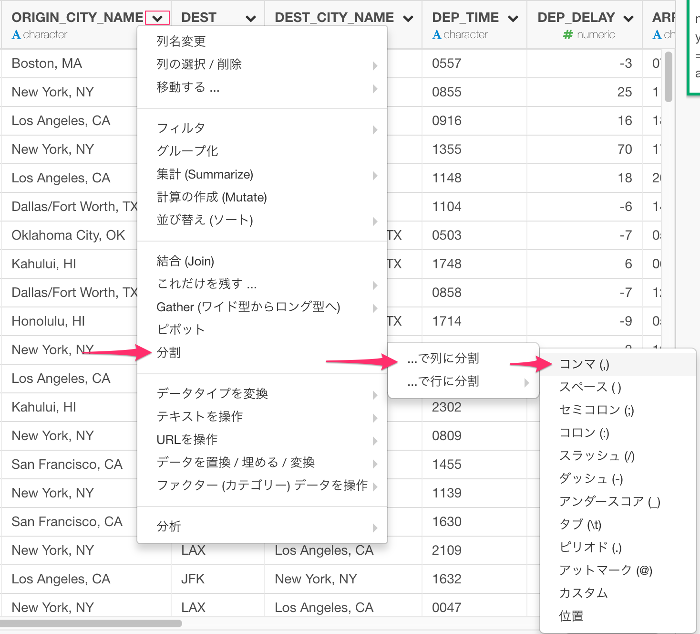
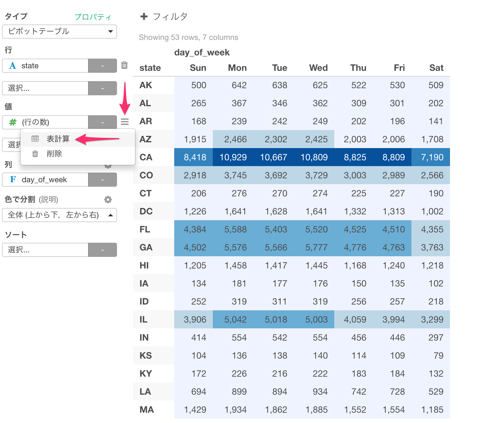
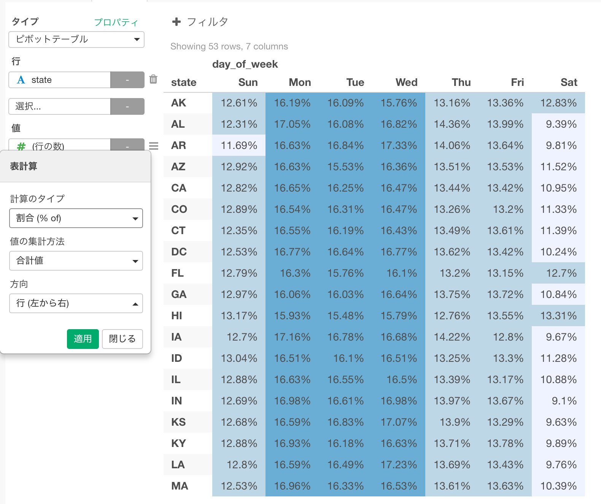
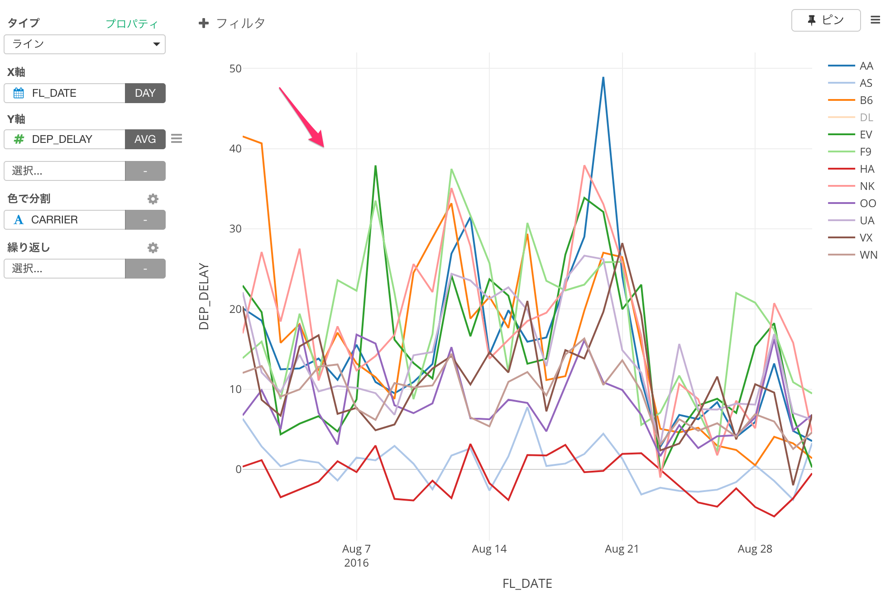
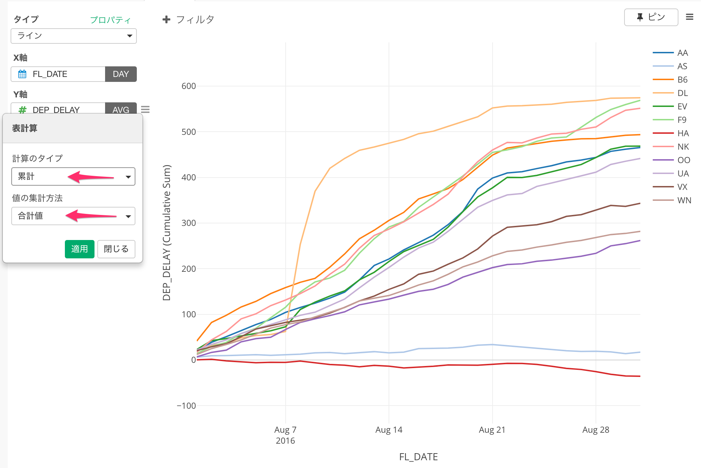

# スタートガイド

所要時間(初めから終わりまで) : 約60分

こちらの米国の航空機の発着遅延データを探索的に分析を行っていくというシナリオに沿ってExploratory デスクトップの使い方を効率よく学べるかと思います。このチュートリアルでは主に以下の機能に触れます。

* 新しいプロジェクトを作成してデータをインポートする
* サマリ(要約)ビューでデータを検査する
* データの整備・加工（データラングリング）
  * データ型を文字から**日付に変換**する 
  * 日付から**曜日の情報を抽出**する
  * 複数の列に**列を分ける**
  * **欠損値**を扱う
  * 他のデータセットとの**結合**
* データの可視化
  * **ジオコードを使用した**地図
  * **パーセント合計**を使用したピボットテーブル
  * **表計算**(Window Calculation)を使用したラインチャート
  * **グループ毎のトップ100**を使用した箱ひげ図
  * **トレンドライン**を使った散布図 (線形回帰モデルと一般化加法モデル)
*  **機械学習** のアルゴリズムを使う
    * Random Forestを用いた変数重要度
* 再現可能な方法でチャートをシェアする
* インサイトをシェアするためにノートを作成する

ステップを進んでいる間にご質問がある場合は、チャットウィンドウからお気軽にお問い合わせください。


または、support@exploratory.ioまでe-mailを送ってください。

## 航空機の離発着遅延サンプルデータのダウンロード

このチュートリアルでは、2016年8月に飛行した米国国内線すべての離発着遅延データを使用し以下の項目を確認します：

* 出発/到着遅延時間の遅れや早さ。
* どこから出発してどこに到着したのか。
* それぞれのフライトでどのくらいの距離を飛んでいたか。

サンプルデータのCSVファイルは、下のリンクからダウンロードできます。

- [Flight delay 2016 August data](http://download2.exploratory.io/data/airline_delay_2016_08.csv)

それでは、さっそく始めましょう!

## 新しいプロジェクトを作成する

Exploratory デスクトップを起動し、まず新しいプロジェクトを作成します。


プロジェクト名を入力し、「作成」ボタンをクリックします。


##　データをインポートする

プロジェクト内で、左側のペインの 「データフレーム」テキストの隣にある 「+」（プラス）ボタンをクリックし、ドロップダウンリストから 「ファイルデータをインポート」を選択します。


先ほどのリンクからダウンロードしたファイル 「airline_delay_2016_08」を選択すると、そのファイルの最初の50行がプレビューとして表示されます。


この演習ではパラメータには何も入力せずに、そのまま「保存」ボタンをクリックしてください。

サマリビューでは、インポートされたフライトデータが以下のように表示されます。


上部の「サイドバーを隠す」ボタンをクリックすると、左側のセクションが非表示になり、データビュー領域が広くなります。


##　サマリ・ビューでデータの概要を把握する

「サマリ」タブをクリックすると、インポートされたデータの概要を即座に確認することができます。例えば、航空会社コードが入力されているCARRIER列を参照すると、このデータには12社の航空会社があり、フライト数のトップ6社をバーチャートで確認することができます。


##　データの整備・加工（データラングリング）

このデータの変換のセクションでは、以下のよく行われるデータの整備・加工タスクについて説明します。

* データ型を文字から日付に変換する
* 日付からの曜日情報の抽出
* 列を複数の列に分ける
* NA（欠損値）を削除する
* 空港のロケーションデータセットに結合する

### データ型を文字から日付に変換する

Exploratoryは、ファイルのインポート時にデータの内容を推測しながら適切なデータ型を割り当てていきます。しかし、まれに想定とは異なる型が割り当てられてしまう場合があります。その時には、インポート後に簡単にデータ型を変換することができます。

FL_DATEの列には、日付データが入力されていますが、文字データ型としてインポートされてしまっています。


そこで、列名の右側にある列ヘッダーメニューから、「データタイプを変換」->「日付/時間に変換」->「Year, Month, Day」を選択します。


ここでは、元データの中で年、月、日がどのような順番で並んでいるかを選択すればいいだけです。 ここでは、例えば、月の情報が数字であっても、月名（例：AugustまたはAug）のように文字であってもかまいません！

画面に戻ると、「計算の作成」ダイアログが開いていると思いますが、ymdという関数がFL_DATEという列の名前とともに適切に設定されているはずです。

```
ymd(FL_DATE)
```


この `ymd`関数は、 `lubridate`と呼ばれるRパッケージの日付/時刻データを加工するための関数の1つで、データが年、月、日の順に表示されるという前提で解析し、日付データ型に適切に変換します。

「日付」は、年、月、日などの日付情報のみを含む日付データのデータ型です。では時間、分、秒などの時間はどうでしょうか？これには`POSIXct`と呼ばれる別のデータ型があります。これは、日付と時刻の両方の情報を保持できます。

この機能の詳細は、「文章表示（または非表示）」ボタンをクリックすると表示されます。


また、「関数一覧」ボタンをクリックすると、すぐに利用可能なR関数がすべて表示されます。

ともあれ、「実行」ボタンをクリックしてコマンドを実行することができます。

「FL_DATE」列がDateに変換されて表示されるようになりました


これは、データがタイムラインに沿ってどのように分布しているかを視覚化するヒストグラムを表示しています。また、期間は2016-08-01から2016-08-31までであることがわかります。

また、上部に2つの色のついた箱（紫色と緑色）があることに気づくと思います。


紫色の箱は、どのコマンドが使用されたかを示します。この場合、 ``` mutate```です。 `` mutate``コマンドはExcelの式に相当し、新しい計算を作成して実行します。 `select`、 `summarize`、 `filter`などのコマンドは後で触れるので、ご心配なく。

今、緑色のボックスには、以下が表示されています。

```
FL_DATE = ymd(FL_DATE)
```

等号 '='の左辺は列名で、右辺は以前に見た ```ymd()```関数を使った計算です。

したがって、 mutateコマンドは緑色の箱で定義された計算を実行します。この場合、 ``` ymd(FL_DATE)```であり、その結果を 「FL_DATE」という列名に格納します。元の列名であるため、既存の列の値が上書きされます。

最後に、右側に「Mutate」という新しいステップが追加されていることに気付くでしょう。


これはExploratoryデスクトップが背後で実際に実行しているRコマンドそのものです。より多くのデータ操作を実行すると、ここに「ステップ」が追加されていきます。

###　日付から「曜日名」を抽出する

同じ「Mutate」のステップでもう一度操作をしましょう。

FL_DATE列がDateデータ型であるため、 「曜日名」のような日付コンポーネント情報を抽出できます。列ヘッダメニューから「抽出」 ->「曜日」を選択することができます。


開かれた「計算の作成」ダイアログで、今回は「新しく列を作成」タブが選択されていることに注目してください


これは、前回のように元の列を上書きするのではなく、 ```wday(FL_DATE、label = TRUE)```という計算で新しい列を作成することを意味します。

新しい列名として「day_of_week」と入力し、「実行」ボタンを押します。


下にスクロールすると、作成されている新しい列 「day_of_week」が表示されます。


ここでは、バーは最も頻度の高い値、この場合「Mon」から開始するのではなく、「Sun」、「Mon」、「Tue」などで始まっています。これは、この列が factorデータ型列として作成されるためです。これは、列内に「並べ替え順」情報を埋め込むことで、カテゴリ変数（列）を扱いやすくするための特殊なデータ型です。これは実際には、曜日のような「順序」に意味のあるデータには完璧です。しかし、そのような順序を無視したい場合は、factorデータ型列を 文字データ型列に変換する列ヘッダーメニューから 「データタイプを変換」 - > 「文字に変換」を選択するだけです。


この演習では、そのままにしておきます。

##　列を複数の列に分ける

列を複数の列に分割する方法を見てみましょう。

ORIGIN_CITY_NAME列には、米国の都市名と州名が含まれています。


米国のどの州から最も飛行機が離陸したのかを見たいとしましょう。この列のテキストの中から州のみを抽出したいとします。

区切り文字（この場合はカンマ）を設定することで、この列を2つの列に分けることができます。1つは都市名、もう1つは州名です。この操作を見やすくするために、最初にテーブルビューに移動してみましょう。

次に、ORIGIN_CITY_NAME列を選択し、列見出しメニューから「分割」 ->「...で列に分割」 -> 「コンマ(,)」を選択します。



開いている「列を分割」ダイアログで、作成する新しい列の列名を入力します。この場合、「city」と「state」です。


コマンドが実行されると、2つの新しい列が作成されます。1つはcity(都市名)、もう1つはstate(州名)です。


そして新しいステップが右側に追加されます。

Mutateステップをクリックして、この「分割」の操作を行う前のデータを表示することができます。


### 欠損値を扱う

サマリビューでDEP_DELAY列を見ると、緑色のバーにわずかな赤色が表示されていることがわかります。


この赤いバーは、この列の欠損値であるデータの比率を示します。データの1.32％が欠損値であることがわかります。 欠損値を扱う方法はたくさんありますが、ここでは フィルタコマンド操作でそれらを削除してみましょう。

列見出しメニューから「フィルタ」 -> 「欠損値でない」を選択します。


これにより、「欠損値でない」演算子が既に選択されている フィルタダイアログが開きます。


興味のある場合は、演算子のドロップダウンをクリックすると、そのデータ型でサポートされる他の多くの演算子が表示されます。 Rに精通しており、それをさらにカスタマイズしたい場合は、いつでも「カスタム」タブに移動して、好きなようにフィルタ条件を入力することができます。


ここで「実行」ボタンをクリックすると、欠損値が除外されたことがわかります。


### 空港の所在地データセットとの結合

これらの空港がある場所を地図上に視覚化したいとします。データに空港コードが含まれていますが、空港に関連付けられている地理的位置コード（経度と緯度）はありません。そこで、私たちができるのは、まず、空港コードと地理的位置コードをマッピングするマッピングテーブルを見つけることです。

このようなマッピングテーブルはWeb上で簡単に見つけることができますが、ここではEDF（Exploratory Data Format）ファイルとして公開しているため、再現性のある方法でExploratoryにインポートできます。

* [Mapping Table for Airport Codes and Geo Location Codes](https://exploratory.io/data/kanaugust/0814311708280782)

Exploratoryにダウンロードしてインポートすると、このマッピングテーブルのデータを使用して、「airline_delay_2016-08」データフレーム内の各空港コードのジオロケーションコードを割り当てることができます。基本的には、Excelでの「vlookup」や、SQLや一般的なBIツールでの「結合」操作の場合と似ています。

Exploratoryでは、`left_join`という結合コマンドの1つを使用できます。これは、両方のデータフレームのキーカラム値を一致させることによって、ターゲットデータフレームからカラムを追加して2つのデータフレームを結合します。それは以下のようになります。


では、上記のリンク先のページに移動し、EDFファイルをダウンロードしてみましょう。


次に、EDFファイルをExploratoryにインポートします。 「データフレームを追加」ドロップダウンリストから「ファイルデータをインポート」を選択します。


そして、「Exploratory (.edf)」を選択します。


インポート後のデータは次のようになります。


右側にいくつかのステップがあることに注目してください。これは、この 「us-air-port-code」データフレームを準備するために使用されたステップです。必要に応じてステップを追加したり、これらのステップを削除したりすることができますが、この演習ではこれをそのまま使用します。

また、Codeという列が表示されます。これは、「airline_delay_2016-08」データフレームとの結合に使用するキー列です。


さて、「airline_delay_2016_08」データフレームに戻ります。


ORIGINという列があります。この列には、飛行機が出発した空港の空港コードがあります。そして、これは、「us-air-port-code」データフレームでマップするために使用する列です。

ORIGINのカラムメニューから「結合」を選択します。


「結合」ダイアログで、「ターゲットデータフレーム」のデータフレーム「us-air-port-code」を選択し、「ORIGIN」列を「現在の列」に、「Code」を「ターゲット列」をキー列として選択します。


コマンドが実行されると、ターゲットデータフレーム 「us-air-port-code」の新しい列が最後に追加されます。


このチュートリアルでは、`left_join`のみを使用しましたが、他のタイプの結合もあります。興味のある方は、これら2つの記事をご覧ください。

* [Introduction to Join — Bring extra columns from the target in Exploratory (英語)](https://blog.exploratory.io/introduction-to-join-bring-extra-columns-from-the-target-in-exploratory-1ec585ec2cf1#.u003r2k1m)
* [Introduction to Join — filtering data based on the target data in Exploratory (英語)](https://blog.exploratory.io/introduction-to-join-filtering-data-based-on-the-target-data-in-exploratory-eedbd7b39d0a#.fudvfqpdm)

ともあれ、十分なデータが得られました。この米国の飛行遅延データをよりよく理解するために、可視化してデータを探索してみましょう。

## データの可視化

Exploratoryでは、さまざまな種類のチャートを使用してデータを視覚化する方法がたくさんあります。この演習では、次のグラフタイプを使用してデータを探索します。

* **地図** - フライトがどこから出発するのかを理解する。
* **ピボットテーブル** - どの州と日にちの組み合わせの便が他の組み合わせより多いかを理解する。
* **折れ線グラフ** - 8月の出発遅延時間の傾向を理解する。
* **箱ひげ図** - 各航空会社による便の遅延の程度をを理解する。
* **散布図** - 到着遅延と出発遅延時間の間の相関を理解する

### ジオコードを使用した地図（経度と緯度）

まず、これらの飛行機がどこから出発したかを見てみましょう。

Vizビューに移動し、「地図 - 経度 / 緯度」チャートタイプを選択します。


これにより、自動的に「経度」と「緯度」の列が表示され、マップ上のすべての空港の位置が表示されます。


ラベルに「名前」列を割り当てることができます。これにより、マウスを任意の円上に置いたときに、この列の値がグラフの右端上方に表示されます。


マウス、トラックパッド、またはマップの左側の上部にあるボタンを使用して、ズームインまたはパンすることができます。

レイアウト設定メニューから背景スタイルを変更することができます。


たとえば、「黒」タイプを選択すると、黒色のテーマを取得できます。


「カラー」の横にある「歯車」アイコンをクリックすると、カラーパレットを変更できます。


### ピボットテーブル

ピボットテーブルを使用して、どの州と曜日のペアの便が他のものより多いかを理解しましょう。

ピボットテーブルを選択し、行に 「state」列を、列に 「day_of_week」列を割り当てます。 Valueをデフォルト値にしておきます。これは、各グループの行数をカウントします。


列の値は、曜日の自然順序を尊重して、「Sun」、「Mon」、「Tue」などのようにソートされています。これは、以前に見たように 「day_of_week」列はfactorデータ型で、ソート順情報が埋め込まれているため、ピボットテーブルなどのグラフはデータのソート時にソート順情報を尊重するためです。


色を使用してデータを視覚化することができます。ドロップダウンから「全体」を選択します。


生の数字の代わりに、 「合計の割合」として値を表示することができます。 「値」の横にある「メニュー」アイコンをクリックし、「表計算」を選択します。



デフォルト設定では、 「合計の割合」がピボットテーブルのすべての値のパーセンテージとして計算されます。しかし、各州または各曜日の割合を見たいかもしれません。たとえば、「方向」の設定を「行」に変更すると、どの曜日に他の曜日よりも多くの便があるか見やすくなります。



ほとんどの州では、月曜日から水曜日までに便が集中しています。土曜日はほとんどの州にとって割合が最低です。

この列の値に基づいてデータをソートするには、「Sat」列をクリックします。 VI（米領バージン諸島）は、他の州と違って、土曜日に他の日よりも多くの便を運航していることが判明しました。これはおそらく、より多くの人々がビジネスよりも休暇のためにそこに行くからです。


### 折れ線グラフ / 時系列

2016年8月の期間の飛行出発遅延時間の傾向を見てみましょう。

「線」グラフを選択し、「FL_DATE」列をX軸に割り当てます。'FL_DATE'列は日付データ型なので、データの集計に日付レベル（年、月、日など）を選択できます。たとえば、デフォルトの「年」の代わりに、データを「日」に設定してデータを集計することができます。


ここで、Y軸に DEP_DELAY列を割り当てて、飛行出発遅延時間の傾向を確認します。デフォルトのデータ集計関数は 「合計」に設定されていますが、これを '平均'のように変更することができます。


色に「CARRIER」列を割り当てて、各航空会社の傾向を確認することができます。


凡例の任意の値をクリックすると、グラフ内の線を表示または非表示にすることができます。


グラフ領域の任意の部分をダブルクリックすると、現在有効な値を最も効果的に表示するためにグラフのスケールが再調整されます。



ドラッグアンドドロップジェスチャを使用して、ズームインする領域を選択することもできます。


チャート上の任意の部分をダブルクリックすると、元のズームレベルに戻ることができます。

次に、チャートに組み込まれている、累積合計（またはランニングトータル)と呼ばれる表計算(Window Calculation)タイプの1つを使用して、出発時間遅延が各航空会社によって累積される様子を見てみましょう。

プロパティアイコンをクリックし、リストから表計算(Window Calculation)を選択します。


リストから「累積」と「合計」を選択します。




デルタ航空（DL）が出発遅延時間を大量に蓄積していることがわかります。その特定の週には何かが起こったに違いないと思われます。 2016年8月8日にデルタのグローバルコンピュータシステムの停止があり、大規模なキャンセルが発生し、通常のスケジュールに戻るまでに数日かかったことが判明しました。 [News from CNN.(英語)](http://money.cnn.com/2016/08/08/news/companies/delta-system-outage-flights/)


遅延が通常の傾向として観測される他の航空会社とは異なり、ハワイアン（HA）やアラスカ（AS）のような一部の航空会社は一貫して非常に低い出発遅延時間であることがわかります。稀に遅れることがあってもそれはこれの航空会社にとっては例外的な出来事です。

## 箱ひげ図

出発の遅延時間についてもう少し詳しく調べてみましょう。チャートタイプを箱ひげ図に変更すると、各航空会社の出発遅延時間のデータ分布がそれぞれの日に対して表示されます。


マウスをドラッグして8月7日から14日の時間範囲を選択してズームインすることができます。


多くのデルタ（DL）航空便が8月8日、9日、10日に大幅に遅れていることがわかります。上記のように、これはデルタのコンピュータシステムの停止が8月8日に起こったためです。システムは同日にオンラインに戻りましたが、ほとんどのフライトをスケジュール通りに戻すには数日かかっていました。

ここで、X軸をCARRIER列に切り替えて、各航空会社の出発遅延時間のデータ分布を見ることができます。


デフォルト設定では、大部分のデータと比較して極端に高い値または低い値である異常値が取り除かれます。 「外れ値を含む」チェックボックスをオンにすると、それらを戻すことができます。


さて、遅延時間に基づいた各航空会社毎のワースト100便に注目して、どれだけひどく遅れたのかを知りたいとします。

「+ (プラス)」ボタンをクリックし、「これだけを残す」  -> 「上位N」を選択します。


100を入力し、「DEP_DELAY」列を選択し、「実行」ボタンをクリックします。


チャートはワースト100便を示しています。


しかし、このワースト100便は、すべての航空会社からのすべてのフライトに基づいています。このため、HA（ハワイアン）、WN（サウスウェスト）などの航空会社は見られません。

我々が見たいのは、すべての航空会社ではなく、各航空会社ごとにワースト100便でした。 `top N`コマンドを適用する前に `group_by`コマンドを使用してデータフレームをグループ化することで、実際にこれを簡単に達成できます。

`group_by`ステップを追加する前に、チャート領域の右上にある 「ピン」ボタンをクリックしましょう。


これにより、チャートは常にこの「上位N / 下位 N」ステップで生成されたデータを参照します。

ここで、右側の「上位N / 下位N」ステップの直前の「フィルタ」ステップをクリックします。


グラフにはこの「フィルタ」ステップの結果ではなく、「上位N」の結果が表示されていることに注意してください。

「追加」ボタンメニューから「グループ化」を選択します。


列リストから「CARRIER」を選択します。


これにより、チャートが自動的に更新されます。ここでは、航空会社毎にワースト100便の遅延時間の範囲を示しています。


現在右側で選択されているステップはまだ「グループ化」ですが、チャートに表示されるデータは「上位N / 下位N」ステップを適用した結果です。これは「ピン」ボタンのおかげです！

### 散布図

ここで、出発遅延時間と到着遅延時間はどのように相関しているでしょうか？言い換えれば、出発時間に遅れたフライトはまた到着時間に遅れたのでしょうか？もしそうなら、それらの2つの遅延時間の間に相関関係はあるのでしょうか？

このような相関関係を調べるために、前に追加した「グループ化」と「上位N / 下位N」の最後の2つのステップは必要ありません。これはデータ全体を評価するためです。この分析のために、これらの2つのステップを削除する代わりに、「グループ化」ステップの前のステップから 「ブランチ」データフレームを作成することができます。このようにして、共通するデータ・ラングリングの処理を共有しつつ、2つの異なるデータ・ラングリングの経路を持つ2つのデータフレームを作成することができます。

右側の「フィルタ」ステップを選択します。


アクションメニューから「ブランチを作成」を選択します。


新しい「ブランチ」データフレーム名の名前（「correlation」など）を入力し、「作成」ボタンをクリックします。


メインデータフレーム 「airline_delay-2016-08」の下に作成された「correlation」という新しいデータフレームがあることに気づくでしょう。


また、右側のステップがグレー表示されていることがわかります。


これらは、メインデータフレーム 「airline_delay_2016-08」で管理されるステップです。この「correlation」データフレームは、メインデータフレームからこれらのステップの結果を継承します。

今度はVizビューに行き、チャートタイプとして 「散布図」を選択し、X軸に 「DEP_DELAY」、Y軸に 「ARR_DELAY」を割り当てます。


2つの数値情報の間には、ある程度の「線形」相関があるようです。

「CARRIER」列を「繰り返し」に割り当てることで、各航空会社の相関関係がどうあるかを見ることができます。


「繰り返し」プロパティを調整して、すべてのグラフをより見やすく表示できます。


たとえば、各行のチャート数を「4」に設定し、「Vizエリア内のすべてのチャートを合わせる」チェックボックスをオンにし、「チャート間でスケールを同期」をオフにして、チャート間でX軸とY軸のスケールを同期させないようにできます。

「AA」や「DL」のような航空会社の中には、「F9」や「HA」といった他の航空会社と比べてはるかに明確な「線形」相関が示されていることがわかります。 トレンドラインを表示することで、これをさらによく見ることができます。

Y軸のプロパティメニューから「トレンドライン」を選択します。


線形回帰モデルを使用してトレンドラインを計算するには 「線形回帰」を選択し、各航空会社のデータ範囲についてのみトレンドラインが描画されるように 「各グループのデータ範囲」を 「線の長さ」として選択します。


フライトを表す点は、 「AA」、「NK」などの一部の航空会社では線形トレンドライン上にうまく収まりますが、「F9」や「VX」ではそれほどではありません。

## 機械学習のアルゴリズムを使って深いインサイトを得る

### Random Forestによる変数重要度

ビジュアライゼーションは、目でパターンやトレンドを探すのにとても適しています。しかしながら、多くのケースで物事はこう簡単には行きません。

例えば、ARR_DELAY, DEP_DELAY, FL_NUM, DISTANCE等々の多くの変数の中で、一体どの変数が航空会社を特徴付けるのに役に立つのでしょうか？別の言い方をすれば、CARRIER列がない際に、あるデータがどの航空会社のものかを予測できるのでしょうか？

この種の質問に答えるには、機械学習や統計のアルゴリズムを使います。Exploratoryでは、アナリティクスビューの下にある、変数重要度の機能を使うことができます。変数重要度の機能は、内部的にはRandom Forestのアルゴリズムを使い、興味のある列の値を予測するという観点で、どの列がより影響度を持つのかを探す助けになります。

まず、アナリティクスタブをクリックし、そしてアナリティクスタイプのプルダウンリストから「変数重要度」を選びます。


次に予測対象の列で'CARRIER'をリストから選びます。


「予測対象の列」をクリックし、そして列選択のダイアログで「全て」をチェックします。 右の方にスクロールし、'CANCELLATION_CODE'のチェックを外します。これはこのCANCELLATION_CODE列の値の多くが欠損値だからです。


そして「実行」ボタンをクリックします。


この結果を見ると、FL_NUMとDISTANCEが、航空会社を特徴付ける(または予測するのに)役に立つ上位２つの変数であることが分かりました。


"Model Quality"のリンクをクリックすると、この２つの変数が「OO」と「EV」の航空会社をとてもよく説明していることが読み取れます。


そして、"Prediction Matrix"をクリックすると, 航空会社が別であるのにも関わらず(例えばDL)、EVと誤って予測してしまう確率はかなり低いことが分かります。また同じことが「OO」という航空会社についても言えます。


さて、この結果を確認するために、Vizビューに移動します。そしてCARRIERをX軸に、FL_NUM列をY軸に割り当てて、箱ひげ図を作ります。すると以下のようなチャートができます。


このチャートを見ると、EVとOOという航空会社のデータの範囲は他の航空会社のものよりもはるかに上の方にあることが分かります。このことは、先ほど変数重要度の"Model quality"と"Prediction Matrix"で確認した結果と合致します。

ここで学んだように、機械学習と統計のアルゴリズムを使うことで、こうしたパターンやトレンドを簡単に素早く知ることができます。


## チャートをシェア

興味深い洞察を見つけたら、他の人と共有したいかもしれません。 Exploratoryを使用すると、グラフだけでなく、データ・ラングリングの手順をチャートと簡単に共有できるため、他の人が簡単に作業を再現できるようになります。

「More」ボタンの下の「Vizのシェア」を選択します。


タイトルと説明を入力します。


プライベートで共有する場合は、「プライベート」を選択します。

そして、「シェア」ボタンをクリックします。

公開されると、「新規またはユーザーを追加」リンクが表示されます。


リンクをクリックすると、「シェア」ダイアログが開いた状態で公開されたページに移動します。


「有効にする」リンクをクリックすると、この一意に生成されたURLを持つ誰でもこのチャートページを開くことができるようになります。パブリックとして公開して共有している場合は、この一意のURLを有効にすることなく、ページのURLをコピーして他のユーザーと共有することができます。


公開されたチャートページで、あなた、または共有された他のユーザーは、「ダウンロード」ボタンをクリックし「EDFをダウンロード」を選択すると、再現可能な形式でチャートをダウンロードできます。


これは、他のユーザーがダウンロードされたEDFファイルをExploratoryにインポートすることができ、チャートだけでなく、チャートデータを生成するためのすべてのデータ・ラングリングの手順も見ることができることを意味します。


## ノートを作成する

最後に、ノートを作成して分析レポートを作成することができます。

「ノート」の横にある「プラス」ボタンをクリックします。


ポップアップに名前を入力し、「作成」ボタンをクリックします。

これはマークダウンエディタなので、マークダウン記法を使って好きなものを書くことができます。マークダウンの中に、Rのコマンドを埋め込んで実行し、結果を表示させることも可能です。

マークダウン記法で手書きしなくても、ツールバーのボタンを押すとこで書式等を変えたり、外部サイトへのリンクを入れたり、Exploratoryで作ったチャートやアナリティクスを挿入することもできます。


ツールバーにチャートボタンがあります。


これをクリックすると、チャート選択ダイアログが表示されます。グラフが作成されたデータフレームを選択し、グラフを選択して「OK」ボタンをクリックします。


実行ボタンを押すと、チャートや動的に計算が必要なものが必要に応じて処理されて、結果を表示できます。


チャートが以下のようにマークダウンに埋め込まれたことが分かります。


レポートの作成が終了したら、URLで共有したり、HTMLドキュメントに保存したりすることができます。


最後に、「データを再インポート」ボタンをクリックして、ノート内のすべてのグラフを更新することができます。これにより、各グラフのデータベース、ファイルなどの基礎となるデータソースからデータがリロードされます。
