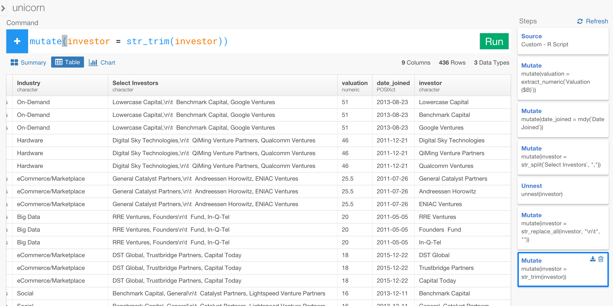

# Working with Text data

### What you are going to learn

Working with Text Data by:

- Scraping text data from Web
- Extract only numeric value from text
- Parse text and convert it to Date / Time data type
- Detecting a pattern of text with Regular Expression
- Remove 'control' characters from text
- Remove white space at the beginning and end of the text
- Remove extra spaces between words
- Separate comma separated text into multiple rows
- Summarize based on the text value
- Visualize the text entries


# Scrape Web Data

Click '+' button next to 'Data Frame' and Select 'Scrape Web Data'.


Type 'unicorn' for Data Frame name and copy the following URL and paste to URL text input field, and click 'Preview' button.


Review the data in the preview table and click 'Import' button to import the data. Now the data is in Exploratory.


# Extract number from text data

When you look closer to the data you would notice that 'Valuation ($B)' column is 'character' data type even though it has the valuation amount information. You want to extract only the numeric part of the data and register that as 'numeric' data type instead of 'character' so that you can do numeric based calculation such as using 'sum()' function to get total values.

This operation is actually pretty simple.

First, click '+' button to add a new data transformation step.


And, select 'mutate' operation from the dropdown list.


Type 'valuation =' inside 'mutate()' command to define a new column, then you'll be suggested a list of the columns and functions to pick.


At the bottom of the list you will see 'Open Function List' button. Clicking this will open Function List dialog  .


Find 'extract_numeric()' function under 'Text' category and click 'Insert Function' button. Now, immediately after that, you'll be suggested a list of the columns, select 'Valuation ($B)' column.


Once you click 'Run' button, you'll see a new column called 'valuation' being added at the end and the data type is 'numeric'.


# Parse text data and convert to Date / Time

When you look at 'Date Joined' column, you will notice this is also 'character' type, so you want to parse this data and convert to Date/Time data type. This is also pretty straightforward.


Just like you have already done at the previous step, click '+' button to add a new transformation step and select 'mutate' operation. And type a new column name 'date_joined' and type '=' and space, then you'll be suggested a list of the columns and functions. Click 'Open Function List' at the bottom of the list.


Select 'mdy()' function under 'Date' category and click 'Insert Function' button.


Once you hit 'Run' button you will find a new column called 'date_joined' is added as 'POSIXct', which is Date/Time data type in R.


Now, you can go to Chart view and assign this new 'date_joined' column to X-axis.


You can also assign one of the new columns, 'valuation', to Y-axis and change the chart type to Boxplot to see the distribution of the valuation amount in US dollars per each year.


# Detect a text pattern from text data and filter

When you go to Table view you can see a column called 'Select Investors' that lists multiple investors who invested in each of the unicorn companies. You can see 'Lowercase Capital' in the 1st row, which is for 'Uber'.  


Let's find out who else 'Lowercase Capital' is investing in.

Add a new transformation step and select 'filter()' operation. Click 'Open Function List' menu at the bottom of the suggested list and select 'str_detect()' function, then click 'Insert Function' button or double click on the function name.


Type 'Lowercase' as a matching pattern inside 'str_detect()' function, and hit 'Run' button.


Now you can see 5 companies listed including 'Uber'.


# Split text data with a separator

Instead of doing the previous operation for each investor, let's find out which investors are investing in which companies all together. To do so, you want to split the multiple investor name entries in 'Select Investor' column first.

First, remove the previously created 'Filter' step by clicking 'Delete (Trash)' icon inside 'Filter' step card at left.


Add a new transformation step and select 'mutate()' operation, and click 'Open Function List' menu at the bottom of the suggested list and select 'str_split()' function, then click 'Insert Function' button.


Inside 'str_split()' function, select 'Select Investors' column and type ',' (comma) as a separating character to split the text.


Now you have a list of 'words' (investor names) for each row (company) in the new column called 'investor'.


# Bring each of the split text items into row - Flatten

Now we want to bring each of the 'words' in the list column of 'investor' into each row so that a combination of each investor name and each company will have its own row. This will make it easy for the operations like counting how many of the companies each investor are investing or calculating how much of the valuation amounts in total each investor have currently. And, you can do this very easily and quickly. All we need to do is to use 'unnest()' command for this column.

Select 'unnest()' operation from the '+' button menu.


And, select 'investor' column. Notice that only 'List' data type column is listed in the suggested list.


Once you hit 'Run' button, you will see each investor is now presented in each row.


# Remove noise characters from text data

When you look closer on the new 'investor' column you would notice that there are '\n\t' characters in the data. These are 'new line' and 'tab' characters and the original text data we scraped from the website was using these characters to have those text in multiple lines. As part of the effort to clean up all the investors names let's get rid of these characters by using 'str_replace_all()' function. You can find this function by start typing 'str' inside 'mutate()' command like below.


And type "\n\t" as the pattern to find, then type "" (no space) as replacing character, which is to basically removing "\n\t".  Once you hit 'Run' button, you will see those characters are gone.


# Trim white space both at the beginning and the end of the text

When you look closer to the data inside 'investor' column you will notice there are some spaces at the beginning of some investor names.


Let's remove these as well by using 'str_trim()' function. You can find this function either by start typing 'str' like you did in the previous step or select from Function List.

One you hit 'Run' button you will see those white spaces are now gone.



# Group by Investor Name and Summarize to count number of unicorn companies for each investor

Looks all the investor names are now clean, let's find out how many unicorn companies each investor is investing.

First, select 'group_by()' command from the '+' button menu and set 'investor' as the grouping level.


Then, select 'summarize()' command from the '+' button menu and type 'count = n()' to count the number of the entries (companies) in each group. Note that 'n()' function is for the count calculation.


# Remove empty (null) row

There is empty investor name, let's remove this with 'filter()' command. After selecting 'investor' column from the suggested list and type 'space', the suggested list will give you a list of the operator you can use inside 'filter()' command.

Select '!=' (not equal) operator.

Then, select the first value suggested in the list, which is the empty investor.


Once you hit 'Run' the empty row is gone now.

# Remove extra space between words


When you look closer on the data though, you will find some of the investors are somehow repeated or have duplicate entries. For example, there are two 'Lowercase Capital' entries. This is weird because we have grouped with 'investor' name so it supposed to have only one entry for 'investor' name after the 'summarize' operation.

Well, it turned out that there are more than one space between words for some investor names. For example, the first 'Lowercase Capital' entry has two spaces between 'Lowercase' and 'Capital'. Let's remove these extra spaces between the words by using 'str_replace_all()' function with a quick regular expression.

By the way, instead of adding this step at the end of the transformation step we can add this new transformation step right before the 'Grouping' step by selecting (clicking) 'Mutate' step right before 'Group' step like below.


Then, click '+' button and select 'Mutate' operation from the list.


Then, type something like following.

```
mutate(investor = str_replace_all(investor, "[:space:]+", " "))
```


[:space:] is a predefined keyword that represent a space. '+' means one or more appearance of a character or characters before. Combining these two as "[:space:]+" means 'at least one or more spaces'. So this entire command is trying to do is, whenever it finds 'at least one or more spaces' then it replaces that with just one space.

Given what you are typing here is R command / functions, you can basically use the same regular expression of R, which is pretty similar to any other regular expression rules (e.g. Perl). Please see [this page](https://stat.ethz.ch/R-manual/R-devel/library/base/html/regex.html) for the detail of the regular expression in R.

After you hit 'Run' button and go back to the last step of the transformation steps by clicking on 'Filter' step at left, you will find, for example, 'Lowercase' has only one entry now.


# Visualize the data

This is the last step of this tutorial, and everything you have done so far will finally come together in a fun way!

Go to Chart view and assign 'investor' to X-axis and assign 'count' to Y-axis.


You can see a list of the investors and their number of the investments sorted as bar chart. Since there are too many entries (bars), let's filter to keep only the investors who invested more than 3 unicorns.


Now, if we want to bring Country data into the chart you can simply add that to Grouping step. But before doing that, let's 'Pin' the chart to the current 'Filter' step by clicking on 'Pin' button like below.


Go back to 'Grouping' step by clicking on it.


And add 'Country' inside 'group_by()' command, and hit 'Run' button.

Go to 'Summarize' step by clicking on it. Now you see 6 'Accel Partners' entries.


But when you go to the next step of 'Filter' you will see only one entry for 'Accel Partner' and all the rows with 'non-US' countries are gone.


This is because the filtering condition is removing any entry with 'count' value that is less than 2. But in order to see the country values in the chart later, we want to keep even those whose 'count' values are less than 2 as long as they are of the investor whose total investments are greater than 2. To do, we can update this 'filter' operation by adding 'sum()' function to 'count' column like below.


Now when you go to Chart view you can see which countries each investor, who is investing in greater than 2 unicorns in total, is investing visually.


