# Analyze Yelp Business Review JSON Data

### What you are going to learn

JSON data handling


- Working with the list data type / nested (array) data
- Counting number of the values inside the list
- Extracting Nth value from the nested data
- Concatenate values from the nested data 
- Finding text patterns inside the nested data
- Unnesting (flatten) the nested data


## Yelp business review sample data

We're going to use Yelp business review sample data that was published by Yelp. You can download it from the link below.

- Yelp business review data (link is still under development)

## Create a new project  

After you open Exploratory app, create a new project.

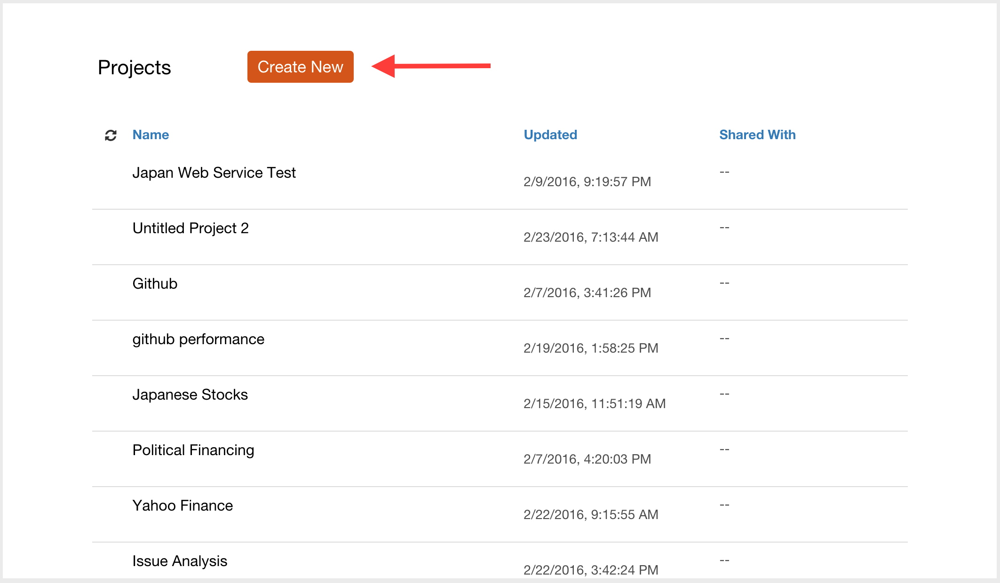


## Import sample data

Inside the project, you can click a plus '+' icon next to 'Data Frame' text in the left side pane to import 'yelp_academic_dataset_business.json'.


After you select the file from the file picker dialog and hit OK, you'll see the first 10 rows of the data you're importing.

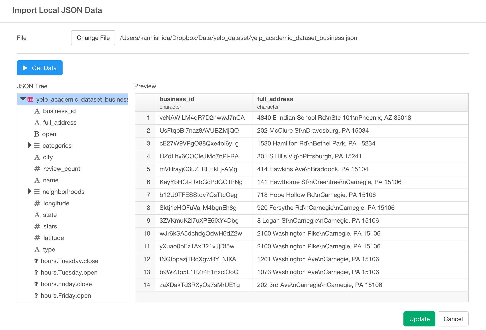


Since it's showing up appropriately, you can keep the parameters as default and click 'Import' button.

You can see a brief summary of the data in Summary view. It shows 105 columns and 61,184 rows at the top.

Explain the auto data type mapping

You can also see some of the columns' sneak peak view. For example, you can see the most frequently appeared businesses like 'Starbucks', 'McDonald's', etc, in name column quickly.

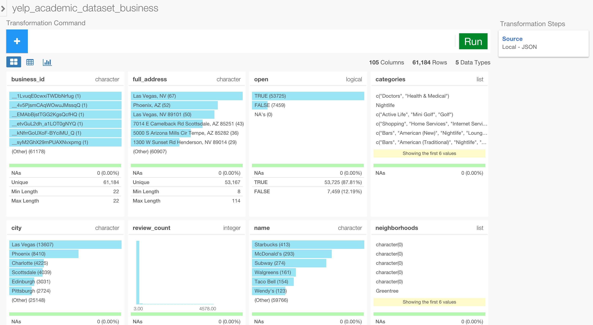

## Select (or Drop) columns

Let's remove unnecessary columns for our analysis.

```
select(-starts_with("hours"), -starts_with("attribute"))
```

Once you run this command, you will get only 13 columns. Very simple. ;)

## Count number of the members inside List (Nested) data

There is a column called 'neighborhoods', people on Yelp give (or tag) each business with the neighborhood names they think appropriate. It is a List data type, which means each row of the data contain more than one value. We call it 'nested data'.

Let's find out how many neighborhoods people are tagging to each business. You can use ```list_n()``` function to count the members (values) inside this list data.

```
mutate(neighborhood_counts = list_n(neighborhoods))
```

When you run this command you can see the number of the neighborhoods are varied between 0 and 3.

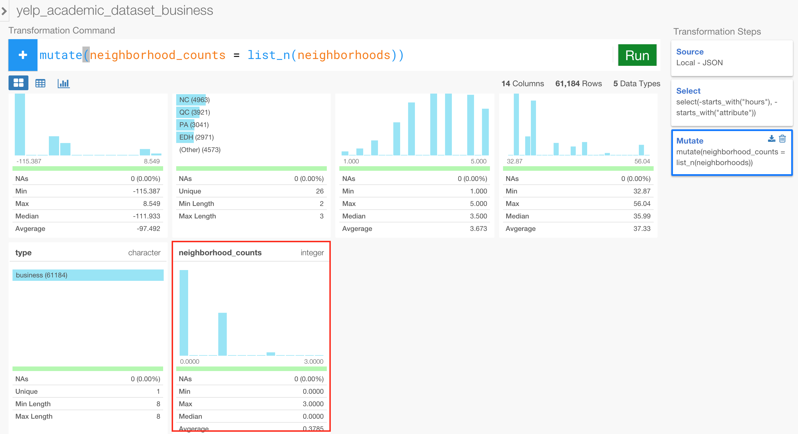

Let's find out what percentage does each count number of the neighborhood represent. Since the summary view gives you a histogram for numeric and date data type column and a bar chart for text data type column, the easiest way to do this is to convert the 'integer' data type to 'character' data type by wrapping the existing ```list_n() ``` function with ```as.character()``` like below.  

```
mutate(neighborhood_counts = as.character(list_n(neighborhoods)))
```

 When you run this command you'll see 52 businesses have 3 tags, but most of the businesses are either no tag or 1 tag of the neighborhood name.

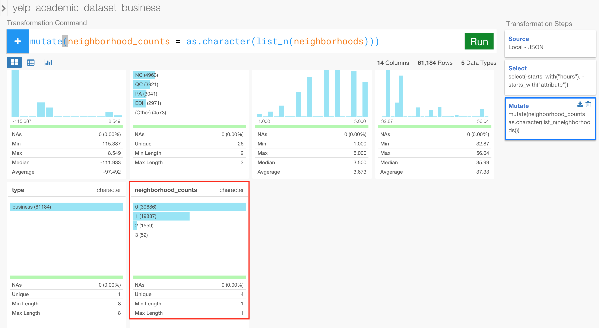


## Extract an Nth value from List (Nested) data

Let's say you want to extract the Nth value in the nested data so that each row of the business will have one neighborhood data assigned. You can use ```list_extract()``` function to extract a value at Nth position inside the nested data like below.

```
mutate(neighborhood_name = list_extract(neighborhoods, 1))
```

When you run this command you can see the top neighborhood names

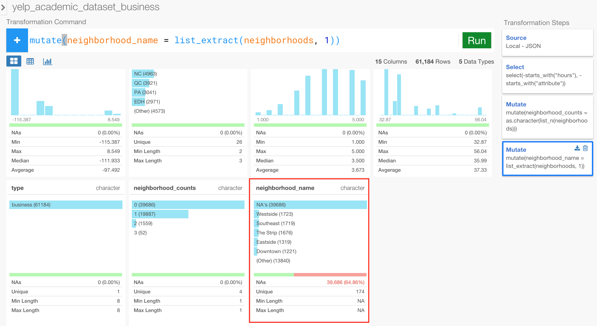

You might want to go to Table view to see this result better by clicking on Table button.

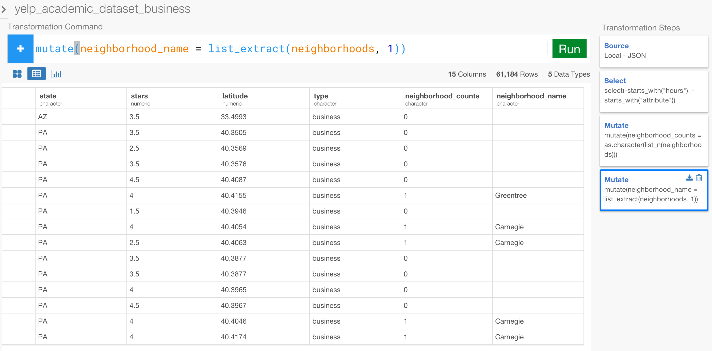

## Extract all the values from List (Nested) data and concatenate

But, we know there are some businesses that have more than just one neighborhood assigned. Let's try to get all the values out and concatenate them by ',' by using ```list_concat()``` function.  

```
mutate(neighborhood_name = list_concat(neighborhoods))
```

The ```list_concat()``` function uses comma ',' as the separator as default. You can change this by adding ```sep``` argument if you like. You can go to Table view to see the result better.

Let's sort the data to list from the ones with the most neighborhoods using ```arrange()``` command.

```
arrange(desc(neighborhood_counts))
```

Now you can see all the neighborhood names are extracted and the column 'neighborhood_name' is 'character' data type.


## Find (Search) values inside List (Nested column)

Let's say you want to know how many restaurants there are in this dat.

You would notice that 'categories' column is 'List' data type, which means each row of the data contain more than one value. We call it 'nested data'. In this case, each business (row) has multiple categories tagged. For example, 'Verizon Wireless' has categories like 'Shopping', 'Home Services', 'Internet Service Providers', etc.


This type of the data structure is very common with JSON and typically it uses 'Array' to store this multiple values information. With Exploratory, you can access to values inside of this nested data easily so we can use this column to answer the above question.

First, let's create a new column that would have TRUE if 'categories' values include 'Restaurant', otherwise FALSE like below.

```
mutate(is_restaurant = str_detect(categories, "Restaurant"))
```

Once you run the command you can find 21,892 (35.78%) of the businesses are restaurant related.

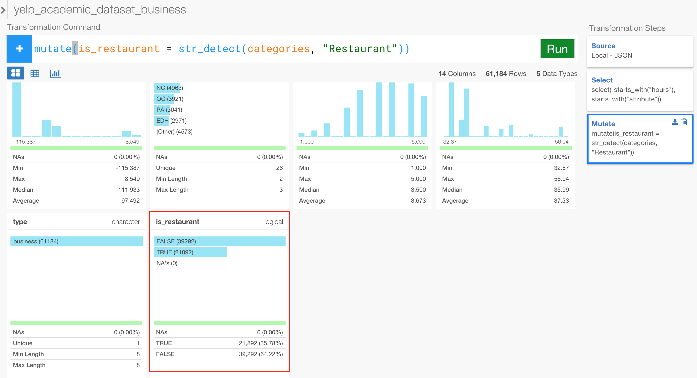

Now, if you wanted to filter only the restaurant related business you could have run the command like below.

```
filter(str_detect(categories, "Restaurant"))
```

After you run the command above, you'll notice that now 'Walgreen' is gone.

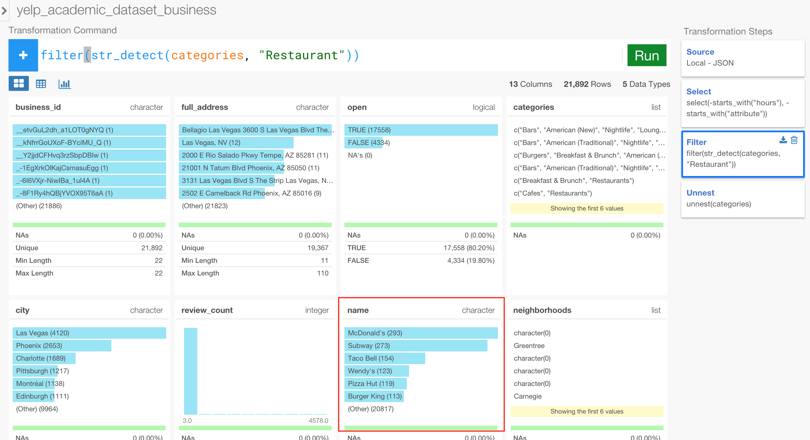

## Unnest

Let's say you want to know what are the most common categories or types of restaurants, for example something like Top 10 restaurant types in terms of the number of the businesses.

To this, we want to unnest the 'categories' list column so that we can count on every single categories that are mapped to all the businesses. And you can use ```unnest()``` function to do this very simply. Add a new step and type the following.

```
unnest(categories)
```

Once you run the command above, you'll find the 'categories' column is now 'character' type instead of 'list', and it has the top categories listed in the summary view.

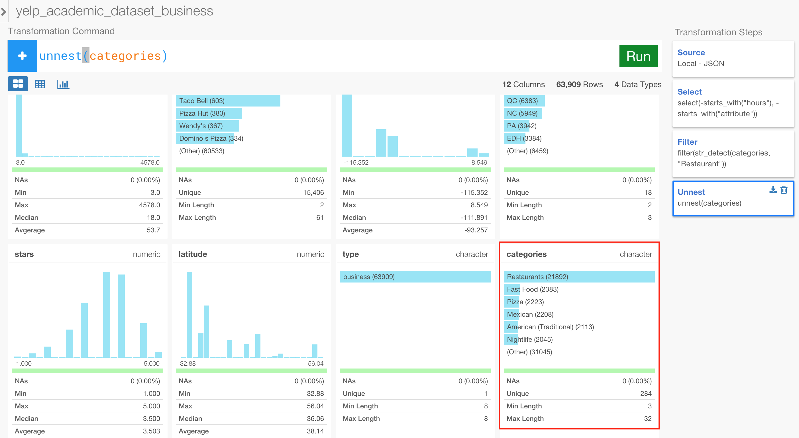

Since we have filtered the data to have only the 'Restaurant' related businesses already at the step 3 of 'Filter' step, we can remove the rows with 'Restaurant' category.

```
filter(categories  != "Restaurants")
```

You can see 'Fast Food', 'Pizza', 'Mexican', etc, are the most common restaurant categories.

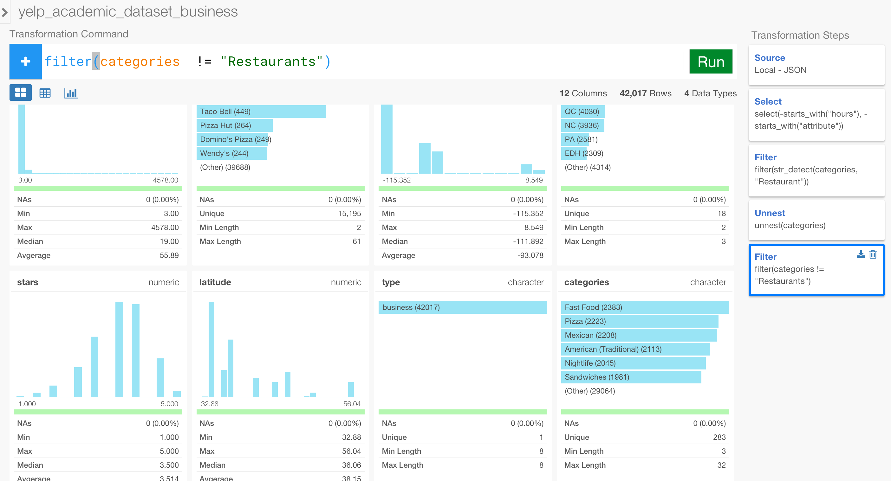

Go to Chart view to see the overall categories.

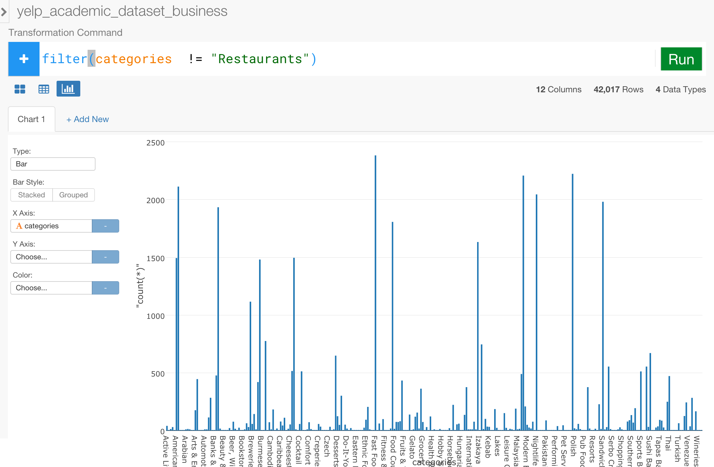

Now, what if you want to know if these common restaurant categories (types) would vary among regions like States.

Go to Table view.

Let's create grouping rules first with the command below.

```
group_by(state, categories)
```

Then, type the ```summarize()``` command below to count number of the restaurants for each state and category.

```
summarize(count = n())
```

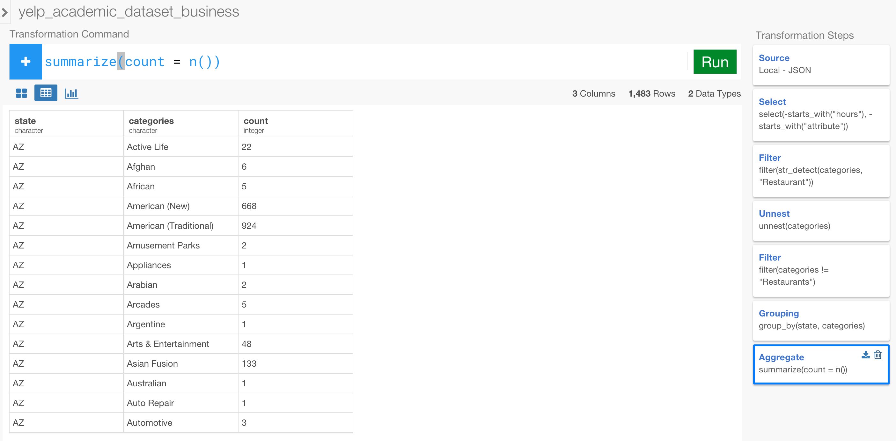

Go to Chart view, and assign 'state' to X-Axis, 'count' to Y-Axis, and 'categories' to Color.


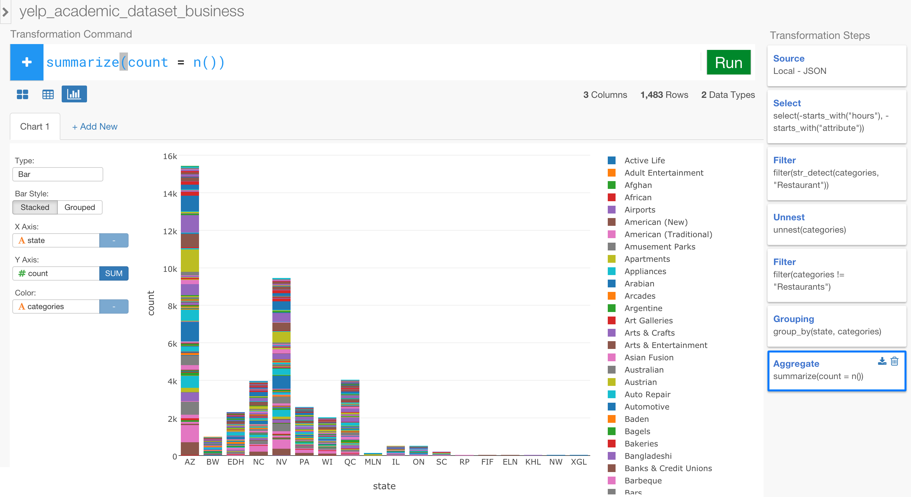

But there are too many categories that it almost doesn't make much of the sense. Let’s get only the top 10 for each state by using ```top_n()``` function. To do this, we need to set the grouping level to 'state' with ```group_by()``` function like below.

```
group_by(state)
```

Then, type ```top_n()``` function like below.

```
top_n(10, count)
```

Once you run the command above, now you'll see much better views. You'll notice, for example, that Chinese restaurants are pretty common all across different states but not with Arizona (AZ).

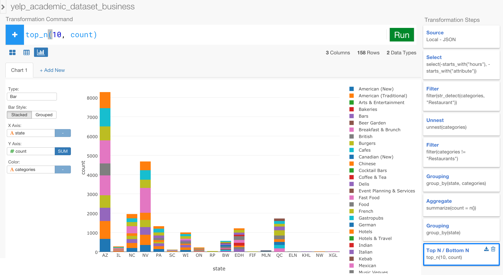

But still, it's hard to see and compare among States because some bars are too big and some bars are too small. So let's get the percentage (ratio) of each category within each state, this way we can compare the trend among States easier. To do this, you can use ```sum()``` function inside ```mutate()``` function, which will make the ```sum()``` function to do the aggregation for each group, in this case each State that is.

```
mutate(ratio = count / sum(count))
```

Now you can see some sort of the trend. AZ to WI are showing some similar trend, BW to MLN are somewhat similar. Also, you can see some states are very diversified, but some others are not.

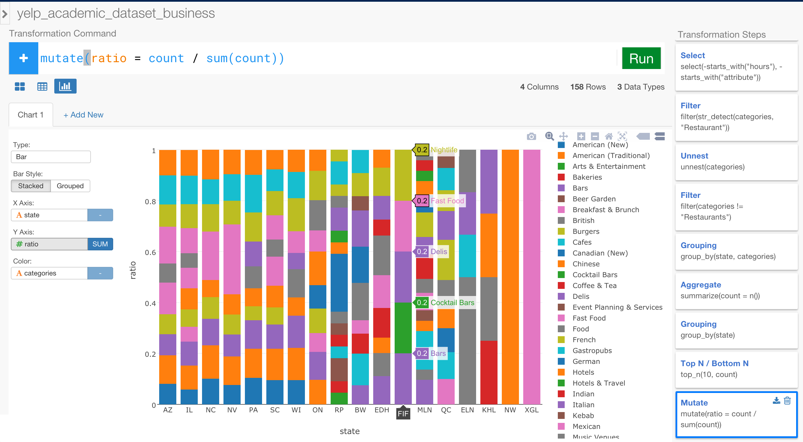


## Update a particular analysis step in the middle

We have seen what types of the restaurants are and their distribution patterns by the states. But how about other categories like 'Shopping' ? If what type of the business people tagged with 'Shopping' and how those are different among the states.

We can do this just by updating the step where we filtered to keep only 'Restaurant' related categories. Click 'Filter' at the third step.

```
filter(str_detect(categories, "Shopping"))
```

Once you hit 'Run' button, you will see different set of the businesses like 'Walgreen', 'Walmart', 'Cvs', etc.

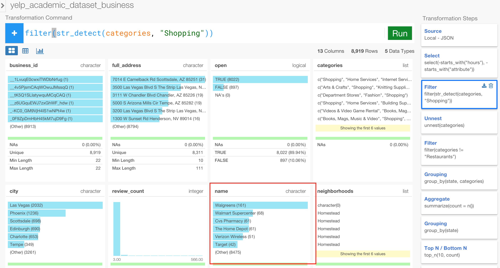

Now, you can click 'Unnest' step to unnest all the categories.


As you would imagine, the most frequent categories is 'Shopping', so let's update 'Filter' step right after the 'Unnest' step by replacing 'Restaurant' with 'Shopping'

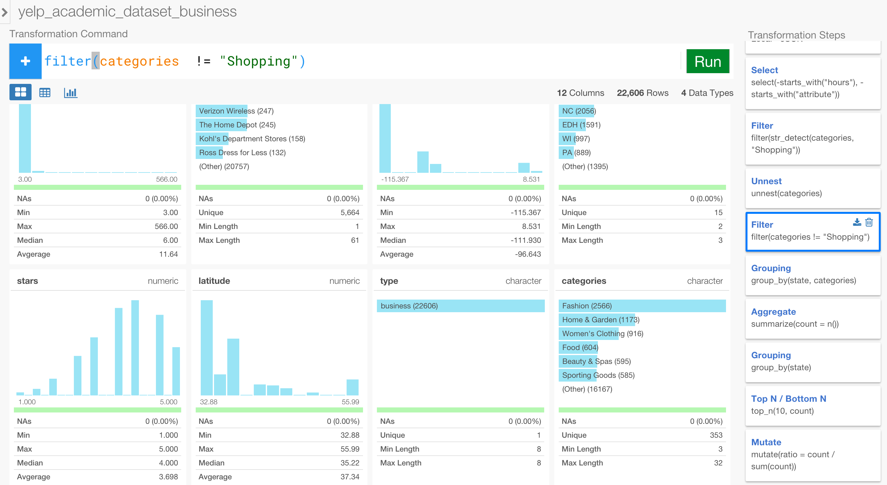

Finally, you can go to the last step and go to Chart view and see the trend. For example, you can see more 'Accessories' type businesses than the other states.

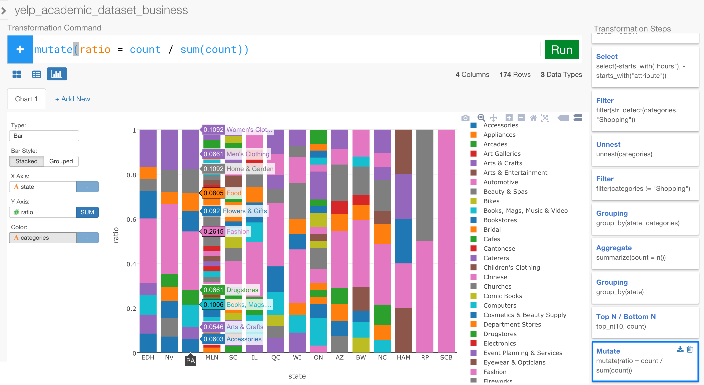
