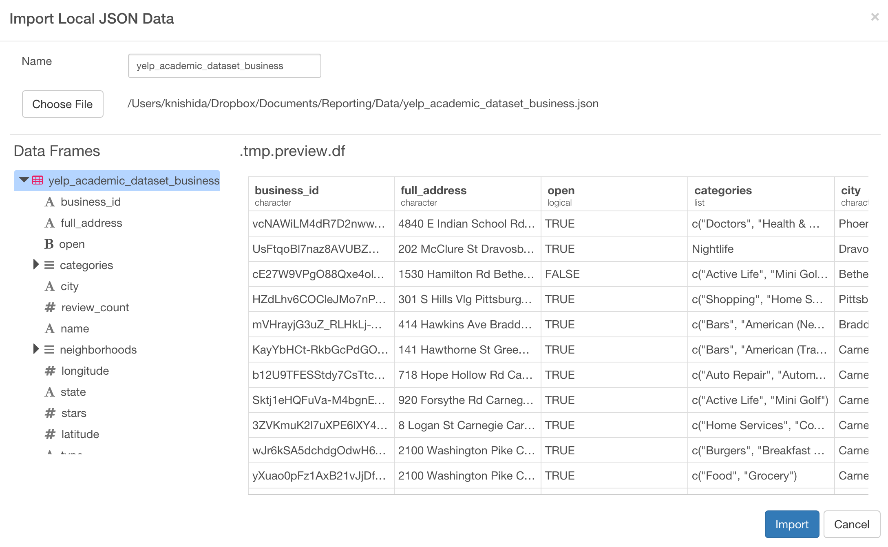

# Working with Yelp Business Review JSON Data

### What you are going to learn

- Working with the list data type / nested (array) data
- Counting number of the values inside the list
- Extracting Nth value from the nested data
- Concatenate values from the nested data
- Finding text patterns inside the nested data
- Un-nesting (flatten) the nested data


## About Yelp business review sample JSON data

We're going to use Yelp business review sample data that was published by Yelp. You can download it from the link below.

- [Yelp business review data](https://www.dropbox.com/s/gd1k41y9gbpfwq3/yelp_academic_dataset_business.json?dl=0)

The data is about businesses on Yelp in the selected areas. You can find information about each business such as their opening hours, type of the business, location, average review star rating, etc. Here's a sample of the raw data for one business.

```
{
  "business_id": "SQ0j7bgSTazkVQlF5AnqyQ",
  "full_address": "214 E Main St\nCarnegie\nCarnegie, PA 15106",
  "hours": {
      "Monday": {
        "close": "22:00",
        "open": "11:00"
      },
      "Tuesday": {
        "close": "22:00",
        "open": "11:00"
      },
      "Friday": {
        "close": "23:00",
        "open": "11:00"
      },
      "Wednesday": {
        "close": "22:00",
        "open": "11:00"
      },
      "Thursday": {
        "close": "22:00",
        "open": "11:00"
      },
      "Sunday": {
        "close": "21:00",
        "open": "11:00"
      },
      "Saturday": {
        "close": "23:00",
        "open": "11:00"
      }
    },
  "open": true,
  "categories": [
    "Chinese",
    "Restaurants"
  ],
  "city": "Carnegie",
  "review_count": 8,
  "name": "Don Don Chinese Restaurant",
  "neighborhoods": [
    "Carnegie",
    "Homestead"
  ],
  "longitude": -80.084861,
  "state": "PA",
  "stars": 2.5,
  "latitude": 40.408343,
  "attributes": {
    "Take-out": true,
    "Alcohol": "none",
    "Noise Level": "quiet",
    "Parking": {
      "garage": false,
      "street": false,
      "validated": false,
      "lot": false,
      "valet": false
    },
    "Delivery": true,
    "Has TV": true,
    "Outdoor Seating": false,
    "Attire": "casual",
    "Waiter Service": false,
    "Good For Groups": false,
    "Price Range": 1
  },
  "type": "business"
}
```

As often with JSON data, the data is hierarchically structured. For example, 'hours' node has two levels, one is about the day of the week and another is about the opening hours within each day of the week. With Exploratory, these hierarchical structures will be flatten out at the data import time so that the lowest level of the element will have its own column. In this case, 'hours.Saturday.open' will have its own column, 'hours.Saturday.close' will have its own column, and so on.

Another common characteristic of JSON data you can observe with this data as well is something called 'Array'. You can see, for example, 'categories' and 'neighborhoods' have multiple values inside the square brackets. With Exploratory, the way these data is stored will be preserved after importing data, but they are registered as List data type and we call them 'Nested' data, which mean it contains multiple values in a single list or sometimes in a data frame. These 'Nested' data can be 'Un-Nested' with ```unnest()``` function later, which we'll talk about later in this tutorial.


## Create a new project  

After you open Exploratory app, create a new project.


## Import sample data

Inside the project, you can click a plus '+' icon next to 'Data Frame' text in the left side pane to import 'yelp_academic_dataset_business.json'.


After you select the file from the file picker dialog and hit OK, you'll see the first 10 rows of the data you're importing. Click 'Import' button leaving the default parameter setting.




## Summary View

You can see a brief summary of the data in Summary view. It shows 105 columns and 61,184 rows at the top. The data has been automatically inspected behind the scene and each column is registered with an appropriate data type so that columns like 'name', 'city', etc, are 'character' type, columns like 'review_count' are 'integer', and so on.


You can also see some of the columns' sneak peak view. For example, you can see the most frequently appeared businesses like 'Starbucks', 'McDonald's', etc, in name column quickly.


## Select (or Drop) columns

Let's remove unnecessary columns for our analysis.

Click on 'Select' button.

Select 'Exclude' to drop columns, and select 'Function' tab.

Select 'starts_with' from 'Function Type' dropdown, and type 'hours'.


Click '+' button to add another column selection in the same 'select' operation.

We'll repeat the similar step. Select 'Exclude' to drop columns, and select 'Function' tab.

Select 'starts_with' from 'Function Type' dropdown, and type 'attribute' this time.


Once you run this command, you will get only 13 columns. Very simple. ;)


## Count number of the members inside List (Nested) data

There is a column called 'neighborhoods'. People on Yelp give (or tag) each business with the neighborhood names they think appropriate. It is a List data type, which means each row of the data contain more than one value. We call this 'Nested' data.


Let's find out how many neighborhoods people are tagging to each business. Select 'Count Items' from 'Neighborhoods' column's column header menu.


This will create a 'mutate' operation with the following expression.

```
list_n(neighborhoods)
```


Click 'Run'


You can see the number of the neighborhoods tagged with businesses are varied between 0 and 3.

Let's find out what percentage does each number (0, 1, 2, 3) represent. Since the summary view gives you a histogram for each numeric and date data type column and a bar chart for each text data type column, the easiest way to do this is to convert the 'integer' data type to 'character' data type by wrapping the result of the ```list_n() ``` function with ```as.character()``` like below.  


 When you run this command you'll see 52 businesses have 3 tags, but most of the businesses are either no tag or 1 tag of the neighborhood name.

 


## Extract an Nth value from List (Nested) data

Let's say you want to extract the Nth value in the nested data so that each row of the business will have one neighborhood data assigned. You can use ```list_extract()``` function to extract a value at Nth position inside the nested data like below.


You can see the top neighborhood names.


## Find (Search) values inside List (Nested) column

Let's say you want to know how many restaurants there are in this data.

You would notice that 'categories' column is 'List' data type, which means each row of the data contain more than one value. In this case, each business has multiple categories assigned. For example, 'Verizon Wireless' business has categories like 'Shopping', 'Home Services', 'Internet Service Providers', etc.


This type of the data structure (Array) is very common with JSON. With Exploratory, you can access to values inside of this nested data easily.

First, let's create a new column that would have TRUE if 'categories' values include 'Restaurant', otherwise FALSE, by using ```str_detect()``` function, which would return TRUE if it detects a given a text pattern.


Once you run the command you can find 21,892 (35.78%) of the businesses are restaurant related.


Now, if you wanted to filter only the restaurant related business you could have added 'Filter' operation like below, instead of having the 'mutate' operation step.


After you run the command above, you'll notice that now 'Walgreen' is not showing up in the top 6 bars under name column.


## Un-nest (Flatten) Nested column data

Let's say you want to know what are the most common categories for the restaurants.

To find this out, we can un-nest (flatten) the 'categories' column, which is 'list' data type currently, so that it will be much easier to count the number of each categories later.

Select 'Unnest' from the column header menu of 'categories' column.


You can select FALSE for 'Drop other list columns' so that another 'list' column like 'neighborhood' won't be dropped.


Once you click on 'Run' button, you will find the 'categories' column is now 'character' type instead of 'list', and it has the top categories listed in the summary view.


Since we have filtered the data to have only the 'Restaurant' related businesses already at the previous step, we can remove the rows with 'Restaurant' category.


You can see 'Fast Food', 'Pizza', 'Mexican', etc, are the most frequent restaurant categories.

Go to Chart view to see all the categories by assigning 'categories' to X-Axis.


## Filter to keep only Top 10 restaurants for each State

Let's take a look at what restaurant categories are common for each state.

Click 'Add New' to create a new Viz, we'll use the default Viz type, Pivot Table.

Assign 'state' to 1st Row, 'categories' to 2nd Row. This will give you the number of the restaurant categories for each state.


However, since there are too many categories for each state it's hard to browse through. We can get those categories down to only the top 10 categories for each state by running a few operations.

First, click 'Group by' button and set the grouping level to 'state' and 'categories' so that we can count the number of the categories for each state.


Second, click 'Summarize' button and type 'counts' as a new column name and keep the default aggregation function of 'n (count)'.


Now, the Pivot Table is showing 1 for all the rows, which is expected. You can select this newly created column 'counts' for Value.


Lastly, click 'Top N' button to filter the data to Top 10 categories for each State based on 'counts' values.


Once you run this, now it's showing only the Top 10 categories for each State in the Pivot Table view.


Now, you can create a new Viz by clicking 'Add New' and select 'Bar' as Viz type. Assign 'state' to X-Axis, 'counts' to Y-Axis, then 'categories' to Color.


If you want to see the percentage of each category for each state, you can use Window Calculation. Click a menu icon next to Y-Axis, select 'Window Calculation', and select '% of Total' from the list.


With Exploratory, not only can you easily work with the nested and key-value nature of JSON data, but also you can flexibly assemble your analysis to answer your questions in a simple and intuitive way.
