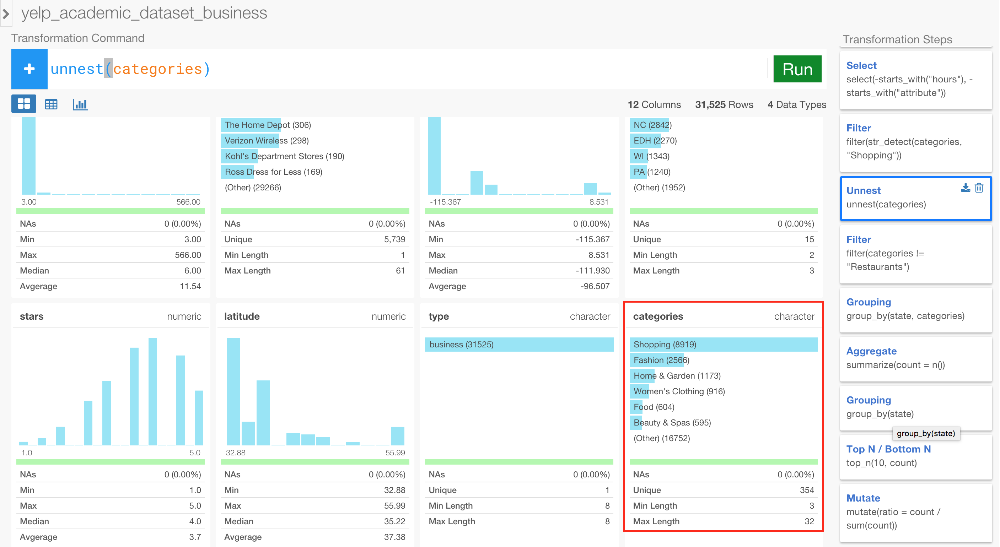
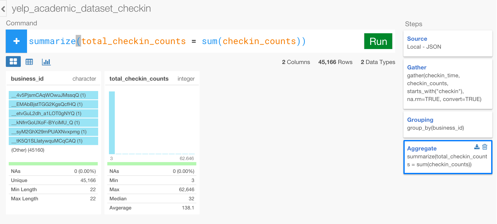

# Analyze Yelp Business Review JSON Data

### What you are going to learn

Analyzing JSON data by:

- Working with the list data type / nested (array) data
- Counting number of the values inside the list
- Extracting Nth value from the nested data
- Concatenate values from the nested data
- Finding text patterns inside the nested data
- Un-nesting (flatten) the nested data


## About Yelp business review sample JSON data

We're going to use Yelp business review sample data that was published by Yelp. You can download it from the link below.

- [Yelp business review data](https://www.dropbox.com/s/3h7vjgktoprheyg/yelp_academic_dataset_business.json?dl=0)

The data is about businesses on Yelp in the selected areas. You can find information about each business such as their opening hours, type of the business, location, average review star rating, etc. Here's a sample of the raw data for one business.

```
{
  "business_id": "SQ0j7bgSTazkVQlF5AnqyQ",
  "full_address": "214 E Main St\nCarnegie\nCarnegie, PA 15106",
  "hours": {
      "Monday": {
        "close": "22:00",
        "open": "11:00"
      },
      "Tuesday": {
        "close": "22:00",
        "open": "11:00"
      },
      "Friday": {
        "close": "23:00",
        "open": "11:00"
      },
      "Wednesday": {
        "close": "22:00",
        "open": "11:00"
      },
      "Thursday": {
        "close": "22:00",
        "open": "11:00"
      },
      "Sunday": {
        "close": "21:00",
        "open": "11:00"
      },
      "Saturday": {
        "close": "23:00",
        "open": "11:00"
      }
    },
  "open": true,
  "categories": [
    "Chinese",
    "Restaurants"
  ],
  "city": "Carnegie",
  "review_count": 8,
  "name": "Don Don Chinese Restaurant",
  "neighborhoods": [
    "Carnegie",
    "Homestead"
  ],
  "longitude": -80.084861,
  "state": "PA",
  "stars": 2.5,
  "latitude": 40.408343,
  "attributes": {
    "Take-out": true,
    "Alcohol": "none",
    "Noise Level": "quiet",
    "Parking": {
      "garage": false,
      "street": false,
      "validated": false,
      "lot": false,
      "valet": false
    },
    "Delivery": true,
    "Has TV": true,
    "Outdoor Seating": false,
    "Attire": "casual",
    "Waiter Service": false,
    "Good For Groups": false,
    "Price Range": 1
  },
  "type": "business"
}
```

As often with JSON data, the data is hierarchically structured. For example, 'hours' node has two levels, one is about the day of the week and another is about the opening hours within each day of the week. With Exploratory, these hierarchical structures will be flatten out at the data import time so that the lowest level of the element will have its own column. In this case, 'hours.Saturday.open' will have its own column, 'hours.Saturday.close' will have its own column, and so on.

Another common characteristic of JSON data you can observe with this data as well is something called 'Array'. You can see, for example, 'categories' and 'neighborhoods' have multiple values inside the square brackets. With Exploratory, the way these data is stored will be preserved after importing data, but they are registered as List data type and we call them 'Nested' data, which mean it contains multiple values in a single list or sometimes in a data frame. These 'Nested' data can be 'Un-Nested' with ```unnest()``` function later, which we'll talk about later in this tutorial.


## Create a new project  

After you open Exploratory app, create a new project.


## Import sample data

Inside the project, you can click a plus '+' icon next to 'Data Frame' text in the left side pane to import 'yelp_academic_dataset_business.json'.


After you select the file from the file picker dialog and hit OK, you'll see the first 10 rows of the data you're importing. Click 'Import' button leaving the default parameter setting.


## Summary View

You can see a brief summary of the data in Summary view. It shows 105 columns and 61,184 rows at the top. The data has been automatically inspected behind the scene and each column is registered with an appropriate data type so that columns like 'name', 'city', etc, are 'character' type, columns like 'review_count' are 'integer', and so on.


You can also see some of the columns' sneak peak view. For example, you can see the most frequently appeared businesses like 'Starbucks', 'McDonald's', etc, in name column quickly.


## Select (or Drop) columns

Let's remove unnecessary columns for our analysis. You can use a minus '-' function to drop columns and use convenient functions like ```starts_with()``` to match the column names with certain characters so that you can drop them all together.

```
select(-starts_with("hours"), -starts_with("attribute"))
```

Once you run this command, you will get only 13 columns. Very simple. ;)

## Count number of the members inside List (Nested) data

There is a column called 'neighborhoods'. People on Yelp give (or tag) each business with the neighborhood names they think appropriate. It is a List data type, which means each row of the data contain more than one value. We call it 'Nested' data.


Let's find out how many neighborhoods people are tagging to each business. You can use ```list_n()``` function to count the members (values) inside this list data.

```
mutate(neighborhood_counts = list_n(neighborhoods))
```

When you run this command you can see the number of the neighborhoods tagged with businesses are varied between 0 and 3.


Let's find out what percentage does each number (0, 1, 2, 3) represent. Since the summary view gives you a histogram for each numeric and date data type column and a bar chart for each text data type column, the easiest way to do this is to convert the 'integer' data type to 'character' data type by wrapping the result of the ```list_n() ``` function with ```as.character()``` like below.  

```
mutate(neighborhood_counts = as.character(list_n(neighborhoods)))
```

 When you run this command you'll see 52 businesses have 3 tags, but most of the businesses are either no tag or 1 tag of the neighborhood name.


## Extract an Nth value from List (Nested) data

Let's say you want to extract the Nth value in the nested data so that each row of the business will have one neighborhood data assigned. You can use ```list_extract()``` function to extract a value at Nth position inside the nested data like below.

```
mutate(neighborhood_name = list_extract(neighborhoods, 1))
```

When you run this command you can see the top neighborhood names


You might want to go to Table view to see this result better by clicking on Table button.


## Extract all the values from List (Nested) data and concatenate

We know there are some businesses that have more than just one neighborhood assigned. Let's try to get all the values out and concatenate them by ',' by using ```list_concat()``` function.  

```
mutate(neighborhood_name = list_concat(neighborhoods))
```

The ```list_concat()``` function uses comma ',' as the separator as default. You can change this by adding ```sep``` argument if you like. You can go to Table view to see the result better.

Let's sort the data to list from the ones with the most neighborhoods using ```arrange()``` command.

```
arrange(desc(neighborhood_counts))
```

Now you can see all the neighborhood names are extracted and the column 'neighborhood_name' is 'character' data type.


## Find (Search) values inside List (Nested) column

Let's say you want to know how many restaurants there are in this data.

You would notice that 'categories' column is 'List' data type, which means each row of the data contain more than one value. In this case, each business has multiple categories assigned. For example, 'Verizon Wireless' business has categories like 'Shopping', 'Home Services', 'Internet Service Providers', etc.


This type of the data structure (Array) is very common with JSON. With Exploratory, you can access to values inside of this nested data easily.

First, let's create a new column that would have TRUE if 'categories' values include 'Restaurant', otherwise FALSE, by using ```str_detect()``` function, which would return TRUE if it detects a given a text pattern.

```
mutate(is_restaurant = str_detect(categories, "Restaurant"))
```

Once you run the command you can find 21,892 (35.78%) of the businesses are restaurant related.


Now, if you wanted to filter only the restaurant related business you could have run the command like below.

```
filter(str_detect(categories, "Restaurant"))
```

After you run the command above, you'll notice that now 'Walgreen' is not showing up in the top 6 bars under name column.


## Un-nest Nested column data

Let's say you want to know what are the most common categories or types of restaurants, for example something like the top 10 most frequent restaurant types.

To find this out, we can un-nest or flatten the 'categories' list column so that we can count on every single categories that are mapped to all the businesses. And you can use ```unnest()``` function to do this very simply. Add a new step and type the following.

```
unnest(categories)
```

Once you run the command above, you will find the 'categories' column is now 'character' type instead of 'list', and it has the top categories listed in the summary view.


Since we have filtered the data to have only the 'Restaurant' related businesses already at the previous step, we can remove the rows with 'Restaurant' category.

```
filter(categories  != "Restaurants")
```

You can see 'Fast Food', 'Pizza', 'Mexican', etc, are the most frequent restaurant categories.


Go to Chart view to see all the categories by assigning 'categories' to X-Axis.


Now, what if you want to know if these common restaurant categories would vary among regions like States. To find this out, we can count the number of the categories for each State, by grouping by State and Category. To see this better, let's go to Table view first.

And, create grouping rules first with the command below.

```
group_by(state, categories)
```

Then, type the ```summarize()``` command below to count number of the restaurants for each state and category.

```
summarize(count = n())
```


Let's go to Chart view to visualize this result, and assign 'state' to X-Axis, 'count' to Y-Axis, and 'categories' to Color.


But there are too many categories that it almost doesn't make much of the sense. Let’s get only the top 10 for each state by using ```top_n()``` function. To do this, first, we need to set the grouping level to 'state' with ```group_by()``` function like below.

```
group_by(state)
```

Then, type ```top_n()``` function like below.

```
top_n(10, count)
```

Once you run the command above, now you'll see much better views. You'll notice, for example, that Chinese restaurants are pretty common all across different states but not with Arizona (AZ).


But still, it's hard to see and compare among States because some bars are very tall but some bars are too small to see inside the bar. So let's get the percentage (ratio) of each category within each state so that we can compare the trend among States easier. To do this, you can use ```sum()``` function to calculate the total for each group (State) and divide each category count by this total number inside ```mutate()``` command.

```
mutate(ratio = count / sum(count))
```

Now you can see some sort of the trend. States from AZ to WI are showing some similar trend while States from BW to MLN are somewhat similar. Also, you can see some states are very diversified, but some others are not.


## Update a particular analysis step in the middle

We have seen what types of the restaurants are in the data and how they're different among the states. But how about other categories like 'Shopping' ? Let's say we want to know what type of the business tagged with 'Shopping' and how those are different among the states.

We can do this just by updating the step where we filtered to keep only 'Restaurant' related categories. Click 'Filter' at the third step and replace 'Restaurant' with 'Shopping'.

```
filter(str_detect(categories, "Shopping"))
```

Once you hit 'Run' button, you will see different set of the businesses like 'Walgreen', 'Walmart', 'Cvs', etc, under 'name' column.


Now, you can just click 'Unnest' step to unnest all the categories.



As you would imagine, the most frequent categories is 'Shopping', so let's update 'Filter' step right after the 'Unnest' step by replacing 'Restaurant' with 'Shopping'

```
filter(categories != "Shopping")
```

Once you hit 'Run' button you can see 'Fashion', 'Home & Garden', 'Woman's Clothing', etc, under 'categories' column


Finally, you can go to the last step by clicking on it, and go to Chart view and see the trend. For example, you can see that 'EDH, 'NV', 'PA' states have more 'Accessories' type businesses than the other states.


# Import Yelp Checkin data and Join with Business Review Data

The above analysis is interesting, but the problem is that we treated every business equally when we evaluated what restaurant types are the most common for each state. But let's think about this super simplified scenario for a second. There are only two restaurants in this particular area, and one of them is Mexican restaurant that takes 200 customers every day and the other is Italian restaurant that takes only 10 customers a day ? Obviously, we can tell intuitively Mexican restaurant type is a lot more popular in this area. So it could have been better if we had an information about the popularity for each restaurant and gave different weights to the restaurants based on that information. This way, we can have a better sense of what type of restaurants are really popular for each state.

Luckily, there is another data set called 'Yelp Academic Dataset Checkin' - [downlod link](https://www.dropbox.com/s/m2075kntzzs8kma/yelp_academic_dataset_checkin.json?dl=0), which has an information about how many people had checked-in to each business at various time ranges. We can bring in this data and join this to the previous data frame 'yelp_academic_dataset_business', and see how the result will look different.

This 'Yelp Academic DataSet Checkin' data is also in JSON format and it looks like below.

```
{
  "checkin_info": {
    "17-6": 1,
    "15-3": 1,
    "15-2": 1,
    "15-5": 12,
    "15-4": 2,
    "15-6": 11,
    "18-4": 3,
    "18-5": 7,
    "18-6": 2,
    "16-6": 4,
    "14-6": 1,
    "0-5": 1,
    "19-4": 9,
    "19-0": 1,
    "19-2": 1,
    "13-6": 2,
    "14-5": 1,
    "20-5": 1,
    "20-4": 2,
    "16-2": 1,
    "16-3": 6,
    "17-5": 10,
    "17-4": 4,
    "17-3": 4,
    "17-2": 1,
    "16-4": 14,
    "16-5": 2,
    "21-4": 2
  },
  "type": "checkin",
  "business_id": "tv8cS4aaA1VDaInYgggb6g"
}
```

This is a snippet (one row) of the data that we extracted for one business. You would notice that there is a bunch of key-value pairs like ```"17-6": 1``` inside ```checkin_info``` node for each ```business id```. It shows how many people checked-in to this particular businesses at a given time range.

This 'key-value' part of the data is very common with JSON data format, and it could be a bit tricky to deal with. But with Exploratory, it's pretty straightforward and delightfully simple, thanks to the underlying data transformation framework provided by amazing R packages like 'tidyr', 'dplyr', 'jsonlite'. Let's start.  

## Import sample data

First, download the yelp checkin data from the link below.

- [yelp_academic_dataset_checkin](https://www.dropbox.com/s/m2075kntzzs8kma/yelp_academic_dataset_checkin.json?dl=0)

Inside the project, you can click a plus '+' icon next to 'Data Frame' text in the left side pane to import 'yelp_academic_dataset_checkin.json'.

After you select the file from the file picker dialog and hit OK, you'll see the first 10 rows of the data you're importing. Click 'Import' button.


Once the data is imported, you can find that there are 170 columns and 45,166 rows. There are so many columns because all the key-value pairs inside 'checkin_info' node are now flattened out to become columns.


## Gather the 'checkin_info' columns

In this particular analysis, we are not really concerned about what time people had checked in to each business, rather we want to know how many people had checked in to each business as total. This will be enough to give us a sense of the popularity for each business. To do, let's bring these 168 ```checkin_info``` columns into two columns, one for the ```key``` and another is for the ```value```. The ```key``` column will hold the information of the time range (e.g. '10-5') and the ```value``` column will hold the number of the checkins. Once this is done, then it will be much easier to sum up all the 'checkins' count numbers for each restaurant.

We can use ```gather()``` command to do this magic, which is to bring those columns into the two columns like below.

```
gather(checkin_time, checkin_counts, starts_with("checkin"), na.rm=TRUE, convert=TRUE)
```

You can set a name for the newly created columns of ```key``` and ```value``` columns, then set the range of the columns that you want to bring in. In this case, all the columns that we want to bring in starts their names with 'checkin' so we can use ```starts_with()``` function to select them all. And there are many NA values in those 168 columns that we don't really care about, so we can drop them as part of this operation. The last ```convert``` argument enables it to guess the most appropriate data types for those two newly created columns based on the actual values.

Once you hit 'Run', now you can see only 4 columns, but the total number of rows has increased to be about 1.6 millions. You can also see the data types are appropriately mapped as 'character' for the ```key``` column and 'integer' for the ```value``` column.


You might want to see the result in Table view better.


## Summarize total checkins for each restaurant

Now, let's count the total number of the 'checkins' for each restaurant. First, we want to set the grouping level to 'business_id' first like below.

```
group_by(business_id)
```
After you hit 'Run' button, add a new step and type ```summarize()``` command with ```sum()``` function like below to calculate the total number of the checkins for each business.

```
summarize(total_checkin_counts = sum(checkin_counts))
```

Once you hit 'Run' button you would notice that the range of the number of the checkins are from 3 to 62,646. Note that the businesses with no checkin have already been removed as part of the 'gather()' operation above.



Now, this data is ready to get joined to the 'yelp_academic_dataset_business' data frame. Let's join.

## Join Business Review and Checkin data frames together

Go to 'yelp_academic_dataset_business' data frame first.

Now, we want to join with the 'yelp_academic_dataset_checkin' data frame, but not at the end, rather we want to do the 'join' at right before start filtering information at the 3rd step. You can insert a new step by simply clicking on the 2nd step of 'Select' at the right hand side, and hit '+' (plus) button. Now, you can add ```left_join()``` command like below.

```
left_join(yelp_academic_dataset_checkin)
```

In this case, both data frames happen to have the same column name as the join key column so you don't need to set the key column information.

Once you hit 'Run' button, you can see the 'total_checkin_counts' column has been just added to this data frame.


You would notice that about 26% of the businesses have NA values, which means they don't have any checkin numbers.


## Keep the businesses with enough checkins.

Once we get the number of the checkin information we can use this to filter the data so that we can keep only the businesses with enough checkins. Let's do something like below, which is to keep the businesses whose checkin numbers are in the 25 percentile, meaning 'the top 75%'.

```
filter(total_checkin_counts  > quantile(total_checkin_counts, .25, na.rm=TRUE))
```

Once you hit 'Run', you can see the total number of the rows are 33,010 and the range of the 'total_checkin_counts' are now between 13 and 62646.


## Find the final result

Simply, click the last step 'Mutate'.

You can see the top restaurant categories. Yes, you don't have to go through the steps you had previously done already! ;)


And when you go to Chart view, you can observe some patterns. You could tell the first seven states are US States even without looking at X-Axis label! ;)


With Exploratory, not only can you easily work with the nested and key-value nature of JSON data, but also you can flexibly assemble your analysis to answer your questions in a simple and intuitive way.
