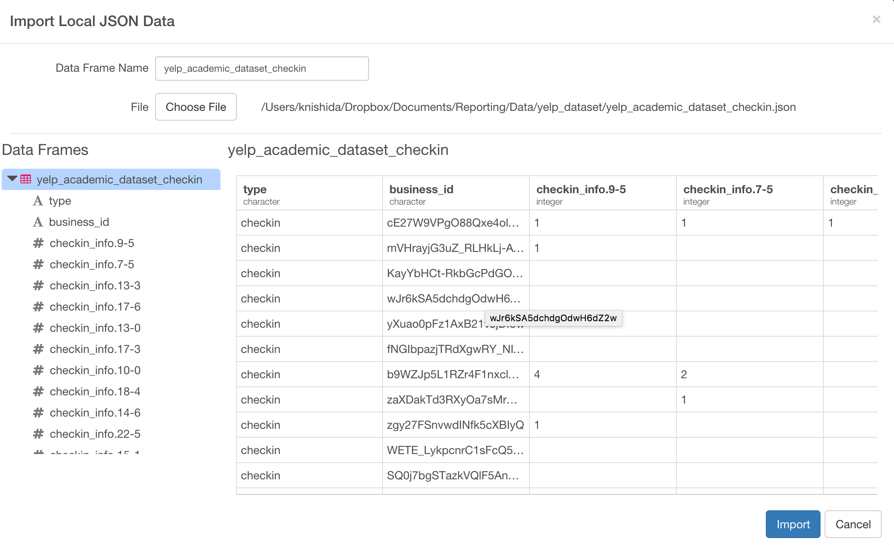
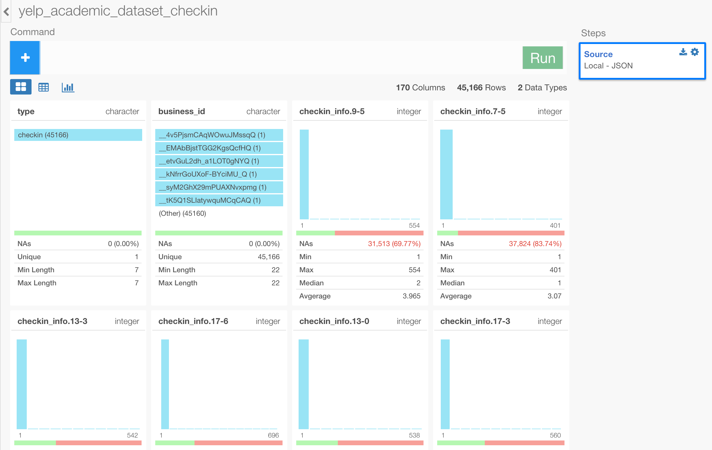
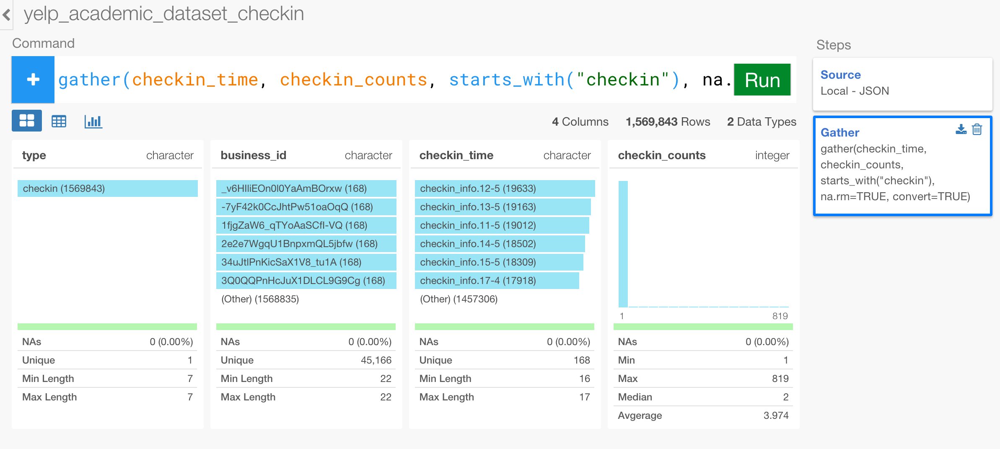
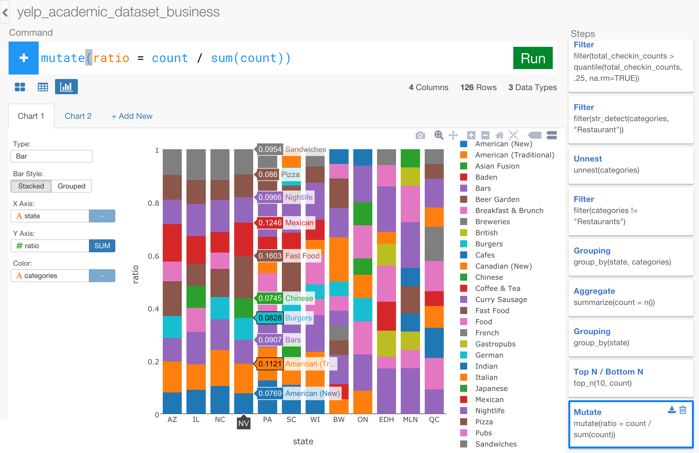

# Import Yelp Checkin data and Join with Business Review Data

The above analysis is interesting, but the problem is that we treated every business equally when we evaluated what restaurant types are the most common for each state. But let's think about this super simplified scenario for a second. There are only two restaurants in this particular area, and one of them is Mexican restaurant that takes 200 customers every day and the other is Italian restaurant that takes only 10 customers a day ? Obviously, we can tell intuitively Mexican restaurant type is a lot more popular in this area. So it could have been better if we had an information about the popularity for each restaurant and gave different weights to the restaurants based on that information. This way, we can have a better sense of what type of restaurants are really popular for each state.

Luckily, there is another data called 'Yelp Academic Dataset Checkin' - [downlod link](https://www.dropbox.com/s/ve3ska89muqs2x0/yelp_academic_dataset_checkin.json?dl=0), which has an information about how many people had checked-in to each business at various time ranges. We can bring in this data and join this to the previous data frame 'yelp_academic_dataset_business', and see how the result will look different.

This 'Yelp Academic DataSet Checkin' data is also in JSON format and it looks like below.

```
{
  "checkin_info": {
    "17-6": 1,
    "15-3": 1,
    "15-2": 1,
    "15-5": 12,
    "15-4": 2,
    "15-6": 11,
    "18-4": 3,
    "18-5": 7,
    "18-6": 2,
    "16-6": 4,
    "14-6": 1,
    "0-5": 1,
    "19-4": 9,
    "19-0": 1,
    "19-2": 1,
    "13-6": 2,
    "14-5": 1,
    "20-5": 1,
    "20-4": 2,
    "16-2": 1,
    "16-3": 6,
    "17-5": 10,
    "17-4": 4,
    "17-3": 4,
    "17-2": 1,
    "16-4": 14,
    "16-5": 2,
    "21-4": 2
  },
  "type": "checkin",
  "business_id": "tv8cS4aaA1VDaInYgggb6g"
}
```

This is a snippet (one row) of the data that we extracted for one business. You would notice that there is a bunch of key-value pairs like ```"17-6": 1``` inside ```checkin_info``` node for each ```business id```. It shows how many people checked-in to this particular businesses at a given time range.

This 'key-value' part of the data is very common with JSON data format, and it could be a bit tricky to deal with. But with Exploratory, it's pretty straightforward and delightfully simple, thanks to the underlying data transformation framework provided by amazing R packages like 'tidyr', 'dplyr', 'jsonlite'. Let's start.  

## Import sample data

First, download the yelp checkin data from the link below.

- [yelp_academic_dataset_checkin](https://www.dropbox.com/s/ve3ska89muqs2x0/yelp_academic_dataset_checkin.json?dl=0)

Inside the project, you can click a plus '+' icon next to 'Data Frame' text in the left side pane to import 'yelp_academic_dataset_checkin.json'.

After you select the file from the file picker dialog and hit OK, you'll see the first 10 rows of the data you're importing. Click 'Import' button.




Once the data is imported, you can find that there are 170 columns and 45,166 rows. There are so many columns because all the key-value pairs inside 'checkin_info' node are now flattened out to become columns.



## Gather the 'checkin_info' columns

In this particular analysis, we are not really concerned about what time people had checked in to each business, rather we want to know how many people had checked in to each business as total. This will be enough to give us a sense of the popularity for each business.

To be able to calculate the total numbers, we want to bring these 168 ```checkin_info``` columns into two columns, one for the ```key``` and another is for the ```value```. The ```key``` column will hold the information of the time range (e.g. '10-5') and the ```value``` column will hold the number of the checkins. Once this is done, then it will be much easier to sum up all the 'checkins' count numbers for each restaurant.

We can use ```gather()``` command to do this magic, which is to bring those columns into the two columns, like below.

```
gather(checkin_time, checkin_counts, starts_with("checkin"), na.rm=TRUE, convert=TRUE)
```

You can set a name for the newly created columns of ```key``` and ```value``` columns, then set the range of the columns that you want to bring in. In this case, all the columns that we want to bring in starts their names with 'checkin' so we can use ```starts_with()``` function to select them all. And there are many NA values in those 168 columns that we don't really care about, so we can drop them as part of this operation. The last ```convert``` argument enables it to guess the most appropriate data types for those two newly created columns based on the actual values.

Once you hit 'Run', now you can see only 4 columns, but the total number of rows has increased to be about 1.6 millions. You can also see the data types are appropriately mapped as 'character' for the ```key``` column and 'integer' for the ```value``` column.



You might want to see the result in Table view better.


## Summarize total checkins for each restaurant

Now, let's count the total number of the 'checkins' for each restaurant. First, we want to set the grouping level to 'business_id' like below.

```
group_by(business_id)
```
After you hit 'Run' button, add a new step and type ```summarize()``` command with ```sum()``` function like below to calculate the total number of the checkins for each business.

```
summarize(total_checkin_counts = sum(checkin_counts))
```

Once you hit 'Run' button you would notice that the range of the number of the checkins are from 3 to 62,646. Note that the businesses with no checkin have already been removed as part of the 'gather()' operation above.


Now, this data is ready to get joined to the 'yelp_academic_dataset_business' data frame. Let's join.

## Join Business Review and Checkin data frames together

Go to 'yelp_academic_dataset_business' data frame by clicking on it first.

Now, we want to join with the 'yelp_academic_dataset_checkin' data frame we have just prepared. But rather than doing the 'join' at the end, we want to do the 'join' at right before start filtering information at the 3rd step. You can insert a new step by simply clicking on the 2nd step of 'Select' at the right hand side, and hit '+' (plus) button. Now, you can add ```left_join()``` command like below.

```
left_join(yelp_academic_dataset_checkin)
```

In this case, both data frames happen to have the same column name as the join key column so you don't need to set the key column information explicitly.

Once you hit 'Run' button, you can see the 'total_checkin_counts' column has been just added to this data frame at the end.


You would notice that about 26% of the businesses have NA values, which means they don't have any checkin numbers.


## Keep the businesses with enough checkins.

Once we get the number of the checkin information we can use this to filter the data so that we can keep only the businesses with enough checkins. Let's do something like below, which is to keep the businesses whose checkin numbers are in the 25 percentile, meaning 'the top 75%'.

```
filter(total_checkin_counts  > quantile(total_checkin_counts, .25, na.rm=TRUE))
```

Once you hit 'Run', you can see the total number of the rows are 33,010 and the range of the 'total_checkin_counts' are now between 13 and 62646.


## Find the final result

Simply, click the last step 'Mutate'.

You can see the top restaurant categories. Yes, you don't have to go through the steps you had previously done already! ;)


And when you go to Chart view, you can observe some patterns. You could tell the first seven states are US States even without looking at X-Axis label! ;)


