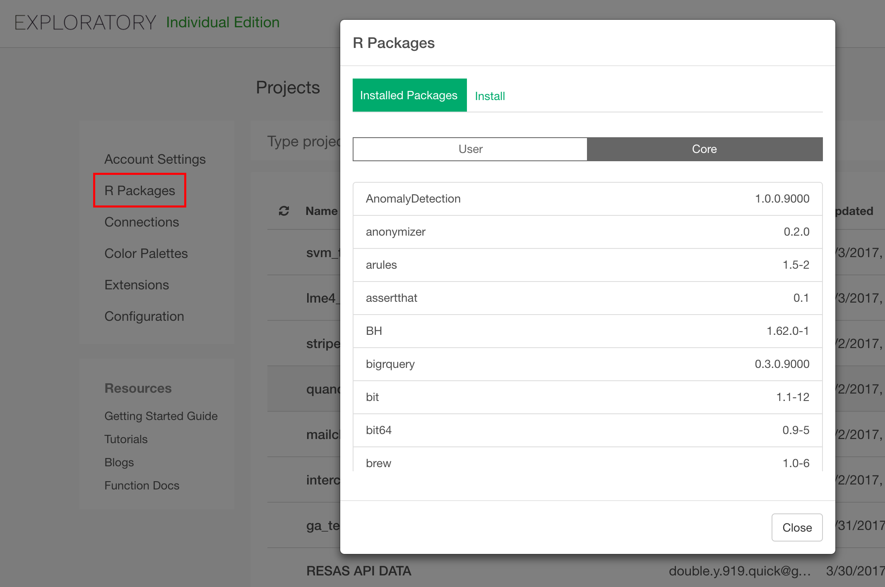
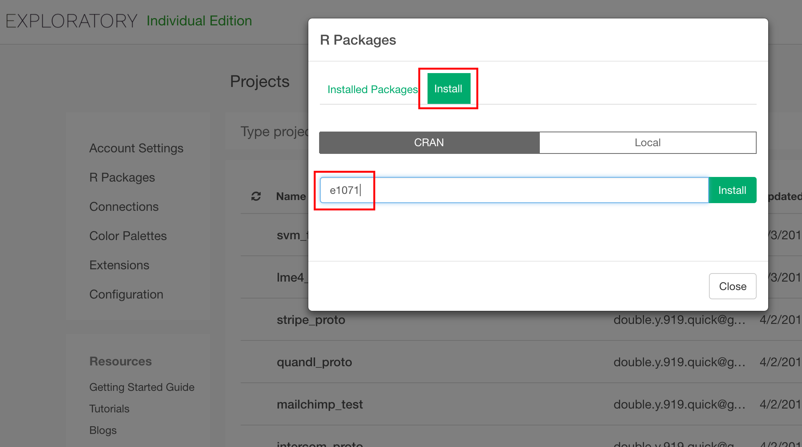
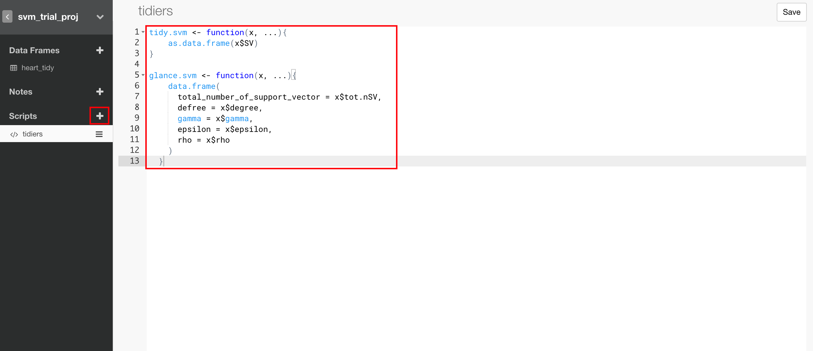
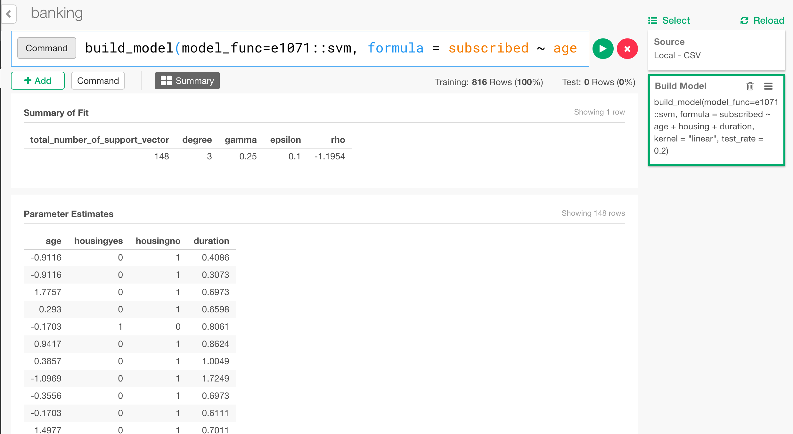
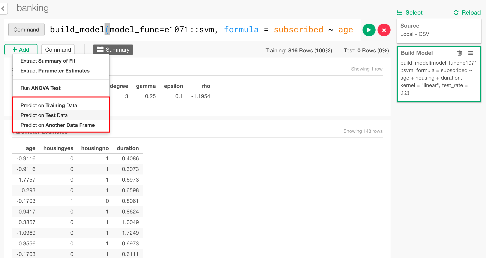
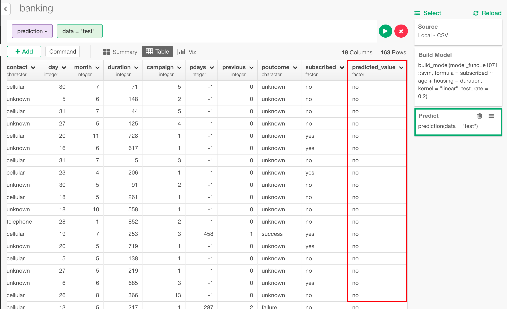

# Use Custom Model Function

Exploratory provides a framework with which users can define and use custom model functions. This is an introduction of how to do it.

## Custom Model Function Overview

build_model function defined in [exploratory R package](https://github.com/exploratory-io/exploratory_func) and functions in [broom package](https://github.com/tidyverse/broom) make it easy to use model functions in Exploratory.
Steps to use model functions are explained below using **svm** function from [e1071](https://github.com/cran/e1071) packages as an example.

## Model Class Name
First, we need to determine an R class name for the model. It is the class name of the object that is returned by the model building function. In this case, it is "svm". (This is the model class name used by e1071 package we are making use of.)

## Model Building Function
Next, we need to define a model building function.
Model building function needs to take following arguments.

1. formula : Formula that defines what to predict from which predictors.
2. data : Training data for building the model.

The model building function needs to return model object with the model class name we determined in the previous step.
This means the function definition should look like the following.

``` r
svm <- function(formula, data, ...) {
  # Create model object here.

  # Set the model class name of the model object.
  class(model_object) <- c("svm")
  model_object
}
```

Fortunately, in this case, e1071 package already has such a function, which means we don't need to implement it.
Note that the function name in e1071 happens to be "svm", which is same as the model class name, but model building function name and model class name generally does not have to be the same.

### Install R Package

Instead of defining model building function, we use e1071's svm function as the model building function.
We need to install e1071 package to do so.

There are many R packages with model building functions in this format, which you can make use of as they are, just like e1071.

The package you need may or may not be installed already as part of installation of Exploratory. Packages already installed can be checked from project list view.



You can install R package from install tab. In this case, it's e1071.



## Define Functions to Show Model Summary

Exploratory shows summary of model in table format when it's created. Let's define functions to extract the model summary info from the model object as data frames.

**tidy** and **glance** function from [broom package](https://github.com/tidyverse/broom) are the framework we make use to extract model summary as data frames. To make use of this framework for a model object class (such as "svm"), the functions for the model object class has to be defined. For some models, those functions are already defined. Such models are listed in the [broom github page](https://github.com/tidyverse/broom). Since svm is not one of them, let's define functions for it.

You can define those functions in **Scripts**



In svm case, you can define the functions like below.
Note that we do not need to define model building function here because we are using e1071's svm function as is, but if this is not the case for a model you are using, you will need to define it here too.

grance function for svm class
``` r
glance.svm <- function(x, ...){
  data.frame(
    total_number_of_support_vector = x$tot.nSV,
    degree = x$degree,
    gamma = x$gamma,
    epsilon = x$epsilon,
    rho = x$rho
  )
}
```

tidy function for svm class
``` r
tidy.svm <- function(x, ...){
  as.data.frame(x$SV)
}
```

Here are some explanation on the code above.

- **x** is the model object and these functions are expected to return a **data frame**.
- Usually, glance returns one row data frame with statistical values and tidy returns data frame with multiple rows, but it is just a conventional rule.
- `...` argument is necessary to avoid errors even if you don't really need extra arguments.

## Apply Model Function to a Data Frame

You can now call model function from command line mode. Please open the data frame you want to apply the model function. Here, svm is applied to this data.
- [Bank Account Data](https://exploratory.io/data/yosuke/7797836164735084)

You can run command below to this data now.

```
build_model(model_func=e1071::svm, formula = subscribed ~ age + housing + duration, kernel = "linear", test_rate = 0.2, seed = 1)
```

You can see model summary view like this. "Summary of Fit" is the result from **glance** function and "Parameter Estimates" is the result from **tidy** function.



Here, test_rate and seed are arguments for build_model. __test_rate = 0.2__ means 20% of the data will be used for test and 80% of the data is used for training. __seed = 1__ means 1 is a random seed to split training data and test data by sampling. __formula = subscribed ~ age + housing + duration__ and __kernel = "linear"__ is a parameter for e1071::svm. You will see summary of the created model like this.

### Use the Model for Prediction

You can also use the model for prediction. By defining **augment** function for the models, which is also from [broom package](https://github.com/tidyverse/broom). You can define it like this for svm for example.

``` r
augment.svm <- function(x, data = NULL, newdata = NULL, ...) {
    if(is.null(newdata)){
        if(is.null(data)){
            stop("data or newdata is needed")
        }
        data$predicted_value <- x$fitted   
        data
    } else {
        predicted <- predict(x, newdata)
        newdata$predicted_value <- predicted
        newdata
    }
}
```

**x** is the model, **data** is training data frame and **newdata** is data frame to be used for prediction. This is how to put predicted result of each row to data frame. If you add this to custom script, you can now use prediction from UI.



The result looks like this.




## Examples

- [Using H2O Powered Machine Learning Algorithms in R & Exploratory](https://exploratory.io/note/exploratory/Using-H2O-Powered-Machine-Learning-Algorithms-in-R-Exploratory-Jcn4oyt6)
- [Building Deep Learning Models with Keras inside Exploratory](https://exploratory.io/note/exploratory/Building-Deep-Learning-Models-with-Keras-inside-Exploratory-wSW9HTl4)

- [スピードがむちゃくちゃ早いと有名なH2Oの機械学習アルゴリズムを試してみる](https://exploratory.io/note/exploratory/H2O-sHL2Huo3)
- [Exploratoryから直接kerasにアクセスしてディープラーニングする](https://exploratory.io/note/exploratory/Exploratory-keras-Ggd3oWB2)

