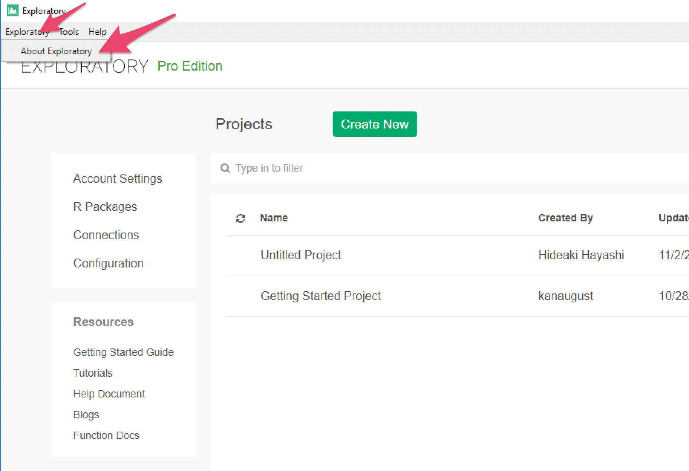
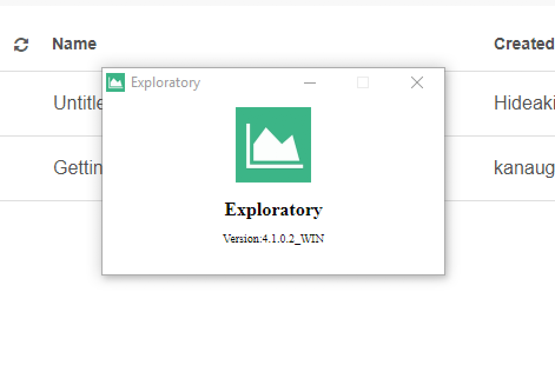

# Check version of your Exploratory Desktop

You can check version of your Exploratory Desktop from the "About Exploratory" sub-menu under "Exploratory" menu.

It will show a popup with version number.

