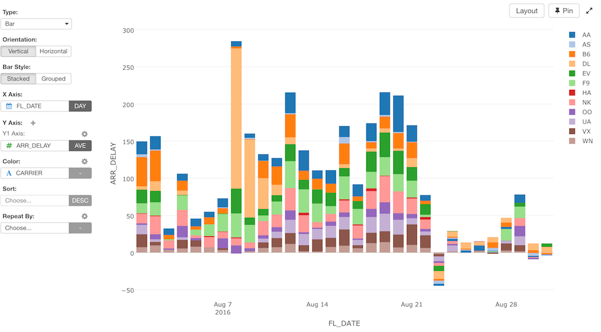
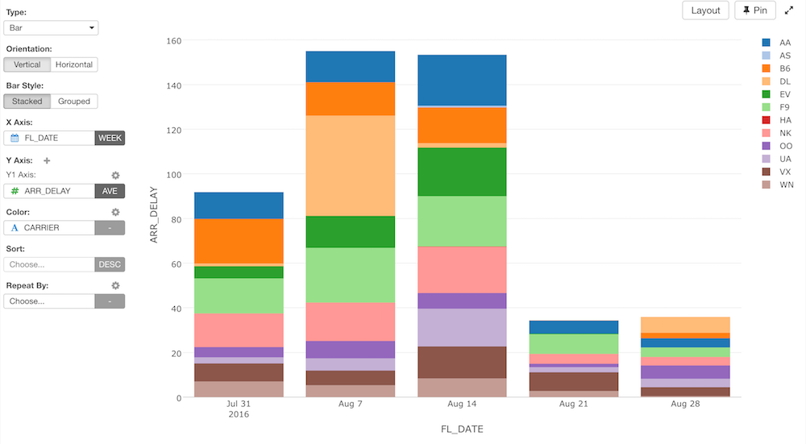
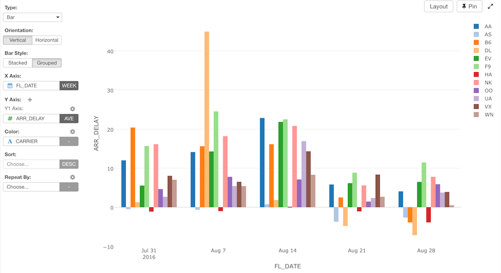

# Bar Chart

## Column Assignments

* X-Axis - Assign a column you want to show at X-Axis. If it's a Date / Time column assigned, you can select the aggregation level such as Month, Week, Day, etc.
* Y-Axis - Assign a column you want to show at Y-Axis. If it's a Numeric column assigned, you can set the aggregation function suhc as 'sum', 'mean (average)', etc. to aggregate the values.
* Color - Take a look at Color section for more details.
* Sort - Assign a column to use for Sorting the X-Axis values. The default is based on either the alphabetic order or the factor level order for Factor type columns.
* Repeat By - You can assign a column to repeat the chart for each of its values. Take a look at Small Multiple section for more details.

You can assign multiple columns to Y-Axis. Take a look at Multiple Y-Axis section for more details.

## Orientation - Horizontal vs. Vertical

## Bar Type - Stacked vs. Grouped

Stacked

Grouped

## Layout Configuration

Take a look at [Layout Configuration](viz/layout.md) on how to configure the layout and format. 
