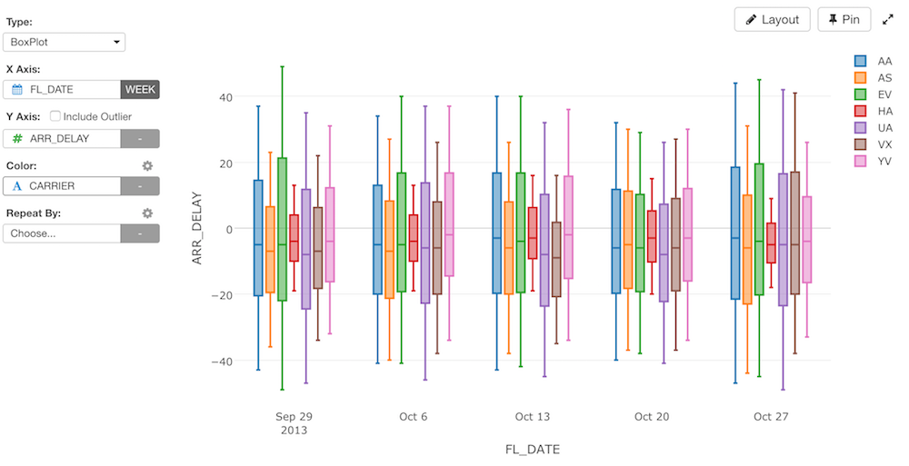

# Boxplot Chart

## Column Assignments

* X-Axis - Assign a column you want to show at X-Axis. If it's a Date / Time column assigned, you can select the aggregation level such as `Month`, `Week`, `Day`, etc. If you assign a Number column, you can choose either `As Number` to treat values as continuous values or `As Text` to treat values as categorical values.  
* Y-Axis - Assign a column you want to show at Y-Axis. You can include/exclude the outlier by the `Include Outlier` checkbox.
* Color - Take a look at [Color](color.md) section for more details.
* Sort By - Assign a column to use for Sorting the X-Axis values. The default is based on either the alphabetic order or the factor level order for Factor type columns. You can also select which aggreagation function for sorting from the Sort Setting dialog. The following aggregation functions are available.
  * Sum
  * Mean (Average)
  * Median
  * Min Value
  * Max Value
  * First 
  * Last
  * Standard Deviation
  * IQR (Interquartile Range)
* Repeat By - You can assign a column to repeat the chart for each of its values. Take a look at [Repeat By](small-multiple.md) section for more details.

## Highlight 

You can change the color of the specific markers such as bars, lines or circles that you pick to stand out from others. See [Highlight](highlight.md) for the detail. 

## Category 

You can categorize numeric values inside the chart. See [Category(Binning)](category.md) for the detail.

## Limit Values

You can use Limit Values to filter the categories by the aggregated values. See [Limit Values](limit.md) for the detail.

## Missing Value Handling

You can use the Missing Value Handling feature to control missing values. See [Missing Value Handling](missing-value-handling.md) for the detail.

## Layout Configuration

Take a look at [Layout Configuration](layout.md) on how to configure the layout and format. 

## Save as an Image

You can save the chart as an image file. See [Save as PNG/SVG](save.md) for more details.
