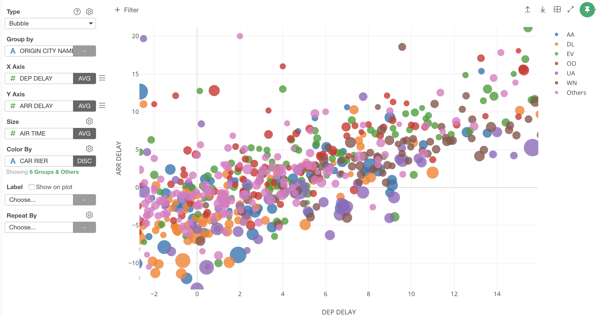

# Bubble Chart

You can show the distribution of the data by circles. It is similar to the Scatter chart, but the Bubble chart can show the distribution of the aggregated data. 

## Column Assignments

* Group by - Assign a column you want to group by. 
* X-Axis - Assign a column you want to show at X-Axis. You can choose how to aggregate the data for each bubble such as sum, average. 
* Y-Axis - Assign a column you want to show at Y-Axis. You can choose how to aggregate the data for each bubble such as sum, average.  
* Size - Assign a column you want to apply the size on each bubble. You can assign a number based column only. 
* Color - Assign a column for color. If you assign a categorical column, it will be also used as a groupby column. Take a look at [Color](color.md) section for more details.
* Label - Assign a column you want to show in the balloon help that you see when you hover bubbles. 
* Repeat By - You can assign a column to repeat the chart for each of its values. Take a look at [Small Multiple](small-multiple.md) section for more details.

## Highlight 

You can change the color of the specific markers such as bars, lines or circles that you pick to stand out from others. See [Highlight](viz/highlight.md) for the detail. 

## Category 

You can categorize numeric values inside the chart. See [Category(Binning)](category.md) for the detail.

## Layout Configuration

Take a look at [Layout Configuration](layout.md) on how to configure the layout and format. 
