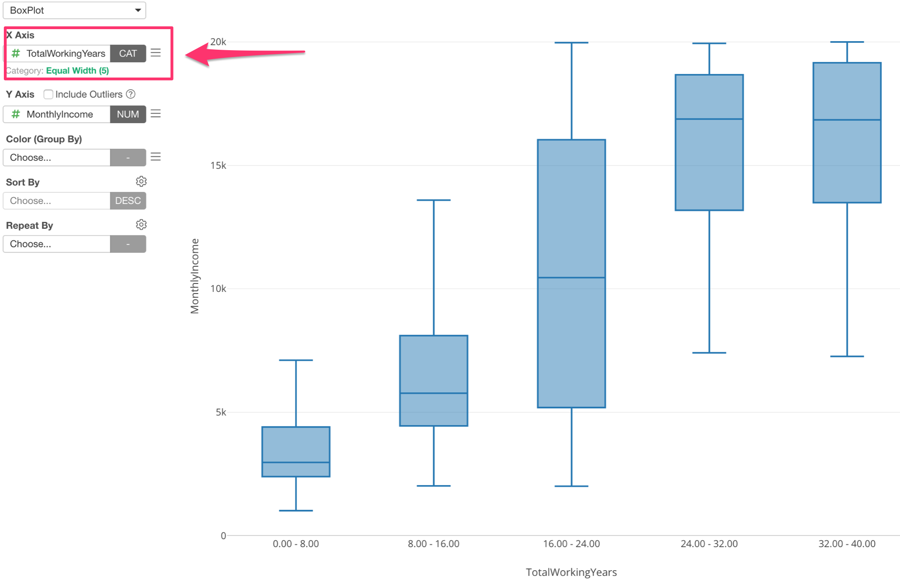
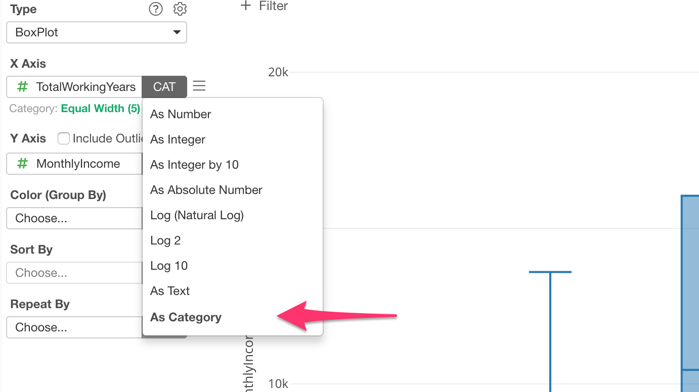
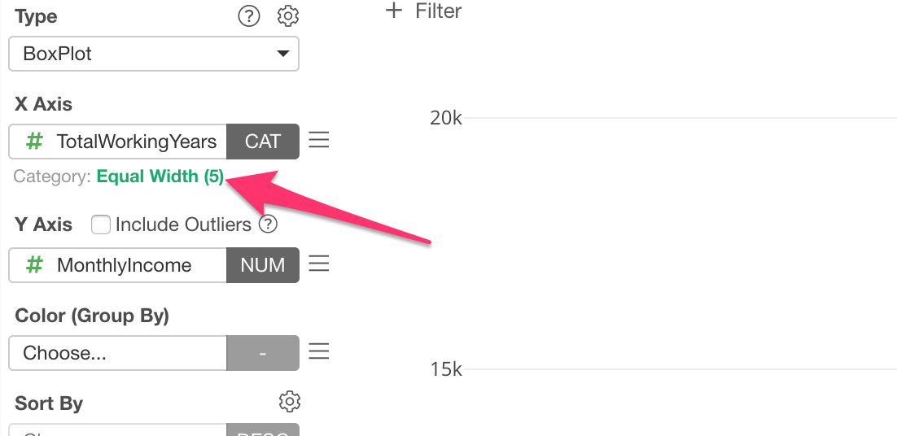
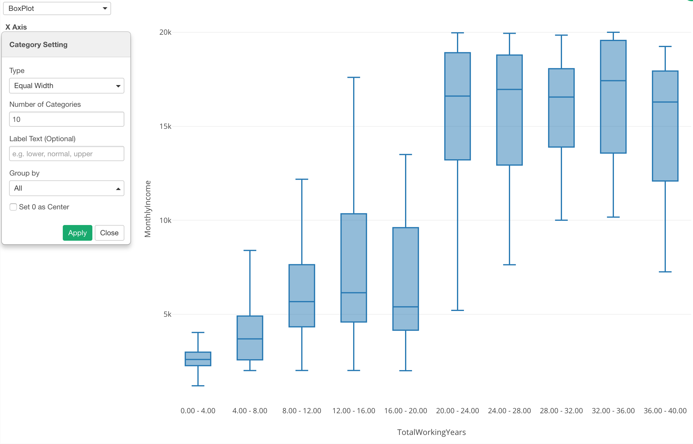
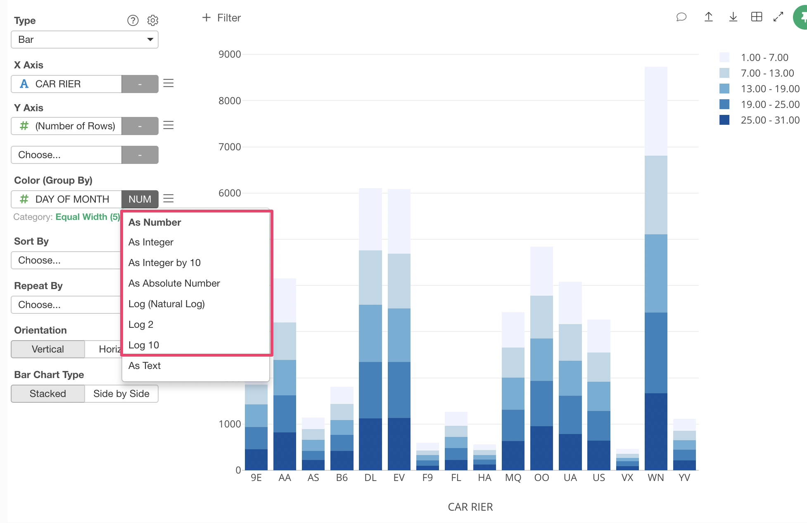
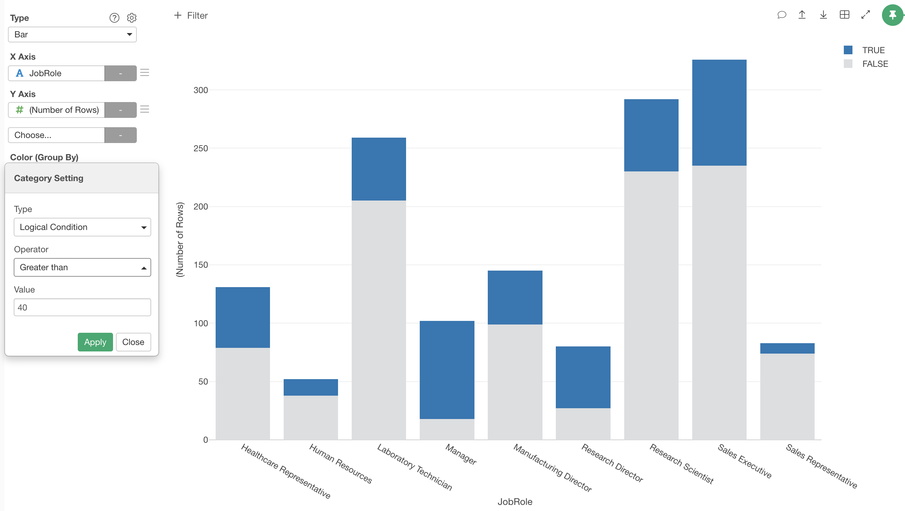

# Category (Binning) 

You can categorize numeric values inside the chart. Category is supported in following chart types.

* Pivot Table (Row Header, Column Header)
* Bar (X-Axis, Color, Repeat By)
* Line (X-Axis, Color, Repeat By)
* Area (X-Axis, Color, Repeat By)
* Ring / Pie (Repeat By)
* Histogram (Color, Repeat By)
* Density Plot (Color, Repeat By)
* Scatter (With Aggregation) (X-Axis, Y-Axis, Color, Group By, Repeat By)
* Boxplot (X-Axis, Color, Repeat By)
* Violin (X-Axis, Color, Repeat By)
* Error Bar (X-Axis, Color, Repeat By)
* Error Bar (Summarized Data) (X-Axis, Color, Repeat By)
* Map - Extension (Color)
* LongLat Map (Group By, Color)
* Heatmap (X-Axis, Y-Axis, Repeat By)

You can refer the [Exploratory v5.3 Released!](https://blog.exploratory.io/exploratory-v5-3-released-e3fbe3dd9910) for the overview of the Category feature. 

## Creating Categories in General

If you assign a numeric column, it automatically changes the function option to ‘As Category’ and divide values into 5 groups by default. The following example shows assigning a numeric column to X-Axis of a Boxplot chart. 

You can see ‘As Category’ option is assigned. 

You can open the property dialog by clicking on the green text.

You can change the setting in the property dialog. The following example shows setting the number of categories to 10 from 5. 

## Creating a Category at Color

If you assign a numeric column at Color, it divides the values into 5 groups by default as well as others. The difference is that the function option is set to "As Number". 

In case of Color, the output of any numeric functions such as "As Integer by 10", "Log 2", "Log 10" are automatically categorized.  

## Category Types 

It supports the following category types. 

### Equal Width 

It divides numeric values into groups by the data range. Each group has an equal data range. This the default type. 

Following options are available. 

* Number of categories: Number of categories to create.
* Label Text: Names for categories separated by commas.  
* Group By: Target data group to create categories. 
  * All: Create categories against the whole data set. If you use Repeat By, all charts will have the same data range. 
  * Repeat By: Create categories for each chart if you use Repeat By. Each chart will have a different data range. 
* Set 0 as Center: It uses 0 as a center value when it creates categories.
* Upper Range: You can set the upper value range for creating categories. If you don't specify, the max value will be used.
* Lower Range: You can set the lower value range for creating categories. If you don't specify, the min value will be used.
* For Values Outside of Range: If you specify the Upper/Lower Range, you can set how to treat values outside the range. The following options are available.
  * Create Groups: Create extra groups for the values outside the range.
  * Ignore

### Equal Frequency 

It divides the numeric values into groups by the number of data points. Each group will have the same amount of data points (data rows). Note that it won't be exactly the same number among groups if you have tied values. 

Following options are available.
* Number of categories: Number of categories to create.
* Label Text: Names for categories separated by commas.  
* Group By: Target data group to create categories. 
  * All: Create categories against the whole data set. If you use Repeat By, all charts will have the same data range. 
  * Repeat By: Create categories for each chart if you use Repeat By. Each chart will have a different data range. 

### Equal Step 

It divides numeric values into groups by the specified step (range). For example, if you specify "10", the group will be like "10-20", "20-30", "30-40" and so on. Each group has an equal data range. 

Following options are available. 

* Step: Range for each group.
* Edge Handling: Which end to include in each range. The following options are available.
  * Include Upper End
  * Include Lower End
* Upper Range: You can set the upper value range for creating categories. If you don't specify, the max value will be used.
* Lower Range: You can set the lower value range for creating categories. If you don't specify, the min value will be used.
* For Values Outside of Range: If you specify the Upper/Lower Range, you can set how to treat values outside the range. The following options are available.
  * Create Groups: Create extra groups for the values outside the range.
  * Ignore

### Manual

It divides numeric values into groups by the Cutting Point values that user-specified.  

Following options are available.

* Cutting Points: Boundary values of categories separated by commas. For example, if you enter "10, 20", it will create categories by splitting data at 10 and 20. 
* Label Text: Names for categories separated by commas.  
* Include Outside of the Range: If you check this, it will include the values outside of the Cutting Points. For example, if you enter "10, 20" at the Cutting Points, it will create 3 categories "-Inf - 10", "10 - 20" and "20 - Inf". If you uncheck this, it will ignore the values outside the Cutting Points. In this example, it will create 1 category "10 - 20". 

### Outliers

It divides numeric values into groups by the outlier detection rules. 

Following options are available.

* Outlier Type: Type of outlier detection. Following outlier types are available. 
  * IQR
  * Percentile 
  * Standard Deviation
* Threshold: You can specify the threshold values. Available for Percentile and Standard Deviation outlier types. 
* Label Text: Names for categories separated by commas.  
* Group By: Target data group to create categories. 
  * All: Create categories against the whole data set. If you use Repeat By, all charts will have the same data range. 
  * Repeat By: Create categories for each chart if you use Repeat By. Each chart will have a different data range. 

### Logical Condition 

You can define a logical condition to divide the data into 2 groups (TRUE and FALSE). Currently, this option is supported only at Color. 

Following operators are availbale. 

Numeric

* Equal To
* Not Equal To
* Is In (Multiple Values)
* Is Not In (Multiple Values)
* Less Than
* Less Than or Equal To
* Greater than
* Greater Than or Equal To
* Between
* Not Between
* Not NA
* Is NA
* Not Outliers
* Is Outliers"

Categorical (character, factor)
* Equal To
* Not Equal To
* Is In (Multiple Values)
* Is Not In (Multiple Values)
* Starts With
* Not Start With
* Ends With
* Not End With
* Contains
* Not Contain
* Is NA
* Not NA
* Keep Only Empty
* Remove Empty
* Keep Only Stopword
* Remove Stopword
* Keep Only Alphabet
* Remove Alphabet

Date/POSIXct 
* Relative Dates
* Equal To
* Not Equal To
* Is In (Multiple Values)
* Is Not In (Multiple Values)
* Earlier Than
* Earlier Than or Equal To
* Later Than
* Later Than or Equal To
* Between
* Not Between
* Is NA
* Not NA

Logical 
* Is TRUE
* Is FALSE
* Is NA
* Not NA

### None

Do nothing. 
