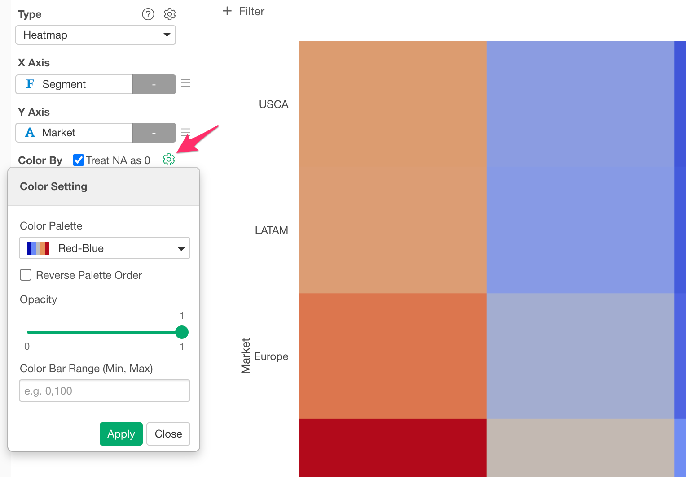
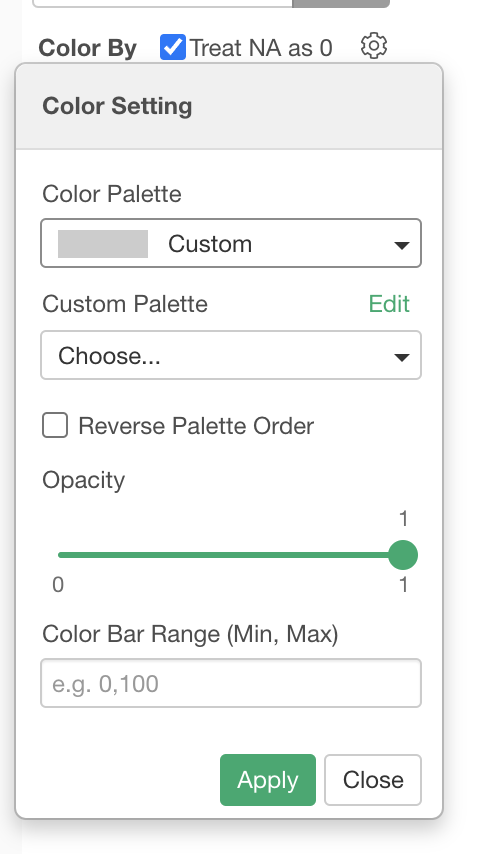
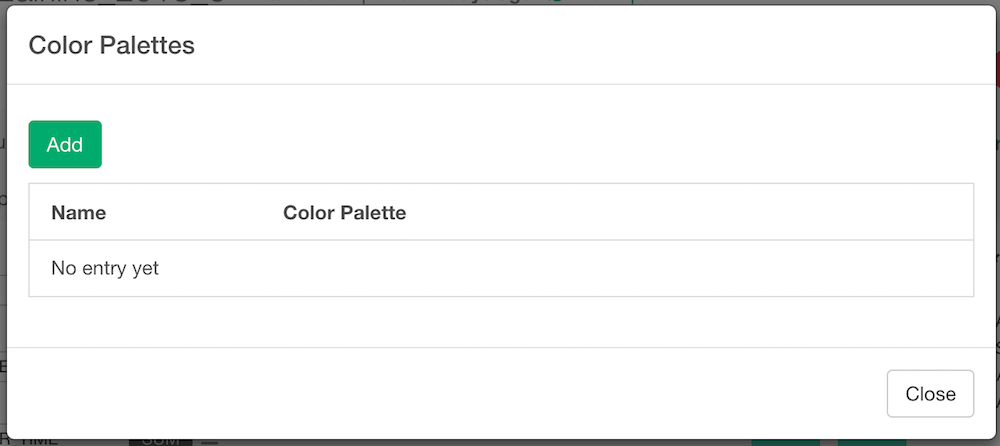
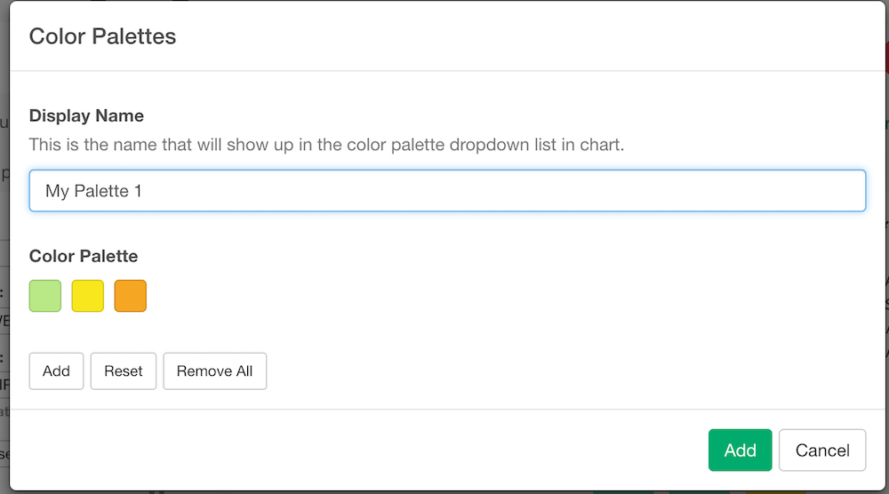
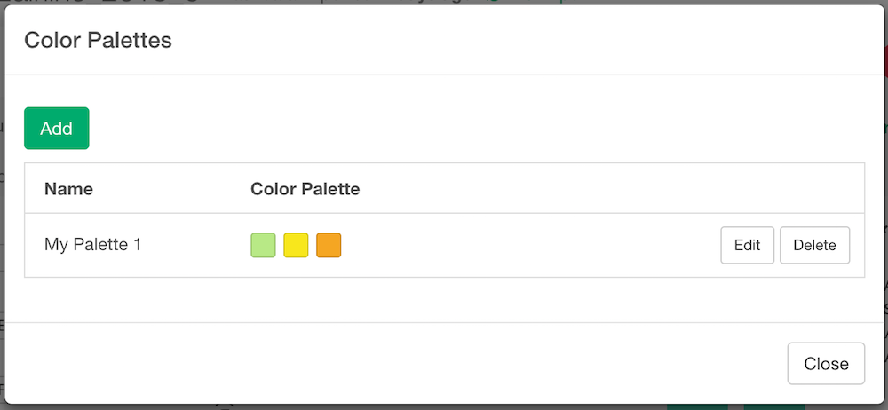

# Setting Color for Chart

You can assign a column to Color for most of the visualization types. We have written a [blog post](https://blog.exploratory.io/how-to-customize-the-color-palette-and-the-order-in-legend-3d780b567a9b#.tnmbhs2rh) as a reference.

## Stack or Group Bar chart

For Bar chart, you can assign a column with discrete values (text column) to Color and make it a Stack or Group bar chart.

The default is Stacked. You can switch it to Grouped bar chart from Bar Style option.

## Multi-Series Line chart

For Line chart, you can assign a column with discrete values (text column) to make it a multiple series line chart.

## Multi-Series Area chart

For Area chart, you can assign a column with discrete values (text column) to make it a multiple series area chart.

## Grouped Boxplot chart 

For the boxplot chart, you can assign a column with discrete values (text column) to make it grouped boxplot chart.

## Histogram

For the histograom, you can assign a column with discrete values (text column) to make it grouped histogram chart.

## Scatter chart 

For the scatter chart, you can assign a column with either discrete values (text column) to make it a grouped chart or continuous values (number column) to make it a grouped chart by value buckets. 

## Map (Long/Lat) 

For the Map (Long/Lat), you can assign a column with either discrete values (text column) to make it a grouped chart or continuous values (number column) to make it a grouped chart by value buckets.

## Map (GeoJSON)

For the Map (GeoJSON), you can assign a column with either discrete values (text column) to make it a grouped chart  or continuous values (number column) to make it a grouped chart by value buckets. 

## Heatmap 

For the Heatmap, you can assign a column with continuous values (number column). 

## Contour

For the Contour chart, you can assign a column with either discrete values (text column) or continuous values (number column) 

## Switch the color palette

You can switch the color palette for Bar, Line, and Area charts.

1. Click the gear icon next to 'Color' label text and select one of the pre-defined ones from Color Palette dropdown menu.

## Customize the color palette

You can create your own color palettes for discrete values. You can use it on Bar, Line, Area, Boxplot, Map and other charts that accept a column with discrete values at color. Here is how to build your own color palettes.

* Click the gear icon next to 'Color' label text and select 'Custom' from Color Palette dropdown.
* Click "Edit" right next to the "Custom Color Palette" to open the Color Palette dialog. 

* Click "Add" button to add a new Color Palette. It opens up a Color Palette Builder dialog

* Click "Add" to add a color to the Color Palette. Click the box to change the color. Once you finish, set a Display Name for this Color Palette and click "Add" button to add this Color Palette to the system.

* Make sure your palette is added to the system. 

