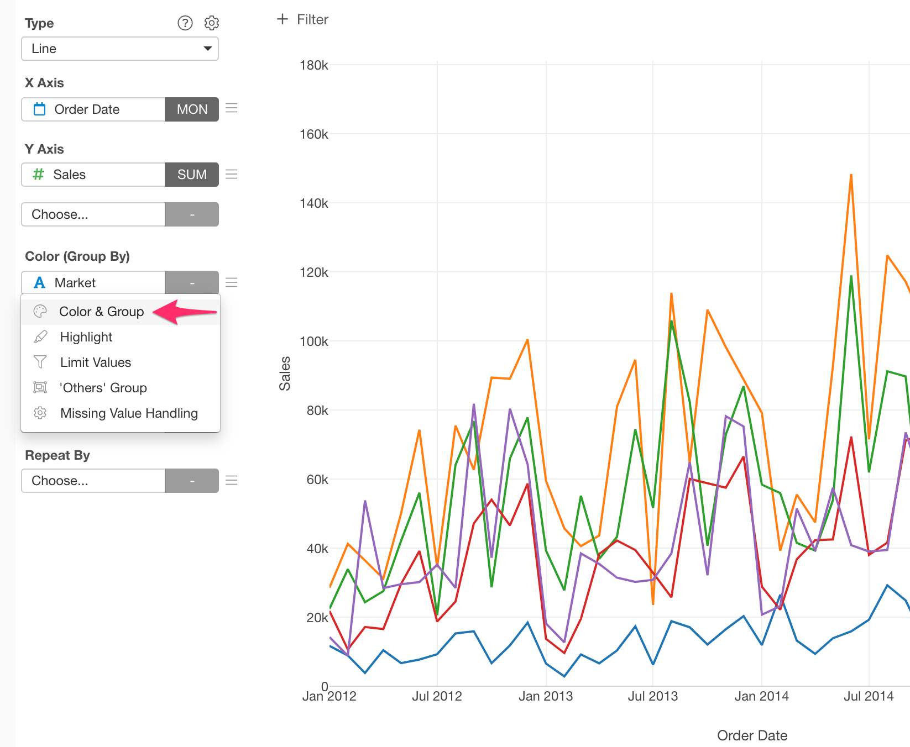
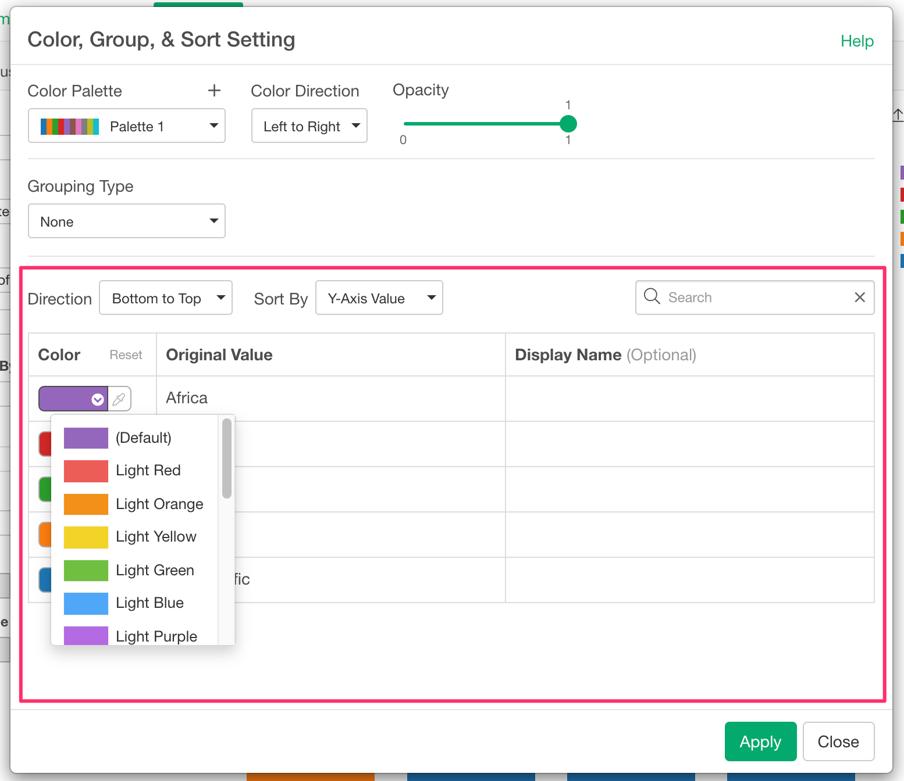

# Color & Group Setting

You can update the color and grouping settings in the Color & Group Setting dialog. 

## How to Open the Dialog

You can select the "Color & Group" menu from the column menu at Color. 

## Color Palette setting

You can set up the color palette in this section.

The following options are available.  

* Color Palette - You can select which color palette to use. It shows the system-defined palettes and user-defined palettes. 
* Color Direction - How you want to apply the colors on the palette. The default is "Left to Right". 
* Opacity - You can set the color opacity.

### Highlight Mode

You can use the Highlight Mode to highlight specific categories that you pick. You can select the "Highlight" menu in the Color Palette dropdown menu to start using it. See [Highlight](highlight.md) for the detail. 

### Edit User Color Palette

You can add/edit your color palette by selecting the "Edit Custom Color Palette" menu at the bottom of the Color Palette dropdown. See [User Color Palette](custom-palette.md) for how to use the User Color Palette dialog. 

## Grouping setting

You can set up the Grouping in this section. 

The following Grouping Types are available. The list of options may vary depending on the chart type and data type of the column that you assigned to the Color. 

* Equal Width - It divides numeric values into groups by the data range. Each group has an equal data range. 
* Equal Frequency - It divides the numeric values into groups by the number of data points. Each group will have the same amount of data points (data rows).
* Equal Step - It divides numeric values into groups by the specified step (range). For example, if you specify "10", the group will be like "10-20", "20-30", "30-40" and so on. Each group has an equal data range. 
* Manual - It divides numeric values into groups by the user-specified Cutting Point values.
* Outliers - It divides numeric values into groups by the outlier detection rules. 
* Logical Condition - You can define a logical condition to divide the data into 2 groups (TRUE and FALSE).
* None

See [Category](category.md#category-types) for the available options for each type.

## Customize Color and Display Name

You can customize the color and display name for each category in this section. 

The following settings are available.  

* Direction - You can choose the sort direction. 
  * Factor type column at Color
    * Factor Level
    * Factor Level (Reversed)
  * For a column with any other type 
    * Top to Bottom
    * Bottom to Top
* Sort By - You can choose the base values for the sort. It is available on Bar, Line, Area, Pie, Scatter (With Aggregation) and Error Bar, and if you assign a character type column to Color. The following options are available. 
  * Alphabetical 
  * Y-Axis Value 
 
<!--
Use this once #26183 is in the product.

* Sort By - You can choose the base values for the sort. It is available on Bar, Line, Area, Pie, Scatter (With Aggregation) and Error Bar, and if you assign a character type column to Color. The following options are available. 
  * Original Value 
  * Display Name
  * Y-Axis Value 

-->

### Show as 'Others' for not highlighted values

If you use the Highlight Mode and you have many categories, you can show as 'Others' for not highlighted values to make the legend simpler. This option also makes the chart rendering faster so you can use it if you feel the chart rendering is slow. 

You can turn it on/off by the checkbox at the bottom of the table. 

It is available in Scatter (No Aggregation) and Scatter (With Aggregation) chart types.

