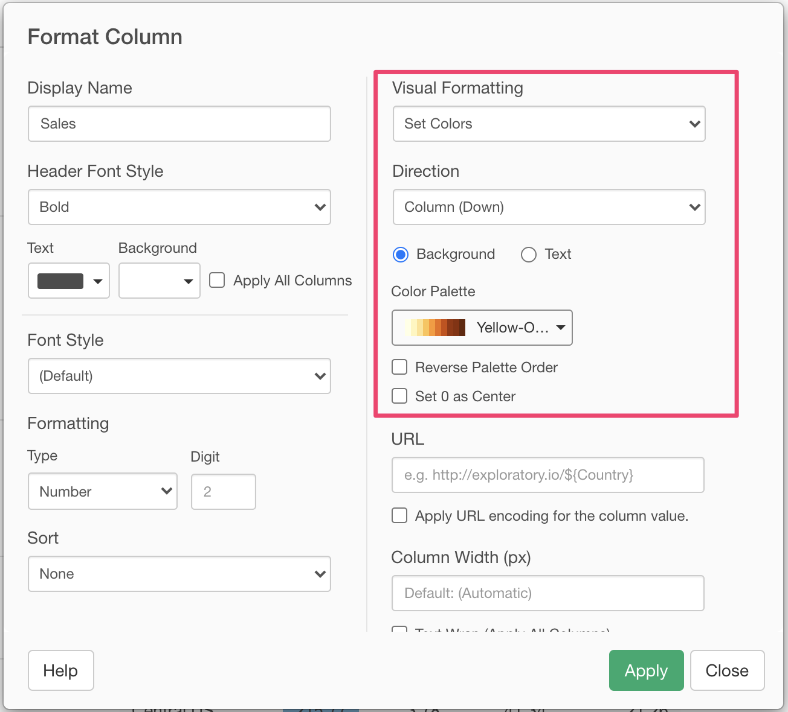

# Column Configuration Dialog 

You can change the format of the target column in the Column Configuration Dialog. 

## Display Name 

You can set the column display name that you want to use. 

## Header Font Style

You can set font styles that you want to use for headers.

## Font Style

You can set font styles that you want to use for text in cells.

## Function 

You can choose the column function you want to apply to the column data if available. The following functions are available depending on the data type of the target column. 

### Character 

* Uppercase
* Lowercase
* Titlecase
* Extract Alphabets
* Extract Numbers
* Extract First Word
* Remove Spaces
* Remove Repeated Spaces
* Remove Alphabets
* Remove Numbers

## Sort 

You can set the sort order of the column. You can set either "Descending" or "Ascending". You can set the sort order in multiple columns. In this case, the sort happens in the priority order. 

In case of Summarize Table, there will be no priority option. If you set a sorting option in one place, the sorting option you set in other place will be reset. 

## Number Formatting

You can set Number Formatting for numeric columns. The following formatting options are available. 

* Type
  * Number: Format as simple numbers. This is the default type.
  * Currency: Format as currency. If you set a currency symbol, it will be added at the beginning of each number. 
  * Percentage: Format as percentages. "%" sign will be added at the end of each number. 
* Digit: Number of decimal digits.
* Symbol: Current symbol. It will be added to it will be added at the beginning of each number if the "Currency" type is selected. 

## Date Formatting
You can set the date formatting for Date and POSIXct columns at the "Formatting" section. 

## Text Wrap

You can enable Text Wrap option to allow showing the text in multiple lines. 

## URL Link

You can set a URL Link on the column. You can dynamically construct the link with the associated column values by referencing the column name by `${}`. Once you define a URL Link, the column value will be clickable and if a user clicks the value, it opens up the URL in an external browser. 

For example, if you have a "Country" column in your table, you can set the URL `http://exploratory.io/?q=${Country}`. Then, the table output will look like this.

If you click "Germany", a browser opens up the URL `https://exploratory.io/?q=Germany`

If you want to use values as a URL parameter, check the "Apply URL encoding for the column value." checkbox.

## Column Width (px)

You can set a column width. The unit is pixel. 

## Visual Formatting 

You can set a Visual Formatting on each column. Visual formatting is available only for the numeric columns. 

### Show Bars on Background

You can show inline bars in the column value cells. The bar length is depending on the column value. You can choose colors for positive values and negative values.  

The output will look like this. 

### Set Colors

You can apply a color encoding to the column values. You can choose a color palette to apply from the list. You can apply colors to either the value text or background color. 

This is the example of the color encoding applied to the background color. 

### Set Colors Conditionally

You can apply a specific color only for the values that meet the condition. You can choose an operator and enter the value to construct a condition, and you can choose a color to apply from the list. You can apply colors to either the value text or background color. 

You can create multiple conditions by clicking "+" icon. The conditions are evaluated from the top to bottom. You can remove unnecessary conditions by clicking "x" icon.

The following operators are available. 

* equal to
* not equal to
* is in
* is not in
* less than
* less than or equal to
* greater than
* greater than or equal to
* between
* not between

This is the sample output of the Conditional Formatting. 

## Direction

For "Show Bars on Background" and "Show Color" visual formattings, you can choose how you group the Values for the color formatting at the Direction option. The following Direction types are available.

### All (Down then Across)

It formats Value cells for the entire pivot table. 

### Row (Across)

It formats Value cells for each row. 

### Column (Down)

It formats Value cells for each column. 

### Column (Down within Group)

It formats Value cells for each column within each row group, which means the 2nd Row Header group from the right.  

### Column (Down then Across within Group)

It formats Value cells for each row group, which means the 2nd Row Header group from the right.  

