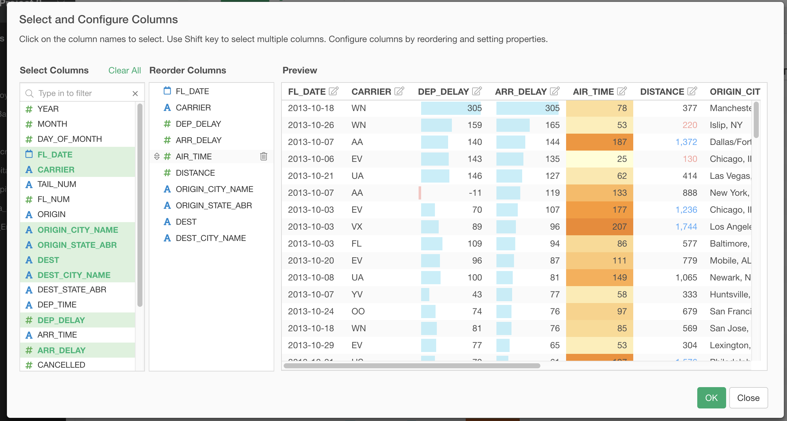
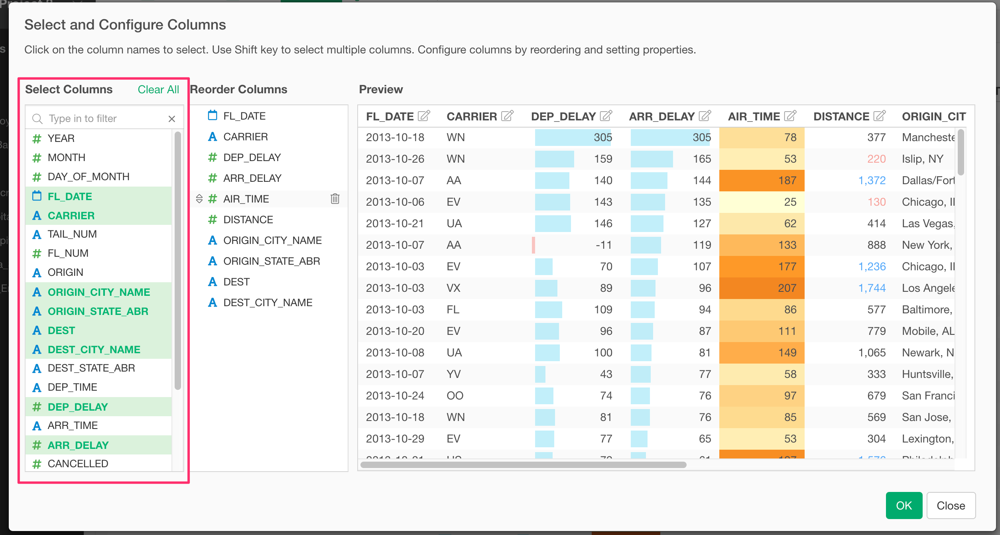
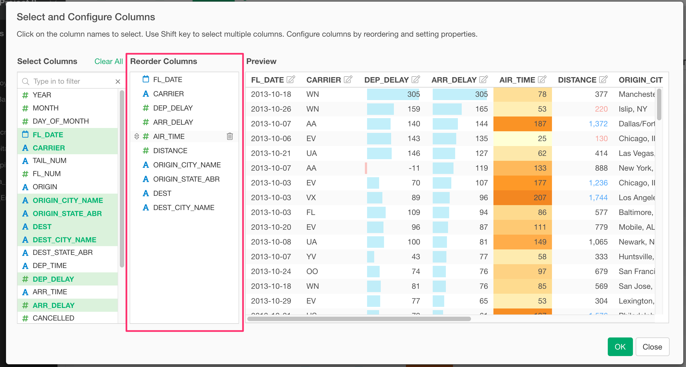
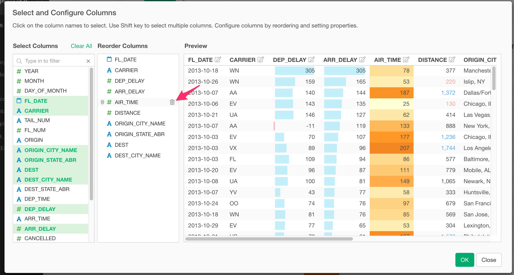
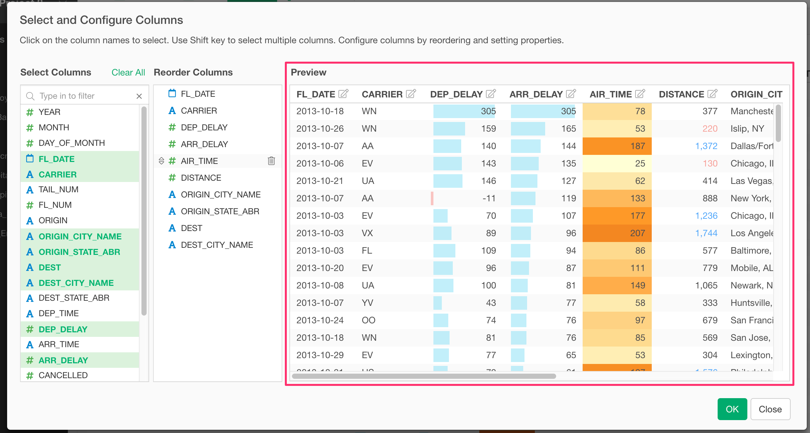
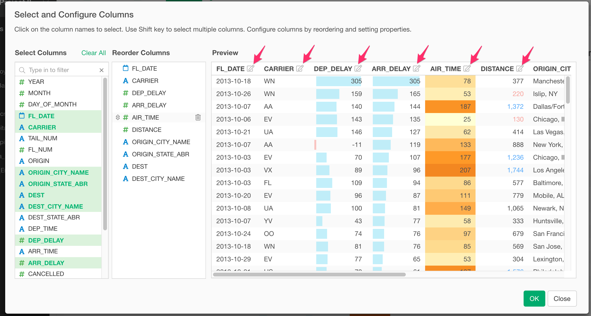
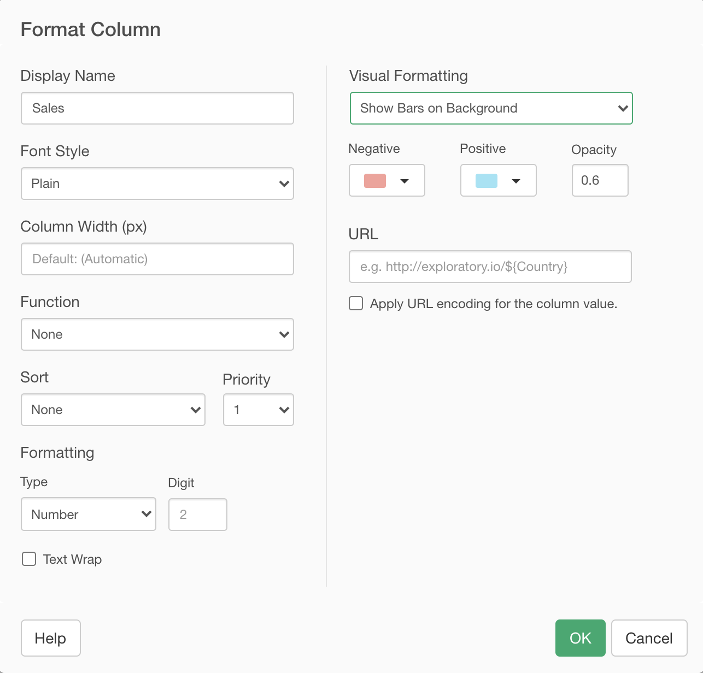

# Select and Configure Columns 

At "Select and Configure Columns", you can configure which columns to show and how each column shows. 

## Select Columns 

You can select which columns to show at "Select Column" section on the left-hand side of the dialog. You can click to select a column and click again to unselect the column. You can use "Shift+Click" to select multiple columns at a time. 

## Reorder Columns 

You can reorder columns at the "Reorder Columns" section in the center of the dialog. You can drag and drop to change the order of columns. 

You can also remove a column by clicking the trash icon that you see when you hover a column. 

## Preview 

You can preview the table at the "Preview" section on the right-hand side of the dialog. 

You can also configure the format of each column from the Column Configuration Dialog. You can open the Column Configuration Dialog by clicking the "Edit" icon at the table header. 

## Column Configuration Dialog 

You can change the format of the target column in the Column Configuration Dialog. See [Column Configuration Dialog](viz/column-configuration-dialog.md) for more details.

