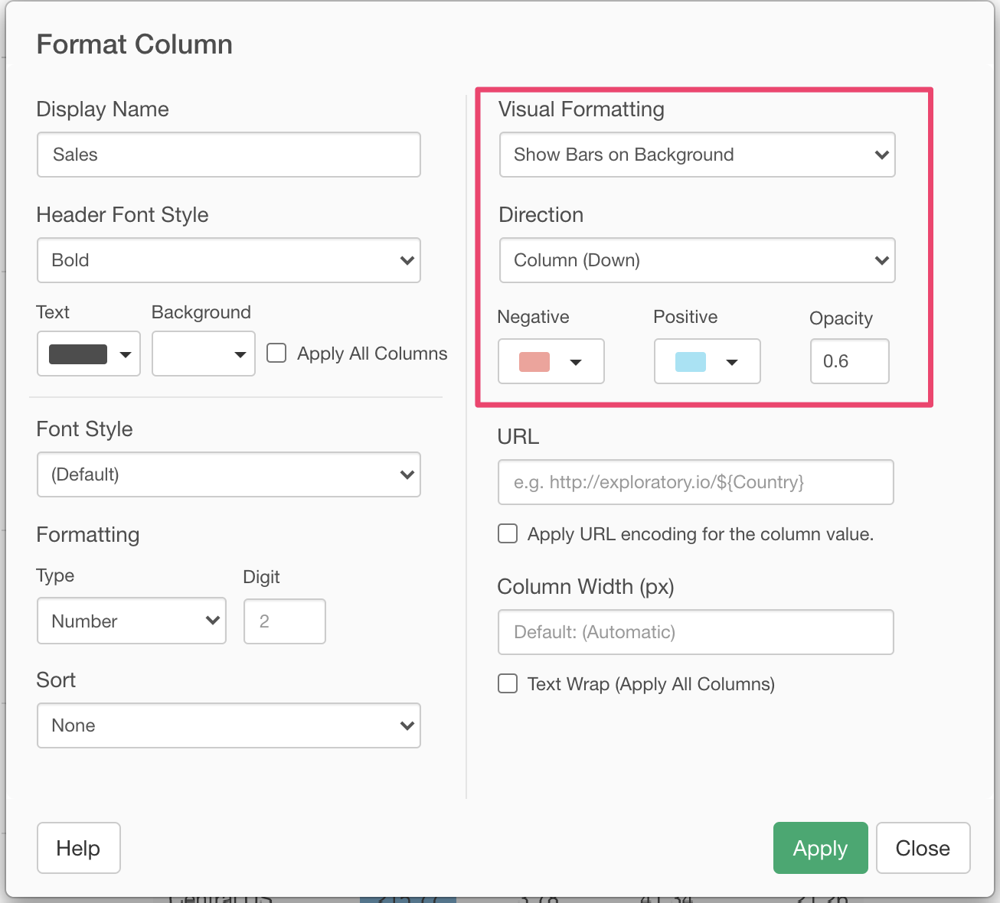
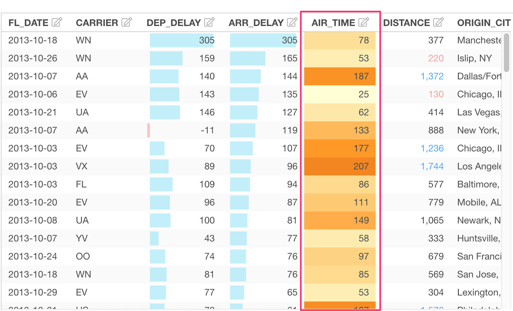
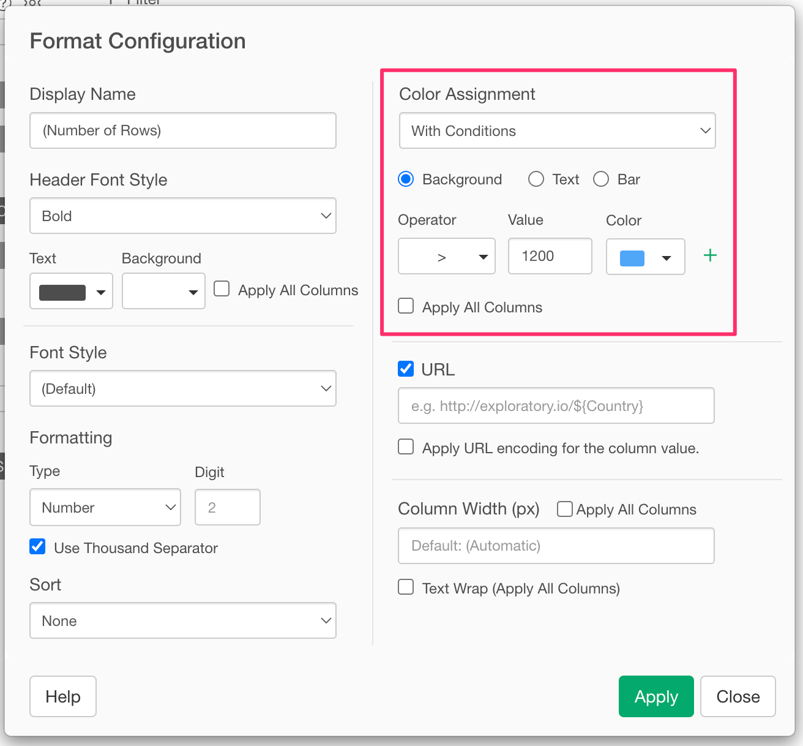

# Select and Configure Columns 


At "Select and Configure Columns", you can configure which columns to show and how each column shows. 

## Select Columns 

You can select which columns to show at "Select Column" section on the left-hand side of the dialog. You can click to select a column and click again to unselect the column. You can use "Shift+Click" to select multiple columns at a time. 


## Reorder Columns 

You can reorder columns at the "Reorder Columns" section in the center of the dialog. You can drag and drop to change the order of columns. 


You can also remove a column by clicking the trash icon that you see when you hover a column. 


## Preview 

You can preview the table at the "Preview" section on the right-hand side of the dialog. 


You can also configure the format of each column from the Column Configuration Dialog. You can open the Column Configuration Dialog by clicking the "Edit" icon at the table header. 


## Column Configuration Dialog 

You can change the format of the target column in the Column Configuration Dialog. 




### Display Name 

You can set the column display name that you want to use. 

### Function 

You can choose the column function you want to apply to the column data. The following functions are available depending on the data type of the target column. 

#### Character 

* Uppercase
* Lowercase
* Titlecase
* Extract Alphabets
* Extract Numbers
* Extract First Word
* Remove Spaces
* Remove Repeated Spaces
* Remove Alphabets
* Remove Numbers


#### Number 

* As Number 
* As Integer 
* As Character 
* Log (Natural Log)
* Log 2
* Log 10 
* Normalize 

#### Date/POSIXct 
* Year
* Half Year
* Quarter
* Bi-Month
* Month - Number (1)
* Month - Short Name (Jan)
* Month - Long Name (January)
* Week of Year
* Day of Month
* Day of Year
* Day of Quarter
* Day of Week - Number (1)
* Day of Week - Short Name (Mon)
* Day of Week - Long Name (Monday)
* Weekday/Weekend


### Sort 

You can set the sort order of the column. You can set either "Descending" or "Ascending". You can set the sort order in multiple columns. In this case, the sort happens in the priority order. 

### Number Formatting

You can set Number Formatting for numeric columns. The following formatting options are available. 

* Type
  * Number: Format as simple numbers. This is the default type.
  * Currency: Format as currency. If you set a currency symbol, it will be added at the beginning of each number. 
  * Percentage: Format as percentages. "%" sign will be added at the end of each number. 
* Digit: Number of decimal digits.
* Symbol: Current symbol. It will be added to it will be added at the beginning of each number if the "Currency" type is selected. 


### URL 

You can set a URL link on the column. If you define a URL link, the column value will be clickable and if a user clicks the value, it opens up the URL in an external browser. 

You can bind the column value in a URL. For example, if you have a "Country" column in your table, you can set the URL like the following.

```
http://exploratory.io/?q=${Country}
```

then the table output will look like this.


If you click "Germany", a browser opens up the URL like the following.

```
https://exploratory.io/?q=Germany
```


### Visual Formatting 

You can set a Visual Formatting on each column. Visual formatting is available only for the numeric columns. 

#### Bar Length 

You can show inline bars in the column value cells. The bar length is depending on the column value. You can choose colors for positive values and negative values.  


The output will look like this. 


#### Color Encoding 

You can apply a color encoding to the column values. You can choose a color palette to apply from the list. You can apply colors to either the value text or background color. 


This is the example of the color encoding applied to the background color. 




### Condtional Formatting 

You can apply a specific color only for the values that meet the condition. You can choose an operator and enter the value to construct a condition, and you can choose a color to apply from the list. You can apply colors to either the value text or background color. 

You can create multiple conditions by clicking "+" icon. The conditions are evaluated from the top to bottom. You can remove unnecessary conditions by clicking "x" icon.




The following operators are available. 

* equal to
* not equal to
* is in
* is not in
* less than
* less than or equal to
* greater than
* greater than or equal to
* between
* not between


This is the sample output of the Conditional Formatting. 


